# docker + gitlab + jenkins 搭建 CI/CD 系统

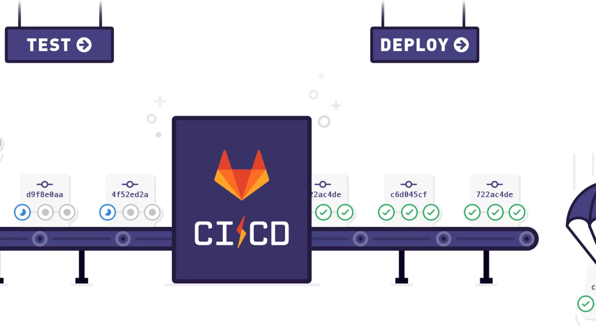

## 1. 环境

搭建环境是 Centos 7.2，本地测试是自己搭建的虚拟机，测试环境是阿里云ECS的Centos 7.2。

## 2. 安装docker

yum默认带有的docker版本比较低，我一般都是会安装更新版本的docker

#### 如果已经使用yum安装了docker

```bash
sudo yum remove docker /
                docker-client \
                docker-client-latest \
                docker-common \
                docker-latest \
                docker-latest-logrotate \
                docker-logrotate \
                docker-selinux \
                docker-engine-selinux \
                docker-engine
```

#### 安装docker依赖库、添加docker官方yum源及安装docker

```bash
sudo yum install -y yum-utils device-mapper-persistent-data lvm2
sudo yum-config-manager --add-repo https://download.docker.com/linux/centos/docker-ce.repo
sudo yum install -y docker-ce
```

#### 配置docker开机自启动并启动docker

```bash
systemctl enable docker
systemctl daemon-reload
systemctl start docker
```

#### 安装完毕可以查询安装的docker版本

```bash
docker --version
Docker version 18.09.6, build 481bc77156
```

#### 安装完docker需要安装 docker-compose

docker-compose是一个python编写的docker编排工具，后面的启动服务都是以docker-compose来启动，这样就不需要每次都手动输入docker启动命令的各项配置参数，简化操作，最后也可以把gitlab，jenkins等关联的服务编写在同一个 docker-compose 脚本中，方便一起管理。

我们部署环境有python3环境，所以直接使用pip3安装docker-compose

```bash
sudo pip3 install docker-compose
```

如果没有python环境，则可以使用二进制包来进行安装。从 [官方 GitHub Release](https://github.com/docker/compose/releases) 处直接下载编译好的二进制文件即可。

例如，在 Linux 64 位系统上直接下载对应的二进制包。

```bash
$ sudo curl -L https://github.com/docker/compose/releases/download/1.24.1/docker-compose-`uname -s`-`uname -m` -o /usr/local/bin/docker-compose
$ sudo chmod +x /usr/local/bin/docker-compose
```

## 3. 安装gitlab

#### build gitlab镜像并启动

首先在工作目录下，创建一个docker-compose的脚本，

```bash
# /data/gitlab 是自定义映射gitlab存放配置参数及数据的目录，可以修改成自己需要的目录
cat > docker-compose.yml << EOF
version: '2'
services:
  jenkins:
    image: gitlab/gitlab-ce:12.0.3-ce.0
    container_name: gitlab
    ports:
      - "9022:9022"
      - "9080:80"
    volumes:
      - "/data/gitlab/cfg:/etc/gitlab"
      - "/data/gitlab/logs:/var/log/gitlab"
      - "/data/gitlab/data:/var/opt/gitlab"
    restart: always
EOF

# 后台启动服务，第一次或自动pull镜像，添加 -d 表示后台启动
docker-compose up -d
```

#### 配置gitlab

gitlab会监听22端口(ssh连接)，80端口(http)及443端口(https)，我们gitlab前面加上一个haproxy做反向代理，haproxy监听443端口代理到9443端口，docker不开80端口全部都走9443端口(映射至433端口)

使用vim编辑gitlab的配置文件，gitlab的配置文件默认为 /data/gitlab/cfg/gitlab.rb ，前面的目录就是docker中配置的映射目录

```bash
docker container exec -it gitlab bash
vim /etc/gitlab/cfg/gitlab.rb

# 以下为gitlab的配置项

# 配置 gitlab 显示 url 的内容，external_url配置为https的链接时，gitlab会自动创建监听443端口的nginx配置，证书需要放置在 /etc/gitlab/ssl 目录下，并且文件名为配置的域名.crt
# 例如配置域名为 https://git.xxx.com，则需要证书文件为 git.xxx.com.crt 及 git.xxx.com.key
external_url 'https://git.xxx.com'

# 配置邮箱信息
gitlab_rails['gitlab_email_enabled'] = true
gitlab_rails['gitlab_email_from'] = 'no-reply@xxx.com'
gitlab_rails['gitlab_email_display_name'] = 'gitlab'
gitlab_rails['smtp_enable'] = true

gitlab_rails['smtp_address'] = "hwsmtp.xxx.com"
gitlab_rails['smtp_port'] = 994
gitlab_rails['smtp_user_name'] = "no-reply@xxx.com"
gitlab_rails['smtp_password'] = "xxx"
gitlab_rails['smtp_domain'] = "qiye.xxx.com"
gitlab_rails['smtp_authentication'] = "login"
gitlab_rails['smtp_enable_starttls_auto'] = true
gitlab_rails['smtp_tls'] = true

# 配置完成后输入一下命令重新配置gitlab
sudo gitlab-ctl reconfigure
```

#### 使用gitlab

gitlab正常使用可以参考网上其他的资料，主要是用户，组及项目的创建

## 4. 安装jenkins

#### 安装jenkins镜像

```bash
# /data/jenkins 是自定义映射jenkins存放数据的目录，可以修改成自己需要的目录，docker的映射是为了让jenkins能使用宿主环境下的docker
cat > docker-compose.yml << EOF
version: '3.1'
services:
  jenkins:
    image: jenkins/jenkins:lts
    user: root
    container_name: jenkins
    ports:
      - "8002:8080"
    volumes:
      - "/var/run/docker.sock:/var/run/docker.sock"
      - "/data/jenkins:/var/jenkins_home"
      - "/usr/bin/docker:/usr/bin/docker"
    restart: always
EOF

# 后台启动服务，第一次或自动pull镜像，添加 -d 表示后台启动，可以添加这个参数用于后台启动
docker-compose up -d
```

#### 使用jenkins

当 jenkins 正常运行时，启动日志中会有第一次登录需要的管理员密码，如下：

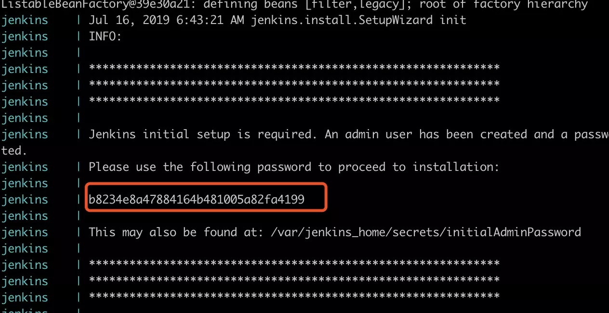


拷贝此密码，然后登录 主机地址:8002 来访问，会进入jenkins初始化页面，输入刚才拷贝的密码，然后进入引导页面，根据引导安装推荐的插件

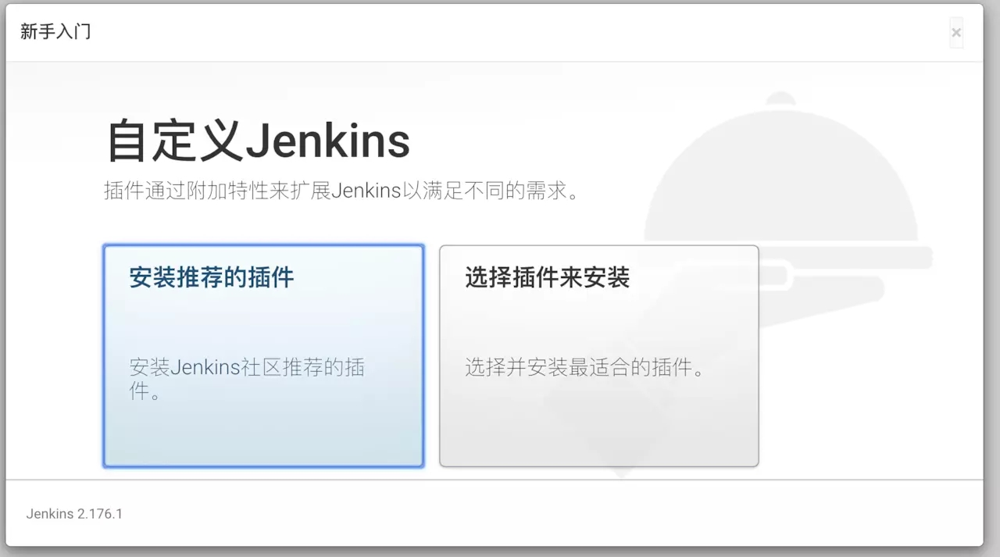

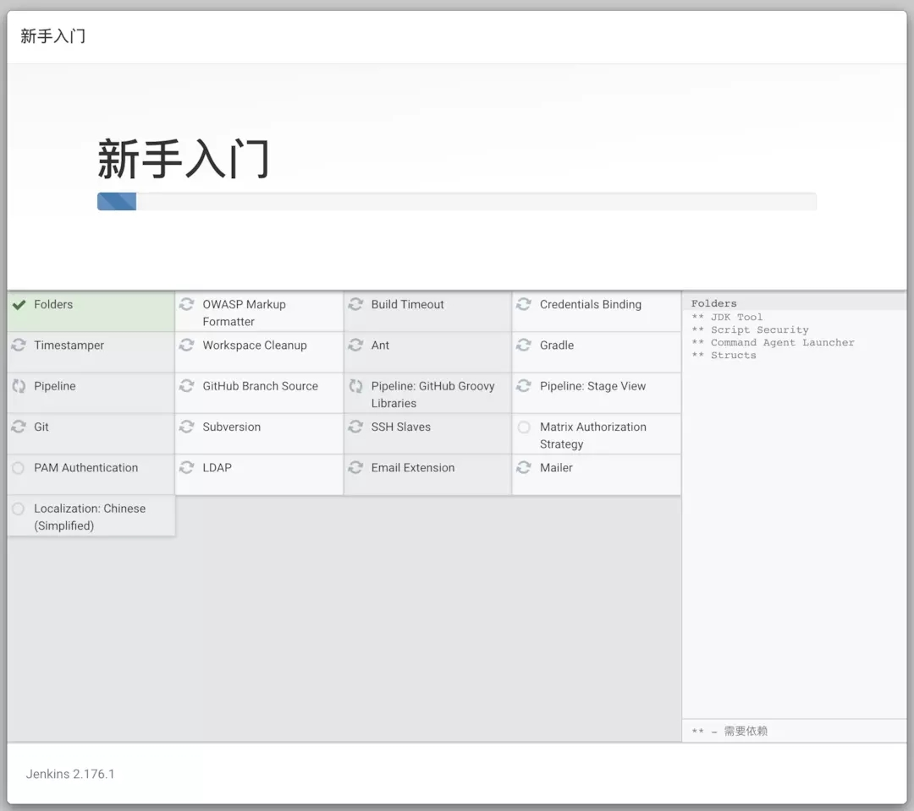


完成插件之后可以添加一个管理员账号，添加完毕后会进入jenkins的主页

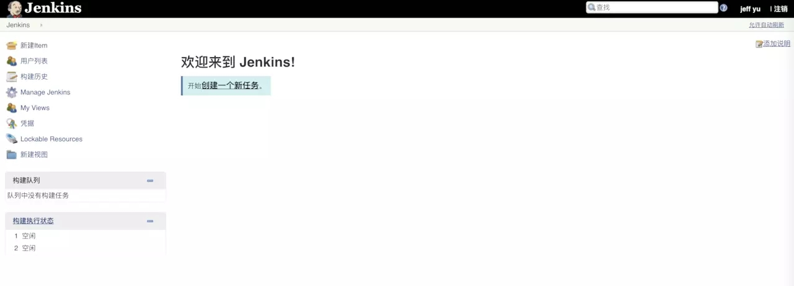


#### 安装 gitlab 及 docker 插件

在 系统管理 > 插件管理 > 可选插件中搜索并安装gitlab，docker相关插件

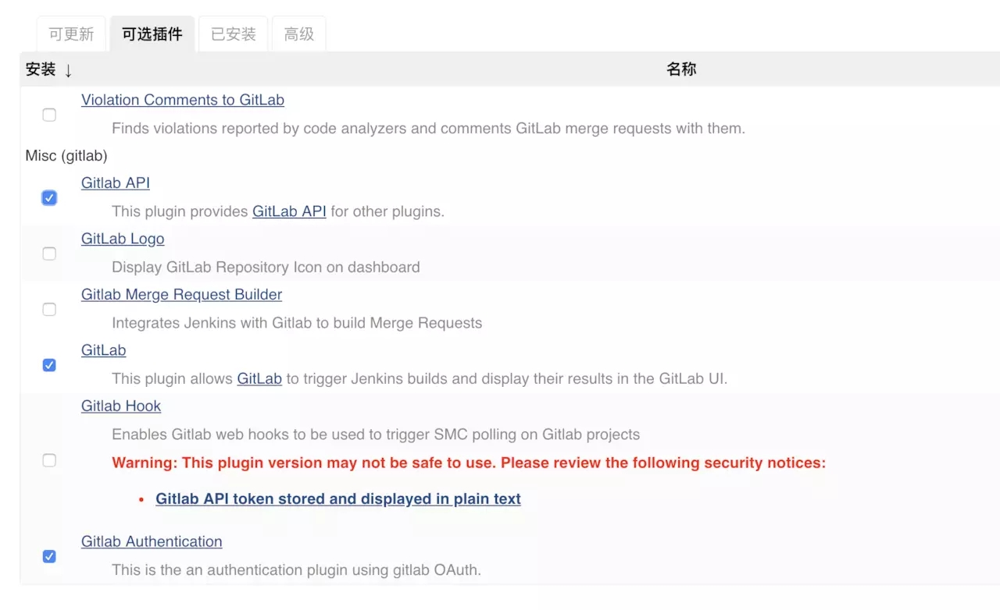


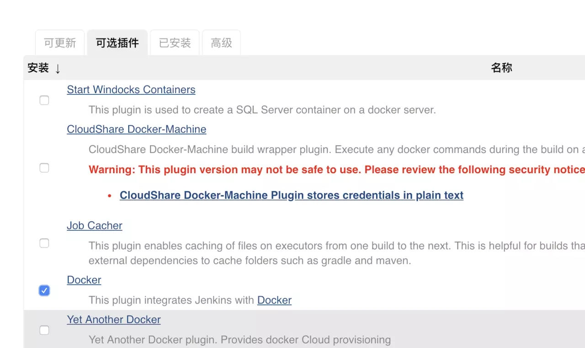


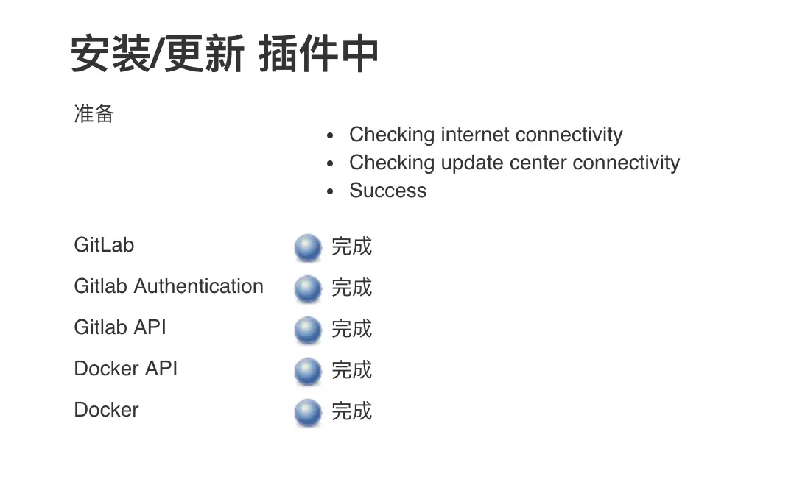


#### gitlab添加一个可以测试的项目

需要在gitlab中添加一个测试项目，并且该项目需要有dockerfile脚本，我们测试主要流程是gitlab push tag，然后 jenkins 触发构建开始自动部署，项目部署以docker镜像生成及部署的方式实现

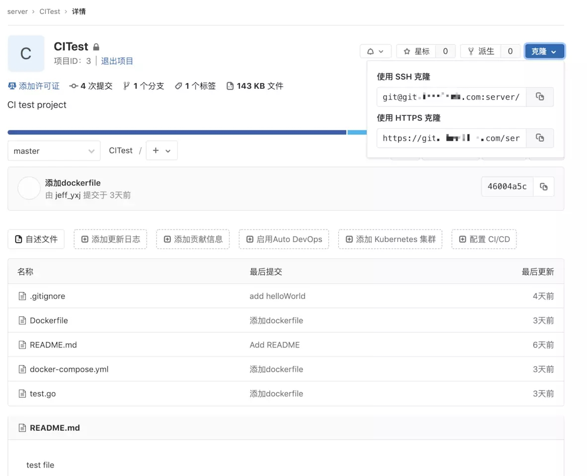


#### 配置 gitlab ssh 密钥对

```shell
# 生成密钥对, 输入后一路回车，默认保存密钥在 ~/.ssh 目录下, id_rsa(私钥)及id_rsa.pub(公钥)
ssh-keygen -o -t rsa -b 4096 -C "email@example.com"
```

拷贝 公钥信息，在gitlab > 用户设置 > SSH密钥 > 添加一个SSH密钥

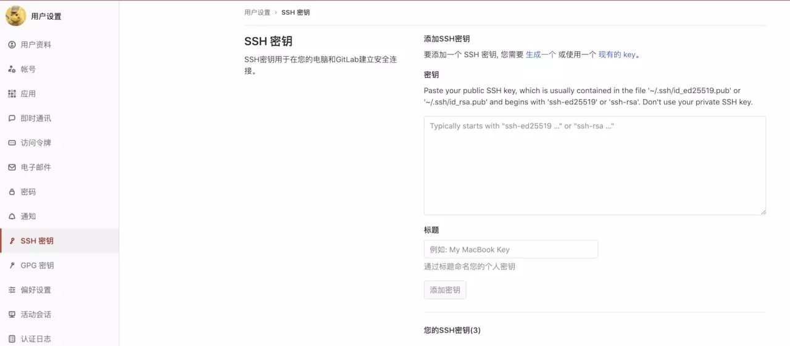


#### 配置docker构建任务

在jenkins中添加一个任务

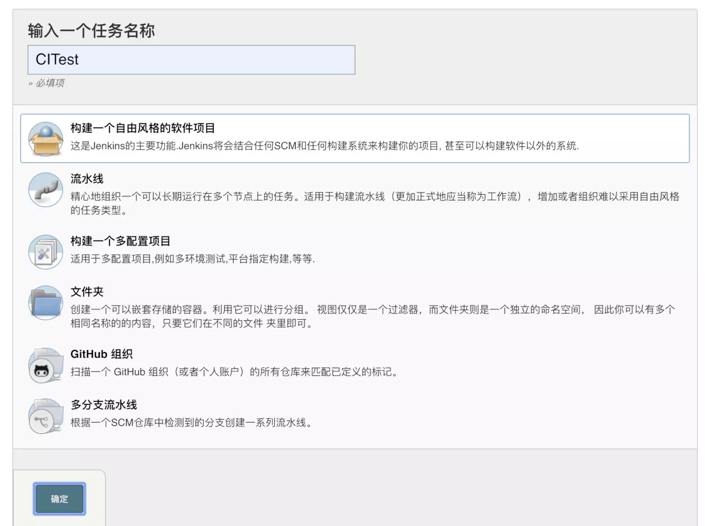


任务中需要配置源码信息，这里使用gitlab托管代码，所以需要gitlab仓库的地址，用户需要对仓库具有相应的权限，这里因为还没配置gitlab用户信息，所以提示无法读取仓库源码

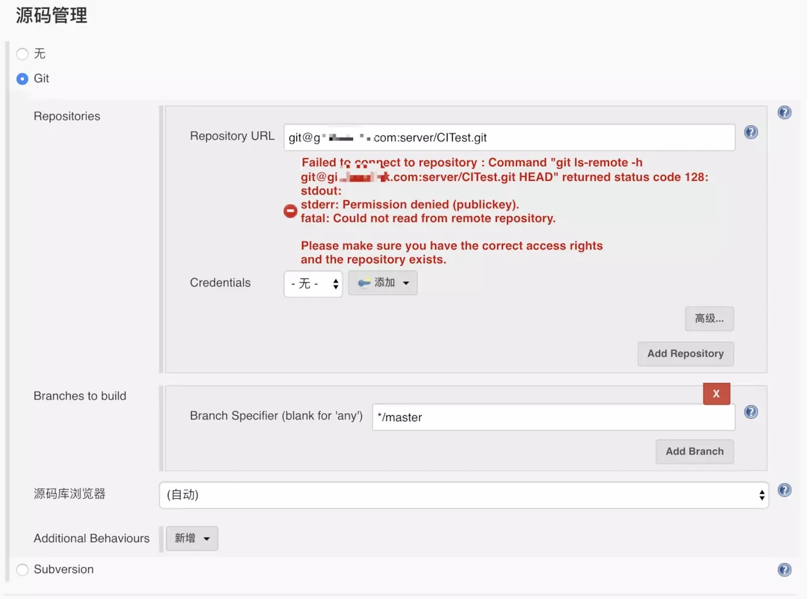


点击 `Credentials` 后面的添加按钮可以添加证书信息，类型选择 `SSH username with private key`，然后添加之前生成密钥的私钥，再点击添加完成录入

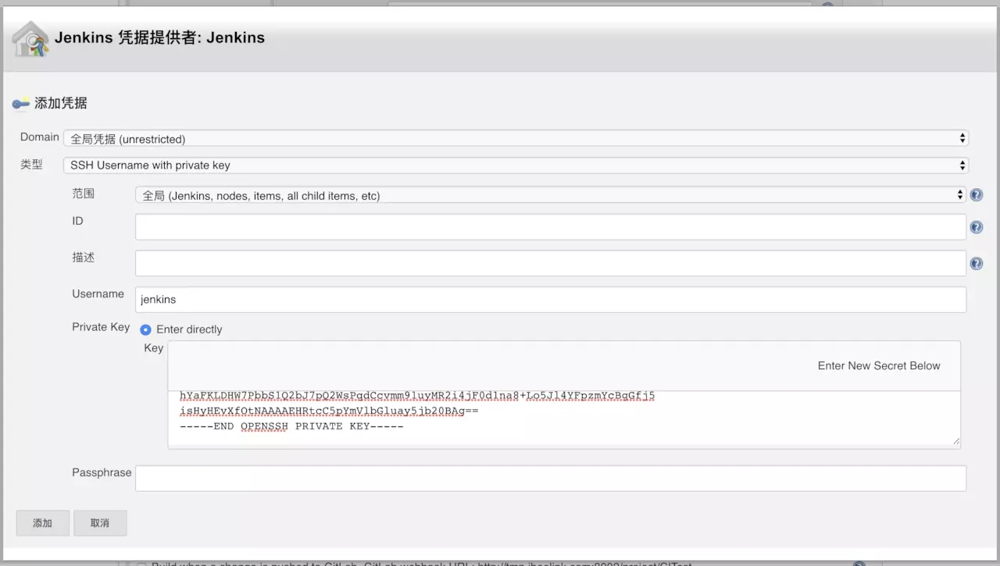

然后在在源码管理中选择刚刚添加的认证信息，添加没问题则红色的出错信息将会消失

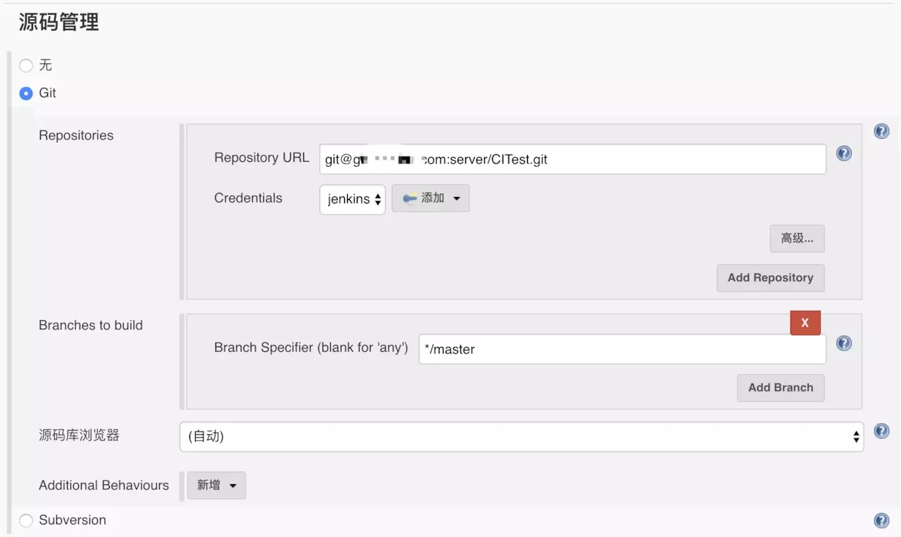

在构建中增加一个构建步骤，即将代码构建 docker 镜像

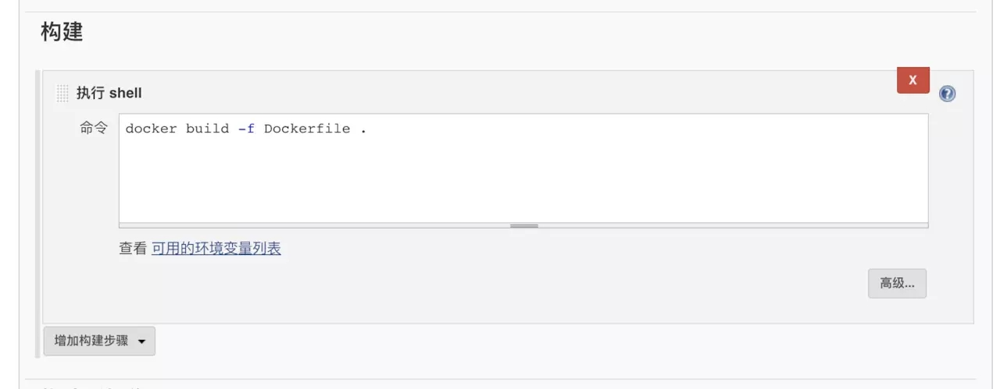

完成后点击保存完成任务的添加，然后在首页点击构建按钮查看构建效果，第一次会触发docker 下载相应的未下载的镜像，可能会比较慢，之后可以看到任务构建成功，查看控制台输出可以看到构建时shell的输出日志，至此任务的构建已经没有问题，接下去要实现 gitlab push 自动触发构建

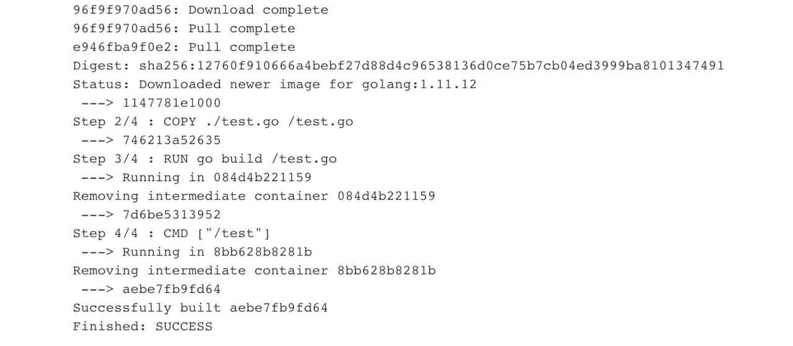


#### 配置 gitlab 自动触发构建

在 jenkins 任务的构建触发器中开启 push event 的触发器，然后在高级中点击生成生成一个回调地址的 Secret token，然后保存

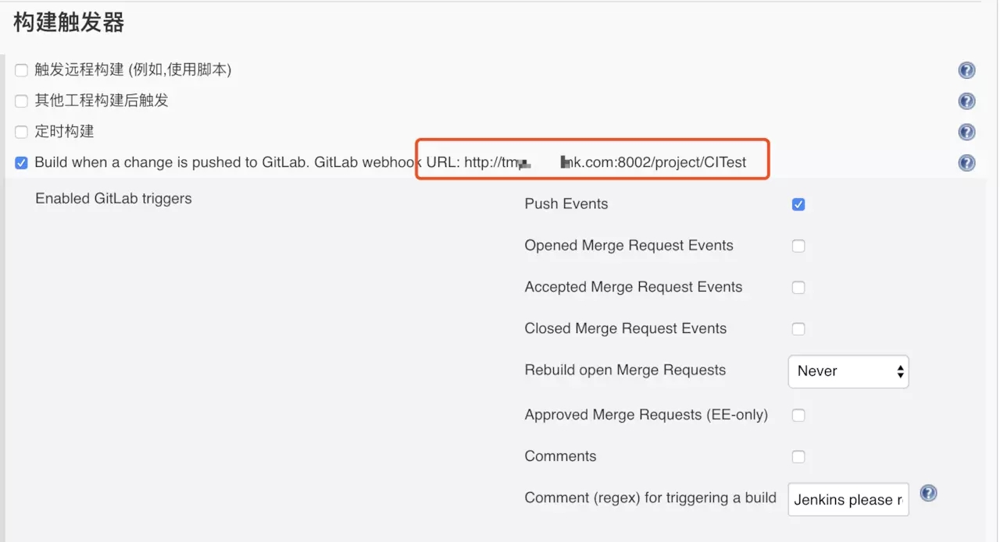


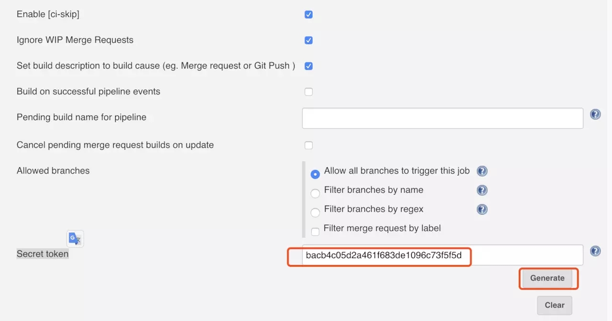

在 gitlab 项目 > 设置 > 集成 中将 Jenkins 及 生成的 token配置到gitlab 中，事件选择 tag push

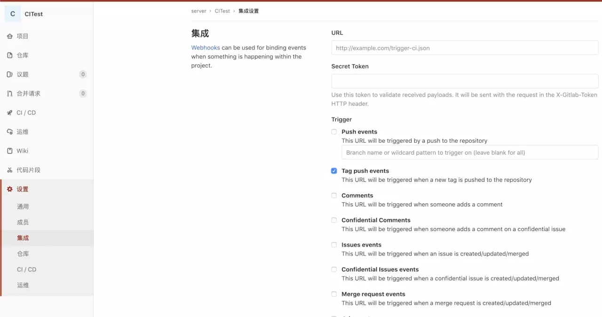

然后创建一个标签，jenkins 收到回调会自动构建，在首页能查询构建的历史记录

#### 构建完成自动推送镜像至阿里云registry

能接受 tag 推送回调之后，需要修改构建的shell脚本

```bash
# 定义变量，CONTAINER_NAME 是项目名称，对应阿里云镜像服务中的仓库名称，GIT_TAG 变量是自动获取本地git版本的tag
CONTAINER_NAME="citest"
GIT_TAG=`git describe --always --tag`
CONTAINER_FULL_NAME=${CONTAINER_NAME}-${GIT_TAG}
REPOSITORY=registry.cn-shanghai.aliyuncs.com/ibeelink/${CONTAINER_NAME}:${GIT_TAG}

# 构建Docker镜像
docker build -t $REPOSITORY -f Dockerfile .

# 推送Docker镜像，username 跟 password 为 阿里云容器镜像服务的账号密码
docker login --username=xxxxx --password=xxxxxx registry.cn-shanghai.aliyuncs.com
docker push $REPOSITORY

# 删除生成的image
docker images | grep citest | awk '{print $1":"$2}' | xargs docker rmi

# 删除名称或标签为none的镜像
docker rmi -f  `docker images | grep '<none>' | awk '{print $3}'`
```

修改至这个版本，可以在gitlab中创建一个tag，然后gitlab会回调至jenkins，然后jenkins开始构建并将生成的镜像推送至阿里云registry中并清理现场

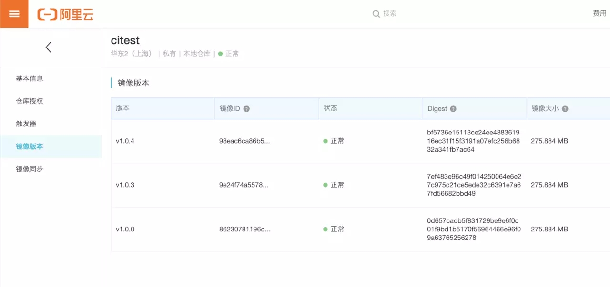


目前已经完成了 gitlab ——— jenkins ——— DockerRegistry 的镜像发布，后续会继续实现 jenkins 将发布的镜像分发到每个机器并部署的功能。


作者：yuxiaojie链接：https://juejin.im/post/5d2d2ce86fb9a07ed36edcb8来源：掘金著作权归作者所有。商业转载请联系作者获得授权，非商业转载请注明出处。

