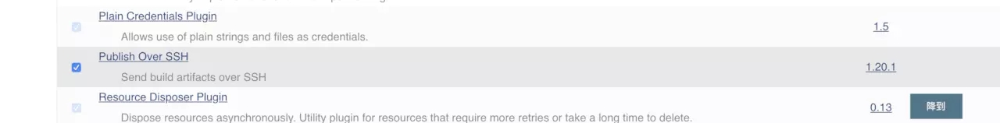
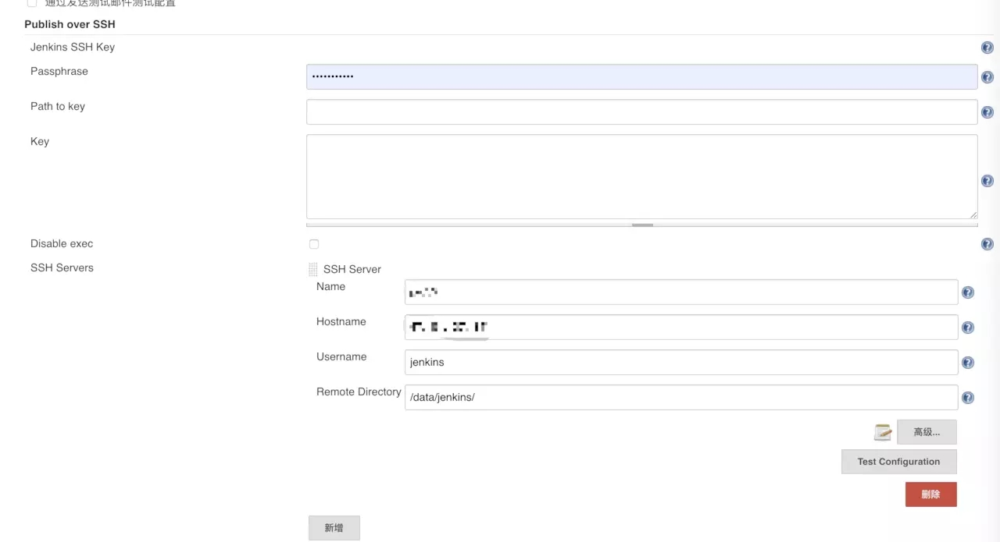
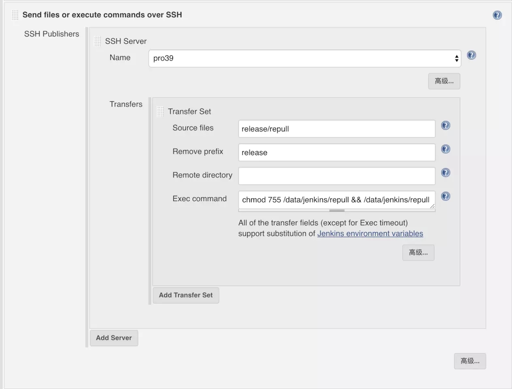

# jenkins + docker 自动部署

### 推送方案

目前已经使用 docker 搭建了 gitlab + jenkins，并且 gitlab 会将 tag 推送事件回调至 jenkins，jenkins 收到推送事件之后就会从 gitlab 仓库中拉取代码，然后将代码构建生成 docker 镜像并推送至 阿里云 registry

1. 构建过程实际就是 jenkins 执行一个我们编写完成的 shell 脚本，所以完成构建之后，可以直接在 shell中编写远程ssh连接服务的脚本，然后构建完成之后就直接执行
2. jenkins 有一个 **Publish Over SSH** 插件，这个插件可以在jenkins的事件中通过配置，自动通过ssh完成脚本的执行，简化一个ssh的连接过程，而且多个节点的话不需要重复的编写shell脚本而是以配置的形式添加Server

### Publish Over SSH 插件配置

在系统管理 > 插件 下，搜索这个插件，然后安装完成并启用





然后再 系统管理 > 系统设置下，Publish over SSH 功能块内，配置需要ssh连接的节点，这里测试就先添加一台，可以添加多个，这里添加的目的是在 jenkins 的 task 配置中快速使用服务器的ssh连接信息来复用

这里配置可以使用账号密码来连接，也可以使用密钥来连接，这里我直接添加了一个账号密码连接的服务器信息，然后可以使用 test configuration 来测试连接是否成功，连接信息中需要配置一个 Remote Directory，这个目录配置后，就是之后脚本执行的当前目录





### Publish Over SSH 插件使用

在之前添加的 task 的配置中进行修改，首先修改之前的构建的 shell 脚本

```bash
CONTAINER_NAME="citest"
GIT_TAG=`git describe --always --tag`
CONTAINER_FULL_NAME=${CONTAINER_NAME}-${GIT_TAG}
REPOSITORY=registry.cn-shanghai.aliyuncs.com/xxx/${CONTAINER_NAME}:${GIT_TAG}

# 构建Docker镜像
docker build -t $REPOSITORY -f Dockerfile .

# 推送Docker镜像
docker login --username=xxx --password=password registry.cn-shanghai.aliyuncs.com
docker push $REPOSITORY

# 删除生成的image
docker images | grep citest | awk '{print $1":"$2}' | xargs docker rmi || true

# 删除名称或标签为none的镜像
docker rmi -f  `docker images | grep '<none>' | awk '{print $3}'` || true

mkdir -p ./release && rm -f ./release/repository && echo \
"docker ps | grep citest | awk '{print \$1}' | xargs docker kill || true\n"\
"docker images | grep citest | awk '{print \$1\":\"\$2}' | xargs docker rmi -f || true\n"\
"docker login --username=xxx --password=password registry.cn-shanghai.aliyuncs.com\n"\
"docker pull $REPOSITORY\n"\
"docker run -d $REPOSITORY" >> ./release/repull
```

这里在原来清理现场之后，增加输出一个shell脚本到本地，这个shell脚本就是之后要ssh发送到其他节点执行的脚本，这里我是通过构建脚本自动生成这个其他节点部署的脚本，因为里面需要每次拉取的仓库地址都是不一样的，这样处理比较方便

其他节点部署的脚本主要工作是，关闭正在执行的 container，然后将这个项目相关的 image 全部移除，再连接阿里云的 registry 将最新的 image pull 下来并且运行

然后在构建步骤中再创建一个 **Send files or execute commands over SSH** 类型的步骤，这个步骤就是 ssh 连接其他节点的步骤，添加后在 ssh Server 中选择之前全局配置的节点 ssh 信息 03.png




这里 Source files 就是要传输的文件信息，Remove prefix是需要过滤的目录，文件传输完成之后会添加在配置ssh信息时填写的 data 目录下，然后再运行 Exec command 下配置的命令

这里几个配置项的用法，可以点后面的帮助信息了解，他不止支持配置文件路径，也可以配置带通配符的目录路径，也可以配置多个传输路径，可以灵活使用

### ssh推送节点自动部署

这个时候基本配置已经完成，在 gitlab 中创建一个新的 tag，然后回调到 jenkins 后会自动触发构建，构建完成会将自动部署脚本传输到配置节点进行自动部署任务


以上是测试服务器在创建 tag 之前的 docker 的运行信息 3.png


以上是完成自动部署之后的 docker 的运行信息，已经完成镜像的自动部署

### 问题

目前完整流程已经全部完成，但是还是有几个问题

1. 版本回退功能未实现

   实现自动部署之后，如果有轻微的bug，可以紧急修复或者下个版本修复，但是对于严重的运行问题则需要整个版本回退，所以目前实现的功能上，需要增加版本回退的功能，可以考虑再建一个参数化手动构建或回退的task 来实现此功能

2. 回退版本记录

   通过 gitlab 的 tag推送 时间触发构建，构建的镜像名称是以 tag 名称来创建的，此时的 image 名称可读性比较好，但是如果想要回退版本时，必须要知道上一次的 image 的名称才可以 pull 上一次的 image，所以要完成回退一种是必须要在本地跟写入自动部署脚本一样，写入一个回退的脚本，然后需要回退时执行回退功能

   或者就需要修改 image 命名规则，将使用构建记录编号作为image的名称，这时候直接去阿里云的 registry中查看不是很容易理解，但是可以利用jenkins自带的构建记录协助完成版本的前进和回退

3. 各个节点状态的管理

   利用目前的方式完成功能没有问题，但是想查看各个节点的 container 运行情况则比较困难，各个服务的部署情况对于配置 task 的人可能比较清楚，但是对于使用的研发人员则不是很了解，如果提供一个各个节点的状态查看及管理的工具则比较方便，后续继续了解 k8s 工具或其他的工具能够解决这个问题

后续会首先解决前面两个问题，完成版本的回退功能