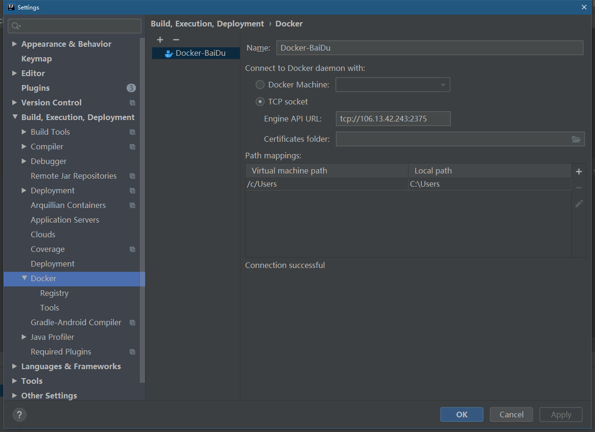
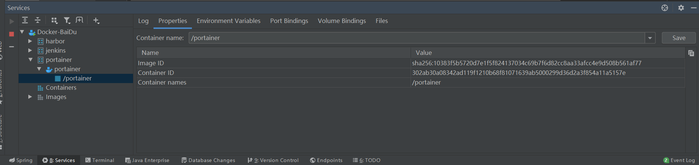
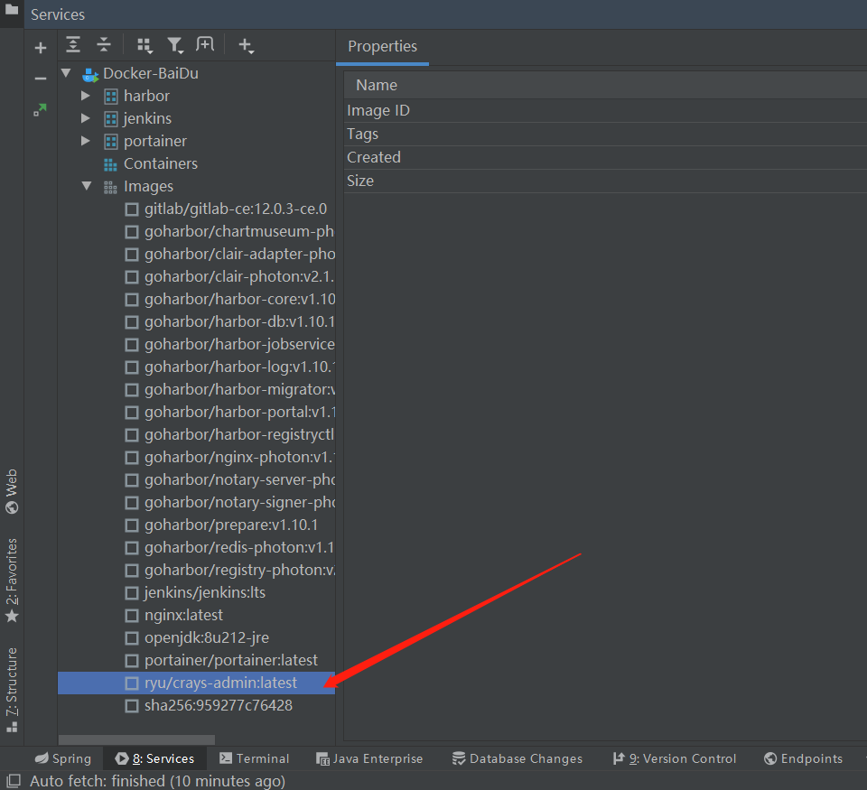
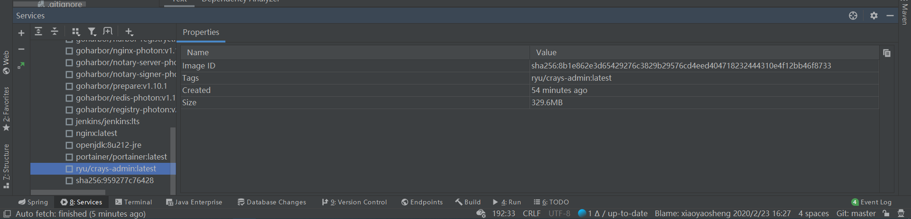

# Idea集成Docker实现镜像打包一键部署


我们常规的项目部署步骤如下：

> 1、在IDEA工具中开发代码
> 2、代码打包jar包
> 3、部署到Linux服务器上
> 4、如果用Docker（编写Dockerfile文件）
> 5、构建镜像
> 6、运行容器


## 1. Docker开启远程访问

如果只是在Docker本地服务器上操作的话，是不需要什么特殊配置的。但是通常情况下，我们都是需要在远程来操作Docker主机，通过一些工具来完成镜像文件上传的。所以，我们就需要开启Docker远程API，来达到我们远程操作的目的。

```shell
#修改Docker服务文件
vi /usr/lib/systemd/system/docker.service

#修改ExecStart这行，将该行配置用#号注释掉。
ExecStart=/usr/bin/dockerd -H fd:// --containerd=/run/containerd/containerd.sock
#修改后的配置如下。该配置就是暴露出本机的2375端口，供外部来访问Docker。
ExecStart=/usr/bin/dockerd -H tcp://0.0.0.0:2375 -H unix://var/run/docker.sock
```

修改完配置文件之后，需要让配置生效，那么接下来我们来重启Docker

```bash
#重新加载配置文件
systemctl daemon-reload
#重启服务
systemctl restart docker.service


#开启防火墙的Docker构建端口
firewall-cmd --zone=public --add-port=2375/tcp --permanent
firewall-cmd --reload


#查看端口是否开启
netstat -nlpt    #如果找不到netstat命令，可进行安装 yum install net-tools
#直接curl看是否生效
curl http://127.0.0.1:2375/info
```


## 2. IDEA安装Docker插件

> 打开Idea，从File->Settings->Plugins->Install JetBrains plugin 进入插件安装界面，在搜索框中输入docker，可以看到Docker Integration，点击右边的Install按钮进行安装。 
> 安装后重启IDEA。

如果IDEA的版本是2019的，默认是集成该插件的，不需要再自己手动安装的。


## 3.  IDEA配置Docker插件连接远程Docker服务器

配置Docker，连接到远程docker服务。

从File->Settings->Build,Execution,Deployment->Docker打开配置界面，填入正确的Docker服务器地址，如下图所示：



连接成功后，在IDEA工具中即可操作Docker：




## 4.  Maven配置docker-maven-plugin插件

传统过程中，打包、部署、上传到Linux、编写Dockerfile、构建镜像、创建容器运行。

而在持续集成过程中，项目工程一般使用 Maven 编译打包，然后生成镜像，通过镜像上线，能够大大提供上线效
率，同时能够快速动态扩容，快速回滚，着实很方便。`docker-maven-plugin` 插件就是为了帮助我们在Maven工程中，通过**简单的配置，自动生成镜像并推送到仓库中**。


**pom.xml**

```xml
<properties>
  <docker.image.prefix>ryu</docker.image.prefix>
</properties>


<build>
  <plugins>      
    <plugin>
      <groupId>org.springframework.boot</groupId>
      <artifactId>spring-boot-maven-plugin</artifactId>
    </plugin>
   
     <plugin>
        <groupId>com.spotify</groupId>
        <artifactId>docker-maven-plugin</artifactId>
        <version>1.0.0</version>
        <configuration>
          <!-- 镜像名称 guoweixin/exam-->
          <imageName>${docker.image.prefix}/${project.artifactId}</imageName>
          <!--指定标签-->
          <imageTags>
            <imageTag>latest</imageTag>
          </imageTags>
          <!-- 基础镜像jdk 1.8-->
          <baseImage>java</baseImage>
          <!-- 制作者提供本人信息 -->
          <maintainer>RyuZheng zhengxiaoch@163.com</maintainer>
          <!--切换到/ROOT目录 -->
          <workdir>/ROOT</workdir>
          <cmd>["java", "-version"]</cmd>
          <entryPoint>["java", "-jar", "${project.build.finalName}.jar"]
</entryPoint>
            
          <!-- 指定 Dockerfile 路径
           <dockerDirectory>${project.basedir}/src/main/docker</dockerDirectory>
         -->
            
          <!--指定远程 docker api地址-->
          <dockerHost>http://192.168.20.135:2375</dockerHost>
            
            
          <!-- 这里是复制 jar 包到 docker 容器指定目录配置 -->
          <resources>
            <resource>
              <targetPath>/</targetPath>
              <!--用于指定需要复制的根目录，${project.build.directory}表示target目
录-->
              <directory>${project.build.directory}</directory>
              <!--用于指定需要复制的文件。${project.build.finalName}.jar指的是打包
后的jar包文件。-->
              <include>${project.build.finalName}.jar</include>
            </resource>
          </resources>
        </configuration>
      </plugin>  
   
  </plugins>
</build>
```

**Dockerfile**

如上用docker-maven插件 自动生成如下文件：

>FROM java
>MAINTAINER guoweixin guoweixin@aliyun.com
>WORKDIR /ROOT
>ADD /ROOT/qfnj-0.0.1-SNAPSHOT.jar /ROOT/
>ENTRYPOINT ["java", "-jar", "qfnj-0.0.1-SNAPSHOT.jar"]
>CMD ["java", "-version"]


## 5.  执行Maven命令构建镜像到Docker

对项目进行打包。并构建镜像到Docker 上。

```shell
mvn clean package docker:build
```

如果打包时要跳过单元测试，则使用下面的命令

```shell
mvn clean package -Dmaven.test.skip=true docker:build
```

执行之后，控制台输出如下：

```shell
[INFO] --- docker-maven-plugin:1.2.2:build (build-image) @ crays-admin ---
[INFO] Using authentication suppliers: [ConfigFileRegistryAuthSupplier]
[INFO] Copying D:\workspaces_compose\projects_web\crays\crays-admin\target\crays-admin.jar -> D:\workspaces_compose\projects_web\crays\crays-admin\target
\docker\ROOT\crays-admin.jar
[INFO] Building image ryu/crays-admin
Step 1/5 : FROM openjdk:8u212-jre

 ---> 0fc98012d4a8
Step 2/5 : MAINTAINER RyuZheng zhengxiaoch@163.com

 ---> Using cache
 ---> 1e5c8f22f72b
Step 3/5 : WORKDIR /ROOT

 ---> Using cache
 ---> 102f2996fe59
Step 4/5 : ADD /ROOT/crays-admin.jar /ROOT/

 ---> 590949ed32bd
Step 5/5 : ENTRYPOINT ["java", "-jar", "-Dspring.profiles.active=prod","/crays-admin.jar"]

 ---> Running in 40830a829a12
Removing intermediate container 40830a829a12
 ---> 8b1e862e3d65
ProgressMessage{id=null, status=null, stream=null, error=null, progress=null, progressDetail=null}
Successfully built 8b1e862e3d65
Successfully tagged ryu/crays-admin:latest
[INFO] Built ryu/crays-admin
[INFO] Tagging ryu/crays-admin with latest
[INFO]
[INFO] --- docker-maven-plugin:1.2.2:build (default-cli) @ crays-admin ---
[INFO] Using authentication suppliers: [ConfigFileRegistryAuthSupplier]
[INFO] Copying D:\workspaces_compose\projects_web\crays\crays-admin\target\crays-admin.jar -> D:\workspaces_compose\projects_web\crays\crays-admin\target
\docker\ROOT\crays-admin.jar
[INFO] Building image ryu/crays-admin
Step 1/5 : FROM openjdk:8u212-jre

 ---> 0fc98012d4a8
Step 2/5 : MAINTAINER RyuZheng zhengxiaoch@163.com

 ---> Using cache
 ---> 1e5c8f22f72b
Step 3/5 : WORKDIR /ROOT

 ---> Using cache
 ---> 102f2996fe59
Step 4/5 : ADD /ROOT/crays-admin.jar /ROOT/

 ---> Using cache
 ---> 590949ed32bd
Step 5/5 : ENTRYPOINT ["java", "-jar", "-Dspring.profiles.active=prod","/crays-admin.jar"]

 ---> Using cache
 ---> 8b1e862e3d65
ProgressMessage{id=null, status=null, stream=null, error=null, progress=null, progressDetail=null}
Successfully built 8b1e862e3d65
Successfully tagged ryu/crays-admin:latest
[INFO] Built ryu/crays-admin
[INFO] Tagging ryu/crays-admin with latest
[INFO] ------------------------------------------------------------------------
[INFO] BUILD SUCCESS
[INFO] ------------------------------------------------------------------------
[INFO] Total time: 03:09 min
[INFO] Finished at: 2020-03-08T13:52:50+08:00
[INFO] Final Memory: 89M/555M
[INFO] ------------------------------------------------------------------------
```

构建成功之后，我们从Idea上就可以看到我们构建好的镜像了。




## 6.  IDEA操作远程Docker




## 7. docker-maven-plugin插件扩展配置

绑定Docker 命令到 Maven 各个阶段

>我们可以绑定 Docker 命令到 Maven 各个阶段，
>我们可以把 Docker 分为 build、tag、push，然后分别绑定 Maven 的 package、deploy 阶段，
>我们只需要执行 mvn deploy 就可以完成整个 build、tag、push操作了，当我们执行 mvn build 就只完成
>build、tag 操作。


```xml
<executions>
  <!--当执行mvn package 时，执行： mvn clean package docker:build -->
  <execution>
    <id>build-image</id>
    <phase>package</phase>
    <goals>
      <goal>build</goal>
    </goals>
  </execution>
    
 <!--当执行mvn package 时，会对镜像进行 标签设定-->
  <execution>
    <id>tag-image</id>
    <phase>package</phase>
    <goals>
      <goal>tag</goal>
    </goals>
    <configuration>
      <image>${docker.image.prefix}/${project.artifactId}:latest</image>     
      <newName>docker.io/${docker.image.prefix}/${project.artifactId}:${project.version} 
 </newName>
    </configuration>
  </execution>
    
  <execution>
    <id>push-image</id>
    <phase>deploy</phase>
    <goals>
      <goal>push</goal>
    </goals>
    <configuration>    
 	<imageName>docker.io/${docker.image.prefix}/${project.artifactId}:${project.version} 
</imageName>
    </configuration>
  </execution>
 
</executions>
```

**完整pom.xml如下：**

```xml
<properties>
  <java.version>1.8</java.version>
  <!-- 镜像前缀名-->
  <docker.image.prefix>guoweixin</docker.image.prefix>
</properties>

<dependencies>
    <dependency>
      <groupId>org.springframework.boot</groupId>
      <artifactId>spring-boot-starter-web</artifactId>
    </dependency>
  .....................
</dependencies>

<build>
    <plugins>
      <plugin>
        <groupId>org.springframework.boot</groupId>
        <artifactId>spring-boot-maven-plugin</artifactId>
      </plugin>
     
      <plugin>
        <groupId>com.spotify</groupId>
        <artifactId>docker-maven-plugin</artifactId>
        <version>1.0.0</version>
        <configuration>
          <!-- 镜像名称 guoweixin/exam-->
          <imageName>${docker.image.prefix}/${project.artifactId}</imageName>
          <!--指定标签-->
          <imageTags>
            <imageTag>latest</imageTag>
          </imageTags>
          <!-- 基础镜像jdk 1.8-->
          <baseImage>java</baseImage>
          <!-- 制作者提供本人信息 -->
          <maintainer>guoweixin guoweixin@aliyun.com</maintainer>
          <!--切换到/ROOT目录 -->
          <workdir>/ROOT</workdir>
          <cmd>["java", "-version"]</cmd>
          <entryPoint>["java", "-jar", "${project.build.finalName}.jar"]
</entryPoint>
            
          <!-- 指定 Dockerfile 路径
           <dockerDirectory>${project.basedir}/src/main/docker</dockerDirectory>
         -->
            
          <!--指定远程 docker api地址-->
          <dockerHost>http://192.168.20.135:2375</dockerHost>
            
          <!-- 这里是复制 jar 包到 docker 容器指定目录配置 -->
          <resources>
            <resource>
              <targetPath>/ROOT</targetPath>
              <!--用于指定需要复制的根目录，${project.build.directory}表示target目
录-->
              <directory>${project.build.directory}</directory>
              <!--用于指定需要复制的文件。${project.build.finalName}.jar指的是打包
后的jar包文件。-->
              <include>${project.build.finalName}.jar</include>
            </resource>
          </resources>
        </configuration>
          
        <!--当执行mvn package 时，执行： mvn clean package docker:build -->
        <executions>
          <execution>
            <id>build-image</id>
            <phase>package</phase>
            <goals>
              <goal>build</goal>
            </goals>
          </execution>
        </executions>
          
      </plugin>
    </plugins>
  </build>
```

**总结：**
当我们执行 mvn package 时，执行 build、tag 操作，当执行 mvn deploy 时，执行build、tag、push 操作。
如果我们想跳过 docker 某个过程时，只需要：

  - `-DskipDockerBuild` 跳过 build 镜像
  - `-DskipDockerTag` 跳过 tag 镜像
  - `-DskipDockerPush` 跳过 push 镜像
  - `-DskipDocker` 跳过整个阶段

例如：我们想执行 package 时，跳过 tag 过程，那么就需要 mvn package -DskipDockerTag