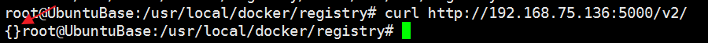

# 安装 Docker Registry 私服

## 概述

官方的 Docker Hub 是一个用于管理公共镜像的地方，我们可以在上面找到我们想要的镜像，也可以把我们自己的镜像推送上去。但是，有时候我们的服务器无法访问互联网，或者你不希望将自己的镜像放到公网当中，那么你就需要 Docker Registry，它可以用来存储和管理自己的镜像。

## 安装

在之前的 [Docker 私有仓库](https://funtl.com/2018/05/13/docker/Docker-私有仓库/) 章节中已经提到过如何配置和使用容器运行私有仓库，这里我们使用 `docker-compose` 来安装，配置如下：

```yaml
version: '3.1'
services:
  registry:
    image: registry
    restart: always
    container_name: registry
    ports:
      - 5000:5000
    volumes:
      - /usr/local/docker/registry/data:/var/lib/registry
```

## 测试

启动成功后需要测试服务端是否能够正常提供服务，有两种方式：

- 浏览器端访问

http://ip:5000/v2/


- 终端访问

```text
curl http://ip:5000/v2/
```

