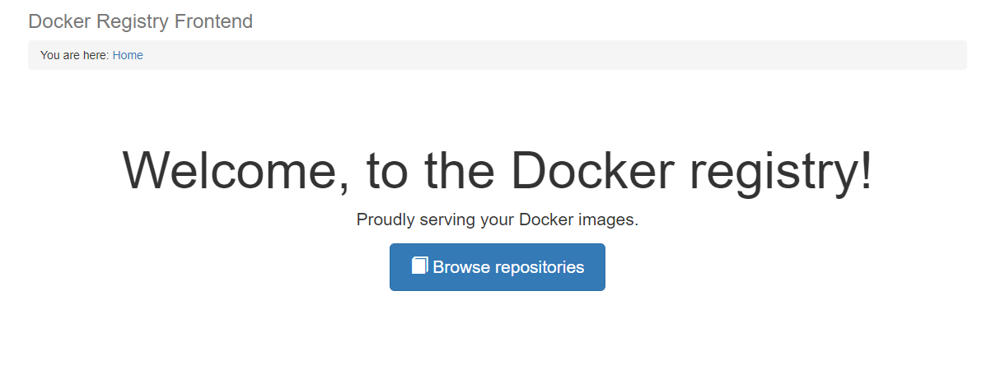

# 部署 Docker Registry WebUI

私服安装成功后就可以使用 docker 命令行工具对 registry 做各种操作了。然而不太方便的地方是不能直观的查看 registry 中的资源情况。如果可以使用 UI 工具管理镜像就更好了。这里介绍两个 Docker Registry WebUI 工具

- [docker-registry-frontend](https://github.com/kwk/docker-registry-frontend)
- [docker-registry-web](https://hub.docker.com/r/hyper/docker-registry-web/)

两个工具的功能和界面都差不多，我们以 `docker-registry-fontend` 为例讲解

## docker-registry-frontend

我们使用 docker-compose 来安装和运行，`docker-compose.yml` 配置如下：

```yaml
version: '3.1'
services:
  frontend:
    image: konradkleine/docker-registry-frontend:v2
    ports:
      - 8080:80
    volumes:
      - ./certs/frontend.crt:/etc/apache2/server.crt:ro
      - ./certs/frontend.key:/etc/apache2/server.key:ro
    environment:
      - ENV_DOCKER_REGISTRY_HOST=192.168.75.133
      - ENV_DOCKER_REGISTRY_PORT=5000
```

> 注意：请将配置文件中的主机和端口换成自己仓库的地址

运行成功后在浏览器访问：http://192.168.75.133:8080



