## 一、背景

最近收到阿里云短信，提示个站 [www.exception.site](https://www.exception.site) 的云盾 SSL 证书(Https 证书)即将到期，需要赶快续费，不然无法继续使用 Https 协议来访问网站！

这个 SSL 证书当时用的是阿里云免费型的，有效期为 1 年，到期后, 如果想继续使用这个证书，就得续费，而且费用还不低！

其实，要想继续使用 Https 协议，我们可以在阿里云上再次申请一张 SSL 证书就可以了，时间一年，嗨呀，又能免费用一年。

本文主要介绍如何在 Ngnix 上配置 SSL 证书，从而让我们的网站能够使用 Https 来访问，另外再附带说一下如何配置反向代理。

## 二、Docker 快速安装&搭建 Ngnix 环境

小哈的个站 Ngnix 搭建在容器当中，也就顺便说一下如何通过 Docker 快速安装&搭建 Ngnix 环境。

### 2.1 下载 Nginx 镜像

```
docker pull nginx:alpine
```

> PS：我这里用的是 alipne 轻量级的镜像.

下载完成后，通过 `docker images` 命令检查一下镜像是否下载成功：

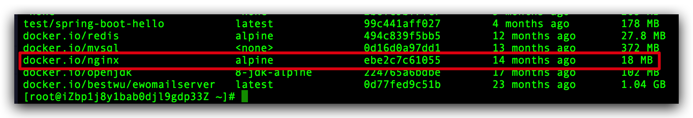

### 2.2 先以简单的方式运行镜像

```
docker run -d -p 80:80 --name nginx nginx:alpine
```

- `-p 80:80`: 将容器的 80 端口映射到宿主机的 80 端口上；
- `-d`: 以后台方式运行镜像；
- `--name`: 指定容器的名称为 nginx;

命令执行完成后，通过 `docker ps`命令确认一下容器是否启动成功。确认成功后，再访问一下 `80` 端口，看看 nginx 服务是否启动成功：

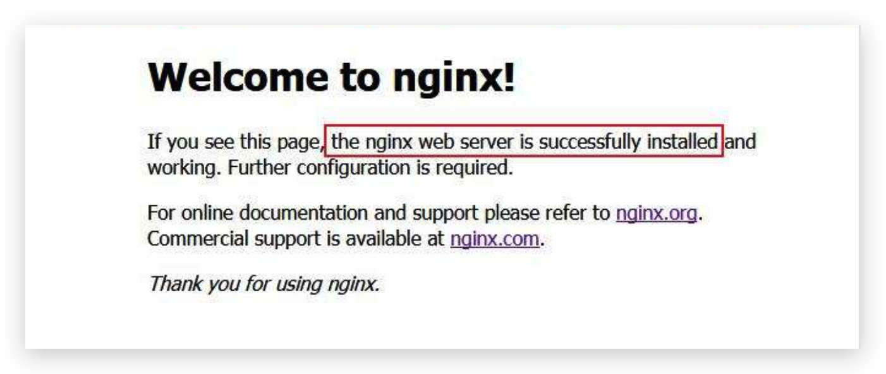

### 2.3 复制相关配置文件至宿主机

复制运行中 nginx 相关配置文件到宿主机的指定路径下：

```bash
# 复制名称为 nginx 容器中 /etc/nginx/nginx.conf 文件夹到宿主机的 /docker/nginx 路径下
docker cp nginx:/etc/nginx/nginx.conf /docker/nginx
# 复制名称为 nginx 容器中 /etc/nginx/conf.d 文件到宿主机的 /docker/nginx 路径下
docker cp nginx:/etc/nginx/conf.d /docker/nginx
```

复制完成后，查看指定路径的配置文件，如下：

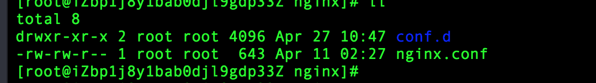

## 三、配置 SSL

### 3.1 免费获取 SSL 证书

访问链接 <https://common-buy.aliyun.com/?spm=5176.2020520163.cas.3.4bf91BFD1BFDcm&commodityCode=cas#/buy>：

> PS: 注意，未注册阿里云账号的童鞋，需要先注册一个账号哟~

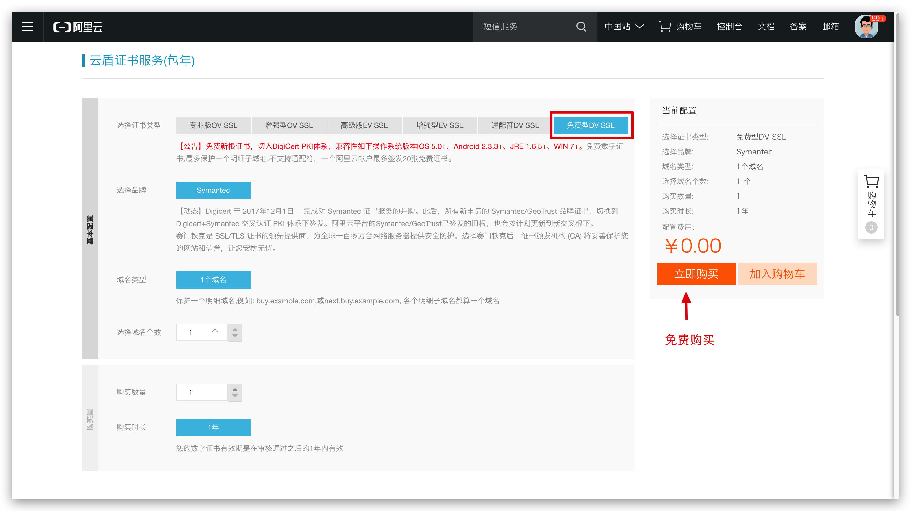

选择**免费 DV SSL 证书** -> **立即购买**，完成后，进入阿里云后台查看：

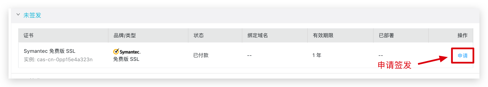

这里需要申请签发，填写相关信息后，等待签发通过即可。

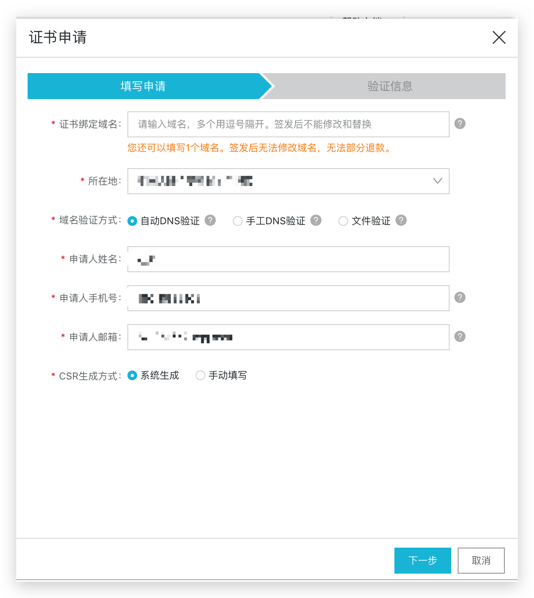

签发通过后，我们下载证书：

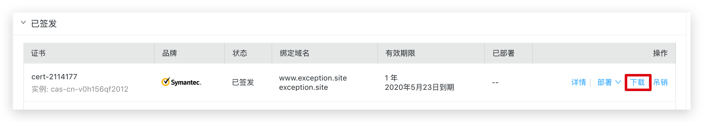

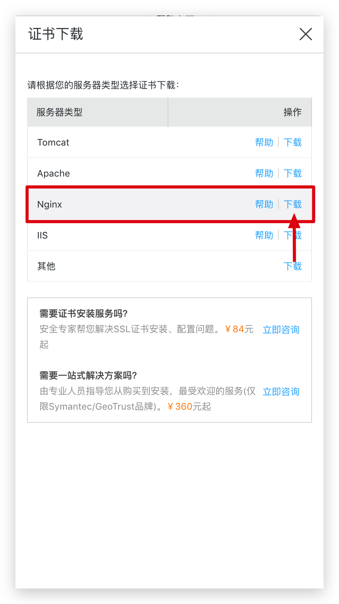

这里我选择的是 Ngnix, 当然了，你也可以选择 Tomcat、Apache、IIS 等。

### 3.2 解压上传到服务器

下载下来后，解压，我们可以看到包含两个文件：

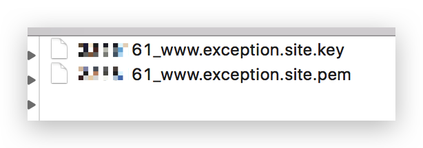

接下来，我们先在容器的挂载目录下创建 `cert` 证书目录：

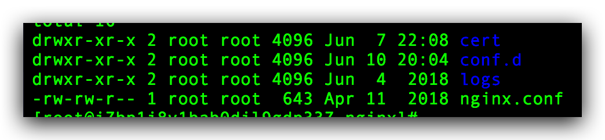

将解压后的两个文件上传至该目录中。


### 3.3 配置 Ngnix SSL

这里需要说一下，运行在 docker 容器中的 nginx 版本，信息如下：

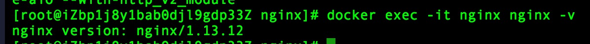

因为我的 nginx 相对版本较高，可能和大家的配置文件目录有些不同，但整体的没啥大的问题，该怎么配置，还是怎么配置：

首先创建 `ssl.conf` 配置文件，专门用来配置 `ssl` 相关参数：

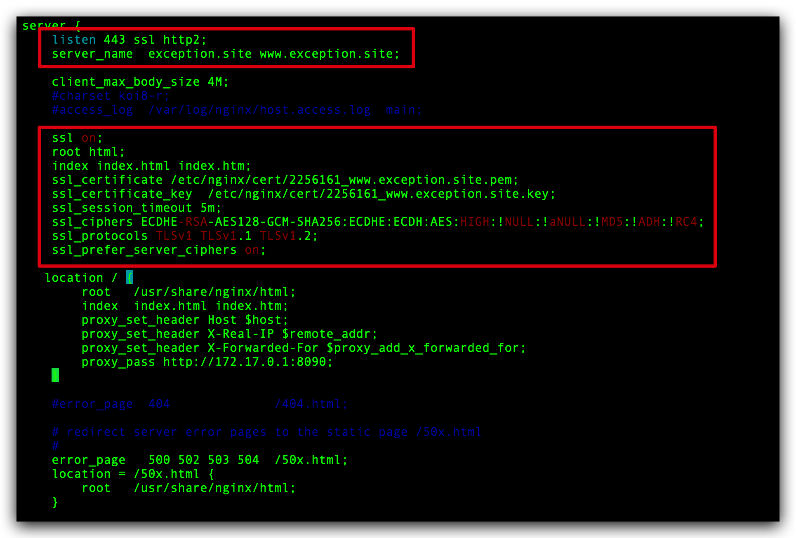

```json
server {
    listen 443 ssl http2;
    server_name  exception.site www.exception.site;

    client_max_body_size 4M;
    #charset koi8-r;
    #access_log  /var/log/nginx/host.access.log  main;

    ssl on;
    root html;
    index index.html index.htm;
    ssl_certificate /etc/nginx/cert/2256161_www.exception.site.pem;
    ssl_certificate_key  /etc/nginx/cert/2256161_www.exception.site.key;
    ssl_session_timeout 5m;
    ssl_ciphers ECDHE-RSA-AES128-GCM-SHA256:ECDHE:ECDH:AES:HIGH:!NULL:!aNULL:!MD5:!ADH:!RC4;
    ssl_protocols TLSv1 TLSv1.1 TLSv1.2;
    ssl_prefer_server_ciphers on;

   location / {
        root   /usr/share/nginx/html;
        index  index.html index.htm;
        proxy_set_header Host $host;
        proxy_set_header X-Real-IP $remote_addr;
        proxy_set_header X-Forwarded-For $proxy_add_x_forwarded_for;
        proxy_pass http://172.17.0.1:8090;
    }

    #error_page  404              /404.html;

    # redirect server error pages to the static page /50x.html
    #
    error_page   500 502 503 504  /50x.html;
    location = /50x.html {
        root   /usr/share/nginx/html;
    }
}
```

根据阿里云的文档说明加上 `ssl` 相关参数，如 ssl 证书的两个文件目录，另外同时监听 `443` 端口。

再贴下 `defaut.conf` 配置文件内容：

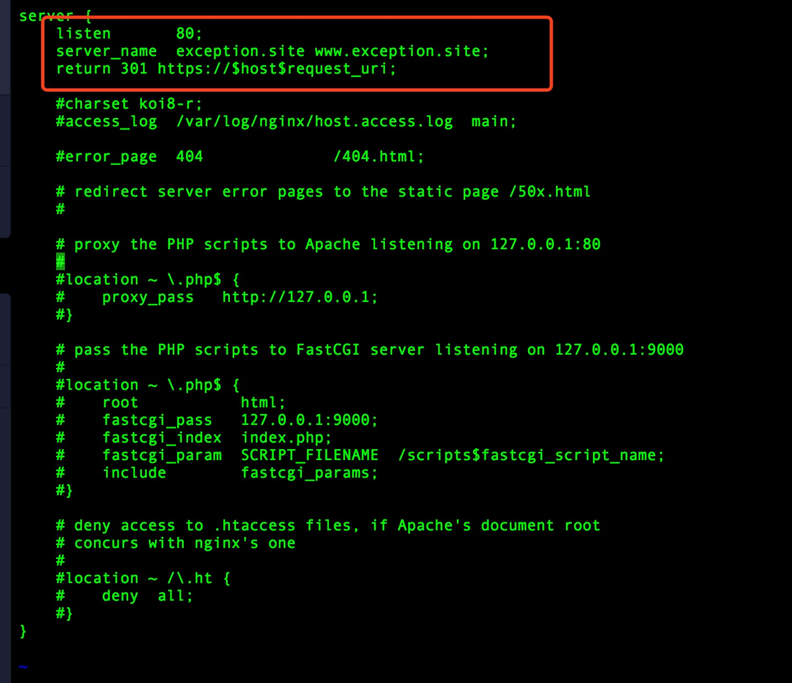

```json
server {
    listen       80;
    server_name  exception.site www.exception.site;
    return 301 https://$host$request_uri;
}
```

可以看到，主要对 `http 80` 端口主要做了一下 `301` 重定向，也就是说，如果前端使用的 `http` 访问，这里会重定向到 `https 协议`。

## 四、配置反向代理

再来说说如何配置反向代理，先通过命令 `ifconfig` 命令获取 `docker0`网卡的 ip 地址：

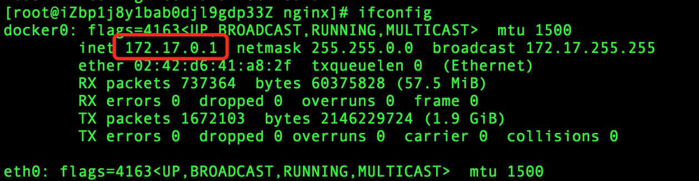

> PS: 因为我需要反向代理的服务部署在本机的 Docker 容器中，所以用的这个 IP，如果你用的外网其他地址，可自行修改。

由于上面我们已经新建了一个 `ssl.conf` 配置文件，这里就直接将反向代理的配置写在里面：

```
proxy_set_header Host $host;
proxy_set_header X-Real-IP $remote_addr;
proxy_set_header X-Forwarded-For $proxy_add_x_forwarded_for;
proxy_pass http://172.17.0.1:8090;
```

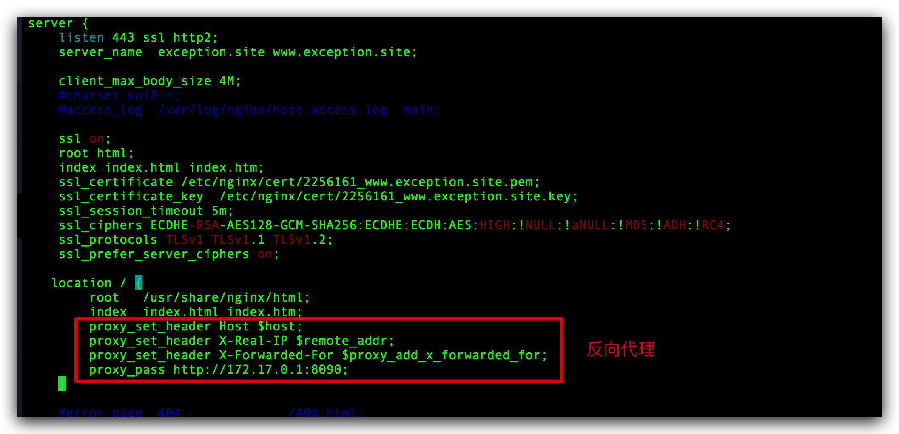

通过配置，我们反向代理到了 `8090` 端口的 Spring Boot 服务。

## 五、重启 Nginx 容器

先删除之前启动的 nginx 容器：

```bash
docker rm -f nginx
```

成功后，回到配置文件的主目录，执行：

```bash
docker run -d \ 
-p 80:80 -p 443:443 \ 
--name nginx \
-v /docker/nginx/nginx.conf:/etc/nginx/nginx.conf \
-v /docker/nginx/conf.d:/etc/nginx/conf.d \
-v /docker/nginx/logs:/var/log/nginx \
-v /docker/nginx/cert:/etc/nginx/cert \
nginx:alpine 
```

参数说明：

- `-p 80:80 -p 443:443`：将容器的 80、443 端口映射到主机的 80、443 端口；
- `-v /docker/nginx/nginx.conf:/etc/nginx/nginx.conf`：将容器中的 /etc/nginx/nginx.conf 文件挂载到宿主机中的 /docker/nginx/nginx.conf 文件；
- `-v /docker/nginx/conf.d:/etc/nginx/conf.d`：将容器中 /etc/nginx/conf.d 目录挂载到宿主机中的 conf.d 目录下；
- `-v /docker/nginx/logs:/var/log/nginx`：将容器中的 /var/log/nginx 目录挂载到宿主机中的 /docker/nginx/logs 目录下, 用以查看 Nginx 日志；
- `-v /docker/nginx/cert:/etc/nginx/cert`: 将容器中的 /etc/nginx/cert 证书目录挂载到宿主机中的 /docker/nginx/cert 证书目录下；

> 注意：因为我使用的阿里云服务器，同时还需要将 443 端口加入到安全组中，才能保证外界的正常访问 https 端口

运行命令成功后，通过 https 协议来访问我们的网站域名 [www.exception.site](https:///www.exception.site)，看看是否能够正常访问，并且方向代理到 8090 端口的 Spring Boot 服务上：

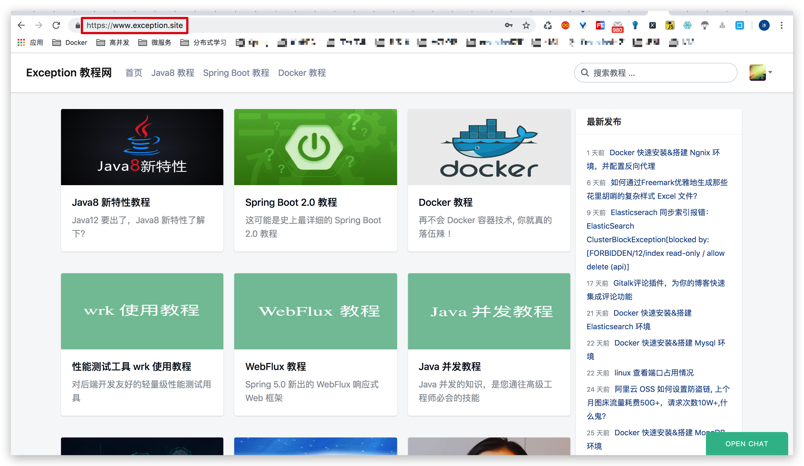

OK! 大工告成。

## 六 、最后

本文中，我们学习了如何通过 Docker 快速搭建 Nginx 环境，并对其配置 SSL 证书和反向代理，让网站能够以 Https 协议来访问。希望童鞋们看完本文能够有所收获~