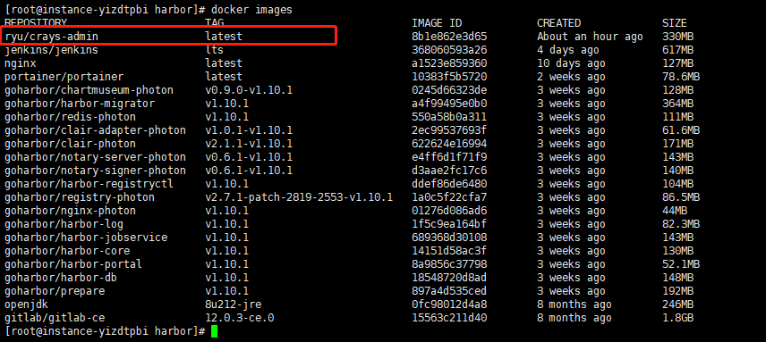
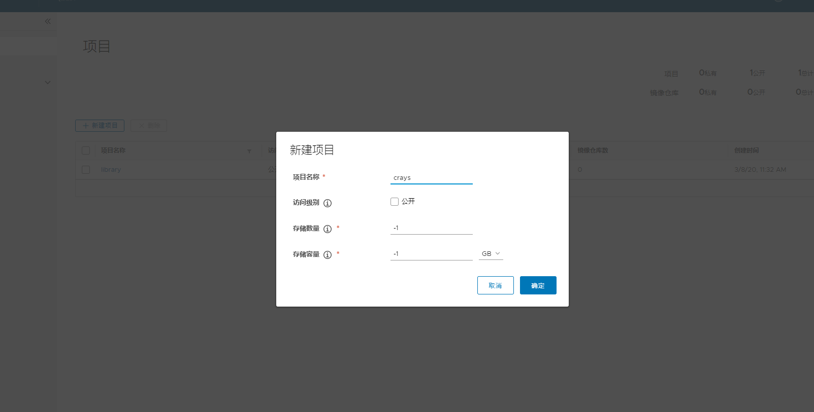
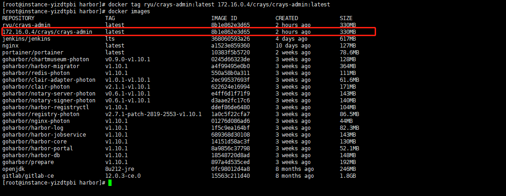
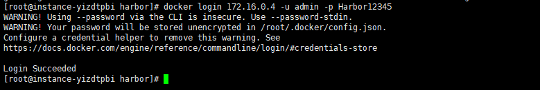
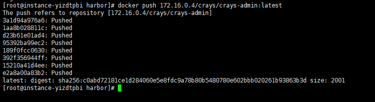
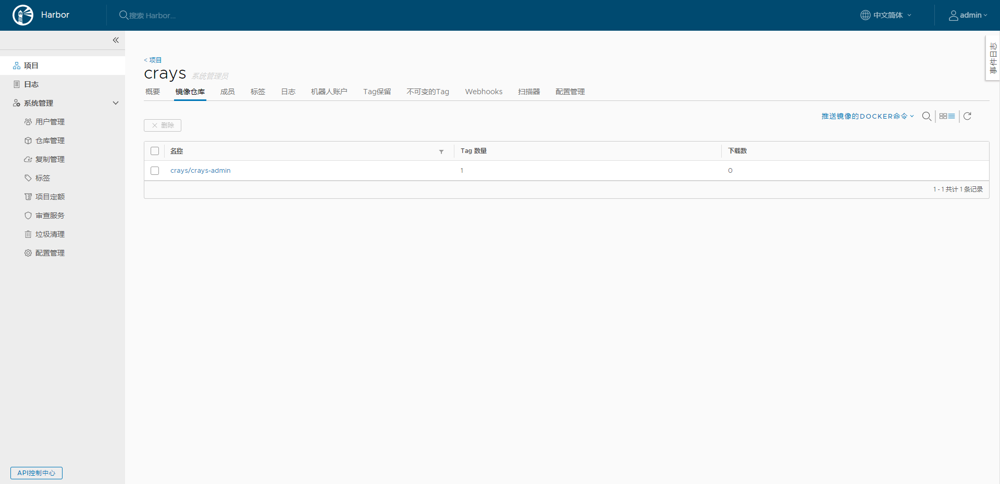
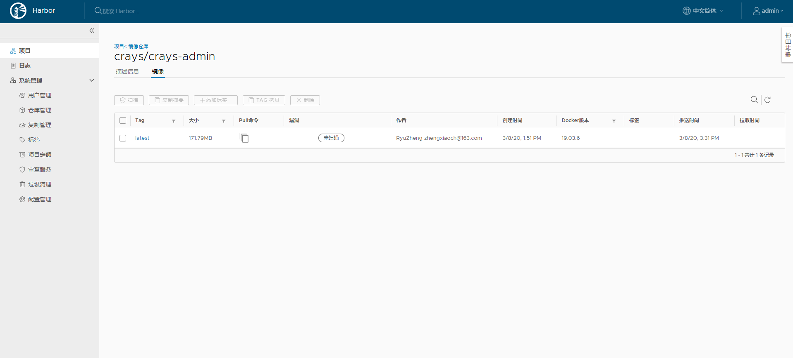

# Docker Compose 部署 Harbor

## 什么是 Harbor

Harbor 是一个用于存储和分发 Docker 镜像的企业级 Registry 服务器，通过添加一些企业必需的功能特性，例如安全、标识和管理等，扩展了开源 Docker Distribution。作为一个企业级私有 Registry 服务器，Harbor 提供了更好的性能和安全。提升用户使用 Registry 构建和运行环境传输镜像的效率。Harbor 支持安装在多个 Registry 节点的镜像资源复制，镜像全部保存在私有 Registry 中， 确保数据和知识产权在公司内部网络中管控。另外，Harbor 也提供了高级的安全特性，诸如用户管理，访问控制和活动审计等。

## Harbor 特性

- **基于角色的访问控制 ：** 用户与 Docker 镜像仓库通过 “项目” 进行组织管理，一个用户可以对多个镜像仓库在同一命名空间（project）里有不同的权限。
- **镜像复制 ：** 镜像可以在多个 Registry 实例中复制（同步）。尤其适合于负载均衡，高可用，混合云和多云的场景。
- **图形化用户界面 ：** 用户可以通过浏览器来浏览，检索当前 Docker 镜像仓库，管理项目和命名空间。
- **AD/LDAP 支持 ：** Harbor 可以集成企业内部已有的 AD/LDAP，用于鉴权认证管理。
- **审计管理 ：** 所有针对镜像仓库的操作都可以被记录追溯，用于审计管理。
- **国际化 ：** 已拥有英文、中文、德文、日文和俄文的本地化版本。更多的语言将会添加进来。
- **RESTful API ：** RESTful API 提供给管理员对于 Harbor 更多的操控，使得与其它管理软件集成变得更容易。
- **部署简单 ：** 提供在线和离线两种安装工具， 也可以安装到 vSphere 平台 (OVA 方式) 虚拟设备。


## Harbor 组件

- **Proxy：** Harbor 的 registry, UI, token 等服务，通过一个前置的反向代理统一接收浏览器、Docker 客户端的请求，并将请求转发给后端不同的服务。

- **Registry：** 负责储存 Docker 镜像，并处理 docker push/pull 命令。由于我们要对用户进行访问控制，即不同用户对 Docker image 有不同的读写权限，Registry 会指向一个 token 服务，强制用户的每次 docker pull/push 请求都要携带一个合法的 token, Registry 会通过公钥对 token 进行解密验证。

- Core services：

   

  这是 Harbor 的核心功能，主要提供以下服务：

  - **UI：** 提供图形化界面，帮助用户管理 registry 上的镜像（image）, 并对用户进行授权。
  - **WebHook：** 为了及时获取 registry 上 image 状态变化的情况， 在 Registry 上配置 webhook，把状态变化传递给 UI 模块。
  - **Token：** 负责根据用户权限给每个 docker push/pull 命令签发 token. Docker 客户端向 - Registry 服务发起的请求，如果不包含 token，会被重定向到这里，获得 token 后再重新向 Registry 进行请求。

- **Database：** 为 core services 提供数据库服务，负责储存用户权限、审计日志、Docker image 分组信息等数据。

- **Job Services：** 提供镜像远程复制功能，可以把本地镜像同步到其他 Harbor 实例中。

- **Log Collector：** 为了帮助监控 Harbor 运行，负责收集其他组件的 log，供日后进行分析。


## 工作原理

假设我们将 Harbor 部署在主机名为 registry.abcdocker.com 的虚机上。用户通过 docker login 命令向这个 Harbor 服务发起登录请求:docker login registry.abcdocker.com当用户输入所需信息并点击回车后，Docker 客户端会向地址“registry.abcdocker.com/v2/” 发出 HTTP GET 请求。

 

Harbor 的各个容器会通过以下步骤处理：

### (1)Docker login

(a) 首先，这个请求会由监听 80 端口的 proxy 容器接收到。根据预先设置的匹配规则，容器中的 Nginx会将请求转发给后端的 registry 容器；

(b) 在 registry 容器一方，由于配置了基于 token 的认证，registry 会返回错误代码 401，提示 Docker客户端访问 token 服务绑定的 URL。在 Harbor 中，这个 URL 指向 Core Services；

(c) Docker 客户端在接到这个错误代码后，会向token服务的URL发出请求，并根据HTTP协议的BasicAuthentication 规范，将用户名密码组合并编码，放在请求头部(header)；

(d)类似地，这个请求通过 80 端口发到 proxy 容器后，Nginx 会根据规则把请求转发给 ui 容器，ui 容器监听 token 服务网址的处理程序接收到请求后，会将请求头解码，得到用户名、密码；

(e) 在得到用户名、密码后，ui 容器中的代码会查询数据库，将用户名、密码与 mysql 容器中的数据进行比对(注:ui 容器还支持 LDAP 的认证方式，在那种情况下 ui 会试图和外部 LDAP 服务进行通信并校验用户名/密码)。比对成功，ui 容器会返回表示成功的状态码， 并用密钥生成 token，放在响应体中返回给 Docker 客户端。这个过程中组件间的交互过程如下图所示


**至此，一次 docker login 成功地完成了，Docker 客户端会把步骤(c)中编码后的用户名密码保存在本地的隐藏文件中。**


### (2) Docker Push

用户登录成功后用 docker push 命令向 Harbor 推送一个 Docker 镜像：docker push registry.abcdocker.com/library/hello-world


(a) 首先，docker 客户端会重复 login 的过程，首先发送请求到 registry,之后得到 token 服务的地址；

(b) 之后，Docker 客户端在访问ui容器上的token服务时会提供额外信息，指明它要申请一个对imagelibrary/hello-world 进行 push 操作的 token；

(c) token 服务在经过 Nginx 转发得到这个请求后，会访问数据库核实当前用户是否有权限对该 image进行 push。如果有权限，它会把 image 的信息以及 push 动作进行编码，并用私钥签名，生成 token返回给 Docker 客户端；

(d) 得到 token 之后 Docker 客户端会把 token 放在请求头部，向 registry 发出请求，试图开始推送image。 Registry 收到请求后会用公钥解码 token 并进行核对，一切成功后，image 的传输就开始了。我们省去 proxy 转发的步骤，下图描述了这个过程中各组件的通信

 


作者：哆啦A梦的猜想链接：https://juejin.im/post/5d9c2f25f265da5bbb1e3de5来源：掘金著作权归作者所有。商业转载请联系作者获得授权，非商业转载请注明出处。

## 安装 Harbor

[官方 GitHub](http://qfdmy.com/wp-content/themes/quanbaike/go.php?url=aHR0cHM6Ly9naXRodWIuY29tL2dvaGFyYm9yL2hhcmJvcg==) 上下载最新离线安装版，并上传至服务器

### 解压安装包

```bash
tar -zxvf harbor-offline-installer-v1.10.1.tgz

# 输出如下
harbor/harbor.v1.10.1.tar.gz
harbor/prepare
harbor/LICENSE
harbor/install.sh
harbor/common.sh
harbor/harbor.yml

```

### 修改配置文件

```bash
vi harbor.yml

# 修改为域名或你服务器IP(如果使用的是阿里云等服务器，这里填写内网IP)
hostname: 172.16.0.4

#注意下面这个配置，定义了管理员的密码，可按自己的需求自行修改
harbor_admin_password: Harbor12345


#如果需要打开Https，那么就将如下配置进行修改
https:
  # https port for harbor, default is 443
  port: 443
  # The path of cert and key files for nginx
  certificate: /your/certificate/path
  private_key: /your/private/key/path

#如果不需要Https，则将以上配置注释掉，否则直接执行下一步的安装，会出现以下错误
[Step 4]: preparing harbor configs ...
prepare base dir is set to /usr/local/docker/harbor
ERROR:root:Error: The protocol is https but attribute ssl_cert is not set
```

### 执行安装脚本

```bash
./install.sh

# 输出如下
[Step 0]: checking if docker is installed ...

Note: docker version: 19.03.6

[Step 1]: checking docker-compose is installed ...

Note: docker-compose version: 1.24.1

[Step 2]: loading Harbor images ...
47a4bb1cfbc7: Loading layer [==================================================>]  34.26MB/34.26MB
c2d9cf7a4eaf: Loading layer [==================================================>]  9.056MB/9.056MB
32b7eca4f03e: Loading layer [==================================================>]   9.71MB/9.71MB
5d104292391f: Loading layer [==================================================>]   9.71MB/9.71MB
Loaded image: goharbor/clair-adapter-photon:v1.0.1-v1.10.1
0039915754c6: Loading layer [==================================================>]  12.83MB/12.83MB
0a4ba5bc8bc2: Loading layer [==================================================>]  49.37MB/49.37MB
Loaded image: goharbor/harbor-jobservice:v1.10.1
db95a8bece9e: Loading layer [==================================================>]  78.32MB/78.32MB
f9aa9f9a3393: Loading layer [==================================================>]  3.072kB/3.072kB
f0baa86a6ccd: Loading layer [==================================================>]   59.9kB/59.9kB
2b8f0a44b78f: Loading layer [==================================================>]  61.95kB/61.95kB
Loaded image: goharbor/redis-photon:v1.10.1
a9f6374f6301: Loading layer [==================================================>]   9.05MB/9.05MB
b3c39a738965: Loading layer [==================================================>]  6.239MB/6.239MB
dce1aa68054e: Loading layer [==================================================>]  16.04MB/16.04MB
612aac9b538e: Loading layer [==================================================>]  28.24MB/28.24MB
8612386fb841: Loading layer [==================================================>]  22.02kB/22.02kB
53883649d694: Loading layer [==================================================>]  50.52MB/50.52MB
Loaded image: goharbor/notary-server-photon:v0.6.1-v1.10.1
f3967aa0de5f: Loading layer [==================================================>]  115.8MB/115.8MB
42fd590be962: Loading layer [==================================================>]  12.14MB/12.14MB
096b03f3e32b: Loading layer [==================================================>]  3.072kB/3.072kB
aa66bf3b8224: Loading layer [==================================================>]  49.15kB/49.15kB
8e76391190c9: Loading layer [==================================================>]  3.584kB/3.584kB
131573c722d5: Loading layer [==================================================>]  13.02MB/13.02MB
Loaded image: goharbor/clair-photon:v2.1.1-v1.10.1
69e43242ff64: Loading layer [==================================================>]  50.39MB/50.39MB
5a3a8e835993: Loading layer [==================================================>]  3.584kB/3.584kB
4dff480c159c: Loading layer [==================================================>]  3.072kB/3.072kB
2be454a39481: Loading layer [==================================================>]   2.56kB/2.56kB
d6b4877d5c4e: Loading layer [==================================================>]  3.072kB/3.072kB
609537197cce: Loading layer [==================================================>]  3.584kB/3.584kB
b52d06cad304: Loading layer [==================================================>]  12.29kB/12.29kB
Loaded image: goharbor/harbor-log:v1.10.1
badcf9296df7: Loading layer [==================================================>]  9.056MB/9.056MB
8b17ed0102b2: Loading layer [==================================================>]  3.584kB/3.584kB
4d1cd50b8d4f: Loading layer [==================================================>]  3.072kB/3.072kB
491c41e50d6a: Loading layer [==================================================>]  21.76MB/21.76MB
0101dc4148c7: Loading layer [==================================================>]  22.59MB/22.59MB
Loaded image: goharbor/registry-photon:v2.7.1-patch-2819-2553-v1.10.1
77965b8f534b: Loading layer [==================================================>]  14.61MB/14.61MB
940bf05c9601: Loading layer [==================================================>]  28.24MB/28.24MB
7ca206eb72e3: Loading layer [==================================================>]  22.02kB/22.02kB
9898774a5bad: Loading layer [==================================================>]  49.09MB/49.09MB
Loaded image: goharbor/notary-signer-photon:v0.6.1-v1.10.1
86340c56281e: Loading layer [==================================================>]  9.055MB/9.055MB
8ac45c34690f: Loading layer [==================================================>]  42.31MB/42.31MB
4aa70453f992: Loading layer [==================================================>]  3.072kB/3.072kB
6cbc6ab111b2: Loading layer [==================================================>]  3.584kB/3.584kB
d6d7b70c18b5: Loading layer [==================================================>]  43.14MB/43.14MB
Loaded image: goharbor/chartmuseum-photon:v0.9.0-v1.10.1
07efa003923d: Loading layer [==================================================>]  9.056MB/9.056MB
96dd65c291de: Loading layer [==================================================>]  3.584kB/3.584kB
802a1397679e: Loading layer [==================================================>]  21.76MB/21.76MB
92c283f6895a: Loading layer [==================================================>]  3.072kB/3.072kB
8b61b91240a6: Loading layer [==================================================>]  8.662MB/8.662MB
1fd753477b6f: Loading layer [==================================================>]  31.24MB/31.24MB
Loaded image: goharbor/harbor-registryctl:v1.10.1
48cda078e98d: Loading layer [==================================================>]  10.89MB/10.89MB
Loaded image: goharbor/nginx-photon:v1.10.1
2c00d9af2c3f: Loading layer [==================================================>]  34.31MB/34.31MB
0e4ae15c3d4e: Loading layer [==================================================>]  339.9MB/339.9MB
27810c9ff1a9: Loading layer [==================================================>]  135.2kB/135.2kB
Loaded image: goharbor/harbor-migrator:v1.10.1
93e0577272a9: Loading layer [==================================================>]  34.24MB/34.24MB
fb3507ff707e: Loading layer [==================================================>]  117.4MB/117.4MB
f59c6315bf8a: Loading layer [==================================================>]  42.32MB/42.32MB
5c5501748347: Loading layer [==================================================>]   2.56kB/2.56kB
3710d94e58dd: Loading layer [==================================================>]  1.536kB/1.536kB
06e0f1585c01: Loading layer [==================================================>]  166.4kB/166.4kB
bf5ac9b9c61c: Loading layer [==================================================>]   3.01MB/3.01MB
Loaded image: goharbor/prepare:v1.10.1
9ea2dad46741: Loading layer [==================================================>]  10.89MB/10.89MB
b280b9e7ca3b: Loading layer [==================================================>]  7.696MB/7.696MB
a1ce7c1130ee: Loading layer [==================================================>]  223.2kB/223.2kB
3b0492a7358b: Loading layer [==================================================>]  195.1kB/195.1kB
c64d6e6c80dd: Loading layer [==================================================>]  15.36kB/15.36kB
ace4e9064f06: Loading layer [==================================================>]  3.584kB/3.584kB
Loaded image: goharbor/harbor-portal:v1.10.1
b74d8257d4e7: Loading layer [==================================================>]  12.83MB/12.83MB
92f141040819: Loading layer [==================================================>]   42.5MB/42.5MB
33c99383fac5: Loading layer [==================================================>]  5.632kB/5.632kB
2bacc160d10f: Loading layer [==================================================>]  40.45kB/40.45kB
f51bed904fbe: Loading layer [==================================================>]   42.5MB/42.5MB
Loaded image: goharbor/harbor-core:v1.10.1
a2ffdaaa3434: Loading layer [==================================================>]  63.56MB/63.56MB
5745ac9e0297: Loading layer [==================================================>]  54.44MB/54.44MB
dc1d24cbb1d5: Loading layer [==================================================>]  5.632kB/5.632kB
4280f2f98340: Loading layer [==================================================>]  2.048kB/2.048kB
0f9279b20eec: Loading layer [==================================================>]   2.56kB/2.56kB
8b9162d25131: Loading layer [==================================================>]   2.56kB/2.56kB
50ad7481e5af: Loading layer [==================================================>]   2.56kB/2.56kB
54b809bfb5ec: Loading layer [==================================================>]  10.24kB/10.24kB
Loaded image: goharbor/harbor-db:v1.10.1


[Step 3]: preparing environment ...

[Step 4]: preparing harbor configs ...
prepare base dir is set to /usr/local/docker/harbor
WARNING:root:WARNING: HTTP protocol is insecure. Harbor will deprecate http protocol in the future. Please make sure to upgrade to https
Generated configuration file: /config/log/logrotate.conf
Generated configuration file: /config/log/rsyslog_docker.conf
Generated configuration file: /config/nginx/nginx.conf
Generated configuration file: /config/core/env
Generated configuration file: /config/core/app.conf
Generated configuration file: /config/registry/config.yml
Generated configuration file: /config/registryctl/env
Generated configuration file: /config/db/env
Generated configuration file: /config/jobservice/env
Generated configuration file: /config/jobservice/config.yml
Generated and saved secret to file: /secret/keys/secretkey
Generated certificate, key file: /secret/core/private_key.pem, cert file: /secret/registry/root.crt
Generated configuration file: /compose_location/docker-compose.yml
Clean up the input dir


[Step 5]: starting Harbor ...
Creating network "harbor_harbor" with the default driver
Creating harbor-log ... done
Creating harbor-db     ... done
Creating registry      ... done
Creating harbor-portal ... done
Creating redis         ... done
Creating registryctl   ... done
Creating harbor-core   ... done
Creating harbor-jobservice ... done
Creating nginx             ... done
✔ ----Harbor has been installed and started successfully.----
```

### 验证安装是否成功

通过浏览器访问 [http://172.16.0.4]() ，看到登录页面


输入账号 `admin`，密码 `Harbor12345`，登录成功后进入系统首页，如下图所示：


## Harbor 启动和停止

Harbor 的日常运维管理是通过 docker-compose 来完成的，Harbor 本身有多个服务进程，都放在 docker 容器之中运行，我们可以通过 `docker ps` 命令查看。

```bash
docker ps | grep goharbor

# 输出如下
45060d73156c        goharbor/harbor-jobservice:v1.10.1                        "/harbor/harbor_jobs…"   4 minutes ago       Up 4 minutes (healthy)                                                    harbor-jobservice
2a6a548a116f        goharbor/nginx-photon:v1.10.1                             "nginx -g 'daemon of…"   4 minutes ago       Up 4 minutes (healthy)   0.0.0.0:80->8080/tcp                             nginx
cfb4987803c6        goharbor/harbor-core:v1.10.1                              "/harbor/harbor_core"    4 minutes ago       Up 4 minutes (healthy)                                                    harbor-core
d797345cc326        goharbor/harbor-portal:v1.10.1                            "nginx -g 'daemon of…"   4 minutes ago       Up 4 minutes (healthy)   8080/tcp                                         harbor-portal
10c5afb7b163        goharbor/harbor-registryctl:v1.10.1                       "/home/harbor/start.…"   4 minutes ago       Up 4 minutes (healthy)                                                    registryctl
f949b288688c        goharbor/redis-photon:v1.10.1                             "redis-server /etc/r…"   4 minutes ago       Up 4 minutes (healthy)   6379/tcp                                         redis
0d29c7b78205        goharbor/registry-photon:v2.7.1-patch-2819-2553-v1.10.1   "/home/harbor/entryp…"   4 minutes ago       Up 4 minutes (healthy)   5000/tcp                                         registry
3b61307801a6        goharbor/harbor-db:v1.10.1                                "/docker-entrypoint.…"   4 minutes ago       Up 4 minutes (healthy)   5432/tcp                                         harbor-db
ebd133bb35b7        goharbor/harbor-log:v1.10.1                               "/bin/sh -c /usr/loc…"   4 minutes ago       Up 4 minutes (healthy)   127.0.0.1:1514->10514/tcp                        harbor-log

```

```bash
# 启动
docker-compose start

# 停止
docker-comose stop

# 重启
docker-compose restart
```

说明：**

- **nginx：** nginx 负责流量转发和安全验证，对外提供的流量都是从 nginx 中转，所以开放 https 的 443 端口，它将流量分发到后端的 ui 和正在 docker 镜像存储的 docker registry。
- **harbor-jobservice：** harbor-jobservice 是 harbor 的 job 管理模块，job 在 harbor 里面主要是为了镜像仓库之前同步使用的；
- **harbor-ui：** harbor-ui 是 web 管理页面，主要是前端的页面和后端 CURD 的接口；
- **registry：** registry 就是 docker 原生的仓库，负责保存镜像。
- **harbor-adminserver：** harbor-adminserver 是 harbor 系统管理接口，可以修改系统配置以及获取系统信息。
- **harbor-db：** harbor-db 是 harbor 的数据库，这里保存了系统的 job 以及项目、人员权限管理。由于本 harbor 的认证也是通过数据，在生产环节大多对接到企业的 ldap 中；
- **harbor-log：** harbor-log 是 harbor 的日志服务，统一管理 harbor 的日志。通过 inspect 可以看出容器统一将日志输出的 syslog。

这几个容器通过 Docker link 的形式连接在一起，这样，在容器之间可以通过容器名字互相访问。对终端用户而言，只需要暴露 proxy （即 Nginx）的服务端口。

## 配置客户端

在 `/etc/docker/daemon.json` 中增加如下内容（如果文件不存在请新建该文件）

```json
{
  "registry-mirrors": [
    "https://registry.docker-cn.com"
  ],
  "insecure-registries": [
    "172.16.0.4"
  ]
}
```

> **注意：** 该文件必须符合 JSON 规范，否则 Docker 将不能启动。

重启服务

```bash
systemctl daemon-reload
systemctl restart docker
```

## 检查客户端配置是否生效

使用 `docker info` 命令手动检查，如果从配置中看到如下内容，说明配置成功

```bash
Insecure Registries:
  172.16.0.4
  127.0.0.0/8
 Registry Mirrors:
  https://registry.docker-cn.com/
```


## Harbor 上传镜像

### 新建项目

我们以推送我们自己的 crays-admin 为例



首先需要在 Harbor 上创建一个 **公开/私有** 的项目




### 推送镜像

我们想把 crays-admin 推送到 crays 这个项目下，那么我们就在Harbor的管理系统中进入到 crays 项目下，获取相应的命令，如下图所示：


根据复制到的命令进行修改，按照下面的步骤进行镜像的推送：

```shell
# 在项目中标记镜像
docker tag ryu/crays-admin:latest 172.16.0.4/crays/crays-admin:latest
```

执行命令后，再次查看镜像列表，就会发现我们标记的镜像已经存在了，如下图所示：



```shell
# 因为我们的私服是私有的，所以需要登录 Harbor
docker login 172.16.0.4 -u admin -p Harbor12345
```

执行命令后，出现如下结果，则表示登录Harbor成功



接下来就可以推送镜像了，执行以下命令

```bash
# 推送镜像到项目
docker push 172.16.0.4/crays/crays-admin:latest
```

执行命令后，如下图所示，则表示推送镜像成功。




### 查看镜像






## Harbor 下载镜像

在其它机器下载镜像只需要配置好客户端即可，然后执行以下命令，就可以进行镜像拉取了。

```bash
docker pull 192.168.141.150/myshop/nginx:latest
```