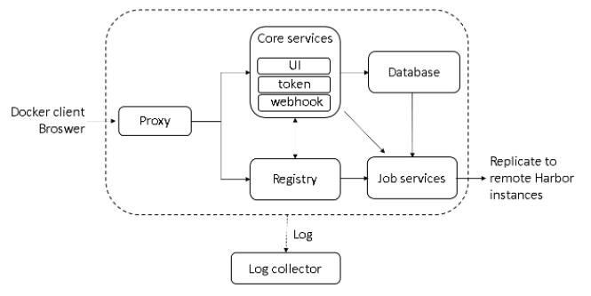

# Docker Compose 部署 Harbor

## 什么是 Harbor

Harbor 是一个用于存储和分发 Docker 镜像的企业级 Registry 服务器，通过添加一些企业必需的功能特性，例如安全、标识和管理等，扩展了开源 Docker Distribution。作为一个企业级私有 Registry 服务器，Harbor 提供了更好的性能和安全。提升用户使用 Registry 构建和运行环境传输镜像的效率。Harbor 支持安装在多个 Registry 节点的镜像资源复制，镜像全部保存在私有 Registry 中， 确保数据和知识产权在公司内部网络中管控。另外，Harbor 也提供了高级的安全特性，诸如用户管理，访问控制和活动审计等。

## Harbor 特性

- **基于角色的访问控制 ：** 用户与 Docker 镜像仓库通过 “项目” 进行组织管理，一个用户可以对多个镜像仓库在同一命名空间（project）里有不同的权限。
- **镜像复制 ：** 镜像可以在多个 Registry 实例中复制（同步）。尤其适合于负载均衡，高可用，混合云和多云的场景。
- **图形化用户界面 ：** 用户可以通过浏览器来浏览，检索当前 Docker 镜像仓库，管理项目和命名空间。
- **AD/LDAP 支持 ：** Harbor 可以集成企业内部已有的 AD/LDAP，用于鉴权认证管理。
- **审计管理 ：** 所有针对镜像仓库的操作都可以被记录追溯，用于审计管理。
- **国际化 ：** 已拥有英文、中文、德文、日文和俄文的本地化版本。更多的语言将会添加进来。
- **RESTful API ：** RESTful API 提供给管理员对于 Harbor 更多的操控，使得与其它管理软件集成变得更容易。
- **部署简单 ：** 提供在线和离线两种安装工具， 也可以安装到 vSphere 平台 (OVA 方式) 虚拟设备。


## Harbor 组件

- **Proxy：** Harbor 的 registry, UI, token 等服务，通过一个前置的反向代理统一接收浏览器、Docker 客户端的请求，并将请求转发给后端不同的服务。

- **Registry：** 负责储存 Docker 镜像，并处理 docker push/pull 命令。由于我们要对用户进行访问控制，即不同用户对 Docker image 有不同的读写权限，Registry 会指向一个 token 服务，强制用户的每次 docker pull/push 请求都要携带一个合法的 token, Registry 会通过公钥对 token 进行解密验证。

- Core services：

   

  这是 Harbor 的核心功能，主要提供以下服务：

  - **UI：** 提供图形化界面，帮助用户管理 registry 上的镜像（image）, 并对用户进行授权。
  - **WebHook：** 为了及时获取 registry 上 image 状态变化的情况， 在 Registry 上配置 webhook，把状态变化传递给 UI 模块。
  - **Token：** 负责根据用户权限给每个 docker push/pull 命令签发 token. Docker 客户端向 - Registry 服务发起的请求，如果不包含 token，会被重定向到这里，获得 token 后再重新向 Registry 进行请求。

- **Database：** 为 core services 提供数据库服务，负责储存用户权限、审计日志、Docker image 分组信息等数据。

- **Job Services：** 提供镜像远程复制功能，可以把本地镜像同步到其他 Harbor 实例中。

- **Log Collector：** 为了帮助监控 Harbor 运行，负责收集其他组件的 log，供日后进行分析。



## 工作原理

假设我们将 Harbor 部署在主机名为 registry.abcdocker.com 的虚机上。用户通过 docker login 命令向这个 Harbor 服务发起登录请求:docker login registry.abcdocker.com当用户输入所需信息并点击回车后，Docker 客户端会向地址“registry.abcdocker.com/v2/” 发出 HTTP GET 请求。

 

Harbor 的各个容器会通过以下步骤处理：

### (1)Docker login

(a) 首先，这个请求会由监听 80 端口的 proxy 容器接收到。根据预先设置的匹配规则，容器中的 Nginx会将请求转发给后端的 registry 容器；

(b) 在 registry 容器一方，由于配置了基于 token 的认证，registry 会返回错误代码 401，提示 Docker客户端访问 token 服务绑定的 URL。在 Harbor 中，这个 URL 指向 Core Services；

(c) Docker 客户端在接到这个错误代码后，会向token服务的URL发出请求，并根据HTTP协议的BasicAuthentication 规范，将用户名密码组合并编码，放在请求头部(header)；

(d)类似地，这个请求通过 80 端口发到 proxy 容器后，Nginx 会根据规则把请求转发给 ui 容器，ui 容器监听 token 服务网址的处理程序接收到请求后，会将请求头解码，得到用户名、密码；

(e) 在得到用户名、密码后，ui 容器中的代码会查询数据库，将用户名、密码与 mysql 容器中的数据进行比对(注:ui 容器还支持 LDAP 的认证方式，在那种情况下 ui 会试图和外部 LDAP 服务进行通信并校验用户名/密码)。比对成功，ui 容器会返回表示成功的状态码， 并用密钥生成 token，放在响应体中返回给 Docker 客户端。这个过程中组件间的交互过程如下图所示


**至此，一次 docker login 成功地完成了，Docker 客户端会把步骤(c)中编码后的用户名密码保存在本地的隐藏文件中。**


### (2) Docker Push

用户登录成功后用 docker push 命令向 Harbor 推送一个 Docker 镜像：docker push registry.abcdocker.com/library/hello-world


(a) 首先，docker 客户端会重复 login 的过程，首先发送请求到 registry,之后得到 token 服务的地址；

(b) 之后，Docker 客户端在访问ui容器上的token服务时会提供额外信息，指明它要申请一个对imagelibrary/hello-world 进行 push 操作的 token；

(c) token 服务在经过 Nginx 转发得到这个请求后，会访问数据库核实当前用户是否有权限对该 image进行 push。如果有权限，它会把 image 的信息以及 push 动作进行编码，并用私钥签名，生成 token返回给 Docker 客户端；

(d) 得到 token 之后 Docker 客户端会把 token 放在请求头部，向 registry 发出请求，试图开始推送image。 Registry 收到请求后会用公钥解码 token 并进行核对，一切成功后，image 的传输就开始了。我们省去 proxy 转发的步骤，下图描述了这个过程中各组件的通信

 


作者：哆啦A梦的猜想链接：https://juejin.im/post/5d9c2f25f265da5bbb1e3de5来源：掘金著作权归作者所有。商业转载请联系作者获得授权，非商业转载请注明出处。

## 安装 Harbor

[官方 GitHub](http://qfdmy.com/wp-content/themes/quanbaike/go.php?url=aHR0cHM6Ly9naXRodWIuY29tL2dvaGFyYm9yL2hhcmJvcg==) 上下载最新离线安装版（我已经下载并放置在群分享的 **Linux** 目录下）并上传至服务器

### 解压安装包

```bash
tar -zxvf harbor-offline-installer-v1.8.0.tgz

# 输出如下
harbor/harbor.v1.8.0.tar.gz
harbor/prepare
harbor/LICENSE
harbor/install.sh
harbor/harbor.yml
```

### 修改配置文件

```bash
vi harbor.yml

# 修改为域名或你服务器 IP
hostname: 192.168.141.150
```

### 执行安装脚本

```bash
./install.sh

# 输出如下
[Step 0]: checking installation environment ...
Note: docker version: 18.09.6
Note: docker-compose version: 1.24.0
[Step 1]: loading Harbor images ...
23d9f72a5270: Loading layer [==================================================>]  33.25MB/33.25MB
1d4a1da12c02: Loading layer [==================================================>]  50.51MB/50.51MB
8eb1a006f3b0: Loading layer [==================================================>]  3.584kB/3.584kB
41b6f75847f4: Loading layer [==================================================>]  3.072kB/3.072kB
ec9bd6e4d4e8: Loading layer [==================================================>]   2.56kB/2.56kB
6d852bb664c2: Loading layer [==================================================>]  3.072kB/3.072kB
0e4ed2b5a5b8: Loading layer [==================================================>]  3.584kB/3.584kB
8dfb2b644f30: Loading layer [==================================================>]  12.29kB/12.29kB
Loaded image: goharbor/harbor-log:v1.8.0
d8c53538042b: Loading layer [==================================================>]  63.34MB/63.34MB
1b5fb7ee22e0: Loading layer [==================================================>]  47.96MB/47.96MB
a8bdca5e9d71: Loading layer [==================================================>]  6.656kB/6.656kB
f7cec940b52c: Loading layer [==================================================>]  2.048kB/2.048kB
301a4a2af7db: Loading layer [==================================================>]   7.68kB/7.68kB
e588e1e3a775: Loading layer [==================================================>]   2.56kB/2.56kB
539f28a5d0ea: Loading layer [==================================================>]   2.56kB/2.56kB
8b4a72241226: Loading layer [==================================================>]   2.56kB/2.56kB
Loaded image: goharbor/harbor-db:v1.8.0
c88db349fb2f: Loading layer [==================================================>]  8.972MB/8.972MB
1f2d4d72bba2: Loading layer [==================================================>]  35.77MB/35.77MB
dddbcf598df5: Loading layer [==================================================>]  2.048kB/2.048kB
0ced476c2d9c: Loading layer [==================================================>]  3.072kB/3.072kB
af24eb0bf40b: Loading layer [==================================================>]  35.77MB/35.77MB
Loaded image: goharbor/chartmuseum-photon:v0.8.1-v1.8.0
b185d348bd7d: Loading layer [==================================================>]   2.56kB/2.56kB
f032ded7f92e: Loading layer [==================================================>]  1.536kB/1.536kB
c6c822edbc47: Loading layer [==================================================>]   66.9MB/66.9MB
73ef3c4363bf: Loading layer [==================================================>]  39.75MB/39.75MB
0c490e002448: Loading layer [==================================================>]  144.4kB/144.4kB
31afe2abafb4: Loading layer [==================================================>]  3.004MB/3.004MB
Loaded image: goharbor/prepare:v1.8.0
257ebcc1c9c4: Loading layer [==================================================>]  8.967MB/8.967MB
7579d3c94fca: Loading layer [==================================================>]  38.68MB/38.68MB
323611f7dd17: Loading layer [==================================================>]  38.68MB/38.68MB
Loaded image: goharbor/harbor-jobservice:v1.8.0
587a5757a7f6: Loading layer [==================================================>]  3.548MB/3.548MB
Loaded image: goharbor/nginx-photon:v1.8.0
a61ab2060e6e: Loading layer [==================================================>]  8.967MB/8.967MB
25359ae00f57: Loading layer [==================================================>]  5.143MB/5.143MB
610a1668f8bf: Loading layer [==================================================>]  15.13MB/15.13MB
db2252abd9e0: Loading layer [==================================================>]  26.47MB/26.47MB
4f406312560b: Loading layer [==================================================>]  22.02kB/22.02kB
1cee0947e5a7: Loading layer [==================================================>]  3.072kB/3.072kB
48db2b9b0752: Loading layer [==================================================>]  46.74MB/46.74MB
Loaded image: goharbor/notary-server-photon:v0.6.1-v1.8.0
aaf447150765: Loading layer [==================================================>]    113MB/113MB
6835441e1a1d: Loading layer [==================================================>]  10.94MB/10.94MB
9f4739e3a532: Loading layer [==================================================>]  2.048kB/2.048kB
928f489135f0: Loading layer [==================================================>]  48.13kB/48.13kB
1495a1a09ada: Loading layer [==================================================>]  3.072kB/3.072kB
1a5f5b141717: Loading layer [==================================================>]  10.99MB/10.99MB
Loaded image: goharbor/clair-photon:v2.0.8-v1.8.0
66006ea937c6: Loading layer [==================================================>]  337.8MB/337.8MB
d272ba122880: Loading layer [==================================================>]  106.5kB/106.5kB
Loaded image: goharbor/harbor-migrator:v1.8.0
05bc5efb1724: Loading layer [==================================================>]  8.967MB/8.967MB
af3a6f89469a: Loading layer [==================================================>]  46.85MB/46.85MB
452d238b3e48: Loading layer [==================================================>]  5.632kB/5.632kB
36e1cb2d6ffa: Loading layer [==================================================>]  27.14kB/27.14kB
5385ffb8451e: Loading layer [==================================================>]  46.85MB/46.85MB
Loaded image: goharbor/harbor-core:v1.8.0
268091c30a67: Loading layer [==================================================>]  71.66MB/71.66MB
4433bcd802e7: Loading layer [==================================================>]  3.072kB/3.072kB
420b26399278: Loading layer [==================================================>]   59.9kB/59.9kB
8864c4b9ac3d: Loading layer [==================================================>]  61.95kB/61.95kB
Loaded image: goharbor/redis-photon:v1.8.0
63645c97bf5d: Loading layer [==================================================>]  8.968MB/8.968MB
ccb295818ad9: Loading layer [==================================================>]  3.072kB/3.072kB
1ec2d1eefa8f: Loading layer [==================================================>]   2.56kB/2.56kB
b88acf0f9f5f: Loading layer [==================================================>]   20.1MB/20.1MB
0e7375de12e6: Loading layer [==================================================>]   20.1MB/20.1MB
Loaded image: goharbor/registry-photon:v2.7.1-patch-2819-v1.8.0
444b0c8bfeee: Loading layer [==================================================>]  3.548MB/3.548MB
ed0415346760: Loading layer [==================================================>]  6.568MB/6.568MB
572bd51089e0: Loading layer [==================================================>]  160.8kB/160.8kB
1410c2919a92: Loading layer [==================================================>]    215kB/215kB
8ecdca210598: Loading layer [==================================================>]  3.584kB/3.584kB
Loaded image: goharbor/harbor-portal:v1.8.0
7fb66591fb58: Loading layer [==================================================>]  8.968MB/8.968MB
42ec4a6394bf: Loading layer [==================================================>]  3.072kB/3.072kB
be6c2180cb57: Loading layer [==================================================>]   20.1MB/20.1MB
d956d9e974c5: Loading layer [==================================================>]  3.072kB/3.072kB
e2e0b4f17ad8: Loading layer [==================================================>]  7.465MB/7.465MB
7e29d670afe9: Loading layer [==================================================>]  27.56MB/27.56MB
Loaded image: goharbor/harbor-registryctl:v1.8.0
453732ea69d4: Loading layer [==================================================>]  13.72MB/13.72MB
c985f3824f33: Loading layer [==================================================>]  26.47MB/26.47MB
76eaa2763221: Loading layer [==================================================>]  22.02kB/22.02kB
0ef55a752948: Loading layer [==================================================>]  3.072kB/3.072kB
c5749b90723d: Loading layer [==================================================>]  45.33MB/45.33MB
Loaded image: goharbor/notary-signer-photon:v0.6.1-v1.8.0
[Step 2]: preparing environment ...
prepare base dir is set to /usr/local/docker/harbor/harbor
Generated configuration file: /config/log/logrotate.conf
Generated configuration file: /config/nginx/nginx.conf
Generated configuration file: /config/core/env
Generated configuration file: /config/core/app.conf
Generated configuration file: /config/registry/config.yml
Generated configuration file: /config/registryctl/env
Generated configuration file: /config/db/env
Generated configuration file: /config/jobservice/env
Generated configuration file: /config/jobservice/config.yml
Generated and saved secret to file: /secret/keys/secretkey
Generated certificate, key file: /secret/core/private_key.pem, cert file: /secret/registry/root.crt
Generated configuration file: /compose_location/docker-compose.yml
Clean up the input dir
[Step 3]: starting Harbor ...
Creating network "harbor_harbor" with the default driver
Creating harbor-log ... done
Creating harbor-db   ... done
Creating registryctl ... done
Creating redis       ... done
Creating registry    ... done
Creating harbor-core ... done
Creating harbor-jobservice ... done
Creating harbor-portal     ... done
Creating nginx             ... done
✔ ----Harbor has been installed and started successfully.----
Now you should be able to visit the admin portal at http://192.168.141.150. 
For more details, please visit https://github.com/goharbor/harbor .
```

### 验证安装是否成功

通过浏览器访问 [http://192.168.141.150](http://qfdmy.com/wp-content/themes/quanbaike/go.php?url=aHR0cDovLzE5Mi4xNjguMTQxLjE1MA==) ，看到登录页面


输入账号 `admin`，密码 `Harbor12345`，登录成功后


## Harbor 启动和停止

Harbor 的日常运维管理是通过 docker-compose 来完成的，Harbor 本身有多个服务进程，都放在 docker 容器之中运行，我们可以通过 `docker ps` 命令查看。

```bash
docker ps | grep goharbor

# 输出如下
07b401504357        goharbor/nginx-photon:v1.8.0                        "nginx -g 'daemon of…"   23 minutes ago      Up 23 minutes (healthy)   0.0.0.0:80->80/tcp          nginx
050f39a147bc        goharbor/harbor-portal:v1.8.0                       "nginx -g 'daemon of…"   23 minutes ago      Up 23 minutes (healthy)   80/tcp                      harbor-portal
305077bc0a3e        goharbor/harbor-jobservice:v1.8.0                   "/harbor/start.sh"       23 minutes ago      Up 23 minutes                                         harbor-jobservice
4eb33b09b268        goharbor/harbor-core:v1.8.0                         "/harbor/start.sh"       23 minutes ago      Up 23 minutes (healthy)                               harbor-core
e9efb7a6abf9        goharbor/registry-photon:v2.7.1-patch-2819-v1.8.0   "/entrypoint.sh /etc…"   24 minutes ago      Up 23 minutes (healthy)   5000/tcp                    registry
f9bc75d47752        goharbor/harbor-registryctl:v1.8.0                  "/harbor/start.sh"       24 minutes ago      Up 23 minutes (healthy)                               registryctl
76d33d1755f6        goharbor/redis-photon:v1.8.0                        "docker-entrypoint.s…"   24 minutes ago      Up 23 minutes             6379/tcp                    redis
3870b3b93f46        goharbor/harbor-db:v1.8.0                           "/entrypoint.sh post…"   24 minutes ago      Up 23 minutes (healthy)   5432/tcp                    harbor-db
6e848e4d8bc2        goharbor/harbor-log:v1.8.0                          "/bin/sh -c /usr/loc…"   24 minutes ago      Up 24 minutes (healthy)   127.0.0.1:1514->10514/tcp   harbor-log
```

```bash
# 启动
docker-compose start

# 停止
docker-comose stop

# 重启
docker-compose restart
```

说明：**

- **nginx：** nginx 负责流量转发和安全验证，对外提供的流量都是从 nginx 中转，所以开放 https 的 443 端口，它将流量分发到后端的 ui 和正在 docker 镜像存储的 docker registry。
- **harbor-jobservice：** harbor-jobservice 是 harbor 的 job 管理模块，job 在 harbor 里面主要是为了镜像仓库之前同步使用的；
- **harbor-ui：** harbor-ui 是 web 管理页面，主要是前端的页面和后端 CURD 的接口；
- **registry：** registry 就是 docker 原生的仓库，负责保存镜像。
- **harbor-adminserver：** harbor-adminserver 是 harbor 系统管理接口，可以修改系统配置以及获取系统信息。
- **harbor-db：** harbor-db 是 harbor 的数据库，这里保存了系统的 job 以及项目、人员权限管理。由于本 harbor 的认证也是通过数据，在生产环节大多对接到企业的 ldap 中；
- **harbor-log：** harbor-log 是 harbor 的日志服务，统一管理 harbor 的日志。通过 inspect 可以看出容器统一将日志输出的 syslog。

这几个容器通过 Docker link 的形式连接在一起，这样，在容器之间可以通过容器名字互相访问。对终端用户而言，只需要暴露 proxy （即 Nginx）的服务端口。

## 配置客户端

在 `/etc/docker/daemon.json` 中增加如下内容（如果文件不存在请新建该文件）

```json
{
  "registry-mirrors": [
    "https://registry.docker-cn.com"
  ],
  "insecure-registries": [
    "192.168.141.150"
  ]
}
```

> **注意：** 该文件必须符合 JSON 规范，否则 Docker 将不能启动。

重启服务

```bash
systemctl daemon-reload
systemctl restart docker
```

## 检查客户端配置是否生效

使用 `docker info` 命令手动检查，如果从配置中看到如下内容，说明配置成功

```bash
Insecure Registries:
 192.168.141.150
 127.0.0.0/8Insecure Registries: 192.168.141.150 127.0.0.0/8
```

## Harbor 上传镜像

### 新建项目

我们以推送 Nginx 为例，首先需要在 Harbor 上创建一个 **公开/私有** 的项目


### 推送镜像


```bash
# 在项目中标记镜像
docker tag nginx 192.168.141.150/myshop/nginx:latest

# 登录 Harbor
docker login 192.168.141.150 -u admin -p Harbor12345

# 推送镜像到项目
docker push 192.168.141.150/myshop/nginx:latest
```

### 查看镜像


## Harbor 下载镜像

在其它机器下载镜像只需要配置好客户端即可

```bash
docker pull 192.168.141.150/myshop/nginx:latest
```