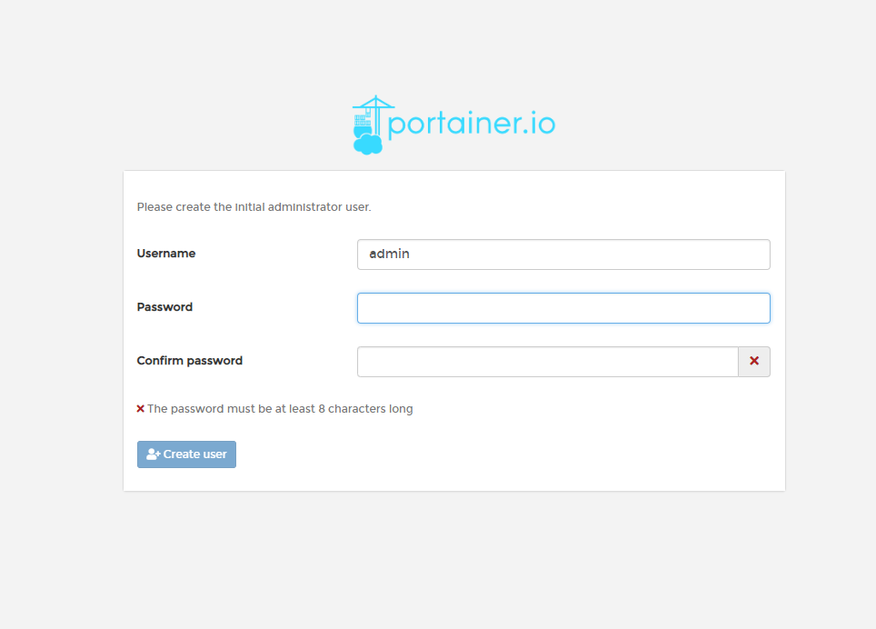
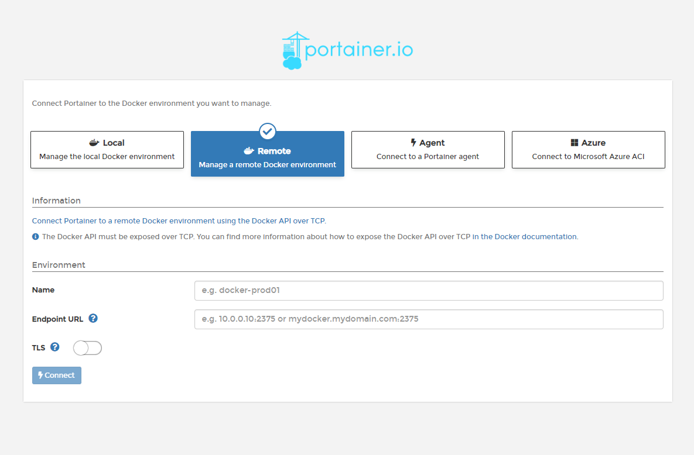
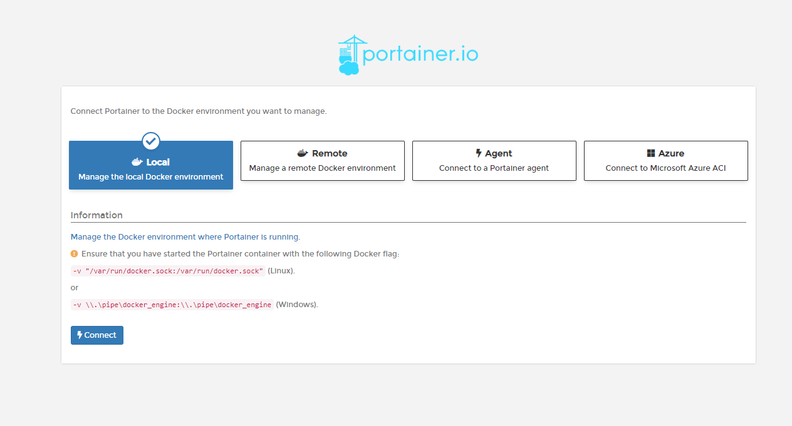
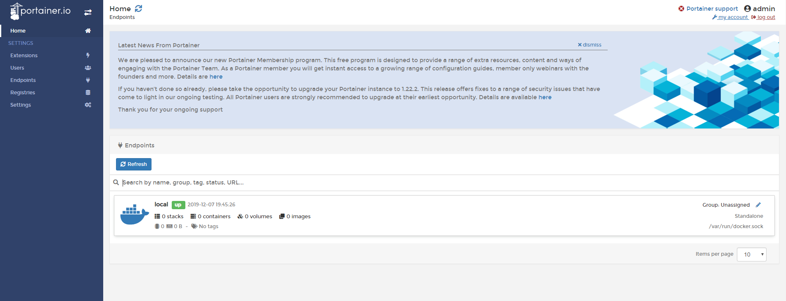
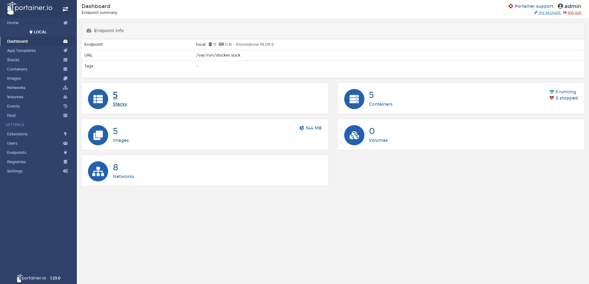
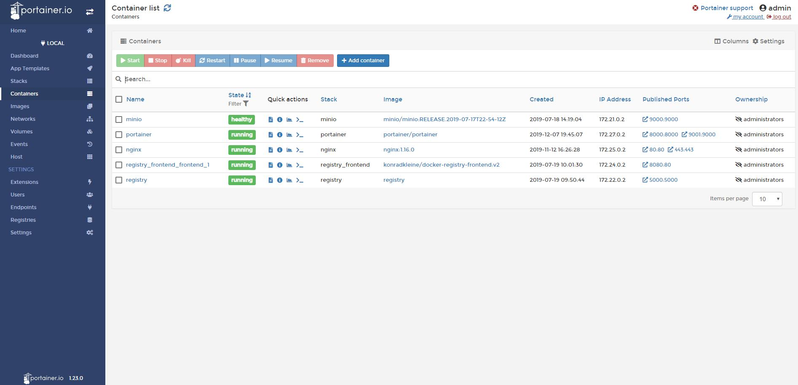
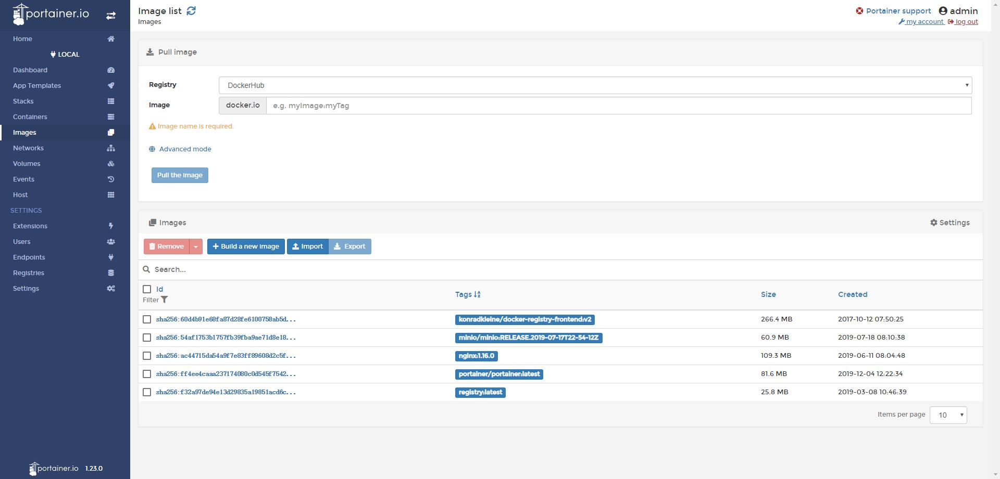
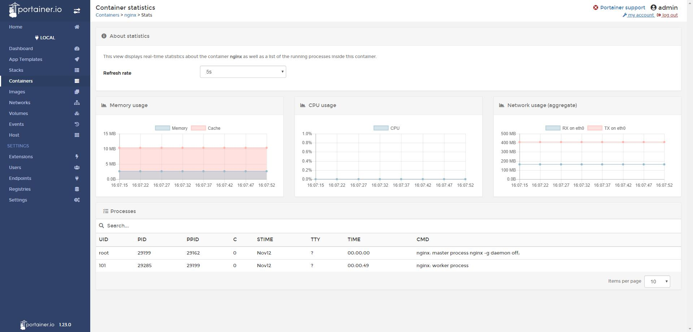
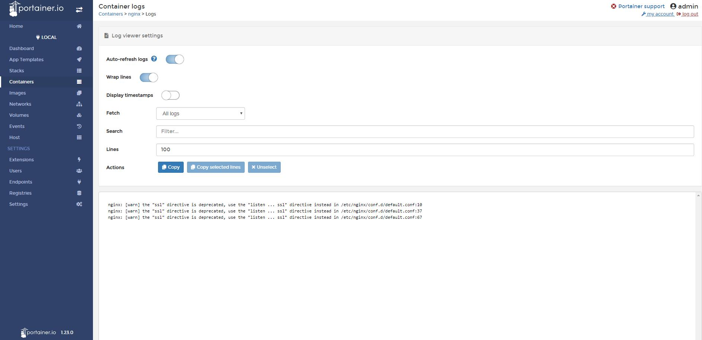
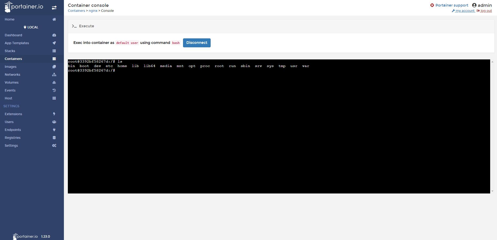

# Docker Compose 部署 Portainer


> Portainer 是一款轻量级的应用，它提供了图形化界面，用于方便的管理Docker环境，包括单机环境和集群环境，下面我们将用Portainer来管理Docker容器中的应用。

- 官网地址：[github.com/portainer/p…](https://github.com/portainer/portainer)


## 部署 Portainer

`docker-compose.yml` 配置如下：

```yaml
version: '3.1'
services:
  portainer:
    restart: always
    image: portainer/portainer
    container_name: portainer
    ports:
      - 9001:9000
      - 8000:8000
    volumes:
      - /var/run/docker.sock:/var/run/docker.sock
      - ./portainer/data:/data
```

> 这里要特别注意的是数据卷的配置，第一个 `/var/run/docker.sock:/var/run/docker.sock` 配置必须要这样，否则容器启动之后，访问Portainer时会报错的。


## 浏览器访问Portainer

- **地址：** [http://IP地址:9000/](http://IP地址:9000)

如果出现以下界面，则表示Portainer安装成功了。



这里是让我们设置初始化管理员的密码，需要注意的是，密码至少是6位。我这里设置为 `1q2w3e4r`。设置好后，点击 `Creat user` 按钮，会进入到以下页面：



这里提供了几种管理Docker环境的选择。因为我们是管理本地的Docker，所以我们选择 `Local` 即可，如下图：



点击 `Connect` 按钮，进行Docker环境的连接。连接成功的话，则会进入到以下页面。




## Portainer 界面介绍

经过上面几步的设置，我们总算是把Portainer安装成功了。那么接下来，我们就看看Portaiiner都提供了什么功能。


- 查看Portainer的DashBoard信息：




- 查看所有运行中的容器信息：




- 查看所有已经下载的Docker镜像：





- 查看`nginx`应用的统计信息：




- 查看`nginx`应用的运行过程中打印的日志信息：




- 进入`nginx`应用的容器内部来操作容器内部系统：




