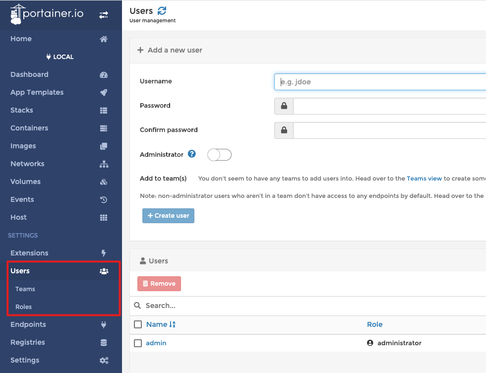

# Docker Compose 部署 Portainer


> `Portainer`是一个轻量级的`Docker`环境管理UI，它提供了图形化界面，用于方便的管理Docker环境，包括单机环境和集群环境。

官网地址：[github.com/portainer/p…](https://github.com/portainer/portainer)


主要优点有：

- 轻量级，镜像只有几十M，相对其它UI工具来说十分轻巧；
- 使用方便，它也是一个`Docker`应用，直接拉取镜像后启动即可；
- 持续更新，作为优秀的开源项目，`GitHub`还在持续维护和更新；
- 功能齐全，如以下几点：
  - 完备的权限管理（团队、角色、用户控制）；
  - 镜像管理；
  - 容器管理；
  - 主机和集群状态显示；
  - 应用模板快速部署；
  - 事件日志显示；
  - 其它`Docker`相关功能等。


下面我们将用Portainer来管理Docker容器中的应用


## 部署 Portainer

`docker-compose.yml` 配置如下：

```yaml
version: '3.1'
services:
  portainer:
    restart: always
    image: portainer/portainer
    container_name: portainer
    ports:
      - 9001:9000
      - 8000:8000
    volumes:
      - /var/run/docker.sock:/var/run/docker.sock
      - ./portainer/data:/data
```

> 这里要特别注意的是数据卷的配置，第一个 `/var/run/docker.sock:/var/run/docker.sock` 配置必须要这样，否则容器启动之后，访问Portainer时会报错的。


## 浏览器访问Portainer

- **地址：** [http://IP地址:9000/](http://IP地址:9000)

如果出现以下界面，则表示Portainer安装成功了。


这里是让我们设置初始化管理员的密码，需要注意的是，密码至少是6位。我这里设置为 `1q2w3e4r`。设置好后，点击 `Creat user` 按钮，会进入到以下页面：


这里提供了几种管理Docker环境的选择。因为我们是管理本地的Docker，所以我们选择 `Local` 即可，如下图：


点击 `Connect` 按钮，进行Docker环境的连接。连接成功的话，则会进入到以下页面。


## Portainer 界面介绍

经过上面几步的设置，我们总算是把Portainer安装成功了。那么接下来，我们就看看Portaiiner都提供了什么功能。


- 查看Portainer的DashBoard信息：


- 查看所有运行中的容器信息：（有新建、启动、停止、杀死、重启、删除等）


- 查看所有已下载的Docker镜像：（镜像功能有查看列表、导入导出、拉取、推送、创建、删除等功能，基本涵盖了命令行常用的命令）


- 权限管理功能有涉及团队、角色、用户的管理




- 查看`nginx`应用的统计信息：


- 查看`nginx`应用的运行过程中打印的日志信息：


- 进入`nginx`应用的容器内部来操作容器内部系统：


