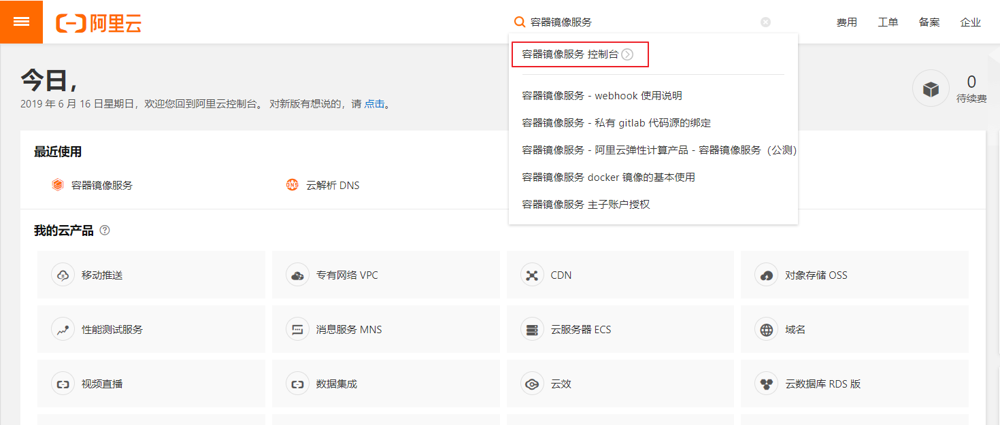
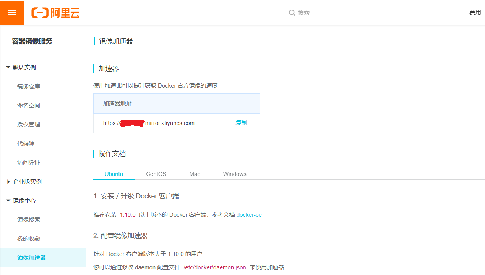
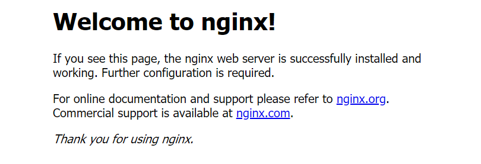

# 安装Docker


## Docker 平台支持

Docker CE 支持多种平台，如下表所示

### 桌面

| 平台                                                         | 架构 |
| :----------------------------------------------------------- | :--- |
| [Docker Desktop for Mac (macOS)](http://qfdmy.com/wp-content/themes/quanbaike/go.php?url=aHR0cHM6Ly9kb2NzLmRvY2tlci5jb20vZG9ja2VyLWZvci1tYWMvaW5zdGFsbC8=) | X64  |
| [Docker Desktop for Windows (Microsoft Windows 10)](http://qfdmy.com/wp-content/themes/quanbaike/go.php?url=aHR0cHM6Ly9kb2NzLmRvY2tlci5jb20vZG9ja2VyLWZvci13aW5kb3dzL2luc3RhbGwv) | X64  |

### 服务器

| 平台                                                         | x86_64 / amd64 | ARM  | ARM64 / AARCH64 | IBM Power (ppc64le) | IBM Z (s390x) |
| :----------------------------------------------------------- | :------------- | :--- | :-------------- | :------------------ | :------------ |
| [CentOS](http://qfdmy.com/wp-content/themes/quanbaike/go.php?url=aHR0cHM6Ly9kb2NzLmRvY2tlci5jb20vaW5zdGFsbC9saW51eC9kb2NrZXItY2UvY2VudG9zLw==) | ✔              |      | ✔               |                     |               |
| [Debian](http://qfdmy.com/wp-content/themes/quanbaike/go.php?url=aHR0cHM6Ly9kb2NzLmRvY2tlci5jb20vaW5zdGFsbC9saW51eC9kb2NrZXItY2UvZGViaWFuLw==) | ✔              | ✔    | ✔               |                     |               |
| [Fedora](http://qfdmy.com/wp-content/themes/quanbaike/go.php?url=aHR0cHM6Ly9kb2NzLmRvY2tlci5jb20vaW5zdGFsbC9saW51eC9kb2NrZXItY2UvZmVkb3JhLw==) | ✔              |      | ✔               |                     |               |
| [Ubuntu](http://qfdmy.com/wp-content/themes/quanbaike/go.php?url=aHR0cHM6Ly9kb2NzLmRvY2tlci5jb20vaW5zdGFsbC9saW51eC9kb2NrZXItY2UvdWJ1bnR1Lw==) | ✔              | ✔    | ✔               | ✔                   | ✔             |


## Docker 安装

### 卸载旧版本

```bash
apt-get remove docker docker-engine docker.io containerd runc
```


### 使用 APT 安装

```bash
# 更新数据源
apt-get update
# 安装所需依赖
apt-get -y install apt-transport-https ca-certificates curl software-properties-common
# 安装 GPG 证书
curl -fsSL http://mirrors.aliyun.com/docker-ce/linux/ubuntu/gpg | sudo apt-key add -
# 新增数据源
add-apt-repository "deb [arch=amd64] http://mirrors.aliyun.com/docker-ce/linux/ubuntu $(lsb_release -cs) stable"
# 更新并安装 Docker CE
apt-get update && apt-get install -y docker-ce
```


### 使用脚本自动安装

在测试或开发环境中 Docker 官方为了简化安装流程，提供了一套便捷的安装脚本，Ubuntu 系统上可以使用这套脚本安装：

```bash
$ curl -fsSL get.docker.com -o get-docker.sh
# 可能会出现 404 错误，请移步下面的特别说明
$ sudo sh get-docker.sh --mirror Aliyun
```

执行这个命令后，脚本就会自动的将一切准备工作做好，并且把 Docker CE 的 Edge 版本安装在系统中。

> **特别说明**
>
> 2018 年 7 月 21 日，貌似阿里云这边在做调整，故导致 Docker 的 Aliyun 安装脚本不可用，是永久性还是临时性的尚不清楚。如果你已经按照之前的操作安装 Docker，请按以下步骤进行修复并重新安装
>
> - 如果已经使用了 Aliyun 脚本安装并成功的
>   - 请先卸载 Docker，命令为：`apt-get autoremove docker-ce`
>   - 删除 `/etc/apt/sources.list.d` 目录下的 `docker.list` 文件
> - 使用 `AzureChinaCloud` 镜像脚本重新安装，命令为：`sudo sh get-docker.sh --mirror AzureChinaCloud

接下来，执行以下命令来启动 Docker CE

```bash
$ sudo systemctl enable docker
$ sudo systemctl start docker
```

Ubuntu 14.04 请使用以下命令启动：

```bash
$ sudo service docker start
```


### 验证安装是否成功

```bash
#执行以下命令
$ docker version

# 输出如下
Client:
 Version:           18.09.6
 API version:       1.39
 Go version:        go1.10.8
 Git commit:        481bc77
 Built:             Sat May  4 02:35:57 2019
 OS/Arch:           linux/amd64
 Experimental:      false
Server: Docker Engine - Community
 Engine:
  Version:          18.09.6
  API version:      1.39 (minimum version 1.12)
  Go version:       go1.10.8
  Git commit:       481bc77
  Built:            Sat May  4 01:59:36 2019
  OS/Arch:          linux/amd64
  Experimental:     false
```


## 配置 Docker 镜像加速器


### 阿里云加速器（推荐）

[点击链接获取](http://qfdmy.com/wp-content/themes/quanbaike/go.php?url=aHR0cHM6Ly9wcm9tb3Rpb24uYWxpeXVuLmNvbS9udG1zL2FjdC9xd2JrLmh0bWw/dXNlckNvZGU9aGdxa3U3YzU=)

### 官方提供中国区镜像

```
https://registry.docker-cn.com
```

### 配置加速器

以配置阿里云加速器为例，首先 [登录阿里云（没有账号请先注册）](http://qfdmy.com/wp-content/themes/quanbaike/go.php?url=aHR0cHM6Ly9wcm9tb3Rpb24uYWxpeXVuLmNvbS9udG1zL2FjdC9xd2JrLmh0bWw/dXNlckNvZGU9aGdxa3U3YzU=)，搜索 **容器镜像服务**



找到你的专属加速器



通过修改 daemon 配置文件 `/etc/docker/daemon.json` 来使用加速器

```json
tee /etc/docker/daemon.json <<-'EOF'
{
  "registry-mirrors": ["https://xxxxxxxx.mirror.aliyuncs.com"]
}
EOF


# 重启 Docker
$ systemctl daemon-reload
$ systemctl restart docker
```

### 验证配置是否成功

```bash
#执行以下命令
$ docker info

# 输出如下
Containers: 38
 Running: 18
 Paused: 0
 Stopped: 20
Images: 10
Server Version: 18.09.6
Storage Driver: overlay2
 Backing Filesystem: extfs
 Supports d_type: true
 Native Overlay Diff: true
Logging Driver: json-file
Cgroup Driver: cgroupfs
Plugins:
 Volume: local
 Network: bridge host macvlan null overlay
 Log: awslogs fluentd gcplogs gelf journald json-file local logentries splunk syslog
Swarm: inactive
Runtimes: runc
Default Runtime: runc
Init Binary: docker-init
containerd version: bb71b10fd8f58240ca47fbb579b9d1028eea7c84
runc version: 2b18fe1d885ee5083ef9f0838fee39b62d653e30
init version: fec3683
Security Options:
 apparmor
 seccomp
  Profile: default
Kernel Version: 4.15.0-51-generic
Operating System: Ubuntu 18.04.2 LTS
OSType: linux
Architecture: x86_64
CPUs: 2
Total Memory: 1.924GiB
Name: kubernetes-master
ID: PJ4H:7AF2:P5UT:6FMR:W4DI:SSWR:IQQR:J6QO:ARES:BOAC:ZVMO:SV2Y
Docker Root Dir: /var/lib/docker
Debug Mode (client): false
Debug Mode (server): false
Registry: https://index.docker.io/v1/
Labels:
Experimental: false
Insecure Registries:
 127.0.0.0/8
## 这里是你配置的镜像加速器
Registry Mirrors:
 https://xxxxxxxx.mirror.aliyuncs.com/
Live Restore Enabled: false
Product License: Community Engine
WARNING: No swap limit support
```

## 运行第一个容器

我们以 Nginx 为例，体验 Docker 是如何运行容器的

```bash
# 下载镜像
docker pull nginx

# 运行容器
docker run --name nginx-container -p 80:80 -d nginx
```

浏览器输入虚拟机地址即可访问 Nginx

