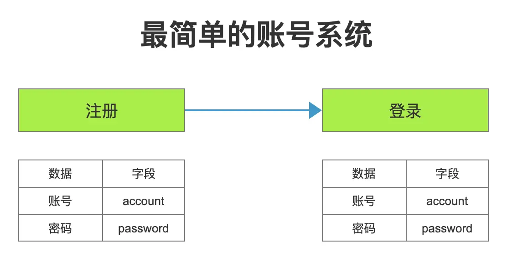
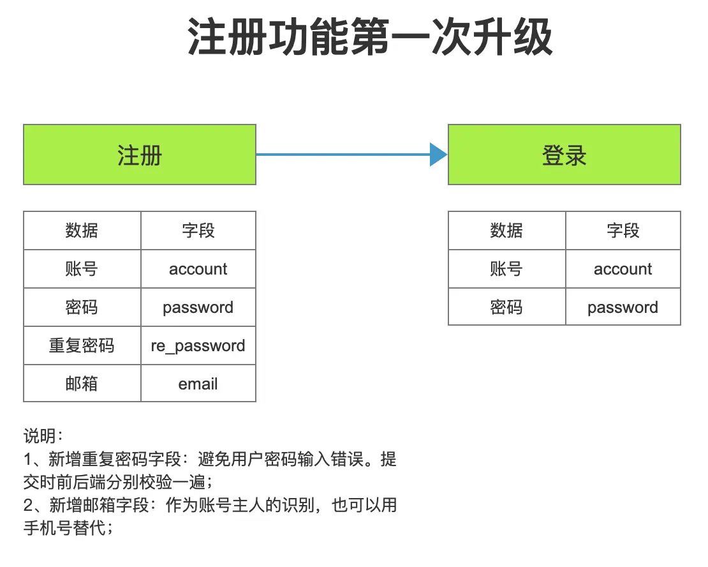
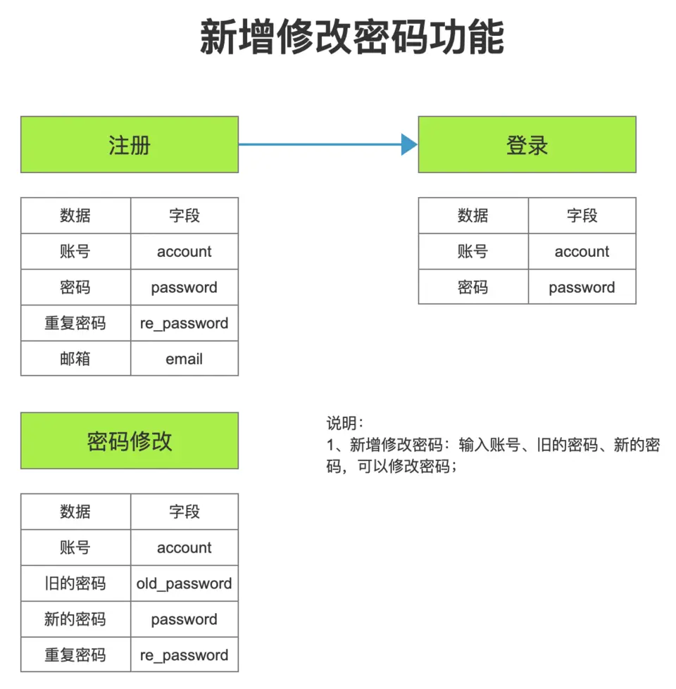
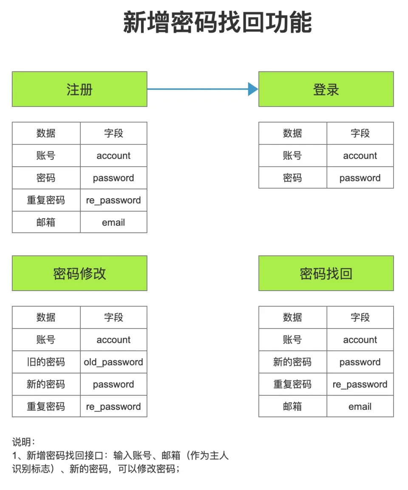
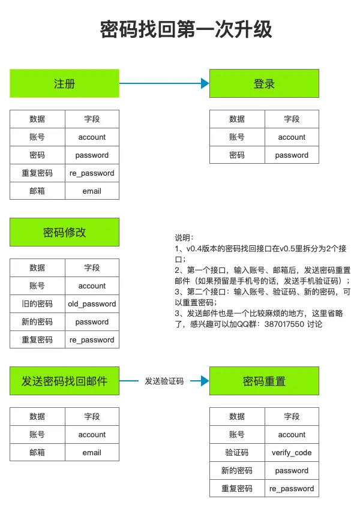
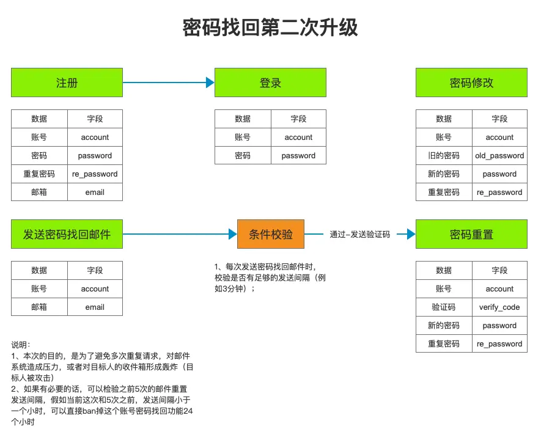
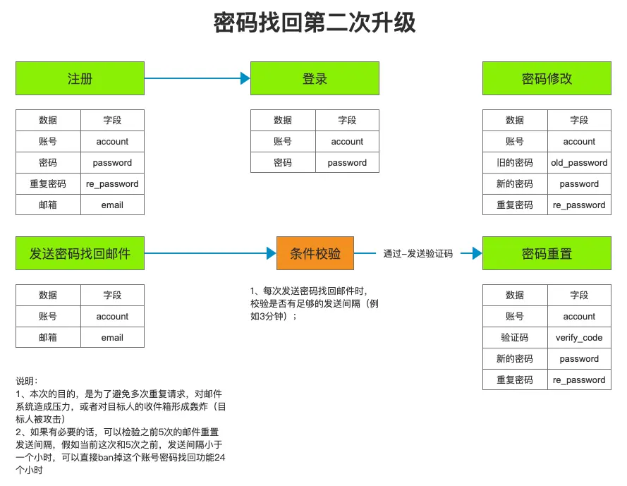
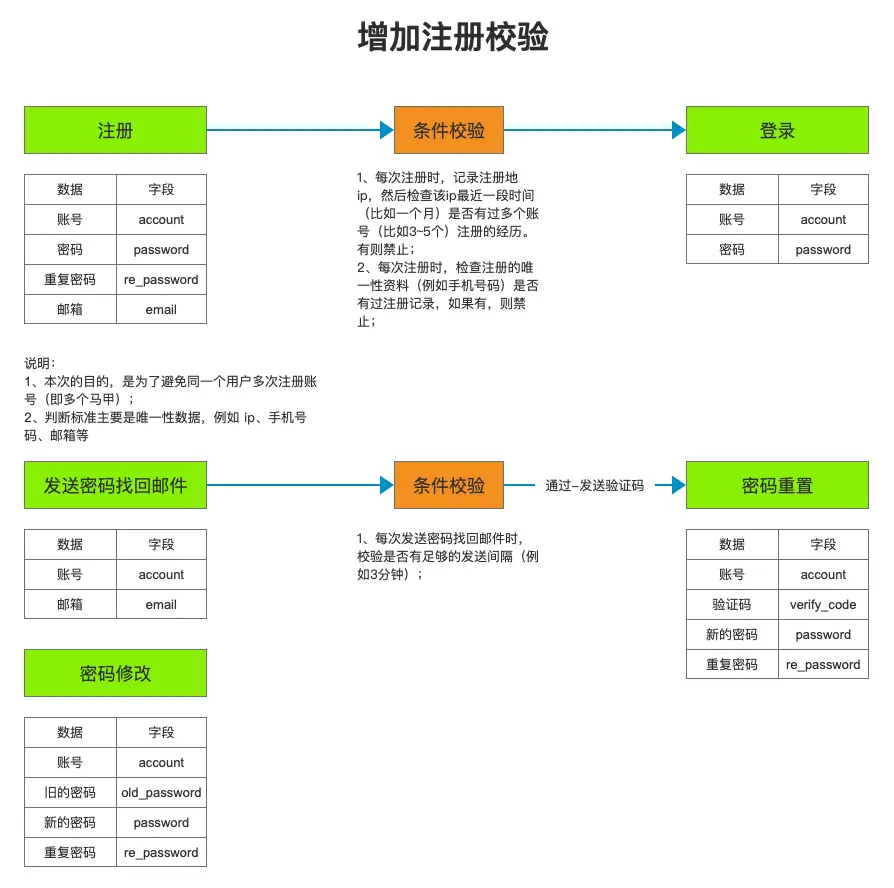
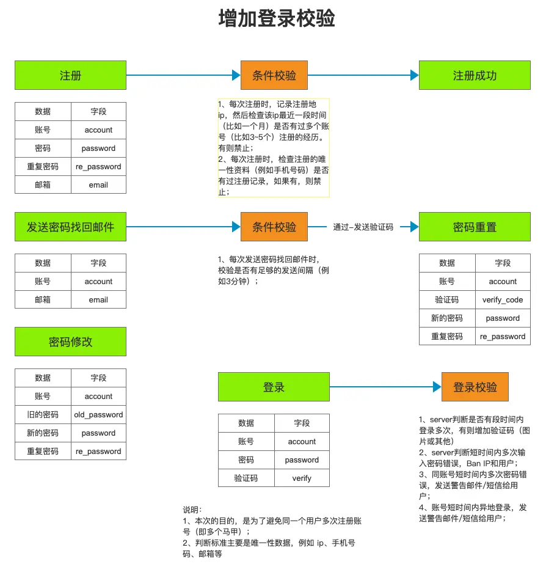

# 01-从零开始设计一个登录系统

## 说明：

1. 无任何代码，只有设计思路。
2. 范畴等级：初级开发、中级开发。
3. 场景：中小型项目，内部项目。
4. 不依赖于框架，核心逻辑全部手动实现
5. 什么时候补具体功能的实现逻辑：下次
6. 什么时候补中高级版本：等有空

## v0.1

## v0.2

## v0.3

## v0.4

## v0.5

## v0.6

## v0.7

## v0.8

## v0.9

