# 08-整合Redis

在 Redis 出现之前，我们的缓存框架各种各样，有了 Redis ，缓存方案基本上都统一了。

关于 Redis，这里有一个系列教程，尚不了解 Redis 的小伙伴可以参考这个教程：[Redis 教程合集](https://mp.weixin.qq.com/s/0Bukv4bFGMWosG8SWWoDDw)

使用 Java 操作 Redis 的方案很多，Jedis 是目前较为流行的一种方案，除了 Jedis ，还有很多其他解决方案，如下：


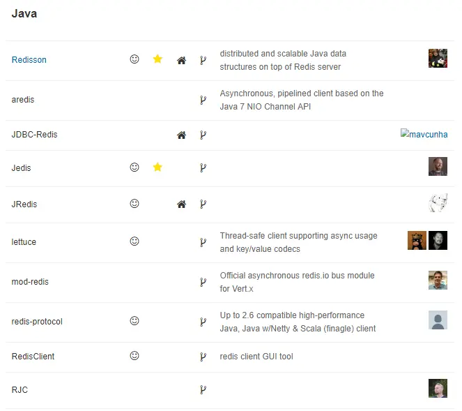

## 一、Spring Boot 中常用Redis操作方案

**1. Spring Data Redis（推荐）**

> 在传统的 SSM 中，开发者需要自己来配置 Spring Data Redis，这个配置比较繁琐，主要配置 3 个东西：连接池、连接器信息以及 key 和 value 的序列化方案。
>
> 而到了Spring Boot时代，官方默认集成的 Redis 就是 Spring Data Redis，就是为了让广大的开发者更加简单方便的来操作Redis。

**2. Spring Cache**

> 通过 Spring Cache 的形式来操作 Redis，Spring Cache 统一了缓存江湖的门面，这种方案有专门的文章介绍，小伙伴可以移步这里：[Spring Boot中，Redis缓存还能这么用！](https://mp.weixin.qq.com/s/UpTewC66iJyzq0osm_0cfw)。

**3. 直接使用Redis客户端**

> 直接使用 Jedis 或者 其他的客户端工具来操作 Redis ，这种方案在 Spring Boot 中也是支持的，虽然操作麻烦，但是支持，这种操作也有相关介绍的文章，因此这里就不再赘述了，可以参考 [Jedis 使用](https://mp.weixin.qq.com/s/4ghSyd8BIq01LYhhjToXrg)。


这里总结了三种方案，事实上前两个使用更广泛一些，直接使用 Jedis 还是比较少，基本上 Spring Boot 中没见过有人直接这么搞。

而前两种方案中，第一种方案在Spring Boot中，集成会更加的简单、方便，所以接下来的这篇文章我们就以这种方式来进行详细讲解。


## 二、集成 Spring Data Redis

在 Spring Boot 中，默认集成的 Redis 就是 Spring Data Redis，默认底层的连接池使用了 lettuce ，开发者可以自行修改为自己的熟悉的，例如 Jedis。

Spring Data Redis 针对 Redis 提供了非常方便的操作模板 RedisTemplate 。这是 Spring Data 擅长的事情，那么接下来我们就来看看 Spring Boot 中 Spring Data Redis 的具体用法。


### 新建项目

创建maven项目，引入 Redis 相关依赖。另外，还需要手动引入 commos-pool2 的依赖，因此最终完整的 pom.xml 依赖如下：

```xml
<dependencies>    
    <dependency>
        <groupId>org.springframework.boot</groupId>
        <artifactId>spring-boot-starter-web</artifactId>
    </dependency>
    <dependency>
        <groupId>org.springframework.boot</groupId>
        <artifactId>spring-boot-starter-data-redis</artifactId>
    </dependency>
    <dependency>
        <groupId>org.apache.commons</groupId>
        <artifactId>commons-pool2</artifactId>
    </dependency>
</dependencies>
```

这里主要就是引入了 Spring Data Redis + 连接池。


### 配置 Redis

接下来配置 Redis 的信息，主要包括两方面，一方面是 Redis 的基本信息，另一方面则是连接池信息:

```properties
spring.redis.database=0
spring.redis.password=123
spring.redis.port=6379
spring.redis.host=192.168.66.128
spring.redis.lettuce.pool.min-idle=5
spring.redis.lettuce.pool.max-idle=10
spring.redis.lettuce.pool.max-active=8
spring.redis.lettuce.pool.max-wait=1ms
spring.redis.lettuce.shutdown-timeout=100ms
```

### 自动配置

当开发者在项目中引入了 Spring Data Redis ，并且配置了 Redis 的基本信息，此时，自动化配置就会生效。

我们从 Spring Boot 中 Redis 的自动化配置类中就可以看出端倪：

```java
@Configuration
@ConditionalOnClass(RedisOperations.class)
@EnableConfigurationProperties(RedisProperties.class)
@Import({ LettuceConnectionConfiguration.class, JedisConnectionConfiguration.class })
public class RedisAutoConfiguration {
    
    @Bean
    @ConditionalOnMissingBean(name = "redisTemplate")
    public RedisTemplate<Object, Object> redisTemplate(
                    RedisConnectionFactory redisConnectionFactory) throws UnknownHostException {
            RedisTemplate<Object, Object> template = new RedisTemplate<>();
            template.setConnectionFactory(redisConnectionFactory);
            return template;
    }
    
    @Bean
    @ConditionalOnMissingBean
    public StringRedisTemplate stringRedisTemplate(
                    RedisConnectionFactory redisConnectionFactory) throws UnknownHostException {
            StringRedisTemplate template = new StringRedisTemplate();
            template.setConnectionFactory(redisConnectionFactory);
            return template;
    }
    
}
```

这个自动化配置类很好理解：

1. 首先标记这个是一个配置类，同时该配置在 RedisOperations 存在的情况下才会生效(即项目中引入了 Spring Data Redis)
2. 然后导入在 application.properties 中配置的属性
3. 然后再导入连接池信息（如果存在的话）
4. 最后，提供了两个 Bean，`RedisTemplate` 和 `StringRedisTemplate` 。其中 StringRedisTemplate 是 RedisTemplate 的子类，两者的方法基本一致，不同之处主要体现在操作的数据类型不同。RedisTemplate 中的两个泛型都是 Object ，意味者存储的 key 和 value 都可以是一个对象。而 StringRedisTemplate 的 两个泛型都是 String，意味者 StringRedisTemplate 的 key 和 value 都只能是字符串。如果开发者没有提供相关的 Bean，这两个配置就会生效，否则不会生效。


### 测试类
注入 StringRedisTemplate 或者 RedisTemplate 来使用

```java
@SpringBootTest
@RunWith(SpringRunner.class)
public class RedisTest {

    @Autowired
    private RedisTemplate redisTemplate;

    @Test
    public void testRedis() {
        String key = "hello";
        ValueOperations ops = redisTemplate.opsForValue();

        //设置数据
        ops.set(key, "你好");

        //获取数据
        String value = (String) ops.get(key);
        System.out.println(value);
    }
}
```

Redis 中的数据操作，大体上来说，可以分为两种：

1. 针对 key 的操作，相关的方法就在 RedisTemplate 中
2. 针对具体数据类型的操作，相关的方法需要首先获取对应的数据类型，获取相应数据类型的操作方法是 opsForXXX

调用该方法就可以将数据存储到 Redis 中去了，执行代码后，我们看一下redis：

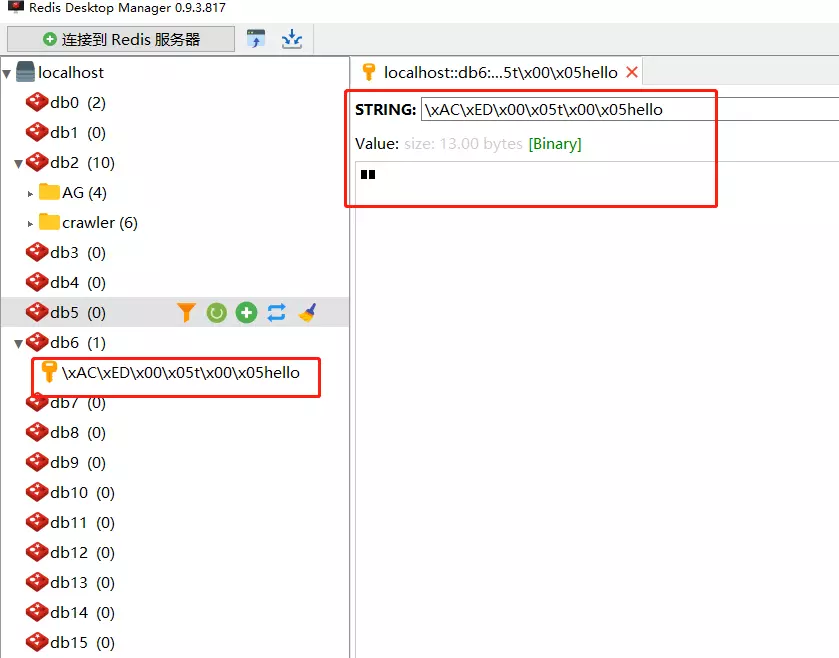


这里存在一个问题：

默认的存储方式导致 key 在Redis-Manager里面显示出来是乱码的，并且存储结果(value)是二进制了。这样不利于我们查看redis里面的数据。

> 为什么会出现这个问题呢？
>
> 在 RedisTemplate 中，key 默认的序列化方案是`JdkSerializationRedisSerializer` 。
> 而在 StringRedisTemplate 中，key 默认的序列化方案是 `StringRedisSerializer`。
> 因此，如果使用 StringRedisTemplate，默认情况下 key 前面不会有前缀。

不过开发者也可以自行修改 RedisTemplate 中的序列化方案，如下:

```java
@SpringBootTest
@RunWith(SpringRunner.class)
public class RedisTest {
    @Autowired
    private RedisTemplate redisTemplate;

    @Test    
    public void hello() {
        String key = "hello";
        redisTemplate.setKeySerializer(new StringRedisSerializer());
        ValueOperations ops = redisTemplate.opsForValue();
        ops.set(key, "你好");
        
        Object value = ops.get(key);
        System.out.println(value);
    }
    
}
```

当然也可以直接使用 StringRedisTemplate：

```java
@SpringBootTest
@RunWith(SpringRunner.class)
public class RedisTest {

    @Autowired
    private StringRedisTemplate stringRedisTemplate;
    
    @Test
    public void hello2() {
        String key = "hello";
        ValueOperations ops = stringRedisTemplate.opsForValue();
        ops.set(key, "你好");
        
        Object value = ops.get(key);
        System.out.println(value);
    }
    
}
```

> 另外需要注意的是，Spring Boot 的自动化配置，只能配置单机的 Redis。如果是 Redis 集群，则所有的东西都需要自己手动配置。
>
> 关于如何操作 Redis 集群，以后再来和大家分享。


### 解决RedisTemplate默认序列化的问题
从上面的案例中可以看出，默认的序列化，会导致key和value都变得不那么易于理解。虽然可以在使用时设置序列化规则，但是每次都进行设置，也是比较麻烦的。接下来，我们就通过一个全局的配置，来解决这个序列化问题。


首先来完善一下maven依赖：

```xml
<dependency>
	<groupId>org.springframework.boot</groupId>
	<artifactId>spring-boot-starter</artifactId>
</dependency>

<dependency>
	<groupId>org.springframework.boot</groupId>
	<artifactId>spring-boot-starter-test</artifactId>
	<scope>test</scope>
</dependency>

<dependency>
	<groupId>org.springframework.boot</groupId>
	<artifactId>spring-boot-starter-web</artifactId>
</dependency>

<dependency>
	<groupId>org.springframework.boot</groupId>
	<artifactId>spring-boot-starter-data-redis</artifactId>
</dependency>
```

定义RedisConfig类：

```java
/**
 * redis配置
 * 
 * 主要是配置Redis的序列化规则，替换默认的jdkSerializer
 * key的序列化规则用StringRedisSerializer
 * value的序列化规则用Jackson2JsonRedisSerializer
 */
@Configuration
public class RedisConfig {

    @Bean
    public RedisTemplate<Object, Object> redisTemplate(RedisConnectionFactory connectionFactory) {
        RedisTemplate<Object, Object> redisTemplate = new RedisTemplate<>();
        redisTemplate.setConnectionFactory(connectionFactory);

        // 使用Jackson2JsonRedisSerialize替换默认序列化
        Jackson2JsonRedisSerializer jackson2JsonRedisSerializer = new Jackson2JsonRedisSerializer(Object.class);

        ObjectMapper objectMapper = new ObjectMapper();
        objectMapper.setVisibility(PropertyAccessor.ALL, JsonAutoDetect.Visibility.ANY);
        objectMapper.enableDefaultTyping(ObjectMapper.DefaultTyping.NON_FINAL);

        jackson2JsonRedisSerializer.setObjectMapper(objectMapper);

        // 设置key和value的序列化规则
        redisTemplate.setKeySerializer(new StringRedisSerializer());
        redisTemplate.setValueSerializer(jackson2JsonRedisSerializer);

        redisTemplate.setHashKeySerializer(new StringRedisSerializer());
        redisTemplate.setHashValueSerializer(jackson2JsonRedisSerializer);

        redisTemplate.afterPropertiesSet();
        return redisTemplate;
    }
}
```

删除之前的key，重新执行一下test方法：

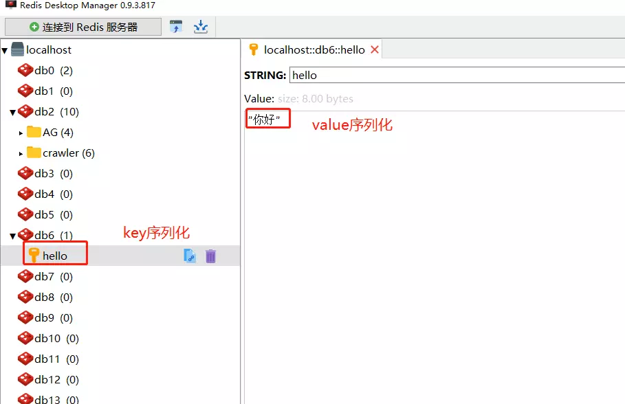


下面来演示一下SpringBoot使用RedisTemplate进行redis数据的操作。


## 三、数据操作(key/list/hash)

RedisTemplate内置redis操作如下：

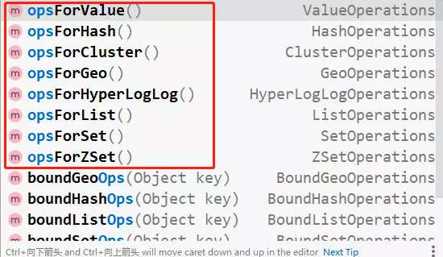


这里主要展示value/hash/list三种用法：

------

### 3.1 RedisTemplate.opsForValue

```java
@Test
public void testKeyOps() {
    // 测试redis操作key-value形式
    Set<String> keySet = new HashSet<>();

    String key1 = "name";
    keySet.add(key1);
    // 存储简单的key-value，并设置过期时间
    redisTemplate.opsForValue().set(key1, "eknown", 1, TimeUnit.MINUTES);

    String key2 = "token:user1";
    String key3 = "token:user2";
    keySet.add(key2);
    keySet.add(key3);
    //
    redisTemplate.opsForValue().set(key2, "{\"name\":\"eknown\"}, \"role\":\"admin\"");
    redisTemplate.opsForValue().set(key3, "{\"name\":\"test\"}, \"role\":\"test\"");

    // 根据key的集合获取多个value
    List<String> valueList = redisTemplate.opsForValue().multiGet(keySet);
    for (String value : valueList) {
        System.out.println(value);
    }
}
```

执行结果：

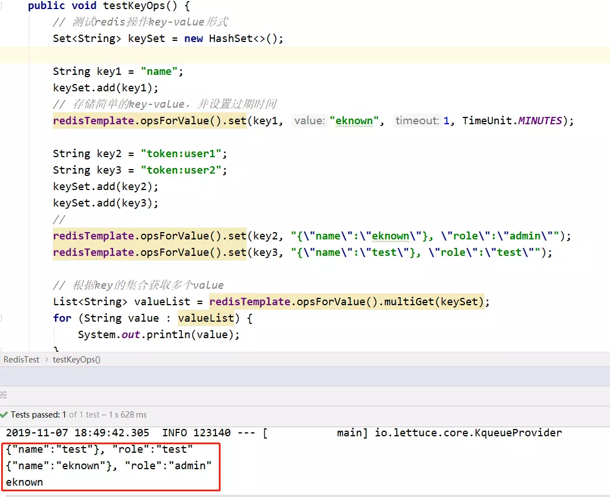


redis中的数据：


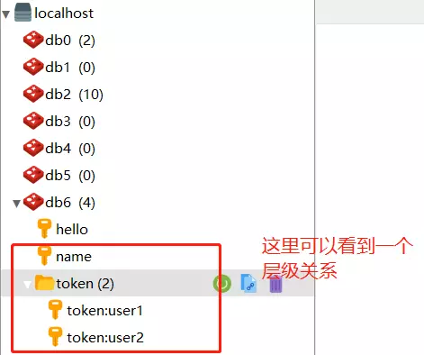


redis中的key显示出了一个层级关系，这个小技巧对于实际项目有个非常好的作用：通过`prefix:suffix`这样的形式，可以将redis中存储的数据分出层级。

------

### 3.2 RedisTemplate.opsForHash

清空该database下的数据，测试redisTemplate.opsForHash：

```java
@Test
public void testHashOps() {
    String key = "hash";
    // 单次往hash中存放一个数据
    redisTemplate.opsForHash().put(key, "1", "你好");

    Map<String, Object> map = new HashMap<>();
    map.put("2", "hello");
    map.put("3a", "china1=2");

    // 一次性向hash中存放一个map
    redisTemplate.opsForHash().putAll(key, map);

    // 获取hash下的所有key和value
    Map<String, Object> resultMap = redisTemplate.opsForHash().entries(key);
    for (String hashKey : resultMap.keySet()) {
        System.out.println(hashKey + ": " + resultMap.get(hashKey));
    }
}
```

执行结果：


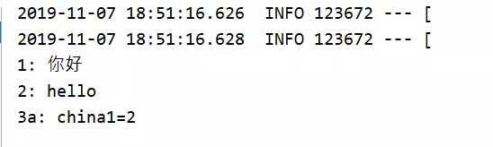


redis:

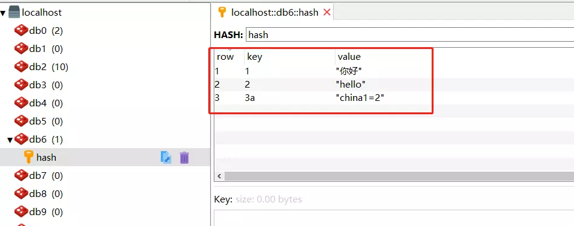


------

### 3.3 RedisTemplate.opsForList

```java
@Test
public void testListOps() {
    String listKey = "list";
    redisTemplate.opsForList().leftPush(listKey, "first value"); // 从list最左边插入数据
    redisTemplate.opsForList().leftPush(listKey, "second value but left");
    redisTemplate.opsForList().rightPush(listKey, 3); // 从list最右边插入数据

    List<Object> list = new ArrayList<>();
    list.add("hello");
    list.add("http://www.eknown.cn");
    list.add(23344);
    list.add(false);
    redisTemplate.opsForList().rightPushAll(listKey, list); // 从list右边批量插入数据

    long size = redisTemplate.opsForList().size(listKey);
    if (size > 0) {
        for (int i = 0; i < size -1 ; i++) {
            // 从list最左边开始读取list中的数据，注意pop会导致出栈，也就是数据被取出来了（redis中就没有这个值了）
            // 此处我们读取size-1条数据，仅留下最后一条数据
            System.out.println(i + ":" + redisTemplate.opsForList().leftPop(listKey).toString());
        }
    }
}
```

执行上面的脚本，注意在最后的读取list数据代码前面加一个断点，此时redis中是这样的：

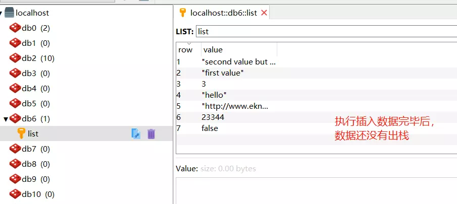


放开断点，程序继续执行，控制台如下：

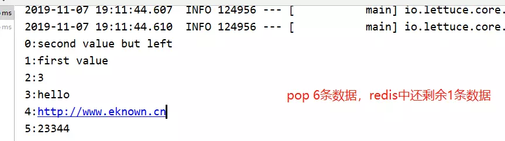


注意，此时redis中仅剩余最后一条数据，这是由于pop的问题，list中的数据被读取并删除了：

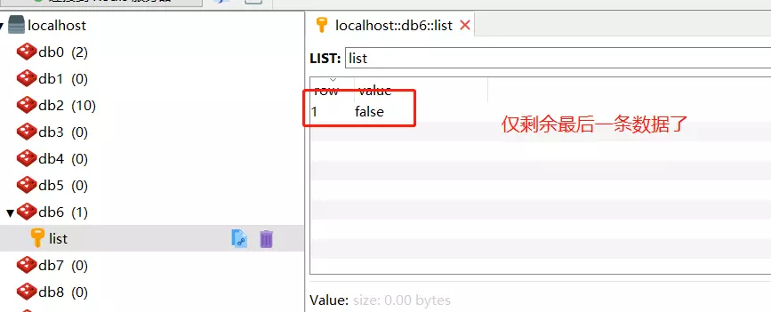


------

好了，这一节主要讲了SpringBoot引入redis，以及使用redis的一些基本操作和相关技巧，在此基础上，我们可以让我们的项目变得更加快速、灵活！
