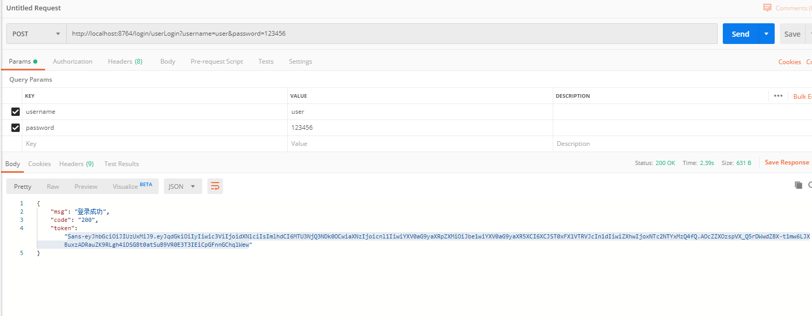
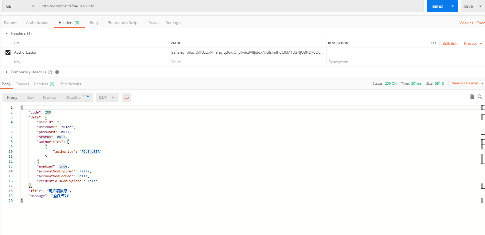
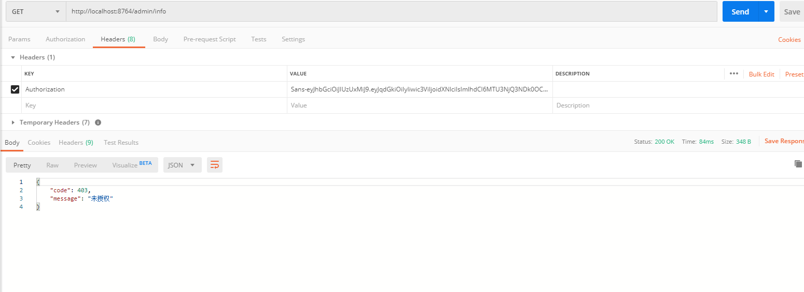
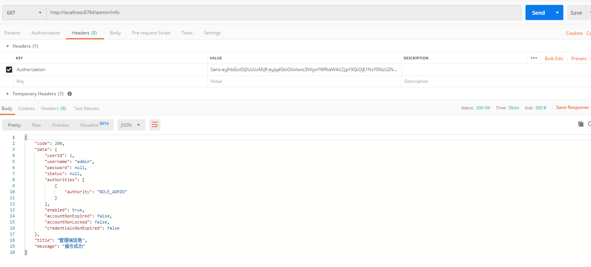

# 10-整合SpringSecurity实现权限注解+JWT登录认证


## 一.说明

SpringSecurity是一个用于Java 企业级应用程序的安全框架，主要包含用户认证和用户授权两个方面。相比较Shiro而言，Security功能更加的强大，它可以很容易地扩展以满足更多安全控制方面的需求。但也相对它的学习成本会更高，两种框架各有利弊。实际开发中还是要根据业务和项目的需求来决定使用哪一种。

JWT是在Web应用中安全传递信息的规范，从本质上来说是Token的演变，是一种生成加密用户身份信息的Token，特别适用于分布式单点登陆的场景，无需在服务端保存用户的认证信息，而是直接对Token进行校验获取用户信息，使单点登录更为简单灵活。


## 二.项目环境

SpringBoot版本:  2.1.6

SpringSecurity版本:   5.1.5

MyBatis-Plus版本:   3.1.0

JDK版本:  1.8

数据表(SQL文件在项目中):数据库中测试号的密码进行了加密,密码皆为123456

| 数据表名      | 中文表名         | 备注说明 |
| :------------ | :--------------- | :------- |
| sys_user      | 系统用户表       | 基础表   |
| sys_menu      | 权限表           | 基础表   |
| sys_role      | 角色表           | 基础表   |
| sys_role_menu | 角色与权限关系表 | 中间表   |
| sys_user_role | 用户与角色关系表 | 中间表   |

Maven依赖如下：

```xml
<dependencies>
        <dependency>
            <groupId>org.springframework.boot</groupId>
            <artifactId>spring-boot-starter-web</artifactId>
        </dependency>
        <dependency>
            <groupId>mysql</groupId>
            <artifactId>mysql-connector-java</artifactId>
            <scope>runtime</scope>
        </dependency>
        <dependency>
            <groupId>org.projectlombok</groupId>
            <artifactId>lombok</artifactId>
            <optional>true</optional>
        </dependency>
        <dependency>
            <groupId>org.springframework.boot</groupId>
            <artifactId>spring-boot-starter-test</artifactId>
            <scope>test</scope>
        </dependency>
        <!--Security依赖 -->
        <dependency>
            <groupId>org.springframework.boot</groupId>
            <artifactId>spring-boot-starter-security</artifactId>
        </dependency>
        <!-- MybatisPlus 核心库 -->
        <dependency>
            <groupId>com.baomidou</groupId>
            <artifactId>mybatis-plus-boot-starter</artifactId>
            <version>3.1.0</version>
        </dependency>
        <!-- 引入阿里数据库连接池 -->
        <dependency>
            <groupId>com.alibaba</groupId>
            <artifactId>druid</artifactId>
            <version>1.1.6</version>
        </dependency>
        <!-- StringUtilS工具 -->
        <dependency>
            <groupId>org.apache.commons</groupId>
            <artifactId>commons-lang3</artifactId>
            <version>3.5</version>
        </dependency>
        <!-- JSON工具 -->
        <dependency>
            <groupId>com.alibaba</groupId>
            <artifactId>fastjson</artifactId>
            <version>1.2.45</version>
        </dependency>
        <!-- JWT依赖 -->
        <dependency>
            <groupId>org.springframework.security</groupId>
            <artifactId>spring-security-jwt</artifactId>
            <version>1.0.9.RELEASE</version>
        </dependency>
        <dependency>
            <groupId>io.jsonwebtoken</groupId>
            <artifactId>jjwt</artifactId>
            <version>0.9.0</version>
        </dependency>
</dependencies>
```

配置如下:

```properties
# 配置端口
server:
  port: 8764
spring:
  # 配置数据源
  datasource:
    driver-class-name: com.mysql.cj.jdbc.Driver
    url: jdbc:mysql://localhost:3306/spring_security_demo?serverTimezone=UTC&useUnicode=true&characterEncoding=utf-8&zeroDateTimeBehavior=convertToNull&useSSL=false
    username: root
    password: 123456
    type: com.alibaba.druid.pool.DruidDataSource
# JWT配置
jwt:
  # 密匙KEY
  secret: JWTSecret
  # HeaderKEY
  tokenHeader: Authorization
  # Token前缀字符
  tokenPrefix: Sans-
  # 过期时间 单位秒(1天后过期=86400 7天后过期=604800)
  expiration: 86400
  # 配置不需要认证的接口
  antMatchers: /index,/login/**,/favicon.ico
# Mybatis-plus相关配置
mybatis-plus:
  # xml扫描，多个目录用逗号或者分号分隔（告诉 Mapper 所对应的 XML 文件位置）
  mapper-locations: classpath:mapper/*.xml
  # 以下配置均有默认值,可以不设置
  global-config:
    db-config:
      #主键类型 AUTO:"数据库ID自增" INPUT:"用户输入ID",ID_WORKER:"全局唯一ID (数字类型唯一ID)", UUID:"全局唯一ID UUID";
      id-type: AUTO
      #字段策略 IGNORED:"忽略判断"  NOT_NULL:"非 NULL 判断")  NOT_EMPTY:"非空判断"
      field-strategy: NOT_EMPTY
      #数据库类型
      db-type: MYSQL
  configuration:
    # 是否开启自动驼峰命名规则映射:从数据库列名到Java属性驼峰命名的类似映射
    map-underscore-to-camel-case: true
    # 返回map时true:当查询数据为空时字段返回为null,false:不加这个查询数据为空时，字段将被隐藏
    call-setters-on-nulls: true
    # 这个配置会将执行的sql打印出来，在开发或测试的时候可以用
    log-impl: org.apache.ibatis.logging.stdout.StdOutImpl
```

## 三.编写项目基础类

Entity、Dao、Service、及等SpringSecurity用户的Entity、Service类等在这里省略，请参考源码。

### JWT工具类

```java
/**
 * JWT工具类
 * @Author RyuZheng
 * @CreateTime 2019/10/2 7:42
 */
@Slf4j
public class JWTTokenUtil {

    /**
     * 生成Token
     * @Param selfUserEntity 用户安全实体
     * @Return Token
     */
    public static String createAccessToken(SelfUserEntity selfUserEntity){
        // 登陆成功生成JWT
        String token = Jwts.builder()
                // 放入用户名和用户ID
                .setId(selfUserEntity.getUserId()+"")
                // 主题
                .setSubject(selfUserEntity.getUsername())
                // 签发时间
                .setIssuedAt(new Date())
                // 签发者
                .setIssuer("sans")
                // 自定义属性 放入用户拥有权限
                .claim("authorities", JSON.toJSONString(selfUserEntity.getAuthorities()))
                // 失效时间
                .setExpiration(new Date(System.currentTimeMillis() + JWTConfig.expiration))
                // 签名算法和密钥
                .signWith(SignatureAlgorithm.HS512, JWTConfig.secret)
                .compact();
        return token;
    }
}
```

### 暂无权限处理类

```java
/**
 * @Description 暂无权限处理类
 * @Author RyuZheng
 * @CreateTime 2019/10/3 8:39
 */
@Component
public class UserAuthAccessDeniedHandler implements AccessDeniedHandler{
    /**
     * 暂无权限返回结果
     */
    @Override
    public void handle(HttpServletRequest request, HttpServletResponse response, AccessDeniedException exception){
        ResultUtil.responseJson(response,ResultUtil.resultCode(403,"未授权"));
    }
}
```

### 用户未登录处理类

```java
/**
 * 用户未登录处理类
 * @Author RyuZheng
 * @CreateTime 2019/10/3 8:55
 */
@Component
public class UserAuthenticationEntryPointHandler implements AuthenticationEntryPoint {
    /**
     * 用户未登录返回结果
     */
    @Override
    public void commence(HttpServletRequest request, HttpServletResponse response, AuthenticationException exception){
        ResultUtil.responseJson(response,ResultUtil.resultCode(401,"未登录"));
    }
}
```

### 登录失败处理类

```java
/**
 * @Description 登录失败处理类
 * @Author RyuZheng
 * @CreateTime 2019/10/3 9:06
 */
@Slf4j
@Component
public class UserLoginFailureHandler implements AuthenticationFailureHandler {
    /**
     * 登录失败返回结果
     */
    @Override
    public void onAuthenticationFailure(HttpServletRequest request, HttpServletResponse response, AuthenticationException exception){
        // 这些对于操作的处理类可以根据不同异常进行不同处理
        if (exception instanceof UsernameNotFoundException){
            log.info("【登录失败】"+exception.getMessage());
            ResultUtil.responseJson(response,ResultUtil.resultCode(500,"用户名不存在"));
        }
        if (exception instanceof LockedException){
            log.info("【登录失败】"+exception.getMessage());
            ResultUtil.responseJson(response,ResultUtil.resultCode(500,"用户被冻结"));
        }
        if (exception instanceof BadCredentialsException){
            log.info("【登录失败】"+exception.getMessage());
            ResultUtil.responseJson(response,ResultUtil.resultCode(500,"用户名密码不正确"));
        }
        ResultUtil.responseJson(response,ResultUtil.resultCode(500,"登录失败"));
    }
}
```

### 登录成功处理类

```java
/**
 * @Description 登录成功处理类
 * @Author RyuZheng
 * @CreateTime 2019/10/3 9:13
 */
@Slf4j
@Component
public class UserLoginSuccessHandler implements AuthenticationSuccessHandler {
    /**
     * 登录成功返回结果
     */
    @Override
    public void onAuthenticationSuccess(HttpServletRequest request, HttpServletResponse response, Authentication authentication){
        // 组装JWT
        SelfUserEntity selfUserEntity =  (SelfUserEntity) authentication.getPrincipal();
        String token = JWTTokenUtil.createAccessToken(selfUserEntity);
        token = JWTConfig.tokenPrefix + token;
        // 封装返回参数
        Map<String,Object> resultData = new HashMap<>();
        resultData.put("code","200");
        resultData.put("msg", "登录成功");
        resultData.put("token",token);
        ResultUtil.responseJson(response,resultData);
    }
}
```

### 登出成功处理类

```java
/**
 * 用户登出类
 * @Author RyuZheng
 * @CreateTime 2019/10/3 9:42
 */
@Component
public class UserLogoutSuccessHandler implements LogoutSuccessHandler {
    /**
     * 用户登出返回结果
     * 这里应该让前端清除掉Token
     */
    @Override
    public void onLogoutSuccess(HttpServletRequest request, HttpServletResponse response, Authentication authentication){
        Map<String,Object> resultData = new HashMap<>();
        resultData.put("code","200");
        resultData.put("msg", "登出成功");
        SecurityContextHolder.clearContext();
        ResultUtil.responseJson(response,ResultUtil.resultSuccess(resultData));
    }
}
```


## 四.编写Security核心类

### 自定义登录验证类

```java
/**
 * 自定义登录验证
 * @Author RyuZheng
 * @CreateTime 2019/10/1 19:11
 */
@Component
public class UserAuthenticationProvider implements AuthenticationProvider {
    @Autowired
    private SelfUserDetailsService selfUserDetailsService;
    @Autowired
    private SysUserService sysUserService;
    
    @Override
    public Authentication authenticate(Authentication authentication) throws AuthenticationException {
        // 获取表单输入中返回的用户名
        String userName = (String) authentication.getPrincipal();
        // 获取表单中输入的密码
        String password = (String) authentication.getCredentials();
        // 查询用户是否存在
        SelfUserEntity userInfo = selfUserDetailsService.loadUserByUsername(userName);
        if (userInfo == null) {
            throw new UsernameNotFoundException("用户名不存在");
        }
        // 我们还要判断密码是否正确，这里我们的密码使用BCryptPasswordEncoder进行加密的
        if (!new BCryptPasswordEncoder().matches(password, userInfo.getPassword())) {
            throw new BadCredentialsException("密码不正确");
        }
        // 还可以加一些其他信息的判断，比如用户账号已停用等判断
        if (userInfo.getStatus().equals("PROHIBIT")){
            throw new LockedException("该用户已被冻结");
        }
        // 角色集合
        Set<GrantedAuthority> authorities = new HashSet<>();
        // 查询用户角色
        List<SysRoleEntity> sysRoleEntityList = sysUserService.selectSysRoleByUserId(userInfo.getUserId());
        for (SysRoleEntity sysRoleEntity: sysRoleEntityList){
            authorities.add(new SimpleGrantedAuthority("ROLE_" + sysRoleEntity.getRoleName()));
        }
        userInfo.setAuthorities(authorities);
        // 进行登录
        return new UsernamePasswordAuthenticationToken(userInfo, password, authorities);
    }
    
    @Override
    public boolean supports(Class<?> authentication) {
        return true;
    }
}
```

### 自定义PermissionEvaluator注解验证

```java
/**
 * 自定义权限注解验证
 * @Author RyuZheng
 * @CreateTime 2019/10/6 13:31
 */
@Component
public class UserPermissionEvaluator implements PermissionEvaluator {
    @Autowired
    private SysUserService sysUserService;
    
    /**
     * hasPermission鉴权方法
     * 这里仅仅判断PreAuthorize注解中的权限表达式
     * 实际中可以根据业务需求设计数据库通过targetUrl和permission做更复杂鉴权
     * @Param  authentication  用户身份
     * @Param  targetUrl  请求路径
     * @Param  permission 请求路径权限
     * @Return boolean 是否通过
     */
    @Override
    public boolean hasPermission(Authentication authentication, Object targetUrl, Object permission) {
        // 获取用户信息
        SelfUserEntity selfUserEntity =(SelfUserEntity) authentication.getPrincipal();
        // 查询用户权限(这里可以将权限放入缓存中提升效率)
        Set<String> permissions = new HashSet<>();
        List<SysMenuEntity> sysMenuEntityList = sysUserService.selectSysMenuByUserId(selfUserEntity.getUserId());
        for (SysMenuEntity sysMenuEntity:sysMenuEntityList) {
            permissions.add(sysMenuEntity.getPermission());
        }
        // 权限对比
        if (permissions.contains(permission.toString())){
            return true;
        }
        return false;
    }
    
    @Override
    public boolean hasPermission(Authentication authentication, Serializable targetId, String targetType, Object permission) {
        return false;
    }
}
```

### SpringSecurity核心配置类

```java
/**
 * SpringSecurity核心配置类
 * @Author RyuZheng
 * @CreateTime 2019/10/1 9:40
 */
@Configuration
@EnableWebSecurity
@EnableGlobalMethodSecurity(prePostEnabled = true) //开启权限注解,默认是关闭的
public class SecurityConfig extends WebSecurityConfigurerAdapter {
    /**
     * 自定义登录成功处理器
     */
    @Autowired
    private UserLoginSuccessHandler userLoginSuccessHandler;
    /**
     * 自定义登录失败处理器
     */
    @Autowired
    private UserLoginFailureHandler userLoginFailureHandler;
    /**
     * 自定义注销成功处理器
     */
    @Autowired
    private UserLogoutSuccessHandler userLogoutSuccessHandler;
    /**
     * 自定义暂无权限处理器
     */
    @Autowired
    private UserAuthAccessDeniedHandler userAuthAccessDeniedHandler;
    /**
     * 自定义未登录的处理器
     */
    @Autowired
    private UserAuthenticationEntryPointHandler userAuthenticationEntryPointHandler;
    /**
     * 自定义登录逻辑验证器
     */
    @Autowired
    private UserAuthenticationProvider userAuthenticationProvider;
    
    /**
     * 加密方式
     */
    @Bean
    public BCryptPasswordEncoder bCryptPasswordEncoder(){
        return new BCryptPasswordEncoder();
    }
    /**
     * 注入自定义PermissionEvaluator
     */
    @Bean
    public DefaultWebSecurityExpressionHandler userSecurityExpressionHandler(){
        DefaultWebSecurityExpressionHandler handler = new DefaultWebSecurityExpressionHandler();
        handler.setPermissionEvaluator(new UserPermissionEvaluator());
        return handler;
    }
    
    /**
     * 配置登录验证逻辑
     */
    @Override
    protected void configure(AuthenticationManagerBuilder auth){
        //这里可启用我们自己的登陆验证逻辑
        auth.authenticationProvider(userAuthenticationProvider);
    }
    
    /**
     * 配置security的控制逻辑
     * @Param  http 请求
     */
    @Override
    protected void configure(HttpSecurity http) throws Exception {
        http.authorizeRequests()
                //不进行权限验证的请求或资源(从配置文件中读取)
               .antMatchers(JWTConfig.antMatchers.split(",")).permitAll()
                //其他的需要登陆后才能访问
                .anyRequest().authenticated()
                .and()
                //配置未登录自定义处理类
                .httpBasic().authenticationEntryPoint(userAuthenticationEntryPointHandler)
                .and()
                //配置登录地址
                .formLogin()
                .loginProcessingUrl("/login/userLogin")
                //配置登录成功自定义处理类
                .successHandler(userLoginSuccessHandler)
                //配置登录失败自定义处理类
                .failureHandler(userLoginFailureHandler)
                .and()
                //配置登出地址
                .logout()
                .logoutUrl("/login/userLogout")
                //配置用户登出自定义处理类
                .logoutSuccessHandler(userLogoutSuccessHandler)
                .and()
                //配置没有权限自定义处理类
                .exceptionHandling().accessDeniedHandler(userAuthAccessDeniedHandler)
                .and()
                // 取消跨站请求伪造防护
                .csrf().disable();
        // 基于Token不需要session
        http.sessionManagement().sessionCreationPolicy(SessionCreationPolicy.STATELESS);
        // 禁用缓存
        http.headers().cacheControl();
        // 添加JWT过滤器
        http.addFilter(new JWTAuthenticationTokenFilter(authenticationManager()));
    }
}
```


## 五.编写JWT拦截类

### JWT接口请求校验拦截器

```java
/**
 * JWT接口请求校验拦截器
 * 请求接口时会进入这里验证Token是否合法和过期
 * @Author RyuZheng
 * @CreateTime 2019/10/5 16:41
 */
@Slf4j
public class JWTAuthenticationTokenFilter extends BasicAuthenticationFilter {
    public JWTAuthenticationTokenFilter(AuthenticationManager authenticationManager) {
        super(authenticationManager);
    }
    @Override
    protected void doFilterInternal(HttpServletRequest request, HttpServletResponse response, FilterChain filterChain) throws ServletException, IOException {
        // 获取请求头中JWT的Token
        String tokenHeader = request.getHeader(JWTConfig.tokenHeader);
        if (null!=tokenHeader && tokenHeader.startsWith(JWTConfig.tokenPrefix)) {
            try {
                // 截取JWT前缀
                String token = tokenHeader.replace(JWTConfig.tokenPrefix, "");
                // 解析JWT
                Claims claims = Jwts.parser()
                        .setSigningKey(JWTConfig.secret)
                        .parseClaimsJws(token)
                        .getBody();
                // 获取用户名
                String username = claims.getSubject();
                String userId=claims.getId();
                if(!StringUtils.isEmpty(username)&&!StringUtils.isEmpty(userId)) {
                    // 获取角色
                    List<GrantedAuthority> authorities = new ArrayList<>();
                    String authority = claims.get("authorities").toString();
                    if(!StringUtils.isEmpty(authority)){
                        List<Map<String,String>> authorityMap = JSONObject.parseObject(authority, List.class);
                        for(Map<String,String> role : authorityMap){
                            if(!StringUtils.isEmpty(role)) {
                                authorities.add(new SimpleGrantedAuthority(role.get("authority")));
                            }
                        }
                    }
                    //组装参数
                    SelfUserEntity selfUserEntity = new SelfUserEntity();
                    selfUserEntity.setUsername(claims.getSubject());
                    selfUserEntity.setUserId(Long.parseLong(claims.getId()));
                    selfUserEntity.setAuthorities(authorities);
                    UsernamePasswordAuthenticationToken authentication = new UsernamePasswordAuthenticationToken(selfUserEntity, userId, authorities);
                    SecurityContextHolder.getContext().setAuthentication(authentication);
                }
            } catch (ExpiredJwtException e){
                log.info("Token过期");
            } catch (Exception e) {
                log.info("Token无效");
            }
        }
        filterChain.doFilter(request, response);
        return;
    }
}
```


## 六.权限注解和hasPermission权限扩展

Security允许我们在定义URL方法访问所应有的注解权限时使用SpringEL表达式，在定义所需的访问权限时如果对应的表达式返回结果为true，则表示拥有对应的权限，反之则没有权限，会进入到我们配置的UserAuthAccessDeniedHandler(暂无权限处理类)中进行处理。这里举一些例子，代码中注释有对应的描述。

| 表达式                         | 描述                                                         |
| :----------------------------- | :----------------------------------------------------------- |
| hasRole([role])                | 当前用户是否拥有指定角色.                                    |
| hasAnyRole([role1,role2])      | 多个角色是一个以逗号进行分隔的字符串如果当前用户拥有指定角色中的任意一个则返回true. |
| hasAuthority([auth])           | 等同于hasRole                                                |
| hasAnyAuthority([auth1,auth2]) | 等同于hasAnyRole                                             |
| Principle                      | 代表当前用户的principle对象                                  |
| authentication                 | 直接从SecurityContext获取的当前Authentication对象            |
| permitAll                      | 总是返回true表示允许所有的                                   |
| denyAll                        | 总是返回false表示拒绝所有的                                  |
| isAnonymous()                  | 当前用户是否是一个匿名用户                                   |
| isRememberMe()                 | 表示当前用户是否是通过Remember-Me自动登录的                  |
| isAuthenticated()              | 表示当前用户是否已经登录认证成功了                           |
| isFullyAuthenticated()         | 如果当前用户既不是一个匿名用户又不是通过Remember-Me自动登录的则返回true |
| hasPermission()                | 使用扩展表达式需要实现PermissionEvaluator接口                |

```java
    /**
     * 管理端信息
     * @return Map<String,Object> 返回数据MAP
     */
    @PreAuthorize("hasRole('ADMIN')")
    @RequestMapping(value = "/info",method = RequestMethod.GET)
    public Map<String,Object> info(){
        Map<String,Object> result = new HashMap<>();
        SelfUserEntity userDetails = SecurityUtil.getUserInfo();
        result.put("title","管理端信息");
        result.put("data",userDetails);
        return ResultUtil.resultSuccess(result);
    }

    /**
     * 拥有ADMIN或者USER角色可以访问
     * @return Map<String,Object> 返回数据MAP
     */
    @PreAuthorize("hasAnyRole('ADMIN','USER')")
    @RequestMapping(value = "/list",method = RequestMethod.GET)
    public Map<String,Object> list(){
        Map<String,Object> result = new HashMap<>();
        List<SysUserEntity> sysUserEntityList = sysUserService.list();
        result.put("title","拥有用户或者管理员角色都可以查看");
        result.put("data",sysUserEntityList);
        return ResultUtil.resultSuccess(result);
    }

    /**
     * 拥有ADMIN和USER角色可以访问
     * @return Map<String,Object> 返回数据MAP
     */
    @PreAuthorize("hasRole('ADMIN') and hasRole('USER')")
    @RequestMapping(value = "/menuList",method = RequestMethod.GET)
    public Map<String,Object> menuList(){
        Map<String,Object> result = new HashMap<>();
        List<SysMenuEntity> sysMenuEntityList = sysMenuService.list();
        result.put("title","拥有用户和管理员角色都可以查看");
        result.put("data",sysMenuEntityList);
        return ResultUtil.resultSuccess(result);
    }
```

通常情况下使用hasRole和hasAnyRole基本可以满足大部分鉴权需求,但是有时候面对更复杂的场景上述常规表示式无法完成权限认证,Security也为我们提供了解决方案.通过hasPermission()来扩展表达式.使用hasPermission()首先要实现PermissionEvaluator接口

```java
/**
 * 自定义权限注解验证
 * @Author RyuZheng
 * @CreateTime 2019/10/6 13:31
 */
@Component
public class UserPermissionEvaluator implements PermissionEvaluator {
    @Autowired
    private SysUserService sysUserService;
    
    /**
     * hasPermission鉴权方法
     * 这里仅仅判断PreAuthorize注解中的权限表达式
     * 实际中可以根据业务需求设计数据库通过targetUrl和permission做更复杂鉴权
     * 当然targetUrl不一定是URL可以是数据Id还可以是管理员标识等,这里根据需求自行设计     
     * @param  authentication  用户身份(在使用hasPermission表达式时Authentication参数默认会自动带上)
     * @param  targetUrl  请求路径
     * @param  permission 请求路径权限
     * @return boolean 是否通过
     */
    @Override
    public boolean hasPermission(Authentication authentication, Object targetUrl, Object permission) {
        // 获取用户信息
        SelfUserEntity selfUserEntity =(SelfUserEntity) authentication.getPrincipal();
        // 查询用户权限(这里可以将权限放入缓存中提升效率)
        Set<String> permissions = new HashSet<>();
        List<SysMenuEntity> sysMenuEntityList = sysUserService.selectSysMenuByUserId(selfUserEntity.getUserId());
        for (SysMenuEntity sysMenuEntity:sysMenuEntityList) {
            permissions.add(sysMenuEntity.getPermission());
        }
        // 权限对比
        if (permissions.contains(permission.toString())){
            return true;
        }
        return false;
    }
    
    @Override
    public boolean hasPermission(Authentication authentication, Serializable targetId, String targetType, Object permission) {
        return false;
    }
}
```

在请求方法上添加hasPermission示例

```java
    /**
     * 拥有sys:user:info权限可以访问
     * hasPermission 第一个参数是请求路径 第二个参数是权限表达式
     * @Return Map<String,Object> 返回数据MAP
     */
    @PreAuthorize("hasPermission('/admin/userList','sys:user:info')")
    @RequestMapping(value = "/userList",method = RequestMethod.GET)
    public Map<String,Object> userList(){
        Map<String,Object> result = new HashMap<>();
        List<SysUserEntity> sysUserEntityList = sysUserService.list();
        result.put("title","拥有sys:user:info权限都可以查看");
        result.put("data",sysUserEntityList);
        return ResultUtil.resultSuccess(result);
    }
```

hasPermission可以也可以和其他表达式联合使用

```java
    /**
     * 拥有ADMIN角色和sys:role:info权限可以访问
     * @Return Map<String,Object> 返回数据MAP
     */
    @PreAuthorize("hasRole('ADMIN') and hasPermission('/admin/adminRoleList','sys:role:info')")
    @RequestMapping(value = "/adminRoleList",method = RequestMethod.GET)
    public Map<String,Object> adminRoleList(){
        Map<String,Object> result = new HashMap<>();
        List<SysRoleEntity> sysRoleEntityList = sysRoleService.list();
        result.put("title","拥有ADMIN角色和sys:role:info权限可以访问");
        result.put("data",sysRoleEntityList);
        return ResultUtil.resultSuccess(result);
    }
```

## 七.测试

创建测试类，创建账户这里用户加密使用了Security推荐的BCryptPasswordEncoder方法。

```java
@RunWith(SpringRunner.class)
@SpringBootTest
public class SpringBootSecurityDemoApplicationTests {

    @Autowired
    private SysUserService sysUserService;
    @Autowired
    private BCryptPasswordEncoder bCryptPasswordEncoder;
    @Autowired
    private SysUserRoleService sysUserRoleService;


    /**
     * 注册用户
     */
    @Test
    public void contextLoads() {
        // 注册用户
        SysUserEntity sysUserEntity = new SysUserEntity();
        sysUserEntity.setUsername("ryu");
        sysUserEntity.setPassword(bCryptPasswordEncoder.encode("123456"));
        // 设置用户状态
        sysUserEntity.setStatus("NORMAL");
        sysUserService.save(sysUserEntity);
        // 分配角色 1:ADMIN 2:USER
        SysUserRoleEntity sysUserRoleEntity = new SysUserRoleEntity();
        sysUserRoleEntity.setRoleId(2L);
        sysUserRoleEntity.setUserId(sysUserEntity.getUserId());
        sysUserRoleService.save(sysUserRoleEntity);
    }

}
```

登录USER角色账号，登录成功后我们会获取到身份认证的Token：

访问地址： `http://localhost:8764/login/userLogin?username=user&password=123456`



访问USER角色的接口，把上一步获取到的Token设置在Headers中，Key为`Authorization`，我们之前实现的JWTAuthenticationTokenFilter 拦截器会根据请求头中的Authorization获取并解析Token：

访问地址： `http://localhost:8764/user/info`



使用USER角色Token访问ADMIN角色的接口，会被拒绝，告知未授权【暂无权限会进入我们定义的UserAuthAccessDeniedHandler这个类进行处理】。

访问地址： `http://localhost:8764/admin/info`



更换ADMIN角色进行登录并访问ADMIN接口

访问地址： `http://localhost:8764/admin/info`




## 八.项目源码

码云:[gitee.com/liselotte/s…](https://gitee.com/liselotte/spring-boot-security-demo)

GitHub:[github.com/xuyulong201…](https://github.com/xuyulong2017/my-java-demo)
