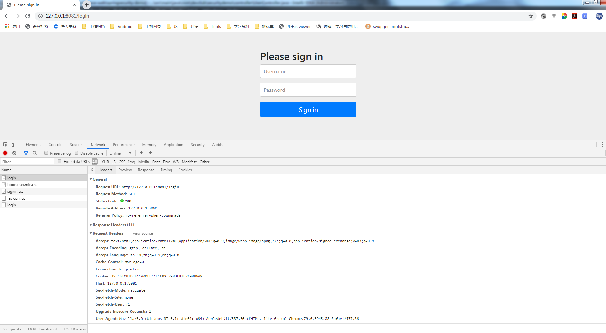
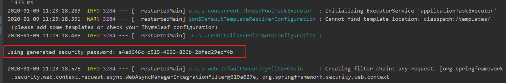

# 01-SpringSecurity自定义基本使用及个性化登录配置


SpringSecurity 核心功能：

- 认证（你是谁）
- 授权（你能干什么）
- 攻击防护（防止伪造身份）

## 简单的开始

pom 依赖

```xml
<?xml version="1.0" encoding="UTF-8"?>
<project xmlns="http://maven.apache.org/POM/4.0.0" xmlns:xsi="http://www.w3.org/2001/XMLSchema-instance"
	xsi:schemaLocation="http://maven.apache.org/POM/4.0.0 http://maven.apache.org/xsd/maven-4.0.0.xsd">
	<modelVersion>4.0.0</modelVersion>
	<parent>
		<groupId>org.springframework.boot</groupId>
		<artifactId>spring-boot-starter-parent</artifactId>
		<version>2.1.4.RELEASE</version>
		<relativePath/> <!-- lookup parent from repository -->
	</parent>
	<groupId>org.woodwhale.king</groupId>
	<artifactId>security-demo</artifactId>
	<version>1.0.0</version>
	<name>security-demo</name>
	<description>spring-security-demo project for Spring Boot</description>

	<properties>
		<java.version>1.8</java.version>
	</properties>

	<dependencies>
		<dependency>
			<groupId>org.springframework.boot</groupId>
			<artifactId>spring-boot-starter-security</artifactId>
		</dependency>
		<dependency>
			<groupId>org.springframework.boot</groupId>
			<artifactId>spring-boot-starter-thymeleaf</artifactId>
		</dependency>
		<dependency>
			<groupId>org.springframework.boot</groupId>
			<artifactId>spring-boot-starter-web</artifactId>
		</dependency>
        
		<dependency>
			<groupId>org.springframework.boot</groupId>
			<artifactId>spring-boot-devtools</artifactId>
			<scope>runtime</scope>
		</dependency>
		<dependency>
			<groupId>mysql</groupId>
			<artifactId>mysql-connector-java</artifactId>
			<scope>runtime</scope>
		</dependency>
		<dependency>
			<groupId>org.projectlombok</groupId>
			<artifactId>lombok</artifactId>
			<optional>true</optional>
		</dependency>
		<dependency>
			<groupId>org.springframework.boot</groupId>
			<artifactId>spring-boot-starter-test</artifactId>
			<scope>test</scope>
		</dependency>
		<dependency>
			<groupId>org.springframework.security</groupId>
			<artifactId>spring-security-test</artifactId>
			<scope>test</scope>
		</dependency>
	</dependencies>

	<build>
		<plugins>
			<plugin>
				<groupId>org.springframework.boot</groupId>
				<artifactId>spring-boot-maven-plugin</artifactId>
			</plugin>
		</plugins>
	</build>

</project>
```

编写一个最简单的用户 controller

```java
import org.springframework.web.bind.annotation.GetMapping;
import org.springframework.web.bind.annotation.RequestMapping;
import org.springframework.web.bind.annotation.RestController;

@RestController
@RequestMapping("/user")
public class UserController {
    @GetMapping
    public String getUsers() {       
        return "Hello Spring Security";
    }
}
```

application.yml 配置IP 和端口

```yaml
server:
  address: 127.0.0.1
  port: 8081
  
logging:
  level:
    org.woodwhale.king: DEBUG
```

浏览器访问http://127.0.0.1:8081/user，浏览器被自动重定向到了登录的界面：





这个`/login`访问路径在程序中没有任何的显示代码编写，为什么会出现这样的界面呢，当前界面中的UI 都是哪里来的呢？

当然是 **spring-security** 进行了默认控制，从启动日志中，可以看到一串用户名默认为 `user` 的默认密码：




登录成功之后，可以正常访问服务资源了。


### 自定义默认用户名和密码

在配置文件配置用户名和密码：

```yaml
spring:
  security:
    user:
      name: "admin"
      password: "admin"
```


### 关闭默认的安全访问控制

旧版的 spring security 关闭默认安全访问控制，只需要在配置文件中关闭即可：

```properties
security.basic.enabled = false
```


新版本 Spring-Boot2.x(Spring-security5.x) 的不再提供上述配置了：

**方法1：**  将 security 包从项目依赖中去除。

**方法2：** 将`org.springframework.boot.autoconfigure.security.servlet.SecurityAutoConfiguration`不注入spring中：

```java
import org.springframework.boot.SpringApplication;
import org.springframework.boot.autoconfigure.EnableAutoConfiguration;
import org.springframework.boot.autoconfigure.SpringBootApplication;
import org.springframework.boot.autoconfigure.security.servlet.SecurityAutoConfiguration;

@SpringBootApplication
@EnableAutoConfiguration(exclude = {SecurityAutoConfiguration.class})
public class SecurityDemoApplication {

	public static void main(String[] args) {
		SpringApplication.run(SecurityDemoApplication.class, args);
	}

}
```

**方法3：** 自己实现一个配置类继承自`WebSecurityConfigurerAdapter`，并重写`configure(HttpSecurity http)`方法：

```java
import org.springframework.context.annotation.Bean;
import org.springframework.context.annotation.Configuration;
import org.springframework.security.config.annotation.web.builders.HttpSecurity;
import org.springframework.security.config.annotation.web.configuration.EnableWebSecurity;
import org.springframework.security.config.annotation.web.configuration.WebSecurityConfigurerAdapter;
import org.springframework.security.core.userdetails.UserDetailsService;

@Configuration
@EnableWebSecurity
public class WebSecurityConfig extends WebSecurityConfigurerAdapter {
    
    /**
     * 配置security的控制逻辑
     *
     * @param http 请求
     */
	@Override
    protected void configure(HttpSecurity http) throws Exception {
        http.authorizeRequests().antMatchers("/**").permitAll();
    }
 
    /**
     * 配置一个userDetailsService Bean
     * 不再生成默认security.user用户
     */
    @Bean
    @Override
    protected UserDetailsService userDetailsService() {
        return super.userDetailsService();
    }
}
```

> **注意：**`WebSecurityConfigurerAdapter`是一个适配器类，为了使自定义的配置类见名知义，所以写成了`WebSecurityConfig`。同时增加了`@EnableWebSecurity`注解到了 spring security 中。


## 自定义用户认证

### 安全认证配置注意事项

springsecurity 的自定义用户认证配置的核心均在上述的`WebSecurityConfigurerAdapter`类中，用户想要个性化的用户认证逻辑，就需要自己写一个自定义的配置类，适配到 spring security 中：

> 注意：如果配置了两个以上的自定义实现类，那么就会报`WebSecurityConfigurers`不唯一的错误：`java.lang.IllegalStateException: @Order on WebSecurityConfigurers must be unique.`

```java
@Configuration
@EnableWebSecurity
public class BrowerSecurityConfig extends WebSecurityConfigurerAdapter {

    /**
     * 配置security的控制逻辑
     *
     * @param http 请求
     */
    @Override
    protected void configure(HttpSecurity http) throws Exception {
        http.formLogin()               //  定义当需要提交表单进行用户登录时候，转到的登录页面。
                .and()
                .authorizeRequests()   // 定义哪些URL需要被保护、哪些不需要被保护
                .anyRequest()          // 任何请求,登录后可以访问
                .authenticated();
    }
}
```


### 自定义用户名和密码

#### 密码加密注意事项

将用户名密码设置到内存中，用户登录的时候会校验内存中配置的用户名和密码：

在旧版本的 spring security 中，在上述自定义的`BrowerSecurityConfig` 中配置如下代码即可：

```java
/**
  * 配置登录验证逻辑
  */
@Override
protected void configure(AuthenticationManagerBuilder auth) throws Exception {
    auth.inMemoryAuthentication().withUser("admin").password("admin").roles("ADMIN");
}
```

但是在新版本中，启动运行都没有问题，一旦用户正确登录的时候，会报异常：

```
java.lang.IllegalArgumentException: There is no PasswordEncoder mapped for the id "null"
```

因为在 Spring security 5.0 中新增了多种加密方式，也改变了密码的格式。[官方文档说明：Password Storage Format](https://docs.spring.io/spring-security/site/docs/5.1.5.RELEASE/reference/htmlsingle/#pe-dpe-format)


上面这段话的意思是，现在新的 Spring Security 中对密码的存储格式是`"{id}……"`。前面的 `id` 是加密方式，id 可以是`bcrypt`、`sha256`等，后面紧跟着是使用这种加密类型进行加密后的密码。

因此，程序接收到内存或者数据库查询到的密码时，首先查找被`{}`包括起来的`id`，以确定后面的密码是被什么加密类型方式进行加密的，如果找不到就认为 id 是 null。这也就是为什么程序会报错：`There is no PasswordEncoder mapped for the id "null"`。官方文档举的例子中是各种加密方式针对同一密码加密后的存储形式，原始密码都是"password"。


#### 密码加密

要想我们的项目还能够正常登陆，需要将前端传过来的密码进行某种方式加密，官方推荐的是使用`bcrypt`加密方式（不同用户使用相同原密码生成的密文是不同的），因此需要在 configure 方法里面指定一下：

```java
/**
 * 配置登录验证逻辑
 */
@Override
protected void configure(AuthenticationManagerBuilder auth) throws Exception {
    // auth.inMemoryAuthentication().withUser("admin").password("admin").roles("ADMIN");
    auth.inMemoryAuthentication()
        .passwordEncoder(new BCryptPasswordEncoder())
        .withUser("admin")
        .password(new BCryptPasswordEncoder().encode("admin"))
        .roles("ADMIN");
}
```

当然还有一种方法，将`passwordEncoder`配置抽离出来：

```java
@Bean
public BCryptPasswordEncoder passwordEncoder() {
    return new BCryptPasswordEncoder();
}
```

#### 自定义到内存

```java
@Override
protected void configure(AuthenticationManagerBuilder auth) throws Exception {
    auth.inMemoryAuthentication()
        .withUser("admin")
        .password(new BCryptPasswordEncoder().encode("admin"))
        .roles("ADMIN");
}
```

#### 自定义到代码

这里还有一种更优雅的方法，实现`org.springframework.security.core.userdetails.UserDetailsService`接口，重载`loadUserByUsername(String username)`方法，当用户登录时，会调用`UserDetailsService`接口的`loadUserByUsername()`来校验用户的合法性（密码和权限）。

> 这种方法为之后结合数据库或者JWT动态校验打下技术可行性基础。

```java
@Service
public class MyUserDetailsService implements UserDetailsService {

	@Override
	public UserDetails loadUserByUsername(String username) throws UsernameNotFoundException {
		Collection<GrantedAuthority> authorities = new ArrayList<>();
		authorities.add(new SimpleGrantedAuthority("ADMIN"));
		return new User("root", new BCryptPasswordEncoder().encode("root"), authorities);
	}
	
}
```

当然，"自定义到内存"中的配置文件中的`configure(AuthenticationManagerBuilder auth)`配置就不需要再配置一遍了。

**注意：** 对于返回的`UserDetails`实现类，可以使用框架自己的 User，也可以自己实现一个 UserDetails 实现类，其中密码和权限都应该从数据库中读取出来，而不是写死在代码里。


#### 最佳实践

将加密类型抽离出来，实现`UserDetailsService`接口，将两者注入到`AuthenticationManagerBuilder`中：

```java
@Configuration
@EnableWebSecurity
public class WebSecurityConfig extends WebSecurityConfigurerAdapter {
	@Autowired
	private UserDetailsService userDetailsService;
    
    @Bean
	public BCryptPasswordEncoder passwordEncoder() {
		return new BCryptPasswordEncoder();
	}
	
    /**
     * 配置登录验证逻辑
     */
	@Override
	protected void configure(AuthenticationManagerBuilder auth) throws Exception {
		auth.userDetailsService(userDetailsService)
			.passwordEncoder(passwordEncoder());
	}
}
```

`UserDetailsService`接口实现类：

```java
import java.util.ArrayList;
import java.util.Collection;

import org.springframework.security.core.GrantedAuthority;
import org.springframework.security.core.authority.SimpleGrantedAuthority;
import org.springframework.security.core.userdetails.User;
import org.springframework.security.core.userdetails.UserDetails;
import org.springframework.security.core.userdetails.UserDetailsService;
import org.springframework.security.core.userdetails.UsernameNotFoundException;
import org.springframework.security.crypto.bcrypt.BCryptPasswordEncoder;
import org.springframework.stereotype.Service;

@Service
public class MyUserDetailsService implements UserDetailsService {

	@Override
	public UserDetails loadUserByUsername(String username) throws UsernameNotFoundException {
		Collection<GrantedAuthority> authorities = new ArrayList<>();
		authorities.add(new SimpleGrantedAuthority("ADMIN"));
		return new User("root", new BCryptPasswordEncoder().encode("root"), authorities);
	}
	
}
```

这里的 User 对象是框架提供的一个用户对象，注意包名是：`org.springframework.security.core.userdetails.User`，里面的属性中最核心的就是 `password`，`username` 和 `authorities`。


### 自定义安全认证配置

配置自定义的登录页面：

```java
@Override
protected void configure(HttpSecurity http) throws Exception {
    http.formLogin() 								// 定义当需要用户登录时候，转到的登录页面。
        .loginPage("/login")	 					// 设置登录页面
        .loginProcessingUrl("/user/login") 			// 自定义的登录接口
        .defaultSuccessUrl("/home").permitAll()		// 登录成功之后，默认跳转的页面
        .and().authorizeRequests()					// 定义哪些URL需要被保护、哪些不需要被保护
        .antMatchers("/", "/index"，"/user/login").permitAll()		// 设置所有人都可以访问登录页面
        .anyRequest().authenticated() 				// 任何请求,登录后可以访问
        .and().csrf().disable(); 					// 关闭csrf防护
}
```

从上述配置中，可以看出用可以所有访客均可以自由登录`/`和`/index`进行资源访问，同时配置了一个登录的接口`/login`，使用mvc做了视图映射（映射到模板文件目录中的`login.html`），controller 映射代码太简单就不赘述了，当用户成功登录之后，页面会自动跳转至`/home`页面。


> 上述图片中的配置有点小小缺陷，当去掉`.loginProcessUrl()`的配置的时候，登录完毕，浏览器会一直重定向，直至报重定向失败。因为登录成功的 url 没有配置成所有人均可以访问，因此造成了死循环的结果。
>
> 因此，配置了登录界面就需要配置任意可访问：`.antMatchers("/user/login").permitAll()`

`login.html`代码：

```html
<!DOCTYPE html>
<html>
<head>
<meta charset="UTF-8">
<title>登录页面</title>
</head>
<body>
	<h2>自定义登录页面</h2>
	<form action="/user/login" method="post">
		<table>
			<tr>
				<td>用户名：</td>
				<td><input type="text" name="username"></td>
			</tr>
			<tr>
				<td>密码：</td>
				<td><input type="password" name="password"></td>
			</tr>
			<tr>
				<td colspan="2"><button type="submit">登录</button></td>
			</tr>
		</table>
	</form>
</body>
</html>
```

### 静态资源忽略配置

上述配置用户认证过程中，会发现资源文件也被安全框架挡在了外面，因此需要进行安全配置：

```java
@Override
public void configure(WebSecurity web) throws Exception {
    web.ignoring().antMatchers("/webjars/**/*", "/**/*.css", "/**/*.js");
}
```

现在前端框架的静态资源完全可以通过`webjars`统一管理，因此注意配置`/webjars/**/*`。


## 处理不同类型的请求

前后端分离的系统中，一般后端仅提供接口 JSON 格式的数据，以供前端自行调用。刚才那样，调用了被保护的接口，直接进行了页面的跳转，在web端还可以接受，但是在 App 端就不行了， 所以我们还需要做进一步的处理。 这里做一下简单的思路整理。

这里提供一种思路，核心在于运用安全框架的：`RequestCache`和`RedirectStrategy`

```java
import java.io.IOException;

import javax.servlet.http.HttpServletRequest;
import javax.servlet.http.HttpServletResponse;

import org.springframework.http.HttpStatus;
import org.springframework.security.web.DefaultRedirectStrategy;
import org.springframework.security.web.RedirectStrategy;
import org.springframework.security.web.savedrequest.HttpSessionRequestCache;
import org.springframework.security.web.savedrequest.RequestCache;
import org.springframework.security.web.savedrequest.SavedRequest;
import org.springframework.util.StringUtils;
import org.springframework.web.bind.annotation.RequestMapping;
import org.springframework.web.bind.annotation.ResponseStatus;
import org.springframework.web.bind.annotation.RestController;

import lombok.extern.slf4j.Slf4j;

@Slf4j
@RestController
public class BrowserSecurityController {

    // 原请求信息的缓存及恢复
    private RequestCache requestCache = new HttpSessionRequestCache();

    // 用于重定向
    private RedirectStrategy redirectStrategy = new DefaultRedirectStrategy();

    /**
     * 当需要身份认证的时候，跳转过来
     * @param request
     * @param response
     * @return
     */
    @RequestMapping("/authentication/require")
    @ResponseStatus(code = HttpStatus.UNAUTHORIZED)
    public String requireAuthenication(HttpServletRequest request, HttpServletResponse response) throws IOException {
        SavedRequest savedRequest = requestCache.getRequest(request, response);

        if (savedRequest != null) {
            String targetUrl = savedRequest.getRedirectUrl();
            log.info("引发跳转的请求是:" + targetUrl);
            if (StringUtils.endsWithIgnoreCase(targetUrl, ".html")) {
                redirectStrategy.sendRedirect(request, response, "/login.html");
            }
        }

        return "访问的服务需要身份认证，请引导用户到登录页";
    }
}
```

**注意：** 这个`/authentication/require`需要配置到安全认证配置：配置成默认登录界面，并设置成任何人均可以访问，并且这个重定向的页面可以设计成配置，从配置文件中读取。


## 自定义处理登录成功/失败

在前后端分离的情况下，我们登录成功了可能需要向前端返回用户的个人信息，而不是直接进行跳转。登录失败也是同样的道理。这里涉及到了 Spring Security 中的两个接口`AuthenticationSuccessHandler`和`AuthenticationFailureHandler`。自定义这两个接口的实现，并进行相应的配置就可以了。 当然框架是有默认的实现类的，我们可以继承这个实现类再来自定义自己的业务：

### 成功登录处理类

```java
import java.io.IOException;

import javax.servlet.ServletException;
import javax.servlet.http.HttpServletRequest;
import javax.servlet.http.HttpServletResponse;

import org.springframework.beans.factory.annotation.Autowired;
import org.springframework.security.core.Authentication;
import org.springframework.security.web.authentication.SimpleUrlAuthenticationSuccessHandler;
import org.springframework.stereotype.Component;

import com.fasterxml.jackson.databind.ObjectMapper;

import lombok.extern.slf4j.Slf4j;

@Slf4j
@Component("myAuthenctiationSuccessHandler")
public class MyAuthenctiationSuccessHandler extends SimpleUrlAuthenticationSuccessHandler {

    @Autowired
    private ObjectMapper objectMapper;

    @Override
    public void onAuthenticationSuccess(HttpServletRequest request, 
    		HttpServletResponse response, Authentication authentication) throws IOException, ServletException {

        log.info("登录成功");
        response.setContentType("application/json;charset=UTF-8");
        response.getWriter().write(objectMapper.writeValueAsString(authentication));
    }
}
```

成功登录之后，通过 response 返回一个 JSON 字符串回去。这个方法中的第三个参数`Authentication`，它里面包含了登录后的用户信息（UserDetails），Session 的信息，登录信息等。

登录成功之后的响应JSON：

```json
{
    "authorities": [
        {
            "authority": "ROLE_admin"
        }
    ],
    "details": {
        "remoteAddress": "127.0.0.1",
        "sessionId": "8BFA4F61A7CEA774C00F616AAE8C307C"
    },
    "authenticated": true,
    "principal": {
        "password": null,
        "username": "admin",
        "authorities": [
            {
                "authority": "ROLE_admin"
            }
        ],
        "accountNonExpired": true,
        "accountNonLocked": true,
        "credentialsNonExpired": true,
        "enabled": true
    },
    "credentials": null,
    "name": "admin"
}
```

> 这里有个细节需要注意：
>
> `principal` 中有个权限数组集合`authorities`，里面的权限值是：`ROLE_admin`，而自定义的安全认证配置中配置的是：`admin`，所以`ROLE_`前缀是框架自己加的，后期取出权限集合的时候需要注意这个细节，以取决于判断是否有权限是使用字符串的包含关系还是等值关系。

### 登录失败处理类

```java
import java.io.IOException;

import javax.servlet.ServletException;
import javax.servlet.http.HttpServletRequest;
import javax.servlet.http.HttpServletResponse;

import org.springframework.beans.factory.annotation.Autowired;
import org.springframework.http.HttpStatus;
import org.springframework.security.core.AuthenticationException;
import org.springframework.security.web.authentication.SimpleUrlAuthenticationFailureHandler;
import org.springframework.stereotype.Component;

import com.fasterxml.jackson.databind.ObjectMapper;

import lombok.extern.slf4j.Slf4j;

@Slf4j
@Component("myAuthenctiationFailureHandler")
public class MyAuthenctiationFailureHandler extends SimpleUrlAuthenticationFailureHandler {

    @Autowired
    private ObjectMapper objectMapper;

    @Override
    public void onAuthenticationFailure(HttpServletRequest request, HttpServletResponse response,
                                        AuthenticationException exception) throws IOException, ServletException {

        log.info("登录失败");
        response.setStatus(HttpStatus.INTERNAL_SERVER_ERROR.value());
        response.setContentType("application/json;charset=UTF-8");
        response.getWriter().write(objectMapper.writeValueAsString(exception.getMessage()));
    }
}
```

将两个自定义的处理类配置到自定义配置文件中：

```java
import org.springframework.beans.factory.annotation.Autowired;
import org.springframework.context.annotation.Configuration;
import org.springframework.security.config.annotation.authentication.builders.AuthenticationManagerBuilder;
import org.springframework.security.config.annotation.web.builders.HttpSecurity;
import org.springframework.security.config.annotation.web.configuration.EnableWebSecurity;
import org.springframework.security.config.annotation.web.configuration.WebSecurityConfigurerAdapter;
import org.springframework.security.crypto.bcrypt.BCryptPasswordEncoder;
import org.woodwhale.king.handler.MyAuthenctiationFailureHandler;
import org.woodwhale.king.handler.MyAuthenctiationSuccessHandler;

@Configuration
@EnableWebSecurity
public class WebSecurityConfig extends WebSecurityConfigurerAdapter {
	
	@Autowired
	private MyAuthenctiationFailureHandler myAuthenctiationFailureHandler;
	
	@Autowired
	private MyAuthenctiationSuccessHandler myAuthenctiationSuccessHandler;
	
	@Override
	protected void configure(HttpSecurity http) throws Exception {
		http.formLogin() 								// 定义当需要用户登录时候，转到的登录页面。
			.loginPage("/login")	 					// 设置登录页面
			.loginProcessingUrl("/user/login") 			// 自定义的登录接口
			.successHandler(myAuthenctiationSuccessHandler)
			.failureHandler(myAuthenctiationFailureHandler)
			//.defaultSuccessUrl("/home").permitAll()		// 登录成功之后，默认跳转的页面
			.and().authorizeRequests()					// 定义哪些URL需要被保护、哪些不需要被保护
			.antMatchers("/", "/index").permitAll()		// 设置所有人都可以访问登录页面
			.anyRequest().authenticated() 				// 任何请求,登录后可以访问
			.and().csrf().disable(); 					// 关闭csrf防护
	}

	@Override
	protected void configure(AuthenticationManagerBuilder auth) throws Exception {
		auth.inMemoryAuthentication()
			.passwordEncoder(new BCryptPasswordEncoder()).withUser("admin")
			.password(new BCryptPasswordEncoder().encode("admin"))
			.roles("admin");
	}

}
```

**注意：** `defaultSuccessUrl`不需要再配置了，实测如果配置了，成功登录的 handler 就不起作用了。

**小结**

可以看出，通过自定义的登录成功或者失败类，进行登录响应控制，可以设计一个配置，以灵活适配响应返回的是页面还是 JSON 数据。


## 结合thymeleaf

在前端使用了`Thymeleaf`进行渲染，特使是结合`Spring Security`在前端获取用户信息

依赖添加：

```xml
<dependency>
    <groupId>org.thymeleaf.extras</groupId>
    <artifactId>thymeleaf-extras-springsecurity5</artifactId>
</dependency>
```

**注意：**

因为本项目使用了spring boot 自动管理版本号，所以引入的一定是完全匹配的，如果是旧的 spring security 版本需要手动引入对应的版本。

引用官方版本引用说明：

```
thymeleaf-extras-springsecurity3 for integration with Spring Security 3.x
thymeleaf-extras-springsecurity4 for integration with Spring Security 4.x
thymeleaf-extras-springsecurity5 for integration with Spring Security 5.x
```

具体语法可查看： [github.com/thymeleaf/t…](https://github.com/thymeleaf/thymeleaf-extras-springsecurity)

### 常用的语法标签

这里为了表述方便，引用了上小节中的"自定义处理登录成功/失败"的成功响应JSON数据：

```json
{
    "authorities": [
        {
            "authority": "ROLE_admin"
        }
    ],
    "details": {
        "remoteAddress": "127.0.0.1",
        "sessionId": "8BFA4F61A7CEA774C00F616AAE8C307C"
    },
    "authenticated": true,
    "principal": {
        "password": null,
        "username": "admin",
        "authorities": [
            {
                "authority": "ROLE_admin"
            }
        ],
        "accountNonExpired": true,
        "accountNonLocked": true,
        "credentialsNonExpired": true,
        "enabled": true
    },
    "credentials": null,
    "name": "admin"
}
```

`sec:authorize="isAuthenticated()`：判断是否有认证通过

`sec:authorize="hasRole('ROLE_ADMIN')"`判断是否有`ROLE_ADMIN`权限

**注意：** 上述的`hasRole()`标签使用能成功的前提是：自定义用户的权限字符集必须是以`ROLE_`为前缀的，否则解析不到，即自定义的`UserDetailsService` 实现类的返回用户的权限数组列表的权限字段必须是`ROLE_***`，同时在 html 页面中注意引入对应的`xmlns`，本例这里引用了：

```
<html xmlns:th="http://www.thymeleaf.org"
	xmlns:sec="http://www.thymeleaf.org/thymeleaf-extras-springsecurity5">
```

`sec:authentication="principal.authorities"`：得到该用户的所有权限列表

`sec:authentication="principal.username"`：得到该用户的用户名

当然也可以获取更多的信息，只要`UserDetailsService`实现类中返回的用户中携带有的信息均可以获取。

## 常见异常类

```
AuthenticationException        常用的的子类：(会被底层换掉，不推荐使用)
UsernameNotFoundException      用户找不到
BadCredentialsException        坏的凭据
AccountStatusException         用户状态异常它包含如下子类：（推荐使用）
AccountExpiredException        账户过期
LockedException                账户锁定
DisabledException              账户不可用
CredentialsExpiredException    证书过期
```

参考资料：

[blog.csdn.net/u013435893/…](https://blog.csdn.net/u013435893/article/details/79596628)

[blog.csdn.net/canon_in_d_…](https://blog.csdn.net/canon_in_d_major/article/details/79675033)

[juejin.im/post/5c46a4…](https://juejin.im/post/5c46a49e51882528735ef2d9)

[www.jianshu.com/p/6307c89fe…](https://www.jianshu.com/p/6307c89fe3fa/)

[mp.weixin.qq.com/s/NKhwU6qKK…](https://mp.weixin.qq.com/s/NKhwU6qKKU0Q0diA0hg13Q)

[mp.weixin.qq.com/s/sMi1__Rw_…](https://mp.weixin.qq.com/s/sMi1__Rw_s75YDaIdmTWKw)

[blog.csdn.net/smd25756245…](https://blog.csdn.net/smd2575624555/article/details/82759863)

[www.cnblogs.com/yyxxn/p/880…](https://www.cnblogs.com/yyxxn/p/8808851.html)

[blog.csdn.net/coder_py/ar…](https://blog.csdn.net/coder_py/article/details/80330868)

参考项目源码：

[github.com/whyalwaysme…](https://github.com/whyalwaysmea/Spring-Security)

[github.com/oycyqr/Spri…](https://github.com/oycyqr/SpringSecurity)

[github.com/chengjiansh…](https://github.com/chengjiansheng/cjs-springsecurity-example)


作者：木鲸鱼
链接：https://juejin.im/post/5cb33ec05188251ad1351af5
来源：掘金
著作权归作者所有。商业转载请联系作者获得授权，非商业转载请注明出处。