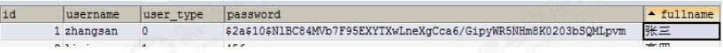

# Spring Security OAuth2.0 认证授权


## 1. 基本概念

### 1.1.什么是认证
进入移动互联网时代，大家每天都在刷手机，常用的软件有微信、支付宝、头条等，下边拿微信来举例子说明认证
相关的基本概念，在初次使用微信前需要注册成为微信用户，然后输入账号和密码即可登录微信，输入账号和密码
登录微信的过程就是认证。

系统为什么要认证？
认证是为了保护系统的隐私数据与资源，用户的身份合法方可访问该系统的资源。

**认证 ：**用户认证就是判断一个用户的身份是否合法的过程，用户去访问系统资源时系统要求验证用户的身份信
息，身份合法方可继续访问，不合法则拒绝访问。常见的用户身份认证方式有：用户名密码登录，二维码登录，手
机短信登录，指纹认证等方式。

### 1.2 什么是会话
用户认证通过后，为了避免用户的每次操作都进行认证可将用户的信息保证在会话中。会话就是系统为了保持当前
用户的登录状态所提供的机制，常见的有基于session方式、基于token方式等。

基于session的认证方式如下图：

它的交互流程是，用户认证成功后，在服务端生成用户相关的数据保存在session(当前会话)中，发给客户端的
sesssion_id 存放到 cookie 中，这样用户客户端请求时带上 session_id 就可以验证服务器端是否存在 session 数
据，以此完成用户的合法校验，当用户退出系统或session过期销毁时,客户端的session_id也就无效了。


基于token方式如下图：
它的交互流程是，用户认证成功后，服务端生成一个token发给客户端，客户端可以放到 cookie 或 localStorage
等存储中，每次请求时带上 token，服务端收到token通过验证后即可确认用户身份。


基于session的认证方式由Servlet规范定制，服务端要存储session信息需要占用内存资源，客户端需要支持
cookie；基于token的方式则一般不需要服务端存储token，并且不限制客户端的存储方式。如今移动互联网时代
更多类型的客户端需要接入系统，系统多是采用前后端分离的架构进行实现，所以基于token的方式更适合。


### 1.3 什么是授权
还拿微信来举例子，微信登录成功后用户即可使用微信的功能，比如，发红包、发朋友圈、添加好友等，没有绑定
银行卡的用户是无法发送红包的，绑定银行卡的用户才可以发红包，发红包功能、发朋友圈功能都是微信的资源即
功能资源，用户拥有发红包功能的权限才可以正常使用发送红包功能，拥有发朋友圈功能的权限才可以使用发朋友
圈功能，这个根据用户的权限来控制用户使用资源的过程就是授权。

为什么要授权？

认证是为了保证用户身份的合法性，授权则是为了更细粒度的对隐私数据进行划分，授权是在认证通过后发生的，
控制不同的用户能够访问不同的资源。

**授权： **授权是用户认证通过根据用户的权限来控制用户访问资源的过程，拥有资源的访问权限则正常访问，没有
权限则拒绝访问。


### 1.4 授权的数据模型
如何进行授权即如何对用户访问资源进行控制，首先需要学习授权相关的数据模型。

授权可简单理解为Who对What(which)进行How操作，包括如下：

Who，即主体（Subject），主体一般是指用户，也可以是程序，需要访问系统中的资源。 

What，即资源（Resource），如系统菜单、页面、按钮、代码方法、系统商品信息、系统订单信息等。系统菜单、页面、按钮、代码方法都属于系统功能资源，对于web系统每个功能资源通常对应一个URL；系统商品信息、系统订单信息都属于实体资源（数据资源），实体资源由资源类型和资源实例组成，比如商品信息为资源类型，商品编号 为001的商品为资源实例。 

How，权限/许可（Permission），规定了用户对资源的操作许可，权限离开资源没有意义，
如用户查询权限、用户添加权限、某个代码方法的调用权限、编号为001的用户的修改权限等，通过权限可知用户
对哪些资源都有哪些操作许可。

主体、资源、权限关系如下图：


主体、资源、权限相关的数据模型如下：
主体（用户id、账号、密码、...）
资源（资源id、资源名称、访问地址、...）
权限（权限id、权限标识、权限名称、资源id、...）
角色（角色id、角色名称、...）

角色和权限关系（角色 id、权限id、...）
主体（用户）和角色关系（用户id、角色id、...）


主体（用户）、资源、权限关系如下图：


通常企业开发中将资源和权限表合并为一张权限表，如下：
资源（资源id、资源名称、访问地址、...）
权限（权限id、权限标识、权限名称、资源id、...）
合并为：
权限（权限id、权限标识、权限名称、资源名称、资源访问地址、...）

修改后数据模型之间的关系如下图：


### 1.5 RBAC
如何实现授权？业界通常基于RBAC实现授权。


#### 1.5.1  基于角色的访问控制
RBAC基于角色的访问控制（Role-Based Access Control）是按角色进行授权，比如：主体的角色为总经理可以查
询企业运营报表，查询员工工资信息等，访问控制流程如下：


根据上图中的判断逻辑，授权代码可表示如下：

```
if(主体.hasRole("总经理角色id")){
    查询工资
}
```

如果上图中查询工资所需要的角色变化为总经理和部门经理，此时就需要修改判断逻辑为“判断用户的角色是否是
总经理或部门经理”，修改代码如下：

```
if(主体.hasRole("总经理角色id") ||  主体.hasRole("部门经理角色id")){
    查询工资
}
```

根据上边的例子发现，当需要修改角色的权限时就需要修改授权的相关代码，系统可扩展性差。


#### 1.5.2 基于资源的访问控制
RBAC基于资源的访问控制（Resource-Based Access Control）是按资源（或权限）进行授权，比如：用户必须
具有查询工资权限才可以查询员工工资信息等，访问控制流程如下：


根据上图中的判断，授权代码可以表示为：

```
if(主体.hasPermission("查询工资权限标识")){
    查询工资
}
```

优点：系统设计时定义好查询工资的权限标识，即使查询工资所需要的角色变化为总经理和部门经理也不需要修改
授权代码，系统可扩展性强。


## 2.  基于Session的认证方式

### 2.1 认证流程
基于Session认证方式的流程是，用户认证成功后，在服务端生成用户相关的数据保存在session(当前会话)，而发
给客户端的 sesssion_id 存放到 cookie 中，这样用客户端请求时带上 session_id 就可以验证服务器端是否存在
session 数据，以此完成用户的合法校验。当用户退出系统或session过期销毁时,客户端的session_id也就无效了。


下图是session认证方式的流程图：


基于Session的认证机制由Servlet规范定制，Servlet容器已实现，用户通过HttpSession的操作方法即可实现，如
下是HttpSession相关的操作API。

| 方法                                        | 含义                    |
| ------------------------------------------- | ----------------------- |
| HttpSession getSession(Boolean create)      | 获取当前HttpSession对象 |
| void setAttribute(String name,Object value) | 向session中存放对象     |
| object getAttribute(String name)            | 从session中获取对象     |
| void removeAttribute(String name);          | 移除session中对象       |
| void invalidate()                           | 使HttpSession失效       |
| 略...                                       |                         |


### 2.2.创建工程
本案例工程使用maven进行构建，使用SpringMVC、Servlet3.0实现。

#### 2.2.1 创建maven工程
创建maven工程 security-springmvc，工程结构如下：


引入如下依赖如下，注意：
1、由于是web工程，packaging设置为war
2、使用tomcat7-maven-plugin插件来运行工程

```xml
<?xml version="1.0" encoding="UTF-8"?>
<project xmlns="http://maven.apache.org/POM/4.0.0"
         xmlns:xsi="http://www.w3.org/2001/XMLSchema-instance"
         xsi:schemaLocation="http://maven.apache.org/POM/4.0.0 http://maven.apache.org/xsd/maven-4.0.0.xsd">
    <modelVersion>4.0.0</modelVersion>

    <groupId>com.jjane.security</groupId>
    <artifactId>security-springmvc</artifactId>
    <version>1.0-SNAPSHOT</version>
    <packaging>war</packaging>


    <properties>
        <project.build.sourceEncoding>UTF‐8</project.build.sourceEncoding>
        <maven.compiler.source>1.8</maven.compiler.source>
        <maven.compiler.target>1.8</maven.compiler.target>
    </properties>


    <dependencies>
        <dependency>
            <groupId>org.springframework</groupId>
            <artifactId>spring-webmvc</artifactId>
            <version>5.1.14.RELEASE</version>
        </dependency>

        <dependency>
            <groupId>javax.servlet</groupId>
            <artifactId>javax.servlet-api</artifactId>
            <version>3.1.0</version>
            <scope>provided</scope>
        </dependency>

        <dependency>
            <groupId>org.projectlombok</groupId>
            <artifactId>lombok</artifactId>
            <version>1.18.12</version>
        </dependency>
    </dependencies>


    <build>
        <finalName>security‐springmvc</finalName>
        <pluginManagement>
            <plugins>
                <plugin>
                    <groupId>org.apache.tomcat.maven</groupId>
                    <artifactId>tomcat7‐maven‐plugin</artifactId>
                    <version>2.2</version>
                </plugin>

                <plugin>
                    <groupId>org.apache.maven.plugins</groupId>
                    <artifactId>maven‐compiler‐plugin</artifactId>
                    <configuration>
                        <source>1.8</source>
                        <target>1.8</target>
                    </configuration>
                </plugin>
                <plugin>
                    <artifactId>maven‐resources‐plugin</artifactId>
                    <configuration>
                        <encoding>utf‐8</encoding>
                        <useDefaultDelimiters>true</useDefaultDelimiters>
                        <resources>
                            <resource>
                                <directory>src/main/resources</directory>
                                <filtering>true</filtering>
                                <includes>
                                    <include>**/*</include>
                                </includes>
                            </resource>
                            <resource>
                                <directory>src/main/java</directory>
                                <includes>
                                    <include>**/*.xml</include>
                                </includes>
                            </resource>
                        </resources>
                    </configuration>
                </plugin>
            </plugins>
        </pluginManagement>
    </build>

</project>
```

 

#### 2.2.2 Spring  容器配置
在config包下定义`ApplicationConfig.java`，它对应web.xml中ContextLoaderListener的配置

```java
package com.jjane.security.springmvc.config;

import org.springframework.context.annotation.ComponentScan;
import org.springframework.context.annotation.Configuration;
import org.springframework.context.annotation.FilterType;
import org.springframework.stereotype.Controller;

/**
 * Spring 容器配置  【相当于applicationContext.xml】
 */
@Configuration
@ComponentScan(basePackages = "com.jjane.security.springmvc", excludeFilters = {@ComponentScan.Filter(type = FilterType.ANNOTATION, value = Controller.class)})
public class ApplicationConfig {
    //在此配置除了Controller的其它bean，比如：数据库链接池、事务管理器、业务bean等
}
```


#### 2.2.3 servletContext配置
本案例采用Servlet3.0无web.xml方式，在config包下定义`WebConfig.java`，它对应于DispatcherServlet配
置。

```java
package com.jjane.security.springmvc.config;

import org.springframework.context.annotation.Bean;
import org.springframework.context.annotation.ComponentScan;
import org.springframework.context.annotation.Configuration;
import org.springframework.context.annotation.FilterType;
import org.springframework.stereotype.Controller;
import org.springframework.web.servlet.config.annotation.EnableWebMvc;
import org.springframework.web.servlet.config.annotation.WebMvcConfigurer;
import org.springframework.web.servlet.view.InternalResourceViewResolver;

/**
 * SpringMVC的servletContext配置  【相当于springmvc.xml】
 */
@Configuration
@EnableWebMvc
@ComponentScan(basePackages = "com.jjane.security.springmvc", includeFilters = {@ComponentScan.Filter(type = FilterType.ANNOTATION, value = Controller.class)})
public class WebConfig implements WebMvcConfigurer {

    /**
     * 视图解析器
     *
     * @return
     */
    @Bean
    public InternalResourceViewResolver viewResolver() {
        InternalResourceViewResolver viewResolver = new InternalResourceViewResolver();
        viewResolver.setPrefix("/WEB‐INF/views/");
        viewResolver.setSuffix(".jsp");
        return viewResolver;
    }

}
```


#### 2.2.4 加载 Spring容器
在init包下定义Spring容器初始化类`SpringApplicationInitializer`，此类实现WebApplicationInitializer接口，Spring容器启动时加载WebApplicationInitializer接口的所有实现类。

```java
package com.jjane.security.springmvc.init;

import com.jjane.security.springmvc.config.ApplicationConfig;
import com.jjane.security.springmvc.config.WebConfig;
import org.springframework.web.servlet.support.AbstractAnnotationConfigDispatcherServletInitializer;

/**
 * 容器启动类
 */
public class SpringApplicationInitializer extends AbstractAnnotationConfigDispatcherServletInitializer {

    /**
     * 加载Spring容器，相当于加载applicationContext.xml
     *
     * @return
     */
    @Override
    protected Class<?>[] getRootConfigClasses() {
        return new Class[]{ApplicationConfig.class};
    }

    /**
     * 加载SpringMvc的servletContext容器，相当于加载springmvc.xml
     *
     * @return
     */
    @Override
    protected Class<?>[] getServletConfigClasses() {
        return new Class[]{WebConfig.class};
    }

    /**
     * url-mapping 配置
     *
     * @return
     */
    @Override
    protected String[] getServletMappings() {
        return new String[]{"/"};
    }
}
```

SpringApplicationInitializer相当于web.xml，使用了servlet3.0开发则不需要再定义web.xml。
ApplicationConfig.class对应以下配置的application-context.xml，WebConfig.class对应以下配置的spring-
mvc.xml，web.xml的内容参考：

```xml
<web‐app>
    <listener>
        <listener‐class>org.springframework.web.context.ContextLoaderListener</listener‐class>
    </listener>
    <context‐param>
        <param‐name>contextConfigLocation</param‐name>
        <param‐value>/WEB‐INF/application‐context.xml</param‐value>
    </context‐param>
 
    <servlet>
        <servlet‐name>springmvc</servlet‐name>
        <servlet‐class>org.springframework.web.servlet.DispatcherServlet</servlet‐class>
        <init‐param>
            <param‐name>contextConfigLocation</param‐name>
            <param‐value>/WEB‐INF/spring‐mvc.xml</param‐value>
        </init‐param>
        <load‐on‐startup>1</load‐on‐startup>
    </servlet>
    <servlet‐mapping>
        <servlet‐name>springmvc</servlet‐name>
        <url‐pattern>/</url‐pattern>
    </servlet‐mapping>
</web‐app>
```


### 2.3.实现认证功能

#### 2.3.1  认证页面

在webapp/WEB-INF/views下定义认证页面login.jsp。本案例只是测试认证流程，页面没有添加css样式，页面实
现可填入用户名，密码，触发登录将提交表单信息至/login。

`login.jsp` 文件内容如下：

```jsp
<%@ page contentType="text/html;charset=UTF-8" language="java" %>
<html>
<head>
    <title>用户登录</title>
</head>
<body>
<form action="login"  method="post">
        用户名：<input type="text"  name="username"><br>
        密&nbsp;&nbsp;&nbsp;码:
        <input type="password"  name="password"><br>
        <input type="submit"  value="登录">
</form>
</body>
</html>
```

在 WebConfig 中新增如下配置，将 / 直接导向login.jsp页面：

```java
@Override
public void addViewControllers(ViewControllerRegistry registry) {
    registry.addViewController("/").setViewName("login");
}
```

启动项目，访问/路径地址，进行测试


#### 2.3.2 认证接口

用户进入认证页面，输入账号和密码，点击登录，请求/login进行身份认证。

（1）定义认证接口，此接口用于对传来的用户名、密码校验，若成功则返回该用户的详细信息，否则抛出错误异
常：

```java
package com.jjane.security.springmvc.service;

import com.jjane.security.springmvc.model.AuthenticationRequest;
import com.jjane.security.springmvc.model.UserDto;

/**
 * 认证服务
 */
public interface AuthenticationService {

    /**
     * 用户认证
     *
     * @param authenticationRequest 用户认证请求
     * @return 认证成功的用户信息      
     */
    UserDto authentication(AuthenticationRequest authenticationRequest);
    
}

```

认证请求结构：

```java
package com.jjane.security.springmvc.model;

import lombok.Data;

/**
 * 登录认证请求
 */
@Data
public class AuthenticationRequest {

    /**
     * 用户名
     */
    private String username;

    /**
     * 密码
     */
    private String password;
}

```

认证成功后返回的用户详细信息，也就是当前登录用户的信息：

```java
package com.jjane.security.springmvc.model;

import lombok.AllArgsConstructor;
import lombok.Data;

/**
 * 登录用户信息
 */
@Data
@AllArgsConstructor
public class UserDto {
    private String id;

    /** 用户名 */
    private String username;

    /** 密码 */
    private String password;

    /** 全名 */
    private String fullname;
    
    /** 手机号 */
    private String mobile;
}

```

（2）认证实现类，根据用户名查找用户信息，并校验密码，这里模拟了两个用户：

```java
package com.jjane.security.springmvc.service.impl;

import com.jjane.security.springmvc.model.AuthenticationRequest;
import com.jjane.security.springmvc.model.UserDto;
import com.jjane.security.springmvc.service.AuthenticationService;
import org.springframework.stereotype.Service;
import org.springframework.util.StringUtils;

import java.util.HashMap;
import java.util.Map;

/**
 * 认证实现类
 */
@Service
public class AuthenticationServiceImpl implements AuthenticationService {

    @Override
    public UserDto authentication(AuthenticationRequest authenticationRequest) {
        //校验参数是否为空
        if (authenticationRequest == null
                || StringUtils.isEmpty(authenticationRequest.getUsername())
                || StringUtils.isEmpty(authenticationRequest.getPassword())) {
            throw new RuntimeException("账号和密码为空");
        }
        //根据账号去查询数据库,这里测试程序采用模拟方法
        UserDto user = getUserDto(authenticationRequest.getUsername());
        //判断用户是否为空
        if (user == null) {
            throw new RuntimeException("查询不到该用户");
        }
        //校验密码
        if (!authenticationRequest.getPassword().equals(user.getPassword())) {
            throw new RuntimeException("账号或密码错误");
        }
        //认证通过，返回用户身份信息
        return user;
    }


    //模拟用户查询
    public UserDto getUserDto(String username) {
        return userMap.get(username);
    }

    //用户信息
    private Map<String, UserDto> userMap = new HashMap<>();

    {
        userMap.put("zhangsan", new UserDto("1010", "zhangsan", "123", "张三", "133443"));
        userMap.put("lisi", new UserDto("1011", "lisi", "456", "李四", "144553"));
    }

}
```

（ 3）登录Controller，对/login请求处理，它调用AuthenticationService完成认证并返回登录结果提示信息：

```java
package com.jjane.security.springmvc.controller;

import com.jjane.security.springmvc.model.AuthenticationRequest;
import com.jjane.security.springmvc.model.UserDto;
import com.jjane.security.springmvc.service.AuthenticationService;
import org.springframework.beans.factory.annotation.Autowired;
import org.springframework.web.bind.annotation.GetMapping;
import org.springframework.web.bind.annotation.RequestMapping;
import org.springframework.web.bind.annotation.RestController;

import javax.servlet.http.HttpSession;

/**
 * 登录Controller
 *
 * @author RyuZheng
 * @version 1.0
 **/
@RestController
public class LoginController {

    @Autowired
    private AuthenticationService authenticationService;

    @RequestMapping(value = "/login", produces = "text/plain;charset=utf-8")
    public String login(AuthenticationRequest authenticationRequest, HttpSession session) {
        UserDto userDto = authenticationService.authentication(authenticationRequest);
        //存入session
        session.setAttribute(UserDto.SESSION_USER_KEY, userDto);
        return userDto.getUsername() + "登录成功";
    }

    @GetMapping(value = "/logout", produces = {"text/plain;charset=UTF-8"})
    public String logout(HttpSession session) {
        session.invalidate();
        return "退出成功";
    }

    @GetMapping(value = "/r/r1", produces = {"text/plain;charset=UTF-8"})
    public String r1(HttpSession session) {
        String fullname = null;
        Object object = session.getAttribute(UserDto.SESSION_USER_KEY);
        if (object == null) {
            fullname = "匿名";
        } else {
            UserDto userDto = (UserDto) object;
            fullname = userDto.getFullname();
        }
        return fullname + "访问资源r1";
    }

    @GetMapping(value = "/r/r2", produces = {"text/plain;charset=UTF-8"})
    public String r2(HttpSession session) {
        String fullname = null;
        Object userObj = session.getAttribute(UserDto.SESSION_USER_KEY);
        if (userObj != null) {
            fullname = ((UserDto) userObj).getFullname();
        } else {
            fullname = "匿名";
        }
        return fullname + " 访问资源2";
    }
}
```

（4）测试
启动项目，访问/路径地址，进行测试


填入错误的用户信息，页面返回错误信息：


填入正确的用户信息，页面提示登录成功：


以上的测试全部符合预期，到目前为止最基础的认证功能已经完成，它仅仅实现了对用户身份凭证的校验，若某用
户认证成功，只能说明他是该系统的一个合法用户，仅此而已。


### 2.4.实现会话功能
会话是指用户登入系统后，系统会记住该用户的登录状态，他可以在系统连续操作直到退出系统的过程。

认证的目的是对系统资源的保护，每次对资源的访问，系统必须得知道是谁在访问资源，才能对该请求进行合法性
拦截。因此，在认证成功后，一般会把认证成功的用户信息放入Session中，在后续的请求中，系统能够从Session中获取到当前用户，用这样的方式来实现会话机制。

（1）增加会话控制
首先在UserDto中定义一个SESSION_USER_KEY，作为Session中存放登录用户信息的key。

```java
public static final String SESSION_USER_KEY = "_user";
```

然后修改LoginController，认证成功后，将用户信息放入当前会话。并增加用户登出方法，登出时将session置为
失效。

```java
/**
 * 用户登录
 * @param authenticationRequest 登录请求
 * @param session http会话
 * @return
 */
@PostMapping(value = "/login",produces = "text/plain;charset=utf‐8")
public String login(AuthenticationRequest authenticationRequest, HttpSession session){
      UserDto userDto = authenticationService.authentication(authenticationRequest);
      //用户信息存入session
      session.setAttribute(UserDto.SESSION_USER_KEY,userDto);
      return userDto.getUsername() + "登录成功";
}

@GetMapping(value = "logout",produces = "text/plain;charset=utf‐8")
public String logout(HttpSession session){
     session.invalidate();
     return "退出成功";
}
```

（2）增加测试资源
修改LoginController，增加测试资源1，它从当前会话session中获取当前登录用户，并返回提示信息给前台。

```java
/**
 * 测试资源1
 *
 * @return
 * @param session
 */
@GetMapping(value = "/r/r1", produces = {"text/plain;charset=UTF-8"})
public String r1(HttpSession session) {
    String fullname = null;
    Object object = session.getAttribute(UserDto.SESSION_USER_KEY);
    if (object == null) {
        fullname = "匿名";
    } else {
        UserDto userDto = (UserDto) object;
        fullname = userDto.getFullname();
    }
    return fullname + "访问资源r1";
}
```

（3）测试
未登录情况下直接访问测试资源/r/r1：


成功登录的情况下访问测试资源/r/r1：


测试结果说明，在用户登录成功时，该用户信息已被成功放入session，并且后续请求可以正常从session中获取当
前登录用户信息，符合预期结果。


### 2.5.实现授权功能
现在我们已经完成了用户身份凭证的校验以及登录的状态保持，并且我们也知道了如何获取当前登录用户(从
Session中获取)的信息，接下来，用户访问系统需要经过授权，即需要完成如下功能：

- 匿名用户（未登录用户）访问拦截：禁止匿名用户访问某些资源。

- 登录用户访问拦截：根据用户的权限决定是否能访问某些资源。


（1）增加权限数据
  为了实现这样的功能，我们需要在UserDto里增加权限属性，用于表示该登录用户所拥有的权限，同时修改
  UserDto的构造方法。

```java
@Data
@AllArgsConstructor
public class UserDto {
    public static final String SESSION_USER_KEY = "_user";
    
    private String id;
    
    /** 用户名 */
    private String username;

    /** 密码 */
    private String password;

    /** 全名 */
    private String fullname;
    
    /**
     * 用户权限
     */
    private Set<String> authorities;
}
```

并在AuthenticationServiceImpl中为模拟用户初始化权限，其中张三给了p1权限，李四给了p2权限。

```java
//用户信息
    private Map<String, UserDto> userMap = new HashMap<>();

    {
        Set<String> authorities1 = new HashSet<>();
        authorities1.add("p1");//这个p1我们人为让它和/r/r1对应
        Set<String> authorities2 = new HashSet<>();
        authorities2.add("p2");//这个p2我们人为让它和/r/r2对应
        userMap.put("zhangsan", new UserDto("1010", "zhangsan", "123", "张三", "133443", authorities1));
        userMap.put("lisi", new UserDto("1011", "lisi", "456", "李四", "144553", authorities2));
    }
```

（2）增加测试资源
我们想实现针对不同的用户能访问不同的资源，前提是得有多个资源，因此在LoginController中增加测试资源2。

```java
/**
 * 测试资源2
 * @param session
 * @return
 */
@GetMapping(value = "/r/r2",produces = {"text/plain;charset=UTF‐8"})
public String r2(HttpSession session){
    String fullname = null;
    Object userObj = session.getAttribute(UserDto.SESSION_USER_KEY);
    if(userObj != null){
        fullname = ((UserDto)userObj).getFullname();
    }else{
        fullname = "匿名";
    }
    return fullname + " 访问资源2";
}
```

（3）实现授权拦截器
在interceptor包下定义SimpleAuthenticationInterceptor拦截器，实现授权拦截：
1、校验用户是否登录
2、校验用户是否拥有操作权限

```java
/**
 * 授权拦截器
 *
 * @author RyuZheng
 * @version 1.0
 **/
@Component
public class SimpleAuthenticationInterceptor implements HandlerInterceptor {

    @Override
    public boolean preHandle(HttpServletRequest request, HttpServletResponse response, Object handler) throws Exception {
        //在这个方法中校验用户请求的url是否在用户的权限范围内
        //取出用户身份信息
        Object object = request.getSession().getAttribute(UserDto.SESSION_USER_KEY);
        if(object == null){
            //没有认证，提示登录
            writeContent(response,"请登录");
        }
        UserDto userDto = (UserDto) object;
        //请求的url
        String requestURI = request.getRequestURI();
        if( userDto.getAuthorities().contains("p1") && requestURI.contains("/r/r1")){
            return true;
        }
        if( userDto.getAuthorities().contains("p2") && requestURI.contains("/r/r2")){
            return true;
        }
        writeContent(response,"没有权限，拒绝访问");

        return false;
    }

    //响应信息给客户端
    private void writeContent(HttpServletResponse response, String msg) throws IOException {
        response.setContentType("text/html;charset=utf-8");
        PrintWriter writer = response.getWriter();
        writer.print(msg);
        writer.close();
    }
}
```

在 WebConfig中配置拦截器，匹配/r/**的资源为受保护的系统资源，访问该资源的请求进入SimpleAuthenticationInterceptor拦截器。

```java
@Autowired
SimpleAuthenticationInterceptor simpleAuthenticationInterceptor;

@Override
public void addInterceptors(InterceptorRegistry registry) {            registry.addInterceptor(simpleAuthenticationInterceptor).addPathPatterns("/r/**");
}
```

（4）测试
未登录情况下，/r/r1与/r/r2均提示 “请先登录”。
张三登录情况下，由于张三有p1权限，因此可以访问/r/r1，张三没有p2权限，访问/r/r2时提示 “权限不足 “。
李四登录情况下，由于李四有p2权限，因此可以访问/r/r2，李四没有p1权限，访问/r/r1时提示 “权限不足 “。
测试结果全部符合预期结果。


### 2.6.小结

基于Session的认证方式是一种常见的认证方式，至今还有非常多的系统在使用。我们在此小节使用Spring mvc技
术对它进行简单实现，旨在让大家更清晰实在的了解用户认证、授权以及会话的功能意义及实现套路，也就是它们
分别干了哪些事儿？大概需要怎么做？

而在正式生产项目中，我们往往会考虑使用第三方安全框架（如 spring security，shiro等安全框架）来实现认证
授权功能，因为这样做能一定程度提高生产力，提高软件标准化程度，另外往往这些框架的可扩展性考虑的非常全
面。但是缺点也非常明显，这些通用化组件为了提高支持范围会增加很多可能我们不需要的功能，结构上也会比较
抽象，如果我们不够了解它，一旦出现问题，将会很难定位。


## 3. Spring Security 快速上手

### 3.1 Spring Security介绍

Spring Security是一个能够为基于Spring的企业应用系统提供声明式的安全访问控制解决方案的安全框架。由于它
是Spring生态系统中的一员，因此它伴随着整个Spring生态系统不断修正、升级，在spring boot项目中加入spring security更是十分简单，使用Spring Security 减少了为企业系统安全控制编写大量重复代码的工作。


### 3.2 创建工程

#### 3.2.1 创建maven工程

创建maven工程 security-spring-security，工程结构如下：


引入以下依赖：
在security-springmvc的基础上增加spring-security的依赖：

```xml
<dependency>
    <groupId>org.springframework.security</groupId>
    <artifactId>spring-security-web</artifactId>
    <version>5.1.4.RELEASE</version>
</dependency>
<dependency>
    <groupId>org.springframework.security</groupId>
    <artifactId>spring-security-config</artifactId>
    <version>5.1.4.RELEASE</version>
</dependency>
```

#### 3.2.2 Spring容器配置

同security-springmvc.

```java
/**
 * Spring 容器配置  【相当于applicationContext.xml】
 *
 * @author RyuZheng
 * @version 1.0
 **/
@Configuration
@ComponentScan(basePackages = "com.jjane.security.springmvc", excludeFilters = {@ComponentScan.Filter(type = FilterType.ANNOTATION, value = Controller.class)})
public class ApplicationConfig {
    //在此配置除了Controller的其它bean，比如：数据库链接池、事务管理器、业务bean等
}
```


#### 3.2.3 Servlet Context配置

同security-springmvc.

```java
/**
 * SpringMVC的servletContext配置  【相当于springmvc.xml】
 *
 * @author RyuZheng
 * @version 1.0
 **/
@Configuration
@EnableWebMvc
@ComponentScan(basePackages = "com.jjane.security.springmvc", includeFilters = {@ComponentScan.Filter(type = FilterType.ANNOTATION, value = Controller.class)})
public class WebConfig implements WebMvcConfigurer {

    /**
     * 视图解析器
     *
     * @return
     */
    @Bean
    public InternalResourceViewResolver viewResolver() {
        InternalResourceViewResolver viewResolver = new InternalResourceViewResolver();
        viewResolver.setPrefix("/WEB-INF/view/");
        viewResolver.setSuffix(".jsp");
        return viewResolver;
    }

}
```


#### 3.2.4  加载 Spring容器

在init包下定义Spring容器初始化类SpringApplicationInitializer，此类实现WebApplicationInitializer接口，
Spring容器启动时加载WebApplicationInitializer接口的所有实现类。

```java
/**
 * 容器启动类
 *
 * @author RyuZheng
 * @version 1.0
 **/
public class SpringApplicationInitializer extends AbstractAnnotationConfigDispatcherServletInitializer {

    /**
     * 加载Spring容器，相当于加载applicationContext.xml
     *
     * @return
     */
    @Override
    protected Class<?>[] getRootConfigClasses() {
        return new Class[]{ApplicationConfig.class};
    }

    /**
     * 加载SpringMvc的servletContext容器，相当于加载springmvc.xml
     *
     * @return
     */
    @Override
    protected Class<?>[] getServletConfigClasses() {
        return new Class[]{WebConfig.class};
    }

    //url-mapping
    @Override
    protected String[] getServletMappings() {
        return new String[]{"/"};
    }
}
```


### 3.3 认证

#### 3.3.1 认证页面

springSecurity默认提供认证页面，不需要额外开发。


#### 3.3.2.安全配置

spring security提供了用户名密码登录、退出、会话管理等认证功能，只需要配置即可使用。

1) 在config包下定义WebSecurityConfig，安全配置的内容包括：用户信息、密码编码器、安全拦截机制。

```java
/**
 * Security 安全配置
 *
 * @author RyuZheng
 * @version 1.0
 **/
@EnableWebSecurity
public class WebSecurityConfig extends WebSecurityConfigurerAdapter {

    //定义用户信息服务（即：查询用户信息）
    @Bean
    public UserDetailsService userDetailsService() {
        InMemoryUserDetailsManager userDetailsManager = new InMemoryUserDetailsManager();
        userDetailsManager.createUser(User.withUsername("zhangsan").password("123").authorities("p1").build());
        userDetailsManager.createUser(User.withUsername("lisi").password("456").authorities("p2").build());
        return userDetailsManager;
    }

    //密码编码器
    @Bean
    public PasswordEncoder passwordEncoder() {
        return NoOpPasswordEncoder.getInstance();
    }

    //安全拦截机制
    @Override
    protected void configure(HttpSecurity http) throws Exception {
        http.authorizeRequests()
                .antMatchers("/r/**").authenticated()     （1）
                .anyRequest().permitAll()                 （2）
                .and()
                .formLogin().successForwardUrl("/login-success");   （3）
    }
}

```

在 **userDetailsService()** 方法中，我们返回了一个UserDetailsService给Spring容器，Spring Security会使用它来获取用户信息。我们暂时使用InMemoryUserDetailsManager实现类，并在其中分别创建了zhangsan、lisi两个用户，并设置密码和权限。

而在**configure()**中，我们通过HttpSecurity设置了安全拦截规则，其中包含了以下内容：

（1）url匹配/r/**的资源，经过认证后才能访问。
（2）其他url完全开放。
（3）支持form表单认证，认证成功后转向/login-success。

关于HttpSecurity的配置清单请参考附录 HttpSecurity。


2) 加载 WebSecurityConfig
修改SpringApplicationInitializer的getRootConfigClasses()方法，添加WebSecurityConfig.class：

```java
/**
 * 加载Spring容器，相当于加载applicationContext.xml
 *
 * @return
*/
@Override
protected Class<?>[] getRootConfigClasses() {
    return new Class[]{ApplicationConfig.class, WebSecurityConfig.class};
}
```


#### 3.3.3. Spring Security初始化

Spring Security 初始化，这里有两种情况

- 若当前环境没有使用 Spring或Spring MVC，则需要将 WebSecurityConfig(Spring Security配置类) 传入超
  类，以确保获取配置，并创建spring context。

- 相反，若当前环境已经使用 spring，我们应该在现有的springContext中注册Spring Security【上一步已经做将WebSecurityConfig加载至rootcontext】，此方法可以什么都不做。


接下来，在init包下定义 `SpringSecurityApplicationInitializer` 类：

  ```java
  /**
   * Spring Security初始化
   *
   * @author RyuZheng
   * @version 1.0
   **/
  public class SpringSecurityApplicationInitializer extends AbstractSecurityWebApplicationInitializer {
  
      public SpringSecurityApplicationInitializer() {
          //super(WebSecurityConfig.class);如果当前环境没有使用Spring或Spring MVC，则需要该代码
      }
      
  }
  ```


#### 3.3.4. 默认根路径请求
在 `WebConfig.java` 中添加默认请求根路径跳转到/login，此url为spring security提供：

```java
// 默认Url根路径跳转到/login，此url为spring security提供
@Override
public void addViewControllers(ViewControllerRegistry registry) {
    registry.addViewController("/").setViewName("redirect:/login");
}
```

spring security默认提供的登录页面。


#### 3.3.5. 认证成功页面
在安全配置中，认证成功将跳转到/login-success，代码如下：

```java
@Override
protected void configure(HttpSecurity http) throws Exception {
    http.authorizeRequests()
        .antMatchers("/r/**").authenticated()
        .anyRequest().permitAll()                 
        .and()
        .formLogin().successForwardUrl("/login-success");
}
```

spring security支持form表单认证，认证成功后转向/login-success。


在LoginController中定义/login-success：

```java
@RequestMapping(value = "/login-success", produces = {"text/plain;charset=UTF-8"})
public String loginSuccess() {
    return " 登录成功";
}
```


#### 3.3.6 测试

**（1）启动项目，访问http://localhost:8080/security-spring-security/路径地址**


页面会根据WebConfig中addViewControllers配置规则，跳转至/login，/login是pring Security提供的登录页面。


**（2）登录**
1、输入错误的用户名、密码


2、输入正确的用户名、密码，登录成功。


**（3）退出**

1、请求/logout退出


2、退出 后再访问资源自动跳转到登录页面


### 3.4 授权

实现授权需要对用户的访问进行拦截校验，校验用户的权限是否可以操作指定的资源，Spring Security默认提供授
权实现方法。

在LoginController添加/r/r1或/r/r2

```java
/**
     * 测试资源1
     *
     * @return
     */
@GetMapping(value = "/r/r1", produces = {"text/plain;charset=UTF-8"})
public String r1() {
    return " 访问资源1";
}

/**
* 测试资源2
*
* @return
*/
@GetMapping(value = "/r/r2", produces = {"text/plain;charset=UTF-8"})
public String r2() {
    return " 访问资源2";
}
```

在安全配置类 `WebSecurityConfig.java` 中配置授权规则：

```java
.antMatchers("/r/r1").hasAuthority("p1")
.antMatchers("/r/r2").hasAuthority("p2")
```

.antMatchers("/r/r1").hasAuthority("p1")表示：访问/r/r1资源的 url需要拥有p1权限。
.antMatchers("/r/r2").hasAuthority("p2")表示：访问/r/r2资源的 url需要拥有p2权限。

完整的WebSecurityConfig方法如下：

```java
@Override
protected void configure(HttpSecurity http) throws Exception {
    http.authorizeRequests()
        .antMatchers("/r/r1").hasAuthority("p1")
        .antMatchers("/r/r2").hasAuthority("p2")
        .antMatchers("/r/**").authenticated()//所有/r/**的请求必须认证通过
        .anyRequest().permitAll()//除了/r/**，其它的请求可以访问
        .and()
        .formLogin()//允许表单登录
        .successForwardUrl("/login-success");//自定义登录成功的页面地址
}
```

测试：
1、登录成功
2、访问/r/r1和/r/r2，有权限时则正常访问，否则返回403（拒绝访问）


### 3.5 小结

通过快速上手，咱们使用Spring Security实现了认证和授权，Spring Security提供了基于账号和密码的认证方式，
通过安全配置即可实现请求拦截，授权功能，Spring Security能完成的不仅仅是这些。


## 4. Spring Security  应用详解

### 4.1 集成SpringBoot

#### 4.1.1 Spring Boot 介绍

Spring Boot是一套Spring的快速开发框架，基于Spring 4.0设计，使用Spring Boot开发可以避免一些繁琐的工程搭建和配置，同时它集成了大量的常用框架，快速导入依赖包，避免依赖包的冲突。基本上常用的开发框架都支持
Spring Boot开发，例如：MyBatis、Dubbo等，Spring 家族更是如此，例如：Spring cloud、Spring mvc、Spring security等，使用Spring Boot开发可以大大提高生产率，所以Spring Boot的使用率非常高。

本章节讲解如何通过Spring Boot开发Spring Security应用，Spring Boot提供spring-boot-starter-security用于开
发Spring Security应用。


#### 4.1.2  创建maven工程

1）创建maven工程 security-spring-boot，工程结构如下：


2）引入以下依赖：

```xml
<?xml version="1.0" encoding="UTF-8"?>
<project xmlns="http://maven.apache.org/POM/4.0.0" xmlns:xsi="http://www.w3.org/2001/XMLSchema-instance"
         xsi:schemaLocation="http://maven.apache.org/POM/4.0.0 https://maven.apache.org/xsd/maven-4.0.0.xsd">
    <modelVersion>4.0.0</modelVersion>
    <parent>
        <groupId>org.springframework.boot</groupId>
        <artifactId>spring-boot-starter-parent</artifactId>
        <version>2.2.6.RELEASE</version>
        <relativePath/> <!-- lookup parent from repository -->
    </parent>
    <groupId>com.jjane.security</groupId>
    <artifactId>security-springboot</artifactId>
    <version>0.0.1-SNAPSHOT</version>
    <name>security-springboot</name>
    <description>Spring Security project for Spring Boot</description>

    <properties>
        <java.version>1.8</java.version>
    </properties>

    <dependencies>
        <dependency>
            <groupId>org.springframework.boot</groupId>
            <artifactId>spring-boot-starter-web</artifactId>
        </dependency>
        <!-- Spring Security 依赖 -->
        <dependency>
            <groupId>org.springframework.boot</groupId>
            <artifactId>spring-boot-starter-security</artifactId>
        </dependency>


        <dependency>
            <groupId>org.projectlombok</groupId>
            <artifactId>lombok</artifactId>
            <optional>true</optional>
        </dependency>
        <dependency>
            <groupId>org.springframework.boot</groupId>
            <artifactId>spring-boot-starter-test</artifactId>
            <scope>test</scope>
            <exclusions>
                <exclusion>
                    <groupId>org.junit.vintage</groupId>
                    <artifactId>junit-vintage-engine</artifactId>
                </exclusion>
            </exclusions>
        </dependency>
        <dependency>
            <groupId>org.springframework.security</groupId>
            <artifactId>spring-security-test</artifactId>
            <scope>test</scope>
        </dependency>
    </dependencies>

    <build>
        <plugins>
            <plugin>
                <groupId>org.springframework.boot</groupId>
                <artifactId>spring-boot-maven-plugin</artifactId>
            </plugin>
        </plugins>
    </build>

</project>
```


#### 4.1.3 spring 容器配置

SpringBoot工程启动会自动扫描启动类所在包下的所有Bean，加载到spring容器。

1）Spring Boot配置文件

在resources下添加application.yml，内容如下：

```yaml
server:
  port: 8080
  servlet:
    context-path: /security-springboot

spring:
  application:
    name: security-springboot
```

2 ）Spring Boot 启动类

```java
@SpringBootApplication
public class SecuritySpringbootApplication {

    public static void main(String[] args) {
        SpringApplication.run(SecuritySpringbootApplication.class, args);
    }

}
```


#### 4.1.4 Servlet Context配置

由于Spring boot starter自动装配机制，这里无需使用`@EnableWebMvc`与`@ComponentScan`，WebConfig 如下：

```java
@Configuration
public class WebConfig implements WebMvcConfigurer {

    //默认Url根路径跳转到/login，此url为Spring Security提供
    @Override
    public void addViewControllers(ViewControllerRegistry registry) {
        registry.addViewController("/").setViewName("redirect:/login");
    }
}
```

视图解析器配置在 application.yml 中

```yaml
spring:  
  mvc:
    view:
      prefix: /WEB-INF/views/
      suffix: .jsp
```


#### 4.1.5 安全配置

由于Spring boot starter自动装配机制，这里无需使用`@EnableWebSecurity`，WebSecurityConfig内容如下:

```java
//===========================================
//内容跟Spring security入门程序一致
//===========================================


/**
 * Security 安全配置
 *
 * @author RyuZheng
 * @version 1.0
 **/
@Configuration
public class WebSecurityConfig extends WebSecurityConfigurerAdapter {

    //定义用户信息服务（即：查询用户信息）
    @Bean
    public UserDetailsService userDetailsService() {
        InMemoryUserDetailsManager userDetailsManager = new InMemoryUserDetailsManager();
        userDetailsManager.createUser(User.withUsername("zhangsan").password("123").authorities("p1").build());
        userDetailsManager.createUser(User.withUsername("lisi").password("456").authorities("p2").build());
        return userDetailsManager;
    }

    //密码编码器
    @Bean
    public PasswordEncoder passwordEncoder() {
        return NoOpPasswordEncoder.getInstance();
    }

    //安全拦截机制
    @Override
    protected void configure(HttpSecurity http) throws Exception {
        http.authorizeRequests()
                .antMatchers("/r/r1").hasAuthority("p1")
                .antMatchers("/r/r2").hasAuthority("p2")
                .antMatchers("/r/**").authenticated()//所有/r/**的请求必须认证通过
                .anyRequest().permitAll()//除了/r/**，其它的请求可以访问
                .and()
                .formLogin()//允许表单登录
                .successForwardUrl("/login-success");//自定义登录成功的页面地址
    }
}
```


#### 4.1.6 测试

LoginController 的内容同Spring security入门程序。

```java
//===========================================
//内容跟Spring security入门程序一致
//===========================================

/**
 * 登录 Controller
 *
 * @author RyuZheng
 * @version 1.0
 **/
@RestController
public class LoginController {


    @RequestMapping(value = "/login-success", produces = {"text/plain;charset=UTF-8"})
    public String loginSuccess() {
        return " 登录成功";
    }

    /**
     * 测试资源1
     *
     * @return
     */
    @GetMapping(value = "/r/r1", produces = {"text/plain;charset=UTF-8"})
    public String r1() {
        return " 访问资源1";
    }

    /**
     * 测试资源2
     *
     * @return
     */
    @GetMapping(value = "/r/r2", produces = {"text/plain;charset=UTF-8"})
    public String r2() {
        return " 访问资源2";
    }

}
```


测试过程：
1、测试认证
2、测试退出
3、测试授权


### 4.2 工作原理

#### 4.2.1 结构总览

Spring Security所解决的问题就是安全访问控制，而安全访问控制功能其实就是对所有进入系统的请求进行拦截，校验每个请求是否能够访问它所期望的资源。根据前边知识的学习，可以通过Filter或AOP等技术来实现，SpringSecurity对Web资源的保护是靠Filter实现的，所以从这个Filter来入手，逐步深入Spring Security原理。

当初始化Spring Security时，会创建一个名为 SpringSecurityFilterChain 的Servlet过滤器，类型为org.springframework.security.web.FilterChainProxy，它实现了javax.servlet.Filter，因此外部的请求会经过此
类，下图是Spring Security过虑器链结构图：


FilterChainProxy 是一个代理，真正起作用的是FilterChainProxy中SecurityFilterChain所包含的各个Filter，同时这些Filter作为Bean被Spring管理，它们是Spring Security核心，各有各的职责，但他们并不直接处理用户的认证，也不直接处理用户的授权，而是把它们交给了认证管理器（AuthenticationManager）和决策管理器（AccessDecisionManager）进行处理，下图是FilterChainProxy相关类的UML图示。


spring Security功能的实现主要是由一系列过滤器链相互配合完成。


下面介绍过滤器链中主要的几个过滤器及其作用：

**SecurityContextPersistenceFilter** 这个Filter是整个拦截过程的入口和出口（也就是第一个和最后一个拦截
器），会在请求开始时从配置好的 SecurityContextRepository 中获取 SecurityContext，然后把它设置给SecurityContextHolder。在请求完成后将 SecurityContextHolder 持有的 SecurityContext 再保存到配置好的 SecurityContextRepository，同时清除 securityContextHolder 所持有的 SecurityContext；

**UsernamePasswordAuthenticationFilter** 用于处理来自表单提交的认证。该表单必须提供对应的用户名和密
码，其内部还有登录成功或失败后进行处理的 AuthenticationSuccessHandler 和AuthenticationFailureHandler，这些都可以根据需求做相关改变；

**FilterSecurityInterceptor** 是用于保护web资源的，使用AccessDecisionManager对当前用户进行授权访问，前
面已经详细介绍过了；

**ExceptionTranslationFilter** 能够捕获来自 FilterChain 所有的异常，并进行处理。但是它只会处理两类异常：
AuthenticationException 和 AccessDeniedException，其它的异常它会继续抛出。


#### 4.2.2.认证流程

##### 4.2.2.1  认证流程


让我们仔细分析认证过程：
1. 用户提交用户名、密码被SecurityFilterChain中的 UsernamePasswordAuthenticationFilter 过滤器获取到，
封装为请求Authentication，通常情况下是UsernamePasswordAuthenticationToken这个实现类。
2. 然后过滤器将Authentication提交至认证管理器（AuthenticationManager）进行认证
3. 认证成功后， AuthenticationManager 身份管理器返回一个被填充满了信息的（包括上面提到的权限信息，
    身份信息，细节信息，但密码通常会被移除） Authentication 实例。
4. SecurityContextHolder 安全上下文容器将第3步填充了信息的 Authentication ，通过SecurityContextHolder.getContext().setAuthentication(…)方法，设置到其中。
   可以看出AuthenticationManager接口（认证管理器）是认证相关的核心接口，也是发起认证的出发点，它
   的实现类为ProviderManager。而Spring Security支持多种认证方式，因此ProviderManager维护着一个
   List<AuthenticationProvider> 列表，存放多种认证方式，最终实际的认证工作是由
   AuthenticationProvider完成的。咱们知道web表单的对应的AuthenticationProvider实现类为
   DaoAuthenticationProvider，它的内部又维护着一个UserDetailsService负责UserDetails的获取。最终
   AuthenticationProvider将UserDetails填充至Authentication。


认证核心组件的大体关系如下：


##### 4.2.2.2.AuthenticationProvider

通过前面的Spring Security认证流程我们得知，认证管理器（AuthenticationManager）委托
AuthenticationProvider完成认证工作。

AuthenticationProvider是一个接口，定义如下：

```java
public interface AuthenticationProvider {
    Authentication authenticate(Authentication var1) throws AuthenticationException;

    boolean supports(Class<?> var1);
}
```


**authenticate()**方法定义了**认证的实现过程**，它的参数是一个Authentication，里面包含了登录用户所提交的用
户、密码等。而返回值也是一个Authentication，这个Authentication则是在认证成功后，将用户的权限及其他信
息重新组装后生成。

Spring Security中维护着一个 List<AuthenticationProvider> 列表，存放多种认证方式，不同的认证方式使用不同的AuthenticationProvider。如使用用户名密码登录时，使用AuthenticationProvider1，短信登录时使用AuthenticationProvider2等等这样的例子很多。

每个AuthenticationProvider需要实现 **supports()** 方法来表明自己支持的认证方式，如我们使用表单方式认证，
在提交请求时Spring Security会生成UsernamePasswordAuthenticationToken，它是一个Authentication，里面
封装着用户提交的用户名、密码信息。而对应的，哪个AuthenticationProvider来处理它？

我们在**DaoAuthenticationProvider**的基类AbstractUserDetailsAuthenticationProvider发现以下代码：

```java
public boolean supports(Class<?> authentication) {
    return UsernamePasswordAuthenticationToken.class.isAssignableFrom(authentication);
}
```

**也就是说当web表单提交用户名密码时，Spring Security由DaoAuthenticationProvider处理。**

最后，我们来看一下 **Authentication(认证信息)**的结构，它是一个接口，我们之前提到的UsernamePasswordAuthenticationToken就是它的实现之一：

```java
public interface Authentication extends Principal, Serializable {   (1)
    Collection<? extends GrantedAuthority> getAuthorities();        (2)
    
    Object getCredentials();                                        (3)
    
    Object getDetails();                                            (4)
    
    Object getPrincipal();                                          (5)
    
    boolean isAuthenticated();
    
    void setAuthenticated(boolean isAuthenticated) throws IllegalArgumentException;
}
```

（1）Authentication是spring security包中的接口，直接继承自Principal类，而Principal是位于 java.security
包中的。它是表示着一个抽象主体身份，任何主体都有一个名称，因此包含一个getName()方法。

（2）getAuthorities()，权限信息列表，默认是GrantedAuthority接口的一些实现类，通常是代表权限信息的一系
列字符串。

（3）getCredentials()，凭证信息，用户输入的密码字符串，在认证过后通常会被移除，用于保障安全。

（4）getDetails()，细节信息，web应用中的实现接口通常为 WebAuthenticationDetails，它记录了访问者的ip地
址和sessionId的值。

（5）**getPrincipal()**，身份信息，大部分情况下返回的是UserDetails接口的实现类，UserDetails代表用户的详细
信息，那从Authentication中取出来的UserDetails就是当前登录用户信息，它也是框架中的常用接口之一。


##### 4.2.2.3.UserDetailsService

1）认识UserDetailsService
现在咱们现在知道DaoAuthenticationProvider处理了web表单的认证逻辑，认证成功后既得到一个Authentication(UsernamePasswordAuthenticationToken实现)，里面包含了身份信息（Principal）。这个身份
信息就是一个 Object ，大多数情况下它可以被强转为UserDetails对象。

DaoAuthenticationProvider中包含了一个UserDetailsService实例，它负责根据用户名提取用户信息
UserDetails(包含密码)，而后DaoAuthenticationProvider会去对比UserDetailsService提取的用户密码与用户提交的密码是否匹配作为认证成功的关键依据，因此可以通过将自定义的 UserDetailsService 公开为spring bean来定义自定义身份验证。

```java
public interface UserDetailsService {
    UserDetails loadUserByUsername(String username) throws UsernameNotFoundException;
}
```

很多人把 DaoAuthenticationProvider和UserDetailsService的职责搞混淆，其实UserDetailsService只负责从特定的地方（通常是数据库）加载用户信息，仅此而已。而DaoAuthenticationProvider的职责更大，它完成完整的认证流程，同时会把UserDetails填充至Authentication。

上面一直提到UserDetails是用户信息，咱们看一下它的真面目：

```java
public interface UserDetails extends Serializable {
    Collection<? extends GrantedAuthority> getAuthorities();
    
    String getPassword();
    
    String getUsername();
    
    boolean isAccountNonExpired();
    
    boolean isAccountNonLocked();

    boolean isCredentialsNonExpired();
    
    boolean isEnabled();
}
```

它和Authentication接口很类似，比如它们都拥有username，authorities。Authentication的getCredentials()与
UserDetails中的getPassword()需要被区分对待，前者是用户提交的密码凭证，后者是用户实际存储的密码，认证
其实就是对这两者的比对。Authentication中的getAuthorities()实际是由UserDetails的getAuthorities()传递而形
成的。还记得Authentication接口中的getDetails()方法吗？其中的UserDetails用户详细信息便是经过了
AuthenticationProvider认证之后被填充的。

通过实现UserDetailsService和UserDetails，我们可以完成对用户信息获取方式以及用户信息字段的扩展。

Spring Security提供的InMemoryUserDetailsManager(内存认证)，JdbcUserDetailsManager(jdbc认证)就是
UserDetailsService的实现类，主要区别无非就是从内存还是从数据库加载用户。


2）测试
自定义UserDetailsService

```java
@Service 
public class SpringDataUserDetailsService implements UserDetailsService {
    @Override
    public UserDetails loadUserByUsername(String username) throws UsernameNotFoundException {
        //登录账号
        System.out.println("username="+username);
        //根据账号去数据库查询...
        //这里暂时使用静态数据
        UserDetails userDetails =
User.withUsername(username).password("123").authorities("p1").build();
        return userDetails;
    }
}
```

屏蔽安全配置类中 UserDetailsService的定义

```java
/*@Bean
    public UserDetailsService userDetailsService() {
        InMemoryUserDetailsManager userDetailsManager = new InMemoryUserDetailsManager();
        userDetailsManager.createUser(User.withUsername("zhangsan").password("123").authorities("p1").build());
        userDetailsManager.createUser(User.withUsername("lisi").password("456").authorities("p2").build());
        return userDetailsManager;
    }*/
```

重启工程，请求认证，SpringDataUserDetailsService的loadUserByUsername方法被调用 ，查询用户信息。


##### 4.2.2.4.PasswordEncoder

1）认识PasswordEncoder

DaoAuthenticationProvider认证处理器通过UserDetailsService获取到UserDetails后，它是如何与请求Authentication中的密码做对比呢？

在这里Spring Security为了适应多种多样的加密类型，又做了抽象，DaoAuthenticationProvider通过
PasswordEncoder接口的matches方法进行密码的对比，而具体的密码对比细节取决于实现：

```java
public interface PasswordEncoder {
    String encode(CharSequence var1);
    boolean matches(CharSequence var1, String var2);
    default boolean upgradeEncoding(String encodedPassword) {
        return false;
    }
}
```

而Spring Security提供很多内置的PasswordEncoder，能够开箱即用，使用某种PasswordEncoder只需要进行如
下声明即可，如下：

```java
@Bean 
public PasswordEncoder passwordEncoder() {
    return  NoOpPasswordEncoder.getInstance();
}
```

NoOpPasswordEncoder采用字符串匹配方法，不对密码进行加密比较处理，密码比较流程如下：

1、用户输入密码（明文 ）
2、DaoAuthenticationProvider获取UserDetails（其中存储了用户的正确密码）
3、DaoAuthenticationProvider使用PasswordEncoder对输入的密码和正确的密码进行校验，密码一致则校验通
过，否则校验失败。


NoOpPasswordEncoder 的校验规则拿 输入的密码和UserDetails中的正确密码进行字符串比较，字符串内容一致
则校验通过，否则校验失败。


实际项目中推荐使用BCryptPasswordEncoder, Pbkdf2PasswordEncoder, SCryptPasswordEncoder等，感兴趣
的大家可以看看这些PasswordEncoder的具体实现。

2）使用BCryptPasswordEncoder

1、配置BCryptPasswordEncoder
在安全配置类中定义：

```java
@Bean 
public PasswordEncoder passwordEncoder() {
    return new BCryptPasswordEncoder();
}
```

测试发现认证失败，提示：Encoded password does not look like BCrypt。

原因：

由于UserDetails中存储的是原始密码（比如：123），它不是BCrypt格式。
跟踪 DaoAuthenticationProvider第33行代码查看 userDetails中的内容 ，跟踪第38行代码查看PasswordEncoder的类型。


2、测试BCrypt
通过下边的代码测试BCrypt加密及校验的方法

添加依赖：

```xml
<dependency>
    <groupId>org.springframework.boot</groupId>
    <artifactId>spring-boot-starter-test</artifactId>
    <scope>test</scope>
</dependency>
```

编写测试方法：

```java
@RunWith(SpringRunner.class)
@SpringBootTest
public class TestBCrypt {

    @Test
    public void test1() {
        //对原始密码加密
        String hashpw = BCrypt.hashpw("123", BCrypt.gensalt());
        System.out.println(hashpw);
        //校验原始密码和BCrypt密码是否一致
        boolean checkpw = BCrypt.checkpw("123", "$2a$10$NlBC84MVb7F95EXYTXwLneXgCca6/GipyWR5NHm8K0203bSQMLpvm");
        System.out.println(checkpw);
    }
}
```

3、修改安全配置类

将UserDetails中的原始密码修改为BCrypt格式

```java
manager.createUser(User.withUsername("zhangsan").password("$2a$10$1b5mIkehqv5c4KRrX9bUj.A4Y2hug3I
GCnMCL5i4RpQrYV12xNKye").authorities("p1").build());
```

实际项目中存储在数据库中的密码并不是原始密码，都是经过加密处理的密码。


#### 4.2.3.授权流程

###### 4.2.3.1 授权流程

通过快速上手我们知道，Spring Security可以通过 http.authorizeRequests() 对web请求进行授权保护。Spring
Security使用标准Filter建立了对web请求的拦截，最终实现对资源的授权访问。

Spring Security的授权流程如下：


分析授权流程：
1. **拦截请求**，已认证用户访问受保护的web资源将被SecurityFilterChain中的 FilterSecurityInterceptor 的子
    类拦截。

2. **获取资源访问策略**，FilterSecurityInterceptor会从 SecurityMetadataSource 的子类
    DefaultFilterInvocationSecurityMetadataSource 获取要访问当前资源所需要的权限
    Collection<ConfigAttribute> 。
    SecurityMetadataSource其实就是读取访问策略的抽象，而读取的内容，其实就是我们配置的访问规则， 读
    取访问策略如：

  ```java
  http
  .authorizeRequests()                                                               
          .antMatchers("/r/r1").hasAuthority("p1")                                     
          .antMatchers("/r/r2").hasAuthority("p2")
          ...
  ```

3. 最后，FilterSecurityInterceptor会调用 AccessDecisionManager 进行授权决策，若决策通过，则允许访问资
   源，否则将禁止访问。

 

AccessDecisionManager（访问决策管理器）的核心接口如下:

```java
public interface AccessDecisionManager {
   /**  
   * 通过传递的参数来决定用户是否有访问对应受保护资源的权限  
   */  
    void decide(Authentication authentication , Object object, Collection<ConfigAttribute>
configAttributes ) throws AccessDeniedException, InsufficientAuthenticationException;
 //略..    
}
```

这里着重说明一下decide的参数：
authentication：要访问资源的访问者的身份

object：要访问的受保护资源，web请求对应FilterInvocation

configAttributes：是受保护资源的访问策略，通过SecurityMetadataSource获取。

**decide接口就是用来鉴定当前用户是否有访问对应受保护资源的权限。**


###### 4.2.3.2 授权决策

AccessDecisionManager采用投票的方式来确定是否能够访问受保护资源。


通过上图可以看出，AccessDecisionManager中包含的一系列AccessDecisionVoter将会被用来对Authentication
是否有权访问受保护对象进行投票，AccessDecisionManager根据投票结果，做出最终决策。

AccessDecisionVoter是一个接口，其中定义有三个方法，具体结构如下所示。

```java
public interface AccessDecisionVoter<S> {
    int ACCESS_GRANTED = 1;
    int ACCESS_ABSTAIN = 0;
    int ACCESS_DENIED = ‐1;
    boolean supports(ConfigAttribute var1);
    boolean supports(Class<?> var1);
    int vote(Authentication var1, S var2, Collection<ConfigAttribute> var3);
}
```

vote()方法的返回结果会是AccessDecisionVoter中定义的三个常量之一。ACCESS_GRANTED表示同意，
ACCESS_DENIED表示拒绝，ACCESS_ABSTAIN表示弃权。如果一个AccessDecisionVoter不能判定当前
Authentication是否拥有访问对应受保护对象的权限，则其vote()方法的返回值应当为弃权ACCESS_ABSTAIN。


Spring Security内置了三个基于投票的AccessDecisionManager实现类如下，它们分别是**AffirmativeBased**、**ConsensusBased** 和 **UnanimousBased**。

 **AffirmativeBased**的逻辑是：
      （1）只要有AccessDecisionVoter的投票为ACCESS_GRANTED则同意用户进行访问；
      （2）如果全部弃权也表示通过；
      （3）如果没有一个人投赞成票，但是有人投反对票，则将抛出AccessDeniedException。


**ConsensusBased**的逻辑是：
      （1）如果赞成票多于反对票则表示通过。
      （2）反过来，如果反对票多于赞成票则将抛出AccessDeniedException。
      （3）如果赞成票与反对票相同且不等于0，并且属性allowIfEqualGrantedDeniedDecisions的值为true，则表
示通过，否则将抛出异常AccessDeniedException。参数allowIfEqualGrantedDeniedDecisions的值默认为true。

​     （4）如果所有的AccessDecisionVoter都弃权了，则将视参数allowIfAllAbstainDecisions的值而定，如果该值
为true则表示通过，否则将抛出异常AccessDeniedException。参数allowIfAllAbstainDecisions的值默认为false。


**UnanimousBased**的逻辑与另外两种实现有点不一样，另外两种会一次性把受保护对象的配置属性全部传递
给AccessDecisionVoter进行投票，而UnanimousBased会一次只传递一个ConfigAttribute给AccessDecisionVoter进行投票。这也就意味着如果我们的AccessDecisionVoter的逻辑是只要传递进来的
ConfigAttribute中有一个能够匹配则投赞成票，但是放到UnanimousBased中其投票结果就不一定是赞成了。

UnanimousBased的逻辑具体来说是这样的：
      （1）如果受保护对象配置的某一个ConfigAttribute被任意的AccessDecisionVoter反对了，则将抛出
AccessDeniedException。
      （2）如果没有反对票，但是有赞成票，则表示通过。
      （3）如果全部弃权了，则将视参数allowIfAllAbstainDecisions的值而定，true则通过，false则抛出
AccessDeniedException。


Spring Security也内置一些投票者实现类如**RoleVoter**、**AuthenticatedVoter**和**WebExpressionVoter**等，可以自行查阅资料进行学习。


### 4.3 自定义认证

Spring Security提供了非常好的认证扩展方法，比如：快速上手中将用户信息存储到内存中，实际开发中用户信息
通常在数据库，Spring security可以实现从数据库读取用户信息，Spring security还支持多种授权方法。


#### 4.3.1 自定义登录页面

在快速上手中，你可能会想知道登录页面从哪里来的？因为我们并没有提供任何的HTML或JSP文件。

Spring Security的默认配置没有明确设定一个登录页面的URL，因此Spring Security会根据启用的功能自动生成一个登录页面URL，并使用默认URL处理登录的提交内容，登录后跳转的到默认URL等等。尽管自动生成的登录页面很方便快速启动和运行，但大多数应用程序都希望定义自己的登录页面。


##### 4.3.1.1 认证页面

将security-springmvc工程的login.jsp拷贝到security-springboot下，目录保持一致。


##### 4.3.1.2 配置认证页面

在`WebConfig.java`中配置认证页面地址：

```java
//默认Url根路径跳转到/login，此url为Spring Security提供
@Override
public void addViewControllers(ViewControllerRegistry registry) {
    registry.addViewController("/").setViewName("redirect:/login-view");
    registry.addViewController("/login-view").setViewName("login");
}
```


##### 4.3.1.3 安全配置

在 `WebSecurityConfig` 中配置表单登录信息：

```java
// 配置安全拦截机制
@Override
protected void configure(HttpSecurity http) throws Exception {
    http.authorizeRequests()
            .antMatchers("/r/**").authenticated()              
            .anyRequest().permitAll()                          
            .and()
            .formLogin()                 (1)
          .loginPage("/login‐view")        (2)
          .loginProcessingUrl("/login")      (3)
          .successForwardUrl("/login‐success")   (4)
          .permitAll();
}
```

（1）允许表单登录
（2）指定我们自己的登录页,spring security以重定向方式跳转到/login-view
（3）指定登录处理的URL，也就是用户名、密码表单提交的目的路径
（4）指定登录成功后的跳转URL
（5）我们必须允许所有用户访问我们的登录页（例如为验证的用户），这个 formLogin().permitAll() 方法允许
任意用户访问基于表单登录的所有的URL。


##### 4.3.1.4 测试

当用户没有认证时访问系统的资源会重定向到login-view页面


输入账号和密码，点击登录,报错：


**问题解决：**
spring security为防止CSRF（Cross-site request forgery跨站请求伪造）的发生，限制了除了get以外的大多数方
法。

解决方法1：(本案例采用该解决方法)
屏蔽CSRF控制，即spring security不再限制CSRF。

配置WebSecurityConfig

```java
@Override 
protected void configure(HttpSecurity http) throws Exception {
    http.csrf().disable()  //屏蔽CSRF控制，即spring security不再限制CSRF
            ...
}
```


解决方法2：
在login.jsp页面添加一个token，spring security会验证token，如果token合法则可以继续请求。

修改login.jsp

```html
<form action="login" method="post"> 
    <input type="hidden"  name="${_csrf.parameterName}"   value="${_csrf.token}"/>
   ...
</form>
```


#### 4.3.2 连接数据库认证

前边的例子我们是将用户信息存储在内存中，实际项目中用户信息存储在数据库中，本节实现从数据库读取用户信
息。根据前边对认证流程研究，只需要重新定义UserDetailService即可实现根据用户账号查询数据库。


##### 4.3.2.1 创建数据库

创建user_db数据库

```sql
CREATE DATABASE spring_security CHARACTER SET 'utf8' COLLATE 'utf8_general_ci';
```

创建t_user表

```sql
CREATE TABLE `t_user`  (
  `id` bigint(20) NOT NULL AUTO_INCREMENT COMMENT 'ID',
  `username` varchar(64) NOT NULL COMMENT '用户名',
  `password` varchar(64) NOT NULL COMMENT '密码',
  `fullname` varchar(255) NOT NULL COMMENT '用户姓名',
  `mobile` varchar(32) NULL DEFAULT NULL COMMENT '手机号',
  PRIMARY KEY (`id`) USING BTREE
) ENGINE = InnoDB AUTO_INCREMENT = 1 CHARACTER SET = utf8 COLLATE = utf8_general_ci COMMENT = '用户表' ROW_FORMAT = Dynamic;
```


##### 4.3.2.2 代码实现

1）定义dataSource

在application.yml配置

```yaml
spring:
  datasource:
    url: jdbc:mysql://localhost:3306/spring_security
    username: root
    password: mysql
    driver-class-name: com.mysql.cj.jdbc.Driver
```


2）添加依赖

```xml
<dependency>
    <groupId>org.springframework.boot</groupId>
    <artifactId>spring-boot-starter-test</artifactId>
    <scope>test</scope>
</dependency>

<dependency>
    <groupId>org.springframework.boot</groupId>
    <artifactId>spring-boot-starter-jdbc</artifactId>
</dependency>
<dependency>
    <groupId>mysql</groupId>
    <artifactId>mysql-connector-java</artifactId>
</dependency>
```


3）定义Dao

定义模型类型，在 model包定义UserDto：

```java
@Data
public class UserDto {
    private String id;
    private String username;
    private String password;
    private String fullname;
    private String mobile;
}
```

在Dao包定义UserDao：在Dao包定义UserDao：

```java
@Repository
public class UserDao {

    @Autowired
    JdbcTemplate jdbcTemplate;

    /**
     * 根据账号查询用户信息
     * @param username
     * @return
     */
    public UserDto getUserByUsername(String username){
        String sql = "select id, username, password, fullname, mobile from t_user where username = ?";
        //连接数据库查询用户
        List<UserDto> userDtoList = jdbcTemplate.query(sql, new Object[]{username}, new BeanPropertyRowMapper<>(UserDto.class));
        if(userDtoList != null && userDtoList.size() == 1){
            return userDtoList.get(0);
        }
        return null;
    }

}
```


##### 4.3.2.3 定义UserDetailService

在service包下定义SpringDataUserDetailsService：

```java
@Service
public class SpringDataUserDetailsService implements UserDetailsService {
    @Autowired
    UserDao userDao;

    @Override
    public UserDetails loadUserByUsername(String username) throws UsernameNotFoundException {
        //连接数据库查询用户信息
        UserDto userDto = userDao.getUserByUsername(username);
        //如果用户查不到，返回null，由DaoAuthenticationProvider来抛异常
        if(userDto == null){
            return null;
        }
        //返回用户信息
        UserDetails userDetails = User.withUsername(userDto.getUsername()).password(userDto.getPassword()).authorities("p1").build();
        return userDetails;
    }

}
```


##### 4.3.2.4 测试

输入账号和密码请求认证，跟踪代码。


##### 4.3.2.5 使用BCryptPasswordEncoder

按照我们前边讲的PasswordEncoder的使用方法，使用BCryptPasswordEncoder需要完成如下工作：

1、在安全配置类中定义BCryptPasswordEncoder

```java
@Bean
public PasswordEncoder passwordEncoder() {
    return new BCryptPasswordEncoder();
}
```

2、UserDetails中的密码存储BCrypt格式

前边实现了从数据库查询用户信息，所以数据库中的密码应该存储BCrypt格式




