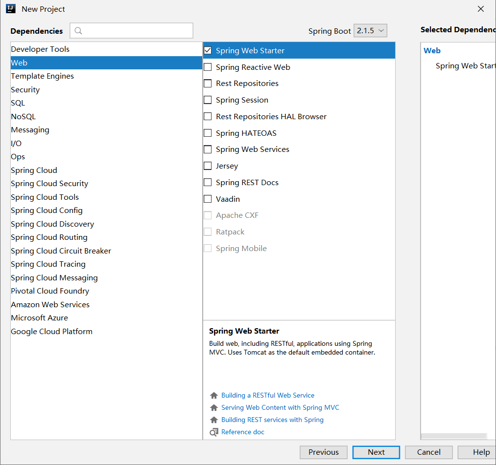

### 第一个 Spring Boot 应用程序

## 创建项目

这里我们使用 Intellij IDEA 来新建一个 Spring Boot 项目。

### Spring 初始化器


### 填写项目信息


### 选择版本和依赖



### 保存项目到指定目录


### 工程目录结构

创建完成后的工程目录结构如下：

```
│  .gitignore
│  pom.xml
│
│
└─src
    ├─main
    │  ├─java
    │  │  └─com
    │  │      └─funtl
    │  │          └─hello
    │  │              └─spring
    │  │                  └─boot
    │  │                          HelloSpringBootApplication.java
    │  │
    │  └─resources
    │      │  application.properties
    │      │
    │      ├─static
    │      └─templates
    └─test
        └─java
            └─com
                └─funtl
                    └─hello
                        └─spring
                            └─boot
                                    HelloSpringBootApplicationTests.java
```

- .gitignore：Git 过滤配置文件
- pom.xml：Maven 的依赖管理配置文件
- HelloSpringBootApplication.java：程序入口
- resources：资源文件目录
  - static: 静态资源文件目录
  - templates：模板资源文件目录
  - application.properties：Spring Boot 的配置文件，实际开发中会替换成 YAML 语言配置（application.yml）

## POM

```xml
<?xml version="1.0" encoding="UTF-8"?>
<project xmlns="http://maven.apache.org/POM/4.0.0" xmlns:xsi="http://www.w3.org/2001/XMLSchema-instance"
         xsi:schemaLocation="http://maven.apache.org/POM/4.0.0 http://maven.apache.org/xsd/maven-4.0.0.xsd">
    <modelVersion>4.0.0</modelVersion>
    <parent>
        <groupId>org.springframework.boot</groupId>
        <artifactId>spring-boot-starter-parent</artifactId>
        <version>2.1.6.RELEASE</version>
        <relativePath/> <!-- lookup parent from repository -->
    </parent>
    <groupId>com.funtl</groupId>
    <artifactId>hello-spring-boot</artifactId>
    <version>0.0.1-SNAPSHOT</version>
    <name>hello-spring-boot</name>
    <description>Demo project for Spring Boot</description>
    <properties>
        <java.version>1.8</java.version>
    </properties>
    <dependencies>
        <dependency>
            <groupId>org.springframework.boot</groupId>
            <artifactId>spring-boot-starter-web</artifactId>
        </dependency>
        <dependency>
            <groupId>org.springframework.boot</groupId>
            <artifactId>spring-boot-starter-test</artifactId>
            <scope>test</scope>
        </dependency>
    </dependencies>
    <build>
        <plugins>
            <plugin>
                <groupId>org.springframework.boot</groupId>
                <artifactId>spring-boot-maven-plugin</artifactId>
                <configuration>
                    <mainClass>com.funtl.hello.spring.boot.HelloSpringBootApplication</mainClass>
                </configuration>
            </plugin>
        </plugins>
    </build>
</project>
```

- parent：继承了 Spring Boot 的 Parent，表示我们是一个 Spring Boot 工程
- `spring-boot-starter-web`：包含了 `spring-boot-starter` 还自动帮我们开启了 Web 支持

## 功能演示

我们创建一个 Controller 来演示一下 Spring Boot 的神奇功能

```java
package com.funtl.hello.spring.boot.controller;
import org.springframework.web.bind.annotation.GetMapping;
import org.springframework.web.bind.annotation.RestController;
@RestController
public class HelloController {
    @GetMapping(value = "/")
    public String sayHi() {
        return "Hello Spring Boot.";
    }
}
```

启动 `HelloSpringBootApplication` 的 `main()` 方法，浏览器访问 [http://localhost:8080](http://qfdmy.com/wp-content/themes/quanbaike/go.php?url=aHR0cDovL2xvY2FsaG9zdDo4MDgw) 可以看到：

```
Hello Spring Boot.
```

## 神奇之处

- 没有配置 web.xml
- 没有配置 application.xml，Spring Boot 帮你配置了
- 没有配置 application-mvc.xml，Spring Boot 帮你配置了
- 没有配置 Tomcat，Spring Boot 内嵌了 Tomcat 容器