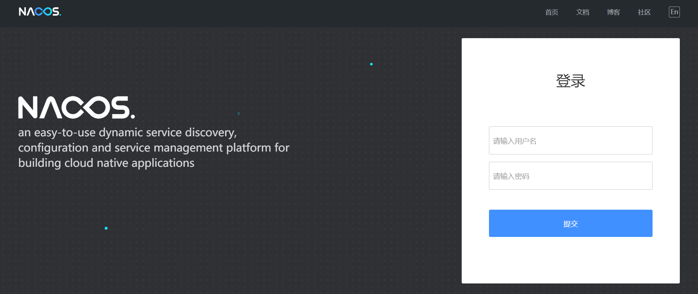
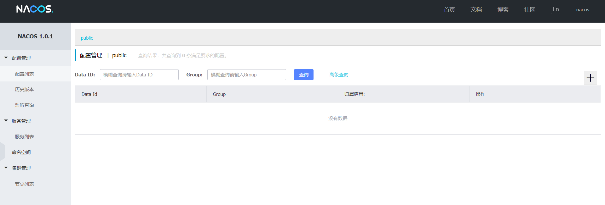

### Nacos 安装

## 概述

Nacos 官方提供了 Docker 版本，方便我们快速部署，操作步骤如下

## 操作步骤

### Clone 项目

```shell
git clone https://github.com/nacos-group/nacos-docker.gitcd nacos-docker
```

### 单机模式

```shell
docker-compose -f example/standalone-mysql.yaml up -d
```

### 查看日志

```shell
docker-compose -f example/standalone-mysql.yaml logs -f
```

## Nacos 控制台

[http://192.168.141.132:8848/nacos](http://qfdmy.com/wp-content/themes/quanbaike/go.php?url=aHR0cDovLzE5Mi4xNjguMTQxLjEzMjo4ODQ4L25hY29z)

### 登录



- **账号：** nacos
- **密码：** nacos

### 访问



完成