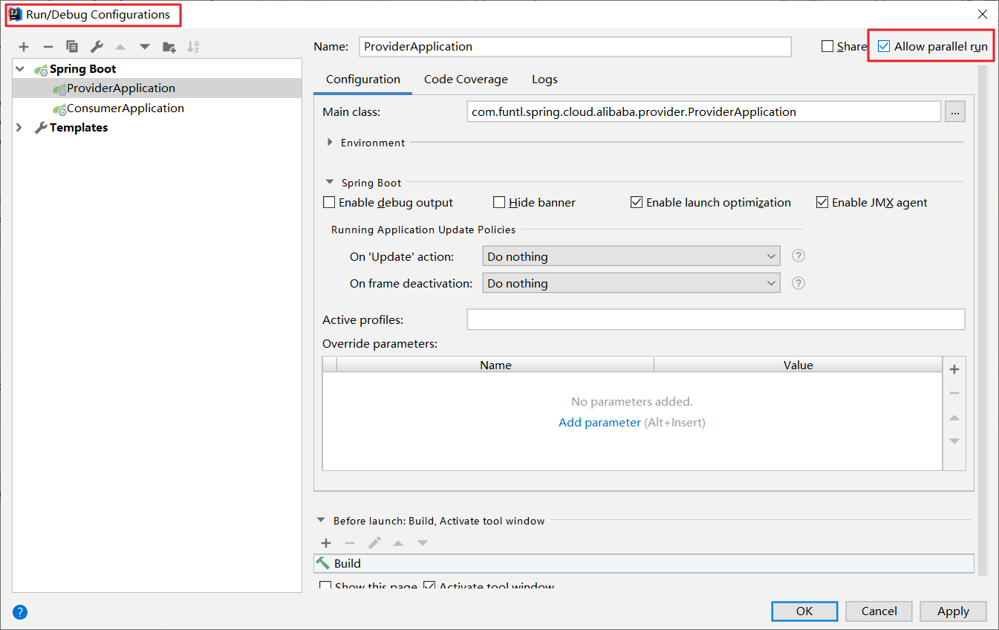
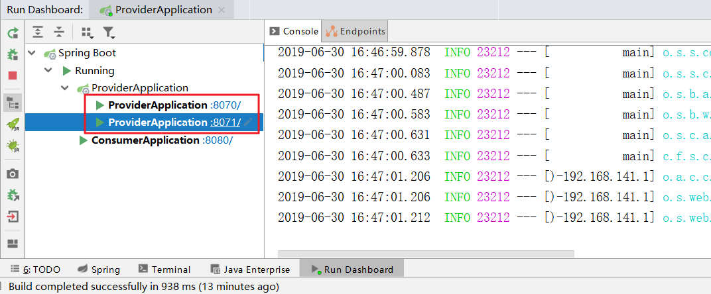
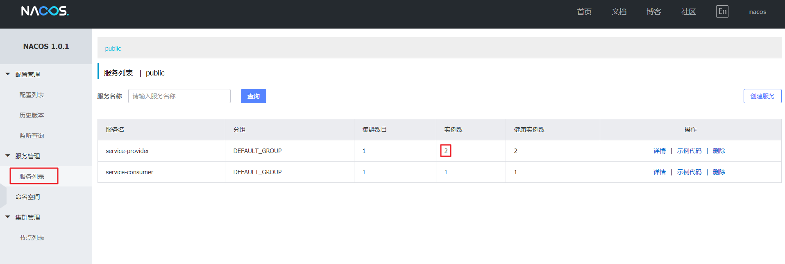
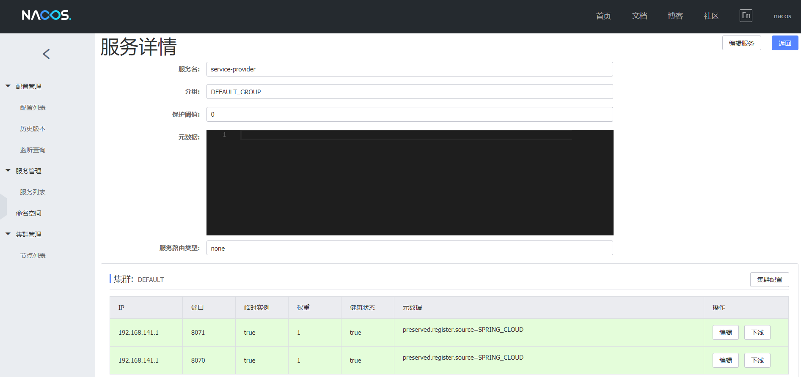

# Nacos Feign 客户端

## 什么是 Feign

Feign 是一个声明式的伪 HTTP 客户端，它使得写 HTTP 客户端变得更简单。使用 Feign，只需要创建一个接口并注解。它具有可插拔的注解特性，可使用 Feign 注解和 JAX-RS 注解。Feign 支持可插拔的编码器和解码器。Feign 默认集成了 Ribbon，Nacos 也很好的兼容了 Feign，默认实现了负载均衡的效果

- Feign 采用的是基于接口的注解
- Feign 整合了 Ribbon

## POM

在 `hello-spring-cloud-alibaba-consumer` 项目中增加 `org.springframework.cloud:spring-cloud-starter-openfeign` 依赖

```xml
<dependency>
    <groupId>org.springframework.cloud</groupId>
    <artifactId>spring-cloud-starter-openfeign</artifactId>
</dependency>
```

## Application

通过 `@EnableFeignClients` 注解开启 Feign 功能

```java
package com.funtl.spring.cloud.alibaba.consumer;
import org.springframework.boot.SpringApplication;
import org.springframework.boot.autoconfigure.SpringBootApplication;
import org.springframework.cloud.client.discovery.EnableDiscoveryClient;
import org.springframework.cloud.openfeign.EnableFeignClients;

@SpringBootApplication
@EnableDiscoveryClient
@EnableFeignClients
public class ConsumerApplication {
    public static void main(String[] args) {
        SpringApplication.run(ConsumerApplication.class, args);
    }
}
```

## Service

创建业务结构，通过 `@FeignClient("服务名")` 注解来指定调用哪个服务

```java
package com.funtl.spring.cloud.alibaba.consumer.service;
import org.springframework.cloud.openfeign.FeignClient;
import org.springframework.web.bind.annotation.GetMapping;
import org.springframework.web.bind.annotation.PathVariable;

@FeignClient(value = "service-provider")
public interface EchoService {
    @GetMapping(value = "/echo/{string}")
    String echo(@PathVariable("string") String string);
}
```

## Controller

```java
package com.funtl.spring.cloud.alibaba.consumer.controller;
import com.funtl.spring.cloud.alibaba.consumer.service.EchoService;
import org.springframework.beans.factory.annotation.Autowired;
import org.springframework.web.bind.annotation.GetMapping;
import org.springframework.web.bind.annotation.PathVariable;
import org.springframework.web.bind.annotation.RestController;

@RestController
public class TestEchoController {
    @Autowired
    private EchoService echoService;
    @GetMapping(value = "/feign/echo/{str}")
    public String echo(@PathVariable String str) {
        return echoService.echo(str);
    }
}
```

## 验证是否成功

通过浏览器访问 [http://localhost:8080/feign/echo/hi](http://qfdmy.com/wp-content/themes/quanbaike/go.php?url=aHR0cDovL2xvY2FsaG9zdDo4MDgwL2ZlaWduL2VjaG8vaGk=)

```
Hello Nacos Provider hi
```

## 配置负载均衡

- 修改 `service-provider` 服务的端口号如 8071，并启动多个实例，IDEA 中依次点击 **Run** -> **Edit Configurations** 并勾选 **Allow parallel run** 以允许 IDEA 多实例运行项目



- 再次启动 `service-provider` 实例，IDEA Spring Boot 面板可以看到



- Nacos Server 控制台可以看到 `service-provider` 有 2 个实例



> **服务：** 通过预定义接口网络访问的提供给客户端的软件功能
> **服务名：** 服务提供的标识，通过该标识可以唯一确定其指代的服务
> **服务分组：** 不同的服务可以归类到同一分组
> **虚拟集群：** 同一个服务下的所有服务实例组成一个默认集群，集群可以被进一步按需求划分，划分的单位可以是虚拟集群
> **实例：** 提供一个或多个服务的具有可访问网络地址（IP:Port）的进程
> **权重：** 实例级别的配置。权重为浮点数。权重越大，分配给该实例的流量越大
> **健康保护阈值：** 为了防止因过多实例 (Instance) 不健康导致流量全部流向健康实例 (Instance) ，继而造成流量压力把健康 健康实例 (Instance) 压垮并形成雪崩效应，应将健康保护阈值定义为一个 0 到 1 之间的浮点数。当域名健康实例 (Instance) 占总服务实例 (Instance) 的比例小于该值时，无论实例 (Instance) 是否健康，都会将这个实例 (Instance) 返回给客户端。这样做虽然损失了一部分流量，但是保证了集群的剩余健康实例 (Instance) 能正常工作



- 在 `service-provider` 项目的 `EchoController` 中增加测试方法

```java
@Value("${server.port}")
private String port;
@GetMapping(value = "/lb")
public String lb() {
    return "Hello Nacos Provider i am from port: " + port;
}
```

- 在 `service-consumer` 项目的 `EchoService` 中增加测试方法

```java
@GetMapping(value = "/lb")
String lb();
```

- 在 `service-consumer` 项目的 `TestEchoController` 中增加测试方法

```java
@GetMapping(value = "/lb")
public String lb() {
    return echoService.lb();
}
```

- 重启服务，通过浏览器访问 [http://localhost:8080/lb](http://qfdmy.com/wp-content/themes/quanbaike/go.php?url=aHR0cDovL2xvY2FsaG9zdDo4MDgwL2xi) ，反复刷新浏览器，浏览器交替显示

```
Hello Nacos Provider i am from port: 8070Hello Nacos Provider i am from port: 8071
```


## 附：扩展阅读

### 常见负载均衡策略

负载主机可以提供很多种负载均衡方法，也就是我们常说的调度方法或算法

#### 轮循

**Round Robin：** 这种方法会将收到的请求循环分配到服务器集群中的每台机器，即有效服务器。如果使用这种方式，所有的标记进入虚拟服务的服务器应该有相近的资源容量 以及负载形同的应用程序。如果所有的服务器有相同或者相近的性能那么选择这种方式会使服务器负载形同。基于这个前提，轮循调度是一个简单而有效的分配请求 的方式。然而对于服务器不同的情况，选择这种方式就意味着能力比较弱的服务器也会在下一轮循环中接受轮循，即使这个服务器已经不能再处理当前这个请求了。 这可能导致能力较弱的服务器超载。

#### 加权轮循

**Weighted Round Robin：** 这种算法解决了简单轮循调度算法的缺点：传入的请求按顺序被分配到集群中服务器，但是会考虑提前为每台服务器分配的权重。管理员只是简单的通过服务 器的处理能力来定义各台服务器的权重。例如，能力最强的服务器 A 给的权重是 100，同时能力最低的服务器给的权重是 50。这意味着在服务器 B 接收到第一个 请求之前前，服务器 A 会连续的接受到 2 个请求，以此类推。

#### 最少连接数

**Least Connection：** 以上两种方法都没有考虑的是系统不能识别在给定的时间里保持了多少连接。因此可能发生，服务器 B 服务器收到的连接比服务器 A 少但是它已经超载，因为 服务器 B 上的用户打开连接持续的时间更长。这就是说连接数即服务器的负载是累加的。这种潜在的问题可以通过 “最少连接数” 算法来避免：传入的请求是根据每 台服务器当前所打开的连接数来分配的。即活跃连接数最少的服务器会自动接收下一个传入的请求。接本上和简单轮询的原则相同：所有拥有虚拟服务的服务器资源 容量应该相近。值得注意的是，在流量率低的配置环境中，各服务器的流量并不是相同的，会优先考虑第一台服务器。这是因为，如果所有的服务器是相同的，那么 第一个服务器优先，直到第一台服务器有连续的活跃流量，否则总是会优先选择第一台服务器。

#### 最少连接数慢启动时间

**Least Connection Slow Start Time：** 对最少连接数和带权重的最小连接数调度方法来说，当一个服务器刚加入线上环境是，可以为其配置一个时间段，在这段时间内连接数是有限制的而且是缓慢 增加的。这为服务器提供了一个‘过渡时间’以保证这个服务器不会因为刚启动后因为分配的连接数过多而超载。这个值在 L7 配置界面设置。

#### 加权最少连接

**Weighted Least Connection：** 如果服务器的资源容量各不相同，那么 “加权最少连接” 方法更合适：由管理员根据服务器情况定制的权重所决定的活跃连接数一般提供了一种对服务器非常 平衡的利用，因为他它借鉴了最少连接和权重两者的优势。通常，这是一个非常公平的分配方式，因为它使用了连接数和服务器权重比例；集群中比例最低的服务器 自动接收下一个请求。但是请注意，在低流量情况中使用这种方法时，请参考 “最小连接数” 方法中的注意事项。

#### 基于代理的自适应负载均衡

**Agent Based Adaptive Balancing：** 除了上述方法之外，负载主机包含一个自适用逻辑用来定时监测服务器状态和该服务器的权重。对于非常强大的 “基于代理的自适应负载均衡” 方法来说，负 载主机以这种方式来定时检测所有服务器负载情况：每台服务器都必须提供一个包含文件，这个文件包含一个 0~99 的数字用来标明改服务器的实际负载情况 (0 = 空前，99 = 超载，101 = 失败，102 = 管理员禁用)，而服务器同构 http get 方法来获取这个文件；同时对集群中服务器来说，以二进制文件形式提供自身负载情况也是该服务器工作之一，然而，并没有限制服务器如何计算自身的负载 情况。根据服务器整体负载情况，有两种策略可以选择：在常规的操作中，调度算法通过收集的服务器负载值和分配给该服务器的连接数的比例计算出一个权重比 例。因此，如果一个服务器负载过大，权重会通过系统透明的作重新调整。和加权轮循调度方法一样，不正确的分配可以被记录下来使得可以有效的为不同服务器分 配不同的权重。然而，在流量非常低的环境下，服务器报上来的负载值将不能建立一个有代表性的样本；那么基于这些值来分配负载的话将导致失控以及指令震荡。 因此，在这种情况下更合理的做法是基于静态的权重比来计算负载分配。当所有服务器的负载低于管理员定义的下限时，负载主机就会自动切换为加权轮循方式来分 配请求；如果负载大于管理员定义的下限，那么负载主机又会切换回自适应方式。

#### 固定权重

**Fixed Weighted：** 最高权重只有在其他服务器的权重值都很低时才使用。然而，如果最高权重的服务器下降，则下一个最高优先级的服务器将为客户端服务。这种方式中每个真实服务器的权重需要基于服务器优先级来配置。

#### 加权响应

**Weighted Response：** 流量的调度是通过加权轮循方式。加权轮循中所使用的权重是根据服务器有效性检测的响应时间来计算。每个有效性检测都会被计时，用来标记它响应成功花 了多长时间。但是需要注意的是，这种方式假定服务器心跳检测是基于机器的快慢，但是这种假设也许不总是能够成立。所有服务器在虚拟服务上的响应时间的总和 加在一起，通过这个值来计算单个服务物理服务器的权重；这个权重值大约每 15 秒计算一次。

#### 源 IP 哈希

**Source IP Hash：** 这种方式通过生成请求源 IP 的哈希值，并通过这个哈希值来找到正确的真实服务器。这意味着对于同一主机来说他对应的服务器总是相同。使用这种方式，你不需要保存任何源 IP。但是需要注意，这种方式可能导致服务器负载不平衡。