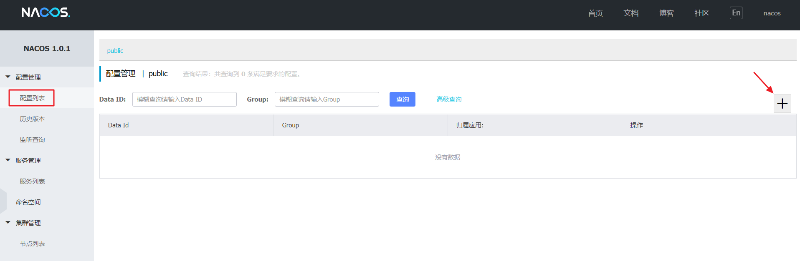
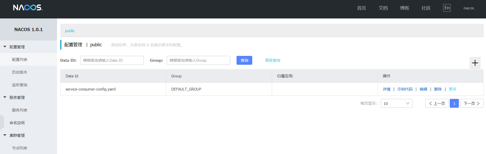
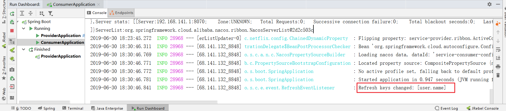

### Nacos 分布式配置中心

## 概述

在分布式系统中，由于服务数量巨多，为了方便服务配置文件统一管理，实时更新，所以需要分布式配置中心组件

## 什么是 Nacos Config

Nacos 提供用于存储配置和其他元数据的 key/value 存储，为分布式系统中的外部化配置提供服务器端和客户端支持。使用 Spring Cloud Alibaba Nacos Config，您可以在 Nacos Server 集中管理你 Spring Cloud 应用的外部属性配置。

Spring Cloud Alibaba Nacos Config 是 Spring Cloud Config Server 和 Client 的替代方案，客户端和服务器上的概念与 Spring Environment 和 PropertySource 有着一致的抽象，在特殊的 bootstrap 阶段，配置被加载到 Spring 环境中。当应用程序通过部署管道从开发到测试再到生产时，您可以管理这些环境之间的配置，并确保应用程序具有迁移时需要运行的所有内容。

## 接入配置中心

### POM

我们以 `service-consumer` 项目为例，修改 `pom.xml` ，引入 **Nacos Config Starter**

```xml
<dependency>
    <groupId>org.springframework.cloud</groupId>
    <artifactId>spring-cloud-starter-alibaba-nacos-config</artifactId>
</dependency>
```

### Controller

完成上述两步后，应用会从 Nacos Config 中获取相应的配置，并添加在 Spring Environment 的 PropertySources 中。这里我们使用 `@Value` 注解来将对应的配置注入到 `TestEchoController` 的 `username`字段，并添加 `@RefreshScope` 打开动态刷新功能

```java
package com.funtl.spring.cloud.alibaba.consumer.controller;

import com.funtl.spring.cloud.alibaba.consumer.service.EchoService;
import org.springframework.beans.factory.annotation.Autowired;
import org.springframework.beans.factory.annotation.Value;
import org.springframework.cloud.context.config.annotation.RefreshScope;
import org.springframework.web.bind.annotation.GetMapping;
import org.springframework.web.bind.annotation.PathVariable;
import org.springframework.web.bind.annotation.RestController;

@RefreshScope
@RestController
public class TestEchoController {
    @Autowired
    private EchoService echoService;
    @Value("${user.name}")
    private String username;
    
    @GetMapping(value = "/config")
    public String config() {
        return echoService.echo(username);
    }
}
```

### 使用控制台发布配置

通过浏览器访问 [http://192.168.141.132:8848/nacos](http://qfdmy.com/wp-content/themes/quanbaike/go.php?url=aHR0cDovLzE5Mi4xNjguMTQxLjEzMjo4ODQ4L25hY29z) ，访问 Nacos Server




> **注意：** Data ID 的默认扩展名为 `.properties` ，希望使用 YAML 配置，此处必须指明是 `.yaml`



```yaml
spring:
  application:
    # 服务名
    name: service-consumer
  cloud:
    nacos:
      discovery:
        # 服务注册中心
        server-addr: 192.168.141.132:8848
server:
  # 服务端口
  port: 8080
management:
  # 端点检查（健康检查）
  endpoints:
    web:
      exposure:
        include: "*"
user:
  name: "灶门炭治郎"
```

### 修改客户端配置

创建名为 `bootstrap.properties` 的配置文件并删除之前创建的 `application.yml` 配置文件

```properties
spring.application.name=service-consumer-config
spring.cloud.nacos.config.server-addr=192.168.141.132:8848
spring.cloud.nacos.config.file-extension=yaml
```

通过浏览器访问 [http://localhost:8080/config](http://qfdmy.com/wp-content/themes/quanbaike/go.php?url=aHR0cDovL2xvY2FsaG9zdDo4MDgwL2NvbmZpZw==) ，浏览器输出如下

```
Hello Nacos Provider 灶门炭治郎
```

> **注意：** Spring Boot 配置文件的加载顺序，依次为 `bootstrap.properties` -> `bootstrap.yml` -> `application.properties` -> `application.yml` ，其中 **bootstrap.properties** 配置为最高优先级

### 动态刷新配置

在 Nacos Server 控制台修改配置文件，将 `user.name` 属性修改为 `灶门祢豆子`，此时观察控制台日志，你会发现我们已经成功刷新了配置



### 验证是否成功

通过浏览器访问 [http://localhost:8080/config](http://qfdmy.com/wp-content/themes/quanbaike/go.php?url=aHR0cDovL2xvY2FsaG9zdDo4MDgwL2NvbmZpZw==) ，浏览器输出如下

```
Hello Nacos Provider 灶门祢豆子
```

> **提示：** 你可以使用 `spring.cloud.nacos.config.refresh.enabled=false` 来关闭动态刷新


## 附：扩展阅读

### Endpoint 信息查看

Spring Boot 应用支持通过 Endpoint 来暴露相关信息，Nacos Config Starter 也支持这一点。在使用之前需要在 maven 中添加 `spring-boot-starter-actuator` 依赖，并在配置中允许 Endpoints 的访问。

- **nacos-discovery：** [http://localhost:8080/actuator/nacos-discovery](http://qfdmy.com/wp-content/themes/quanbaike/go.php?url=aHR0cDovL2xvY2FsaG9zdDo4MDgwL2FjdHVhdG9yL25hY29zLWRpc2NvdmVyeQ==)

```json
{
    "subscribe": [
        {
            "jsonFromServer": "",
            "name": "service-consumer",
            "groupName": "DEFAULT_GROUP",
            "clusters": null,
            "cacheMillis": 1000,
            "hosts": [],
            "lastRefTime": 0,
            "checksum": "",
            "allIPs": false,
            "key": "service-consumer",
            "valid": true,
            "keyEncoded": "service-consumer"
        },
        {
            "jsonFromServer": "",
            "name": "service-provider",
            "groupName": "DEFAULT_GROUP",
            "clusters": null,
            "cacheMillis": 1000,
            "hosts": [],
            "lastRefTime": 0,
            "checksum": "",
            "allIPs": false,
            "key": "service-provider",
            "valid": true,
            "keyEncoded": "service-provider"
        }
    ],
    "NacosDiscoveryProperties": {
        "serverAddr": "192.168.141.132:8848",
        "endpoint": "",
        "namespace": "",
        "watchDelay": 30000,
        "logName": "",
        "service": "service-consumer",
        "weight": 1,
        "clusterName": "DEFAULT",
        "namingLoadCacheAtStart": "false",
        "metadata": {
            "preserved.register.source": "SPRING_CLOUD"
        },
        "registerEnabled": true,
        "ip": "192.168.141.1",
        "networkInterface": "",
        "port": 8080,
        "secure": false,
        "accessKey": "",
        "secretKey": ""
    }
}
```

- **nacos-config：** [http://localhost:8080/actuator/nacos-config](http://qfdmy.com/wp-content/themes/quanbaike/go.php?url=aHR0cDovL2xvY2FsaG9zdDo4MDgwL2FjdHVhdG9yL25hY29zLWNvbmZpZw==)

```json
{
    "NacosConfigProperties": {
        "serverAddr": "192.168.141.132:8848",
        "encode": null,
        "group": "DEFAULT_GROUP",
        "prefix": null,
        "fileExtension": "yaml",
        "timeout": 3000,
        "endpoint": null,
        "namespace": null,
        "accessKey": null,
        "secretKey": null,
        "contextPath": null,
        "clusterName": null,
        "name": null,
        "sharedDataids": null,
        "refreshableDataids": null,
        "extConfig": null
    },
    "RefreshHistory": [
        {
            "timestamp": "2019-06-30 18:30:45",
            "dataId": "service-consumer-config.yaml",
            "md5": "690fd78b5ae9fac5b545c1a8d7ec4e2b"
        },
        {
            "timestamp": "2019-06-30 18:22:08",
            "dataId": "service-consumer-config.yaml",
            "md5": "40b12ffc9d305ec1cad65d606e8f4708"
        }
    ],
    "Sources": [
        {
            "lastSynced": "2019-06-30 18:22:05",
            "dataId": "service-consumer-config.yaml"
        }
    ]
}
```

> **注意：** Sources 表示此客户端从哪些 Nacos Config 配置项中获取了信息，RefreshHistory 表示动态刷新的历史记录，最多保存20条，NacosConfigProperties 则为 Nacos Config Starter 本身的配置

### 更多配置

| 配置项                   | key                                       | 默认值        | 说明                                                         |
| :----------------------- | :---------------------------------------- | :------------ | :----------------------------------------------------------- |
| 服务端地址               | spring.cloud.nacos.config.server-addr     |               |                                                              |
| DataId前缀               | spring.cloud.nacos.config.prefix          |               | spring.application.name                                      |
| Group                    | spring.cloud.nacos.config.group           | DEFAULT_GROUP |                                                              |
| dataID后缀及内容文件格式 | spring.cloud.nacos.config.file-extension  | properties    | dataId的后缀，同时也是配置内容的文件格式，目前只支持 properties |
| 配置内容的编码方式       | spring.cloud.nacos.config.encode          | UTF-8         | 配置的编码                                                   |
| 获取配置的超时时间       | spring.cloud.nacos.config.timeout         | 3000          | 单位为 ms                                                    |
| 配置的命名空间           | spring.cloud.nacos.config.namespace       |               | 常用场景之一是不同环境的配置的区分隔离，例如开发测试环境和生产环境的资源隔离等。 |
| AccessKey                | spring.cloud.nacos.config.access-key      |               |                                                              |
| SecretKey                | spring.cloud.nacos.config.secret-key      |               |                                                              |
| 相对路径                 | spring.cloud.nacos.config.context-path    |               | 服务端 API 的相对路径                                        |
| 接入点                   | spring.cloud.nacos.config.endpoint        | UTF-8         | 地域的某个服务的入口域名，通过此域名可以动态地拿到服务端地址 |
| 是否开启监听和自动刷新   | spring.cloud.nacos.config.refresh.enabled | true          |                                                              |

### 更多介绍

Nacos为用户提供包括动态服务发现，配置管理，服务管理等服务基础设施，帮助用户更灵活，更轻松地构建，交付和管理他们的微服务平台，基于 Nacos, 用户可以更快速的构建以“服务”为中心的现代云原生应用。Nacos 可以和 **Spring Cloud**、**Kubernetes/CNCF**、**Dubbo** 等微服务生态无缝融合，为用户提供更卓越的体验