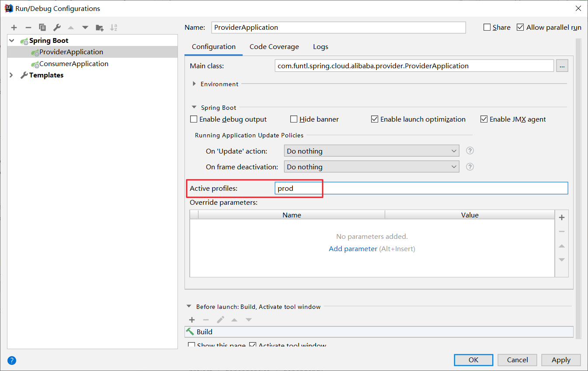
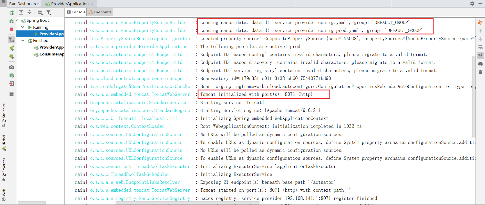

# 08-Nacos 多环境配置


## 概述

我们在做项目开发的时候，生产环境和测试环境的一些配置可能会不一样，有时候一些功能也可能会不一样，所以我们可能会在上线的时候手工修改这些配置信息。Spring 为我们提供了 Spring Boot Profile 这个功能（Maven 也为我们提供了 Maven Profile）。我们只需要在启动的时候添加一个虚拟机参数，激活自己环境所要用的 Profile 就可以了。

操作起来很简单，只需要为不同的环境编写专门的配置文件，如：`application-dev.yml`、`application-prod.yml`， 启动项目时只需要增加一个命令参数 `--spring.profiles.active=` 环境配置即可

```bash
java -jar 1.0.0-SNAPSHOT.jar --spring.profiles.active=prod
```

## 什么是 Nacos Config Profile

`spring-cloud-starter-alibaba-nacos-config` 在加载配置的时候，不仅仅加载了以 dataid 为 `${spring.application.name}.${file-extension:properties}` 为前缀的基础配置，还加载了 dataid 为 `${spring.application.name}-${profile}.${file-extension:properties}` 的基础配置。在日常开发中如果遇到多套环境下的不同配置，可以通过 Spring 提供的 `${spring.profiles.active}` 这个配置项来配置。

## 使用 Nacos Config Profile

我们以 `service-provider` 项目为例，演示多环境配置效果，不要忘记依赖 Nacos Config Starter

```
<dependency>    <groupId>org.springframework.cloud</groupId>    <artifactId>spring-cloud-starter-alibaba-nacos-config</artifactId></dependency>
```

### 使用控制台发布配置

> **注意：** 控制台发布配置时不要加注释，否则打成 Jar 包后运行会报无法解析配置文件的错误

通过浏览器访问 [http://192.168.141.132:8848/nacos](http://www.qfdmy.com/wp-content/themes/quanbaike/go.php?url=aHR0cDovLzE5Mi4xNjguMTQxLjEzMjo4ODQ4L25hY29z) ，访问 Nacos Server

- 发布一个名为 `service-provider-config.yaml` 的 **测试环境** 配置

```yaml
spring:
  application:
    # 服务名
    name: service-provider
  cloud:
    nacos:
      discovery:
        # 服务注册中心
        server-addr: 192.168.141.132:8848

server:
  # 服务端口
  port: 8070

management:
  # 端点检查（健康检查）
  endpoints:
    web:
      exposure:
        include: "*"
```

- 发布一个名为 `service-provider-config-prod.yaml` 的 **生产环境** 配置

```yaml
spring:
  application:
    # 服务名
    name: service-provider
  cloud:
    nacos:
      discovery:
        # 服务注册中心
        server-addr: 192.168.141.132:8848

server:
  # 修改了上面的端口号，区分配置的不同
  port: 8071

management:
  # 端点检查（健康检查）
  endpoints:
    web:
      exposure:
        include: "*"
```

### 修改客户端配置

- 创建名为 `bootstrap.properties` 的配置文件并删除之前创建的 `application.yml` 配置文件

```properties
spring.application.name=service-provider-config
spring.cloud.nacos.config.server-addr=192.168.141.132:8848
spring.cloud.nacos.config.file-extension=yaml
```

- 创建名为 `bootstrap-prod.properties` 的配置文件

```properties
spring.profiles.active=prod
spring.application.name=service-provider-config
spring.cloud.nacos.config.server-addr=192.168.141.132:8848
spring.cloud.nacos.config.file-extension=yaml
```

### 测试多环境配置

此时我们有两个配置文件，分别为 `bootstrap.properties` 和 `bootstrap-prod.properties` ，我们需要指定启动时加载哪一个配置文件

**Run** -> **Edit Configurations** -> **Active profiles:**



运行项目并观察日志



由上图可知，我们成功加载了不同环境的配置