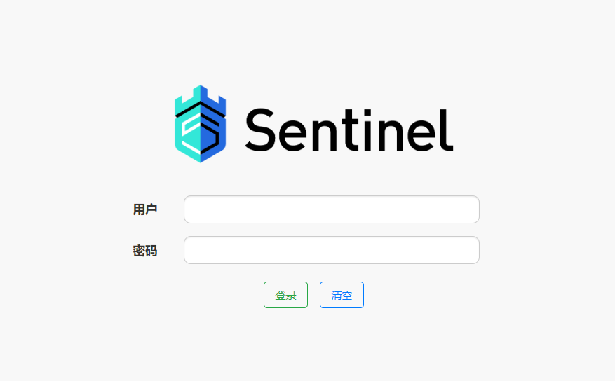
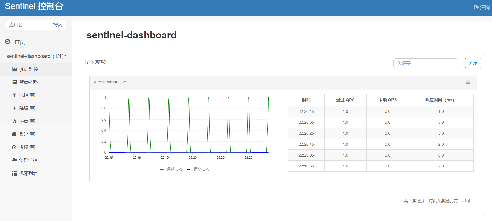

# 10-Sentinel 控制台


## 概述

Sentinel 提供一个轻量级的开源控制台，它提供机器发现以及健康情况管理、监控（单机和集群），规则管理和推送的功能。另外，鉴权在生产环境中也必不可少。这里，我们将会详细讲述如何通过简单的步骤就可以使用这些功能。Sentinel 控制台最少应该包含如下功能

- **查看机器列表以及健康情况：** 收集 Sentinel 客户端发送的心跳包，用于判断机器是否在线。
- **监控 (单机和集群聚合)：** 通过 Sentinel 客户端暴露的监控 API，定期拉取并且聚合应用监控信息，最终可以实现秒级的实时监控。
- **规则管理和推送：** 统一管理推送规则。
- **鉴权：** 生产环境中鉴权非常重要。这里每个开发者需要根据自己的实际情况进行定制。

## 启动控制台

### 获取

您可以从 [官方 GitHub Release 页面](http://www.qfdmy.com/wp-content/themes/quanbaike/go.php?url=aHR0cHM6Ly9naXRodWIuY29tL2FsaWJhYmEvU2VudGluZWwvcmVsZWFzZXM=) 页面下载最新版本的控制台 JAR 包。

### 启动

> **注意：** 启动 Sentinel 控制台需要 JDK 版本为 1.8 及以上版本

```
java -Dserver.port=8080 -Dcsp.sentinel.dashboard.server=localhost:8080 -Dproject.name=sentinel-dashboard -jar sentinel-dashboard.jar
```

其中 `-Dserver.port=8080` 用于指定 Sentinel 控制台端口为 `8080`

> **注意：** 从 Sentinel 1.6.0 起，Sentinel 控制台引入基本的 **登录** 功能，**默认用户名和密码都是 sentinel**

### 鉴权

用户可以通过如下参数进行配置

- `-Dsentinel.dashboard.auth.username=sentinel` 用于指定控制台的登录用户名为 sentinel
- `-Dsentinel.dashboard.auth.password=123456` 用于指定控制台的登录密码为 123456；如果省略这两个参数，默认用户和密码均为 sentinel
- `-Dserver.servlet.session.timeout=7200` 用于指定 Spring Boot 服务端 session 的过期时间，如 7200 表示 7200 秒；60m 表示 60 分钟，默认为 30 分钟

## 验证安装是否成功

通过浏览器访问 [http://localhost:8080/#/login](http://www.qfdmy.com/wp-content/themes/quanbaike/go.php?url=aHR0cDovL2xvY2FsaG9zdDo4MDgwLyMvbG9naW4=)



- **账号：** sentinel
- **密码：** sentinel



详细说明请参考 [官方 Sentinel Wiki](http://www.qfdmy.com/wp-content/themes/quanbaike/go.php?url=aHR0cHM6Ly9naXRodWIuY29tL2FsaWJhYmEvU2VudGluZWwvd2lraQ==)