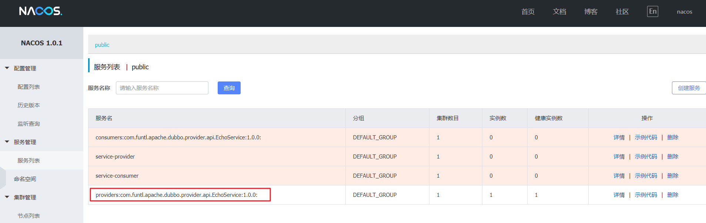
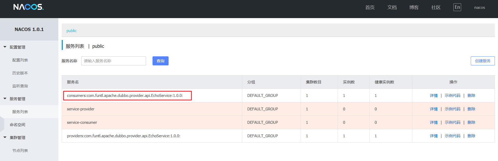

# 04-Dubbo 服务注册与发现


## 概述

由于我们已经有了 Nacos 注册中心，Sentinel 熔断限流控制中心，所以我们不再使用 Zookeeper 和 Dubbo Admin 来管理我们的 Dubbo 应用程序，Dubbo 仅当作我们微服务中的 RPC 通信框架，真正实现对内 RPC，对外 REST

## 创建服务提供者

### POM

创建一个名为 `hello-apache-dubbo-provider` 的服务提供者项目，`pom.xml` 配置如下：

```xml
<?xml version="1.0" encoding="UTF-8"?>
<project xmlns="http://maven.apache.org/POM/4.0.0" xmlns:xsi="http://www.w3.org/2001/XMLSchema-instance"
         xsi:schemaLocation="http://maven.apache.org/POM/4.0.0 http://maven.apache.org/xsd/maven-4.0.0.xsd">
    <modelVersion>4.0.0</modelVersion>
    
    <parent>
        <groupId>com.funtl</groupId>
        <artifactId>hello-apache-dubbo</artifactId>
        <version>0.0.1-SNAPSHOT</version>
    </parent>
    
    <artifactId>hello-apache-dubbo-provider</artifactId>
    <packaging>pom</packaging>
    <url>http://www.funtl.com</url>
    <inceptionYear>2018-Now</inceptionYear>
    
    <licenses>
        <license>
            <name>Apache 2.0</name>
            <url>https://www.apache.org/licenses/LICENSE-2.0.txt</url>
        </license>
    </licenses>
    
    <developers>
        <developer>
            <id>liwemin</id>
            <name>Lusifer Lee</name>
            <email>lee.lusifer@gmail.com</email>
        </developer>
    </developers>
    
    <modules>
        <module>hello-apache-dubbo-provider-api</module>
        <module>hello-apache-dubbo-provider-service</module>
    </modules>
</project>
```

### 创建服务提供者接口模块

#### POM

创建一个名为 `hello-apache-dubbo-provider-api` 的模块（该模块只负责定义接口），`pom.xml` 配置如下：

```xml
<?xml version="1.0" encoding="UTF-8"?>
<project xmlns="http://maven.apache.org/POM/4.0.0" xmlns:xsi="http://www.w3.org/2001/XMLSchema-instance"
         xsi:schemaLocation="http://maven.apache.org/POM/4.0.0 http://maven.apache.org/xsd/maven-4.0.0.xsd">
    <modelVersion>4.0.0</modelVersion>
    
    <parent>
        <groupId>com.funtl</groupId>
        <artifactId>hello-apache-dubbo-provider</artifactId>
        <version>0.0.1-SNAPSHOT</version>
    </parent>
    
    <artifactId>hello-apache-dubbo-provider-api</artifactId>
    <packaging>jar</packaging>
    <url>http://www.funtl.com</url>
    <inceptionYear>2018-Now</inceptionYear>
    
    <licenses>
        <license>
            <name>Apache 2.0</name>
            <url>https://www.apache.org/licenses/LICENSE-2.0.txt</url>
        </license>
    </licenses>
    
    <developers>
        <developer>
            <id>liwemin</id>
            <name>Lusifer Lee</name>
            <email>lee.lusifer@gmail.com</email>
        </developer>
    </developers>
    
</project>
```

#### 定义接口

```java
package com.funtl.apache.dubbo.provider.api;

public interface EchoService {
    String echo(String string);
}
```

### 创建服务提供者接口实现

#### POM

创建一个名为 `hello-apache-dubbo-provider-service` 的模块，`pom.xml` 配置如下：

```xml
<?xml version="1.0" encoding="UTF-8"?>
<project xmlns="http://maven.apache.org/POM/4.0.0" xmlns:xsi="http://www.w3.org/2001/XMLSchema-instance"
         xsi:schemaLocation="http://maven.apache.org/POM/4.0.0 http://maven.apache.org/xsd/maven-4.0.0.xsd">
    <modelVersion>4.0.0</modelVersion>
    
    <parent>
        <groupId>com.funtl</groupId>
        <artifactId>hello-apache-dubbo-provider</artifactId>
        <version>0.0.1-SNAPSHOT</version>
    </parent>
    
    <artifactId>hello-apache-dubbo-provider-service</artifactId>
    <packaging>jar</packaging>
    <url>http://www.funtl.com</url>
    <inceptionYear>2018-Now</inceptionYear>
    
    <licenses>
        <license>
            <name>Apache 2.0</name>
            <url>https://www.apache.org/licenses/LICENSE-2.0.txt</url>
        </license>
    </licenses>
    
    <developers>
        <developer>
            <id>liwemin</id>
            <name>Lusifer Lee</name>
            <email>lee.lusifer@gmail.com</email>
        </developer>
    </developers>
    
    <dependencies>
        <!-- Spring Boot Begin -->
        <dependency>
            <groupId>org.springframework.boot</groupId>
            <artifactId>spring-boot-starter</artifactId>
        </dependency>
        <dependency>
            <groupId>org.springframework.boot</groupId>
            <artifactId>spring-boot-starter-test</artifactId>
            <scope>test</scope>
        </dependency>
        <!-- Spring Boot End -->
        <!-- Apache Dubbo Begin -->
        <dependency>
            <groupId>org.apache.dubbo</groupId>
            <artifactId>dubbo-spring-boot-starter</artifactId>
        </dependency>
        <dependency>
            <groupId>org.apache.dubbo</groupId>
            <artifactId>dubbo</artifactId>
        </dependency>
        <dependency>
            <groupId>com.alibaba</groupId>
            <artifactId>dubbo-registry-nacos</artifactId>
        </dependency>
        <dependency>
            <groupId>com.alibaba.nacos</groupId>
            <artifactId>nacos-client</artifactId>
        </dependency>
        <dependency>
            <groupId>com.alibaba.spring</groupId>
            <artifactId>spring-context-support</artifactId>
        </dependency>
        <!-- Apache Dubbo End -->
        <!-- Projects Begin -->
        <dependency>
            <groupId>com.funtl</groupId>
            <artifactId>hello-apache-dubbo-provider-api</artifactId>
            <version>${project.parent.version}</version>
        </dependency>
        <!-- Projects End -->
    </dependencies>
    
    <build>
        <plugins>
            <plugin>
                <groupId>org.springframework.boot</groupId>
                <artifactId>spring-boot-maven-plugin</artifactId>
                <configuration>
                    <mainClass>com.funtl.apache.dubbo.provider.ProviderApplication</mainClass>
                </configuration>
            </plugin>
        </plugins>
    </build>
    
</project>
```

#### application.yml

主要增加了 Dubbo 包扫描路径和 Nacos Server 配置

```yaml
spring:
  application:
    name: dubbo-provider
  main:
    allow-bean-definition-overriding: true

dubbo:
  scan:
    base-packages: com.funtl.apache.dubbo.provider.service
  protocol:
    name: dubbo
    port: -1
  registry:
    address: nacos://192.168.141.132:8848
```

#### Application

```java
package com.funtl.apache.dubbo.provider;

import org.springframework.boot.SpringApplication;
import org.springframework.boot.autoconfigure.SpringBootApplication;

@SpringBootApplication
public class ProviderApplication {
    public static void main(String[] args) {
        SpringApplication.run(ProviderApplication.class, args);
    }
}
```

#### Service

通过 `org.apache.dubbo` 包下的 `@Service` 注解将服务暴露出去

```java
package com.funtl.apache.dubbo.provider.service;

import com.funtl.apache.dubbo.provider.api.EchoService;
import org.apache.dubbo.config.annotation.Service;

@Service(version = "1.0.0")
public class EchoServiceImpl implements EchoService {
    @Override
    public String echo(String string) {
        return "Echo Hello Dubbo " + string;
    }
}
```

#### 验证是否成功

通过浏览器访问 [http://192.168.141.132:8848/nacos](http://www.qfdmy.com/wp-content/themes/quanbaike/go.php?url=aHR0cDovLzE5Mi4xNjguMTQxLjEzMjo4ODQ4L25hY29z) Nacos Server 网址



你会发现一个服务已经注册在服务中了，服务名为 `providers:com.funtl.apache.dubbo.provider.api.EchoService:1.0.0:`


## 创建服务消费者

### POM

创建一个名为 `hello-apache-dubbo-consumer` 的服务消费者项目，`pom.xml` 配置如下：

```xml
<?xml version="1.0" encoding="UTF-8"?>
<project xmlns="http://maven.apache.org/POM/4.0.0" xmlns:xsi="http://www.w3.org/2001/XMLSchema-instance"
         xsi:schemaLocation="http://maven.apache.org/POM/4.0.0 http://maven.apache.org/xsd/maven-4.0.0.xsd">
    <modelVersion>4.0.0</modelVersion>
    
    <parent>
        <groupId>com.funtl</groupId>
        <artifactId>hello-apache-dubbo</artifactId>
        <version>0.0.1-SNAPSHOT</version>
    </parent>
    
    <artifactId>hello-apache-dubbo-consumer</artifactId>
    <packaging>jar</packaging>
    <url>http://www.funtl.com</url>
    <inceptionYear>2018-Now</inceptionYear>
    
    <licenses>
        <license>
            <name>Apache 2.0</name>
            <url>https://www.apache.org/licenses/LICENSE-2.0.txt</url>
        </license>
    </licenses>
    
    <developers>
        <developer>
            <id>liwemin</id>
            <name>Lusifer Lee</name>
            <email>lee.lusifer@gmail.com</email>
        </developer>
    </developers>
    
    <dependencies>
        <!-- Spring Boot Begin -->
        <dependency>
            <groupId>org.springframework.boot</groupId>
            <artifactId>spring-boot-starter-web</artifactId>
        </dependency>
        <dependency>
            <groupId>org.springframework.boot</groupId>
            <artifactId>spring-boot-starter-actuator</artifactId>
        </dependency>
        <dependency>
            <groupId>org.springframework.boot</groupId>
            <artifactId>spring-boot-starter-test</artifactId>
            <scope>test</scope>
        </dependency>
        <!-- Spring Boot End -->
        <!-- Apache Dubbo Begin -->
        <dependency>
            <groupId>org.apache.dubbo</groupId>
            <artifactId>dubbo-spring-boot-starter</artifactId>
        </dependency>
        <dependency>
            <groupId>org.apache.dubbo</groupId>
            <artifactId>dubbo-spring-boot-actuator</artifactId>
        </dependency>
        <dependency>
            <groupId>org.apache.dubbo</groupId>
            <artifactId>dubbo</artifactId>
        </dependency>
        <dependency>
            <groupId>com.alibaba</groupId>
            <artifactId>dubbo-registry-nacos</artifactId>
        </dependency>
        <dependency>
            <groupId>com.alibaba.nacos</groupId>
            <artifactId>nacos-client</artifactId>
        </dependency>
        <dependency>
            <groupId>com.alibaba.spring</groupId>
            <artifactId>spring-context-support</artifactId>
        </dependency>
        <!-- Apache Dubbo End -->
        <!-- Projects Begin -->
        <dependency>
            <groupId>com.funtl</groupId>
            <artifactId>hello-apache-dubbo-provider-api</artifactId>
            <version>${project.parent.version}</version>
        </dependency>
        <!-- Projects End -->
    </dependencies>
    
    <build>
        <plugins>
            <plugin>
                <groupId>org.springframework.boot</groupId>
                <artifactId>spring-boot-maven-plugin</artifactId>
                <configuration>
                    <mainClass>com.funtl.apache.dubbo.consumer.ConsumerApplication</mainClass>
                </configuration>
            </plugin>
        </plugins>
    </build>
    
</project>
```

### application.yml

主要增加了 Dubbo 包扫描路径、健康检查以及 Nacos Server 配置

```yaml
spring:
  application:
    name: dubbo-consumer
  main:
    allow-bean-definition-overriding: true

dubbo:
  scan:
    base-packages: com.funtl.apache.dubbo.consumer.controller
  protocol:
    name: dubbo
    port: -1
  registry:
    address: nacos://192.168.141.132:8848

server:
  port: 8080

endpoints:
  dubbo:
    enabled: true

management:
  health:
    dubbo:
      status:
        defaults: memory
        extras: threadpool
  endpoints:
    web:
      exposure:
        include: "*"
```

### Application

```java
package com.funtl.apache.dubbo.consumer;

import org.springframework.boot.SpringApplication;
import org.springframework.boot.autoconfigure.SpringBootApplication;

@SpringBootApplication
public class ConsumerApplication {
    public static void main(String[] args) {
        SpringApplication.run(ConsumerApplication.class, args);
    }
}
```

### Controller

通过 `org.apache.dubbo` 包下的 `@Reference` 注解像调用本地服务一样调用远程服务，轻松实现透明的远程过程调用

```java
package com.funtl.apache.dubbo.consumer.controller;

import com.funtl.apache.dubbo.provider.api.EchoService;
import org.apache.dubbo.config.annotation.Reference;
import org.springframework.web.bind.annotation.GetMapping;
import org.springframework.web.bind.annotation.PathVariable;
import org.springframework.web.bind.annotation.RestController;

@RestController
public class EchoController {
    
    @Reference(version = "1.0.0")
    private EchoService echoService;
    
    @GetMapping(value = "/echo/{string}")
    public String echo(@PathVariable String string) {
        return echoService.echo(string);
    }
}
```

### 验证是否成功

通过浏览器访问 [http://192.168.141.132:8848/nacos](http://www.qfdmy.com/wp-content/themes/quanbaike/go.php?url=aHR0cDovLzE5Mi4xNjguMTQxLjEzMjo4ODQ4L25hY29z) Nacos Server 网址



你会发现一个服务已经注册在服务中了，服务名为 `consumers:com.funtl.apache.dubbo.provider.api.EchoService:1.0.0:`，通过浏览器访问 [http://localhost:8080/echo/hi](http://www.qfdmy.com/wp-content/themes/quanbaike/go.php?url=aHR0cDovL2xvY2FsaG9zdDo4MDgwL2VjaG8vaGk=)

```
Echo Hello Dubbo hi
```

### 服务端点检查

通过浏览器访问 [http://localhost:8080/actuator/health](http://www.qfdmy.com/wp-content/themes/quanbaike/go.php?url=aHR0cDovL2xvY2FsaG9zdDo4MDgwL2FjdHVhdG9yL2hlYWx0aA==)

```json
{    
    "status": "UP"
}
```