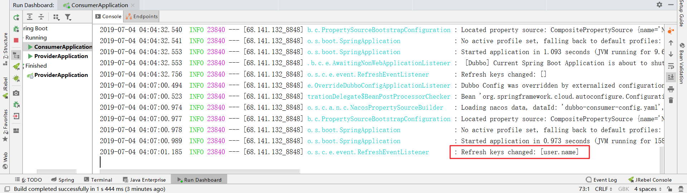

# 07-Dubbo 外部化配置


## 概述

由于我们已经使用了 Nacos Server 作为我们的注册中心，所以此处依然使用 Nacos Config 实现 Dubbo 的外部化配置

## 接入配置中心

### POM

我们以 `dubbo-consumer` 项目为例，修改 `pom.xml` ，引入 **Nacos Config Starter**

```xml
<dependency>
    <groupId>org.springframework.cloud</groupId>
    <artifactId>spring-cloud-starter-alibaba-nacos-config</artifactId>
</dependency>
```

### Controller

完成上述两步后，应用会从 Nacos Config 中获取相应的配置，并添加在 Spring Environment 的 PropertySources 中。这里我们使用 `@Value` 注解来将对应的配置注入到 `EchoController` 的 `username`字段，并添加 `@RefreshScope` 打开动态刷新功能

```java
package com.funtl.apache.dubbo.consumer.controller;

import com.funtl.apache.dubbo.provider.api.EchoService;
import org.apache.dubbo.config.annotation.Reference;
import org.springframework.beans.factory.annotation.Value;
import org.springframework.cloud.context.config.annotation.RefreshScope;
import org.springframework.web.bind.annotation.GetMapping;
import org.springframework.web.bind.annotation.PathVariable;
import org.springframework.web.bind.annotation.RestController;

@RefreshScope
@RestController
public class EchoController {
    
    @Reference(version = "1.0.0")
    private EchoService echoService;
    
    @Value("${user.name}")
    private String username;
    
    @GetMapping(value = "/echo/{string}")
    public String echo(@PathVariable String string) {
        return echoService.echo(string) + " " + username;
    }
    
}
```

### 使用控制台发布配置

> **注意：** Data ID 的默认扩展名为 `.properties` ，希望使用 YAML 配置，此处必须指明是 `.yaml`

```yaml
spring:
  application:
    name: dubbo-consumer
  main:
    allow-bean-definition-overriding: true

dubbo:
  scan:
    base-packages: com.funtl.apache.dubbo.consumer.controller
  protocol:
    name: dubbo
    port: -1
    serialization: kryo
  registry:
    address: nacos://192.168.141.132:8848

server:
  port: 8080

endpoints:
  dubbo:
    enabled: true
management:
  health:
    dubbo:
      status:
        defaults: memory
        extras: threadpool
  endpoints:
    web:
      exposure:
        include: "*"

user:
  name: "唯我成幸"
```

### 修改客户端配置

创建名为 `bootstrap.properties` 的配置文件并删除之前创建的 `application.yml` 配置文件

```properties
spring.application.name=dubbo-consumer-config
spring.cloud.nacos.config.server-addr=192.168.141.132:8848
spring.cloud.nacos.config.file-extension=yaml
```

通过浏览器访问 [http://localhost:8080/echo/hi](http://www.qfdmy.com/wp-content/themes/quanbaike/go.php?url=aHR0cDovL2xvY2FsaG9zdDo4MDgwL2VjaG8vaGk=) ，浏览器输出如下

```
Echo Hello Dubbo hi i am from port: -1 唯我成幸
```

### 动态刷新配置

在 Nacos Server 控制台修改配置文件，将 `user.name` 属性修改为 `桐须真冬`，此时观察控制台日志，你会发现我们已经成功刷新了配置



### 验证是否成功

通过浏览器访问 [http://localhost:8080/echo/hi](http://www.qfdmy.com/wp-content/themes/quanbaike/go.php?url=aHR0cDovL2xvY2FsaG9zdDo4MDgwL2VjaG8vaGk=) ，浏览器输出如下

```
Echo Hello Dubbo hi i am from port: -1 桐须真冬
```

> **提示：** 你可以使用 `spring.cloud.nacos.config.refresh.enabled=false` 来关闭动态刷新