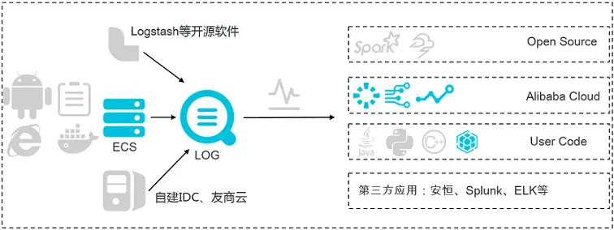
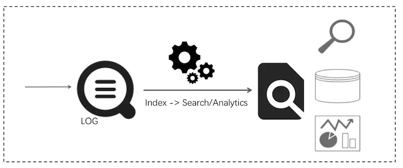
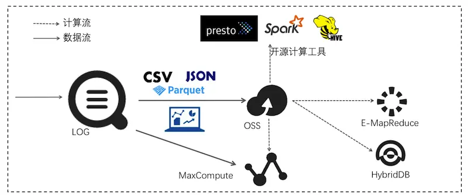

# 日志规范


> 打印日志是一门艺术，但长期被开发同学所忽视。日志就像车辆保险，没人愿意为保险付钱，但是一旦出了问题都又想有保险可用。我们打印日志的时候都很随意，可是用的时候会吐槽各种 SB 包括自己！写好每一条日志吧，与君共勉！


# 日志


## 日志是什么？


日志，维基百科的定义是记录服务器等电脑设备或软件的运作。

日志文件提供精确的系统记录，根据日志最终定位到错误详情和根源。日志的特点是，它描述一些离散的（不连续的）事件。 例如：应用通过一个滚动的文件输出 INFO 或 ERROR 信息，并通过日志收集系统，存储到一些存储引擎（Elasticsearch）中方便查询。


## 日志有什么用？

- 在上文中我们解释了日志的作用是提供精准的系统记录方便根因分析。那么具体在哪些具体方面它可以发挥作用？
- **打印调试**：即可以用日志来记录变量或者某一段逻辑。记录程序运行的流程，即程序运行了哪些代码，方便排查逻辑问题。
- **问题定位**：程序出异常或者出故障时快速的定位问题，方便后期解决问题。因为线上生产环境无法 debug，在测试环境去模拟一套生产环境，费时费力。所以依靠日志记录的信息定位问题，这点非常重要。还可以记录流量，后期可以通过 ELK（包括 EFK 进行流量统计）。
- **用户行为日志**：记录用户的操作行为，用于大数据分析，比如监控、风控、推荐等等。这种日志，一般是给其他团队分析使用，而且可能是多个团队，因此一般会有一定的格式要求，开发者应该按照这个格式来记录，便于其他团队的使用。当然，要记录哪些行为、操作，一般也是约定好的，因此，开发者主要是执行的角色。
- **根因分析（甩锅必备）**：即在关键地方记录日志。方便在和各个终端定位问题时，别人说时你的程序问题，你可以理直气壮的拿出你的日志说，看，我这里运行了，状态也是对的。这样，对方就会乖乖去定位他的代码，而不是互相推脱。


## 什么时候记录日志？

上文说了日志的重要性，那么什么时候需要记录日志。

- **系统初始化**：系统或者服务的启动参数。核心模块或者组件初始化过程中往往依赖一些关键配置，根据参数不同会提供不一样的服务。务必在这里记录 INFO 日志，打印出参数以及启动完成态服务表述。
- **编程语言提示异常**：如今各类主流的编程语言都包括异常机制，业务相关的流行框架有完整的异常模块。这类捕获的异常是系统告知开发人员需要加以关注的，是质量非常高的报错。应当适当记录日志，根据实际结合业务的情况使用 WARN 或者 ERROR 级别。
- **业务流程预期不符**：除开平台以及编程语言异常之外，项目代码中结果与期望不符时也是日志场景之一，简单来说所有流程分支都可以加入考虑。取决于开发人员判断能否容忍情形发生。常见的合适场景包括外部参数不正确，数据处理问题导致返回码不在合理范围内等等。
- **系统核心角色，组件关键动作**：系统中核心角色触发的业务动作是需要多加关注的，是衡量系统正常运行的重要指标，建议记录 INFO 级别日志，比如电商系统用户从登录到下单的整个流程；微服务各服务节点交互；核心数据表增删改；核心组件运行等等，如果日志频度高或者打印量特别大，可以提炼关键点 INFO 记录，其余酌情考虑 DEBUG 级别。
- **第三方服务远程调用**：微服务架构体系中有一个重要的点就是第三方永远不可信，对于第三方服务远程调用建议打印请求和响应的参数，方便在和各个终端定位问题，不会因为第三方服务日志的缺失变得手足无措。


# 日志打印


## Slf4j & Logback

Slf4j 英文全称为 “ Simple Logging Facade for Java ”，为 Java 提供的简单日志门面。Facade 门面，更底层一点说就是接口。它允许用户以自己的喜好，在工程中通过 Slf4j 接入不同的日志系统。

Logback 是 Slf4j 的原生实现框架，同样也是出自 Log4j 一个人之手，但拥有比 Log4j 更多的优点、特性和更做强的性能，Logback 相对于 Log4j 拥有更快的执行速度。基于我们先前在 Log4j 上的工作，Logback 重写了内部的实现，在某些特定的场景上面，甚至可以比之前的速度快上 10 倍。在保证 Logback 的组件更加快速的同时，同时所需的内存更加少。


## 日志文件

日志文件放置于固定的目录中，按照一定的模板进行命名，推荐的日志文件名称：

```
当前正在写入的日志文件名：<应用名>[-<功能名>].log
如：example-server-book-service-access.log
已经滚入历史的日志文件名：<应用名>[-<功能名>].yyyy-MM-dd-hh.[滚动号].log
```

如：example-server-book-service-access.2019-12-01-10.1.log


## 日志变量定义

推荐使用 lombok（代码生成器） 注解 @lombok.extern.slf4j.Slf4j 来生成日志变量实例。

```xml
<!-- https://mvnrepository.com/artifact/org.projectlombok/lombok -->
<dependency>
    <groupId>org.projectlombok</groupId>
    <artifactId>lombok</artifactId>
    <version>1.18.10</version>
    <scope>provided</scope>
</dependency>
```

代码示例

```java
import lombok.extern.slf4j.Slf4j;

@Slf4j
public class LogTest {

    public static void main(String[] args) {
        log.info("this is log test");
    }
    
}
```


## 日志配置

日志记录采用分级记录，级别与日志文件名相对应，不同级别的日志信息记录到不同的日志文件中。如有特殊格式日志，如 access log，单独使用一个文件，请注意避免重复打印（可使用 **additivity****="false"** 避免 ）。


## 参数占位格式

使用参数化形式 {} 占位，[] 进行参数隔离，这样的好处是可读性更高，而且只有真正准备打印的时候才会处理参数。

```java
// 正确示例，必须使用参数化信息的方式
log.debug("order is paying with userId:[{}] and orderId : [{}]",userId, orderId);
// 错误示例，不要进行字符串拼接,那样会产生很多 String 对象，占用空间，影响性能。及日志级别高于此级别也会进行字符串拼接逻辑。
log.debug("order is paying with userId: " + userId + " and orderId: " + orderId);
```


## 日志的基本格式


### 日志时间

作为日志产生的日期和时间，这个数据非常重要，一般精确到毫秒。

```
yyyy-MM-dd HH:mm:ss.SSS
```


### 日志级别

日志的输出都是分级别的，不同的设置不同的场合打印不同的日志。

主要使用如下的四个级别：

- DEBUG：DEUBG 级别的主要输出调试性质的内容，该级别日志主要用于在开发、测试阶段输出。该级别的日志应尽可能地详尽，开发人员可以将各类详细信息记录到 DEBUG 里，起到调试的作用，包括参数信息，调试细节信息，返回值信息等等，便于在开发、测试阶段出现问题或者异常时，对其进行分析。
- INFO：INFO 级别的主要记录系统关键信息，旨在保留系统正常工作期间关键运行指标，开发人员可以将初始化系统配置、业务状态变化信息，或者用户业务流程中的核心处理记录到INFO日志中，方便日常运维工作以及错误回溯时上下文场景复现。建议在项目完成后，在测试环境将日志级别调成 INFO，然后通过 INFO 级别的信息看看是否能了解这个应用的运用情况，如果出现问题后是否这些日志能否提供有用的排查问题的信息。
- WARN：WARN 级别的主要输出警告性质的内容，这些内容是可以预知且是有规划的，比如，某个方法入参为空或者该参数的值不满足运行该方法的条件时。在 WARN 级别的时应输出较为详尽的信息，以便于事后对日志进行分析。
- ERROR：ERROR 级别主要针对于一些不可预知的信息，诸如：错误、异常等，比如，在 catch 块中抓获的网络通信、数据库连接等异常，若异常对系统的整个流程影响不大，可以使用 WARN 级别日志输出。在输出 ERROR 级别的日志时，尽量多地输出方法入参数、方法执行过程中产生的对象等数据，在带有错误、异常对象的数据时，需要将该对象一并输出。


**DEBUG / INFO 的选择**

DEBUG 级别比 INFO 低，包含调试时更详细的了解系统运行状态的东西，比如变量的值等等，都可以输出到 DEBUG 日志里。 INFO 是在线日志默认的输出级别，反馈系统的当前状态给最终用户看的。输出的信息，应该对最终用户具有实际意义的。从功能角度上说，INFO 输出的信息可以看作是软件产品的一部分，所以需要谨慎对待，不可随便输出。如果这条日志会被频繁打印或者大部分时间对于纠错起不到作用，就应当考虑下调为 DEBUG 级别。

- 由于 DEBUG 日志打印量远大于 INFO，出于前文日志性能的考虑，如果代码为核心代码，执行频率非常高，务必推敲日志设计是否合理，是否需要下调为 DEBUG 级别日志。
- 注意日志的可读性，不妨在写完代码 review 这条日志是否通顺，能否提供真正有意义的信息。
- 日志输出是多线程公用的，如果有另外一个线程正在输出日志，上面的记录就会被打断，最终显示输出和预想的就会不一致。


**WARN / ERROR 的选择**

当方法或者功能处理过程中产生不符合预期结果或者有框架报错时可以考虑使用，常见问题处理方法包括：

- 增加判断处理逻辑，尝试本地解决：增加逻辑判断吞掉报警永远是最优选择抛出异常，交给上层逻辑解决
- 抛出异常，交给上层逻辑解决
- 记录日志，报警提醒
- 使用返回码包装错误做返回

一般来说，WARN 级别不会短信报警，ERROR 级别则会短信报警甚至电话报警，ERROR 级别的日志意味着系统中发生了非常严重的问题，必须有人马上处理，比如数据库不可用，系统的关键业务流程走不下去等等。错误的使用反而带来严重的后果，不区分问题的重要程度，只要有问题就error记录下来，其实这样是非常不负责任的，因为对于成熟的系统，都会有一套完整的报错机制，那这个错误信息什么时候需要发出来，很多都是依据单位时间内 ERROR 日志的数量来确定的。


**强调ERROR报警**

- ERROR 级别的日志打印通常伴随报警通知。ERROR的报出应该伴随着业务功能受损，即上面提到的系统中发生了非常严重的问题，必须有人马上处理。

ERROR日志目标

- 给处理者直接准确的信息：ERROR 信息形成自身闭环。

问题定位：

- 发生了什么问题，哪些功能受到影响
- 获取帮助信息：直接帮助信息或帮助信息的存储位置
- 通过报警知道解决方案或者找何人解决


### 线程名称

输出该日志的线程名称，一般在一个应用中一个同步请求由同一线程完成，输出线程名称可以在各个请求产生的日志中进行分类，便于分清当前请求上下文的日志。


### opentracing 标识

在分布式应用中，用户的一个请求会调用若干个服务完成，这些服务可能还是嵌套调用的，因此完成一个请求的日志并不在一个应用的日志文件，而是分散在不同服务器上不同应用节点的日志文件中。该标识是为了串联一个请求在整个系统中的调用日志。

- 唯一字符串（trace id）
- 调用层级（span id）

通过搜索 trace id 就可以查到这个 trace id 标识的请求在整个系统中流转（处理）过程中产生的所有日志。


### biz 标识

在业务开发中，我们的日志都是和业务相关联的，有时候是需要根据用户或者业务做聚类的，因此一次请求如果可以通过某项标识做聚类的时候，可以将聚类标识打印到日志中。

- 用户标识（user id）
- 业务标识（biz id）


### 日志记录器名称

日志记录器名称一般使用类名，日志文件中可以输出简单的类名即可，看实际情况是否需要使用包名和行号等信息。主要用于看到日志后到哪个类中去找这个日志输出，便于定位问题所在。


### 日志内容

禁用 System.out.println 和 System.err.println


变参替换日志拼接


输出日志的对象，应在其类中实现快速的 toString 方法，以便于在日志输出时仅输出这个对象类名和 hashCode


预防空指针:不要在日志中调用对象的方法获取值，除非确保该对象肯定不为 null，否则很有可能会因为日志的问题而导致应用产生空指针异常。


### 异常堆栈

异常堆栈一般会出现在 ERROR 或者 WARN 级别的日志中，异常堆栈含有方法调用链的系统，以及异常产生的根源。异常堆栈的日志属于上一行日志的，在日志收集时需要将其划至上一行中。


## 最佳实践


### 日志格式

```
2019-12-01 00:00:00.000|pid|log-level|[svc-name,trace-id,span-id,user-id,biz-id]|thread-name|package-name.class-name : log message
```

- 时间
- pid，pid
- log-level，日志级别
- svc-name，应用名称
- trace-id，调用链标识
- span-id，调用层级标识
- user-id，用户标识
- biz-id，业务标识
- thread-name，线程名称
- package-name.class-name，日志记录器名称
- log message，日志消息体


### 日志模块扩展

日志模块是基于以下技术点做扩展的。

- Slf4j MDC 实现原理（暂不开展详解，如有兴趣私下沟通）
- Opentracing Scope 原理（暂不开展详解，如有兴趣私下沟通）

在每个 tracing 链路中，将 Opentracing Scope 中的上下文信息放置 MDC 中，根据 Spring Boot Logging 扩展接口扩展的取值逻辑 **logging.pattern.level **的取值逻辑。

相关源码参考

[Spring Cloud Sleuth](https://juejin.im/post/[https://github.com/spring-cloud/spring-cloud-sleuth/blob/master/spring-cloud-sleuth-core/src/main/java/org/springframework/cloud/sleuth/autoconfig/TraceEnvironmentPostProcessor.java](https://github.com/spring-cloud/spring-cloud-sleuth/blob/master/spring-cloud-sleuth-core/src/main/java/org/springframework/cloud/sleuth/autoconfig/TraceEnvironmentPostProcessor.java))

[Spring Cloud Sleuth][github.com/spring-clou…](https://github.com/spring-cloud/spring-cloud-sleuth/blob/master/spring-cloud-sleuth-core/src/main/java/org/springframework/cloud/sleuth/log/Slf4jCurrentTraceContext.java)

修改 logback 配置文件中每个 appender 的 pattern 为以下默认值即可实现标准化。

```
%d{${LOG_DATEFORMAT_PATTERN:-yyyy-MM-dd HH:mm:ss.SSS}}|${PID:- }|%level|${LOG_LEVEL_PATTERN:-%5p}|%t|%-40.40logger{39}: %msg%n
```

logback.xml 节选

```xml
<configuration>
<property name="LOG_PATH"
          value="${LOG_PATH:-${LOG_TEMP:-${java.io.tmpdir:-/tmp}}}"/>

<springProperty scope="context" name="APP_NAME"
                source="spring.application.name" defaultValue="spring-boot-fusion"/>
<!-- 全局统一 pattern -->
<property name="LOG_PATTERN"
          value="%d{${LOG_DATEFORMAT_PATTERN:-yyyy-MM-dd HH:mm:ss.SSS}}|${PID:- }|%level|${LOG_LEVEL_PATTERN:-%5p}|%t|%-40.40logger{39}: %msg%n"/>
<!-- 输出模式 file,滚动记录文件，先将日志文件指定到文件，当符合某个条件时，将日志记录到其他文件 -->
<appender name="fileInfo" class="ch.qos.logback.core.rolling.RollingFileAppender">
    <!--被写入的文件名，可以是相对目录，也可以是绝对目录，如果上级目录不存在会自动创建，没有默认值。-->
    <file>${LOG_PATH}/${APP_NAME}-info.log</file>
    <!--滚动策略  基于时间的分包策略 -->
    <rollingPolicy class="ch.qos.logback.core.rolling.SizeAndTimeBasedRollingPolicy">
        <!-- yyyy-MM-dd 时间策略则为一天一个文件 -->
        <FileNamePattern>${LOG_PATH}/${APP_NAME}-info.%d{yyyy-MM-dd-HH}.%i.log</FileNamePattern>
        <!--日志文件保留小时数-->
        <MaxHistory>48</MaxHistory>
        <maxFileSize>1GB</maxFileSize>
        <totalSizeCap>20GB</totalSizeCap>
    </rollingPolicy>
    <!--  layout 负责把事件转换成字符串，格式化的日志信息的输出 -->
    <layout class="ch.qos.logback.classic.PatternLayout">
        <pattern>${LOG_PATTERN}</pattern>
    </layout>
    <!--级别过滤器，根据日志级别进行过滤。如果日志级别等于配置级别，过滤器会根据onMath 和 onMismatch接收或拒绝日志-->
    <filter class="ch.qos.logback.classic.filter.LevelFilter">
        <!--设置过滤级别-->
        <level>INFO</level>
        <!--用于配置符合过滤条件的操作-->
        <onMatch>ACCEPT</onMatch>
        <!--用于配置不符合过滤条件的操作-->
        <onMismatch>DENY</onMismatch>
    </filter>
</appender>
</configuration>
```

代码使用示例：

```java
@Override
public Result<PagingObject<SimpleResponse>> page(@RequestParam(value = "page-num", defaultValue = "1") int pageNum,
                                                 @RequestParam(value = "page-size", defaultValue = "10") int pageSize) {
    LogStandardUtils.putUserId("userId123");
    LogStandardUtils.putBizId("bizId321");
    producerService.sendMsg("xxx");
    simpleClient.page(pageNum, pageSize);
    return new Result<>(simpleService.page(pageNum, pageSize));
}
```

日志记录

```
2019-12-04 16:29:08.223|43546|INFO|[example-server-book-service,ac613cff04bac8b1,4a9adc10fdf0eb5,userId123,bizId321]|XNIO-1 task-4|c.n.u.concurrent.ShutdownEnabledTimer   : Shutdown hook installed for: NFLoadBalancer-PingTimer-example-server-order-service
2019-12-04 16:29:08.224|43546|INFO|[example-server-book-service,ac613cff04bac8b1,4a9adc10fdf0eb5,userId123,bizId321]|XNIO-1 task-4|c.netflix.loadbalancer.BaseLoadBalancer : Client: example-server-order-service instantiated a LoadBalancer: DynamicServerListLoadBalancer:{NFLoadBalancer:name=example-server-order-service,current list of Servers=[],Load balancer stats=Zone stats: {},Server stats: []}ServerList:null
2019-12-04 16:29:08.234|43546|INFO|[example-server-book-service,ac613cff04bac8b1,4a9adc10fdf0eb5,userId123,bizId321]|XNIO-1 task-4|c.n.l.DynamicServerListLoadBalancer     : Using serverListUpdater PollingServerListUpdater
2019-12-04 16:29:08.247|43546|INFO|[example-server-book-service,ac613cff04bac8b1,4a9adc10fdf0eb5,userId123,bizId321]|XNIO-1 task-4|c.n.l.DynamicServerListLoadBalancer     : DynamicServerListLoadBalancer for client example-server-order-service initialized: DynamicServerListLoadBalancer:{NFLoadBalancer:name=example-server-order-service,current list of Servers=[],Load balancer stats=Zone stats: {},Server stats: []}ServerList:ConsulServerList{serviceId='example-server-order-service', tag=null}
2019-12-04 16:29:08.329|43546|WARN|[example-server-book-service,ac613cff04bac8b1,4a9adc10fdf0eb5,userId123,bizId321]|XNIO-1 task-4|c.p.f.l.ctl.common.rule.StrategyRule    : No up servers available from load balancer: DynamicServerListLoadBalancer:{NFLoadBalancer:name=example-server-order-service,current list of Servers=[],Load balancer stats=Zone stats: {},Server stats: []}ServerList:ConsulServerList{serviceId='example-server-order-service', tag=null}
2019-12-04 16:29:08.334|43546|WARN|[example-server-book-service,ac613cff04bac8b1,4a9adc10fdf0eb5,userId123,bizId321]|XNIO-1 task-4|c.p.f.l.ctl.common.rule.StrategyRule    : No up servers available from load balancer: DynamicServerListLoadBalancer:{NFLoadBalancer:name=example-server-order-service,current list of Servers=[],Load balancer stats=Zone stats: {},Server stats: []}ServerList:ConsulServerList{serviceId='example-server-order-service', tag=null}
2019-12-04 16:29:08.342|43546|ERROR|[example-server-book-service,ac613cff04bac8b1,4a9adc10fdf0eb5,userId123,bizId321]|XNIO-1 task-4|c.p.f.w.c.advice.ExceptionHandlerAdvice : 当前程序进入到异常捕获器，出错的 url 为：[ http://127.0.0.1:10011/simples ]，出错的参数为：[ {"querystring":"{}","payload":""} ]
java.lang.RuntimeException: com.netflix.client.ClientException: Load balancer does not have available server for client: example-server-order-service
```


# 日志服务


## SLS日志服务

日志服务（简称 SLS）是针对日志类数据的一站式服务，在阿里巴巴集团经历大量大数据场景锤炼而成。您无需开发就能快捷完成日志数据采集、消费、投递以及查询分析等功能，提升运维、运营效率，建立 DT 时代海量日志处理能力。


### project

> 项目、管理日志基础单元，服务日志建议一个环境建为一个 Project，这样日志记录是整体一个闭环，日志记录随整个环境内的服务调用产生。


### logstore

> 日志库，日志库建议按照日志类型分为不同的，如特定格式的 access 日志，以及 info / warn / error 日志，特定格式可以配置更为方面的索引以及告警设置。

注意：请勿按照应用服务区分为不同的 logstore，在微服务架构中，一次请求交叉了多个应用服务，日志是散落在各个应用服务中的，按照服务区分 logstore，需要开发同学十分了解应用运行状况和调用拓扑图，这点往往是不具备的。


### 实时采集与消费

功能：

- 通过ECS、容器、移动端、开源软件、JS等接入实时日志数据（例如Metric、Event、BinLog、TextLog、Click等）。
- 提供实时消费接口，与实时计算及服务对接。

用途：数据清洗（ETL）、流计算（Stream Compute）、监控与报警、 机器学习与迭代计算。





### 查询分析

实时索引、查询分析数据。

- 查询：关键词、模糊、上下文、范围。
- 统计：SQL聚合等丰富查询手段。
- 可视化：Dashboard + 报表功能。
- 对接：Grafana、JDBC/SQL92。

用途：DevOps / 线上运维，日志实时数据分析，安全诊断与分析，运营与客服系统。





### 消费投递

稳定可靠的日志投递。将日志中枢数据投递至存储类服务进行存储。支持压缩、自定义Partition、以及行列等各种存储方式。

用途：数据仓库 + 数据分析、审计、推荐系统与用户画像。





### 告警

日志服务的告警功能基于仪表盘中的查询图表实现。在日志服务控制台**查询页面**或**仪表盘页面**设置告警规则，并指定告警规则的配置、检查条件和通知方式。[设置告警](https://help.aliyun.com/document_detail/48162.html)后，日志服务定期对仪表盘的查询结果进行检查，检查结果满足预设条件时发送告警通知，实现实时的服务状态监控。


### 最佳实践

日志服务功能相当强大，想用好日志服务可以参看：

[help.aliyun.com/document_de…](https://help.aliyun.com/document_detail/29090.html?spm=a2c4g.11186623.6.1079.4edd3aabvs50OW)


## ELK 通用日志解决方案

ELK 是 Elasticsearch、Logstash、Kibana 三大开源框架首字母大写简称。市面上也被成为 Elastic Stack。其中 Elasticsearch 是一个基于 Lucene、分布式、通过 Restful 方式进行交互的近实时搜索平台框架。像类似百度、谷歌这种大数据全文搜索引擎的场景都可以使用 Elasticsearch 作为底层支持框架，可见 Elasticsearch 提供的搜索能力确实强大，市面上很多时候我们简称 Elasticsearch 为 es。Logstash 是 ELK 的中央数据流引擎，用于从不同目标（文件/数据存储/MQ）收集的不同格式数据，经过过滤后支持输出到不同目的地（文件/ MQ / Redis / Elasticsearch / Kafka 等）。Kibana 可以将 Elasticsearch 的数据通过友好的页面展示出来，提供实时分析的功能。


# 实践说明


## 普通格式日志

```
2019-11-26 15:01:03.332|1543|INFO|[example-server-book-service,28f019d57b8336ab,630697c7f34ca4fa,105,45982043|XNIO-1 task-42]|c.p.f.w.pay.PayServiceImpl     : order is paying with userId: 105 and orderId: 45982043
```

普通日志前缀是固定的，可以固定分词索引，方便更快的查询分析。


## 特定格式日志

以 access 日志为例

```
2019-11-26 15:01:03.332|1543|INFO|[example-server-book-service,28f019d57b8336ab,630697c7f34ca4fa,105,45982043|XNIO-1 task-42]|c.p.f.w.logging.AccessLoggingFilter     : 
> url: http://liweichao.com:10011/actuator/health
> http-method: GET
> request-header: [Accept:"text/plain, text/*, */*", Connection:"close", User-Agent:"Consul Health Check", Host:"liweichao.com:10011", Accept-Encoding:"gzip"]
> request-time: 2019-11-26 15:01:03.309
> querystring: -
> payload: -
> extra-param: -

< response-time: 2019-11-26 15:01:03.332
< take-time: 23
< http-status: 200
< response-header: [content-type:"application/vnd.spring-boot.actuator.v2+json;charset=UTF-8", content-size:"15"]
< response-data: {"status":"UP"}
```

特定格式日志可按格式创建索引更方便聚焦查询分析和告警，如根据 take-time，http-status，biz-code 等值。


# 参考文献

- [ Java日志记录最佳实践 ]([www.jianshu.com/p/546e9aace…](https://www.jianshu.com/p/546e9aace657)
- [ 别在 Java 代码里乱打日志了，这才是打印日志的正确姿势！ ]([mp.weixin.qq.com/s/hJvkRlt9x…](https://mp.weixin.qq.com/s/hJvkRlt9xQbWhYy1G7ZDsw)
- [ 日志服务 ]([help.aliyun.com/product/289…](https://help.aliyun.com/product/28958.html?spm=a2c4g.11186623.3.1.7cfd735dv8i1pB)
- [ Spring Boot Logging ]([docs.spring.io/spring-boot…](https://docs.spring.io/spring-boot/docs/2.2.1.RELEASE/reference/html/spring-boot-features.html#boot-features-logging)
- [ Spring Cloud Sleuth ]([github.com/spring-clou…](https://github.com/spring-cloud/spring-cloud-sleuth)
- [ Opentracing ]([github.com/opentracing](https://github.com/opentracing)


# 作者说明

来自读者投稿，有好的文章欢迎联系我微信 jihuan900