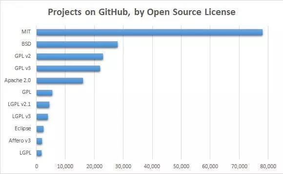
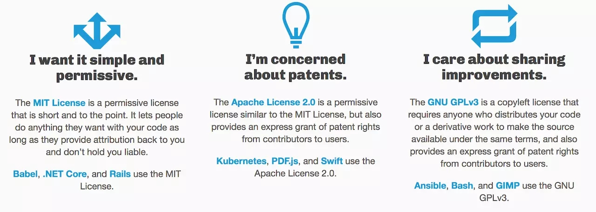
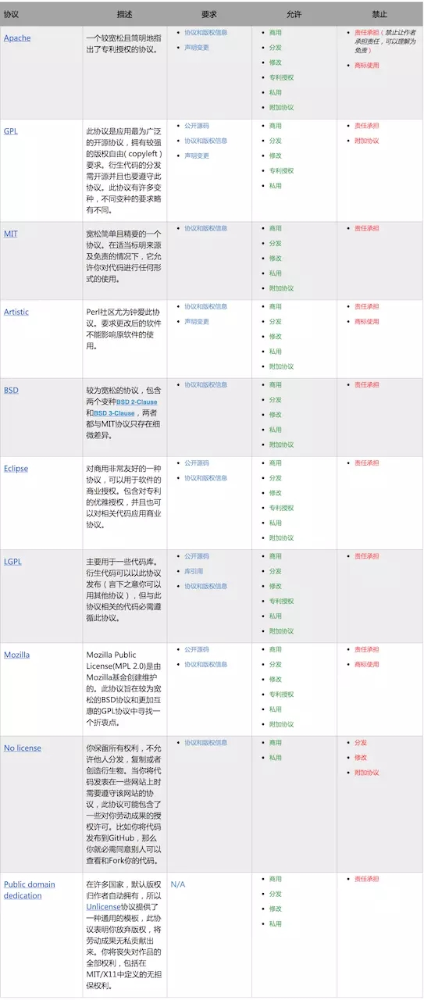
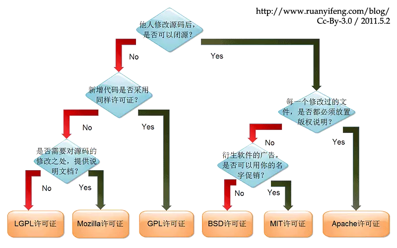

# 01-简话开源协议


[TOC]

一直对 Github 的开源协议没有明确认识，直到有一天，也想搞个开源项目。随之而来的问题是：如何选择，如何在这个到处撕比的时代用武器维护劳动成果？


# 一、了解协议

在浏览器端进行 Ajax 请求时会出现跨域问题，那么什么是跨域，如何解决跨域呢？先看浏览器端出现跨域问题的现象，如下图所示


跨域，指的是浏览器不能执行其他网站的脚本。它是由浏览器的同源策略造成的，是浏览器对 JavaScript 施加的安全限制。

## 什么是同源？

所谓同源是指，域名，协议，端口均相同

- http://www.funtl.com --> http://admin.funtl.com 跨域
- http://www.funtl.com --> http://www.funtl.com 非跨域
- http://www.funtl.com --> http://www.funtl.com:8080 跨域
- http://www.funtl.com --> https://www.funtl.com 跨域

## 如何解决跨域问题？

### 使用 CORS（跨资源共享）解决跨域问题

CORS 是一个 W3C 标准，全称是"跨域资源共享"（Cross-origin resource sharing）。它允许浏览器向跨源服务器，发出 XMLHttpRequest 请求，从而克服了 AJAX 只能同源使用的限制。

CORS 需要浏览器和服务器同时支持。目前，所有浏览器都支持该功能，IE 浏览器不能低于 IE10。整个 CORS 通信过程，都是浏览器自动完成，不需要用户参与。对于开发者来说，CORS 通信与同源的 AJAX 通信没有差别，代码完全一样。浏览器一旦发现 AJAX 请求跨源，就会自动添加一些附加的头信息，有时还会多出一次附加的请求，但用户不会有感觉。因此，实现 CORS 通信的关键是服务器。只要服务器实现了 CORS 接口，就可以跨源通信（在 `header` 中设置：`Access-Control-Allow-Origin`）

### 使用 JSONP 解决跨域问题

JSONP（JSON with Padding）是 JSON 的一种“使用模式”，可用于解决主流浏览器的跨域数据访问的问题。由于同源策略，一般来说位于 `server1.example.com` 的网页无法与 `server2.example.com` 的服务器沟通，而 HTML 的 `<script>` 元素是一个例外。利用 `<script>` 元素的这个开放策略，网页可以得到从其他来源动态产生的 JSON 资料，而这种使用模式就是所谓的 JSONP。用 JSONP 抓到的资料并不是 JSON，而是任意的 JavaScript，用 JavaScript 直译器执行而不是用 JSON 解析器解析（需要目标服务器配合一个 `callback` 函数）。

### CORS 与 JSONP 的比较

CORS 与 JSONP 的使用目的相同，但是比 JSONP 更强大。

JSONP 只支持 GET 请求，CORS 支持所有类型的 HTTP 请求。JSONP 的优势在于支持老式浏览器，以及可以向不支持 CORS 的网站请求数据。

### 使用 Nginx 反向代理解决跨域问题

以上跨域问题解决方案都需要服务器支持，当服务器无法设置 `header` 或提供 `callback` 时我们就可以采用 Nginx 反向代理的方式解决跨域问题。

Nginx 配置跨域案例，在 `nginx.conf` 的 `location` 中增加如下配置：

```
add_header Access-Control-Allow-Origin *或域名;
add_header Access-Control-Allow-Headers X-Requested-With;
add_header Access-Control-Allow-Methods GET,POST,OPTIONS;
```

如：

```
user  nginx;
worker_processes  1;

events {
    worker_connections  1024;
}

http {
    include       mime.types;
    default_type  application/octet-stream;

    sendfile        on;

    keepalive_timeout  65;

    server {
        listen 80;
        server_name 192.168.75.128;
        location / {
            add_header Access-Control-Allow-Origin *;
            add_header Access-Control-Allow-Headers X-Requested-With;
            add_header Access-Control-Allow-Methods GET,POST,OPTIONS;

            root /usr/share/nginx/wwwroot/cdn;
            index index.jsp index.html index.htm;
        }
    }
}
```


# 一、了解协议

作为第一步，我们首先需要知道什么是协议。协议的英文：`License` 是软件的授权许可，软件版权属于知识产权的著作权范畴，具有知识产权的特征，即时间性，专有性和地域性。

> 什么鬼东西，通俗的告诉我就行！

`License` 表述了你获得代码后拥有的权利，可以对别人的作品进行哪些操作，哪些操作又是被禁止的。软件协议一般分为开源协议和商业协议，这节，我们的重点是开源协议。


# 二、协议的重要性

按照小学语文的逻辑，我们要先了解一下重要性，从而提升大家的阅读兴趣。既然已经知道了协议的存在，那么协议为何如此重要呢？举几个通俗易懂的例子：

1.你使用别人代码的时候，发现里面写了 MIT，贸然地使用会不会侵权？你不知道！
2.对开源代码修改了，有哪些限制？你不知道！
3.偷着抄袭了别人的博客，却被 CC 协议吓了一跳。
4.博客底下的 Copyrights © 2018 Jartto. All Rights Reserved. 是什么意思？
5.我的开源项目，别人修改之后，拿去贩卖，我该如何保留自己的权利？你不知道！
6.如果作者在代码中下毒，你用的好好的，突然收到了法院的传票，你不知道！

> 是不是有点慌了，啥也没干，咋就侵权了呢？啥也没干，还被别人给利用了！

# 三、协议分类

协议太宽松会导致作者丧失对作品的很多权利，太严格又不便于使用者使用及作品的传播。所以除了协议多之外，你还要考虑你对作品想保留哪些权利，放开哪些限制。

>  开源协议有成千上万种，如何来选择重点呢？



> 这就是所谓的捷径，我们可以先从 Github 上最火的开源协议入手。

话不多说，我们开始吧，先来看看下面这三种常用协议吧：




#### 1.`MIT`(简单宽松的协议)

> 如果你只想要一个简单点的协议不想太麻烦的话。

[`MIT`](https://choosealicense.com/licenses/mit/) 协议相对宽松但还是抓住了要点的。此协议允许别人以任何方式使用你的代码同时署名原作者，但原作者不承担代码使用后的风险，当然也没有技术支持的义务。`jQuery` 和 `Rails` 就是 `MIT`协议。

#### 2.`Apache`(考虑有专利的情况)

>  如果你的作品中涉及到专利相关。

[`Apache`](https://choosealicense.com/licenses/apache-2.0/) 协议也是个相对宽松与 `MIT` 类似的协议，但它简单指明了作品归属者对用户专利上的一些授权。`Apache`服务器，`SVN` 还有 `NuGet` 等是使用的 `Apache` 协议。

#### 3.`GNU GPLv2` (代码分享与促进)

> 如果你在乎作品的传播和别人的修改，希望别人也以相同的协议分享出来。

[`GNU GPL`](https://choosealicense.com/licenses/gpl-2.0/)（V2或V3）是一种版本自由的协议（可以参照`copyright` 来理解，后者是版本保留，那 `copyleft` 便是版权自由，或者无版权，但无版权不代表你可以不遵守软件中声明的协议）。此协议要求代码分发者或者以此代码为基础开发出来的衍生作品需要以同样的协议来发布。

>  copyright 和 copyleft 下文会有[详细说明](http://jartto.wang/2018/06/29/talk-about-license/)。

#### 4.`LGPL` (GNU Lesser General Public License)

>  鉴于 `GPL` 是如此的隔绝商业, 就出现了一个宽松版的 `GPL` 即 `LGPL`

但 `LGPL` 其实只是 `GPL` 的一个为主要为类库使用设计的开源协议，`LGPL`允许商业软件通过类库引用方式使用`LGPL`类库而不需要开源商业软件的代码。

`GPL/LGPL` 都保障原作者的知识产权，避免有人利用开源代码复制并开发类似的产品，`Hibernate`就采用了该协议。

#### 5.`BSD` (Berkeley Software Distribution)

> [`BSD`](https://www.jianshu.com/p/5b2372fec71b) 开源协议是一个给于使用者很大自由的协议, 基本上使用者可以「为所欲为」, 因此是对商业集成很友好的协议。

但「为所欲为」的前提当你发布使用了 `BSD` 协议的代码时, 需要满足这三个条件：

- 如果在发布的产品中包含源代码, 则在源代码中必须带有原来代码中的 `BSD` 协议
- 如果在发布的只是二进制类库/软件, 则需要在类库/软件的文档和版权声明中包含原来代码中的 `BSD` 协议
- 不可以用开源代码的作者/机构名字和原来产品的名字做市场推广

采用 `BSD`协议的软件如：`nginx`

####  6.`CC`（Creative Commons） 协议
上面各协议只是针对软件或代码作品，如果你的作品不是代码，比如视频，音乐，图片，文章等，共享于公众之前，也最好声明一下协议以保证自己的权益不被侵犯。

针对非代码的数字作品的协议，最通用的莫过于 [`Creative Commons`](https://baike.baidu.com/item/creative commons/8755425?fr=aladdin) (也是你经常在别人博客下面可以看到的 `CC` 协议)协议。

> 所以现在你见到别人博客文章下面的签名就不会感到陌生了，数字作品的协议嘛。

还有更多相关协议，这里就不一一列举了，可以看看下面这张图(感谢[作者](https://www.cnblogs.com/Wayou/p/how_to_choose_a_license.html)的整理)，非常详细：



关于 `MIT`，`Apache`，`GNU GPL` 协议更多细节，可以看这里：[Choose an open source license](https://choosealicense.com/)。


# 四、快速选择

那我们该如何选择呢？看看[阮一峰老师](http://www.ruanyifeng.com/blog/2011/05/how_to_choose_free_software_licenses.html)的这张图片，简洁易懂：



# 五、为 Github 项目添加协议

在 `Github` 中添加协议很容易，主要分为四步：
1.进入你的代码仓库，点击 `Create new file`；
2.这时 `Github` 的新页面上，有一个空格让你填入文件名称。在输入框输入文件名 `LICENSE`, 然后点击右侧 `Choose a license template`；
3.出现一系列协议可供选择，选择自己想要的即可；
4.点击 `Commit new file`，这时你添加的开源协议就在代码仓库的菜单中了。

如果还不清楚，请查看图文：[如何为 Github 已有仓库添加协议](https://link.juejin.im/?target=https%3A%2F%2Fwww.cnblogs.com%2Fgwca%2Fp%2F8341198.html)。

# 六、关于默认协议

那么问题来了，很多情况下我们都忽略了协议的重要性。试想一下，如果你无意或者有意增加协议，那么又该如何算呢？

You’re under no obligation to choose a license. It’s your right not to include one with your code or project, but please be aware of the implications. Generally speaking, the absence of a license means that the default copyright laws apply. This means that you retain all rights to your source code and that nobody else may reproduce, distribute, or create derivative works from your work. This might not be what you intend.

Even if this is what you intend, if you publish your source code in a public repository on GitHub, you have accepted the Terms of Service which do allow other GitHub users some rights. Specifically, you allow others to view and fork your repository

By setting your repositories to be viewed publicly, you agree to allow others to view and fork your repositories

# 七、有趣的 WTFPL 协议

之前同事聊天的时候，有人提到过这个，觉得很有意思，翻阅 [`wiki`](https://link.juejin.im/?target=https%3A%2F%2Fen.wikipedia.org%2Fwiki%2FWTFPL) 得到如下解释：
The WTFPL (Do What the Fuck You Want To Public License) is a permissive license most commonly used as a free software license. As a public domain like license, the WTFPL is essentially the same as dedication to the public domain.[1] It allows redistribution and modification of the software under any terms. As of May 2016, the WTFPL was used by less than one percent of open-source software projects.

Do What the Fuck You Want To Public License：你 TM 想干嘛就干嘛公共许可证。

这是一种比较极端的自由软件许可证。也就意味着等同于贡献到公有领域，该许可证已被自由软件基金会认证为兼容 `GPL` 的自由软件许可证。

# 八、Copyright 和 Copyleft

`Copyright`（著作权）很常见，我们的网站底部一般都会有它，意思是保留所有权利。而 `Copyleft`（[著佐权](https://link.juejin.im/?target=http%3A%2F%2Fwww.gnu.org%2Fcopyleft%2F)）是一个由自由软件运动所发展的概念，是一种利用现有著作权体制来挑战该体制的授权方式。

Copyleft 是一种让程序或其它作品保持自由（是言论自由的自由，而不是“零价格”）的通用方法，并要求对 Copyleft 程序的任何修改和扩展都保持自由。

`Copyleft` 是一种对程序进行版权保护的方法。它并不是放弃版权，因为这样会使 `Copyleft` 变得不可操作。`Copyleft` 中的 `left`，并不使用它在英语中「保留」的意思，而是指它（left，左）与通常的版权( `Copyright` )中的 `right`（右）具有镜像的关系。

践行 `Copyleft` 最常见的的协议有 `GPL`。即如果你使用了这份开源代码，要求使用者改作后的衍生作品必须要以同等的授权方式释出以回馈社会。这意味着，如果是商业软件使用这样的开源代码并改动，商业价值有可能会下降。而 `Copyleft` 也是很多开源协议的标志性特点。

详细内容请查看：1.[什么是 Copyleft？](https://link.juejin.im/?target=http%3A%2F%2Fwww.gnu.org%2Fcopyleft%2F) 2.[WTFPL](https://link.juejin.im/?target=https%3A%2F%2Fblog.csdn.net%2Ftestcs_dn%2Farticle%2Fdetails%2F51099415)

# 九、总结

文章中整理了比较热门的开源协议，当然开源协议远远多于此。感兴趣的话，可以去深入学习，这里就不赘述了。而我们的目的就是了解它们，做一个文明的 `Coder` ，而不是流氓。不论代码或非代码作品，都凝聚了作者的心血，请尊重他们。


# 原文链接

[原文链接：jartto.wang](http://jartto.wang/2018/06/29/talk-about-license/)