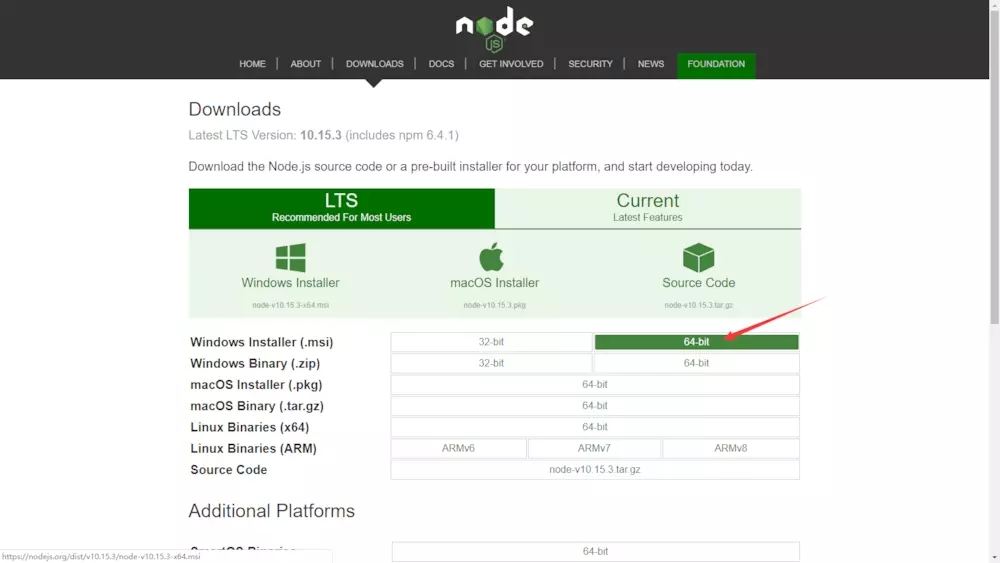
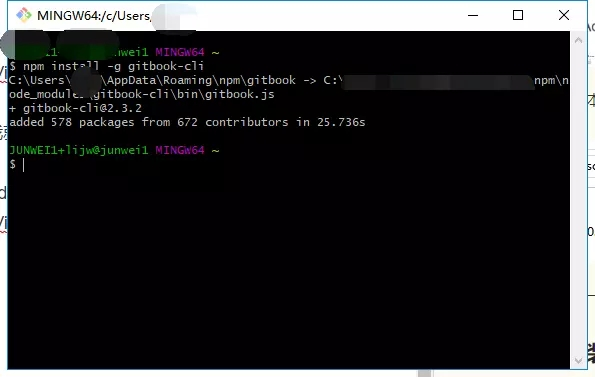
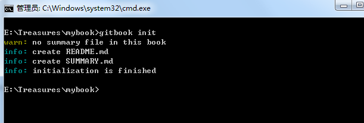
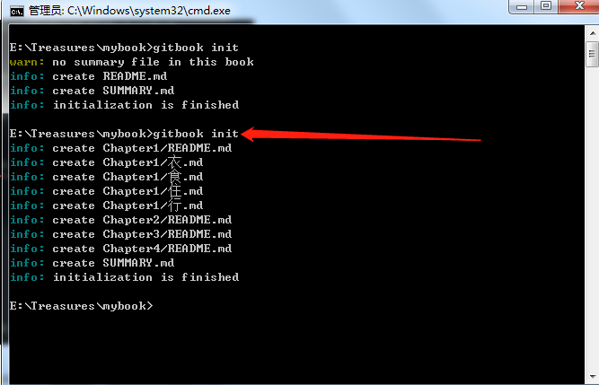
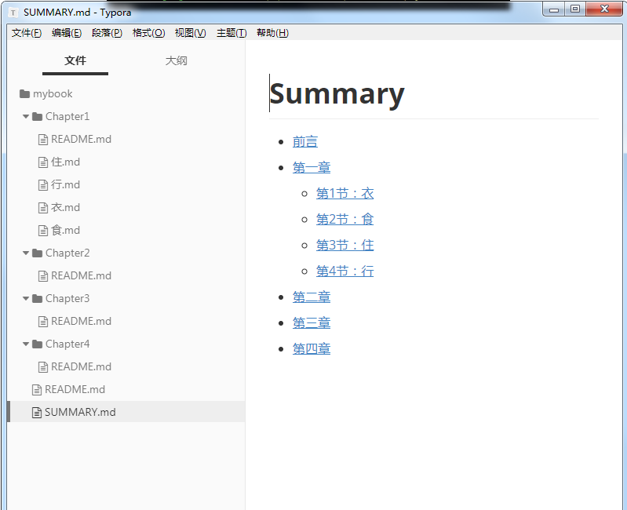
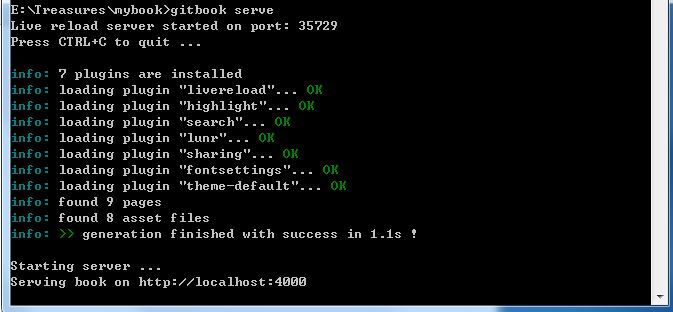
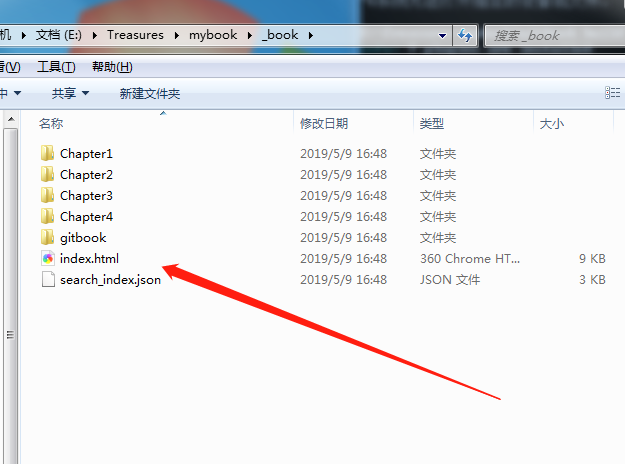
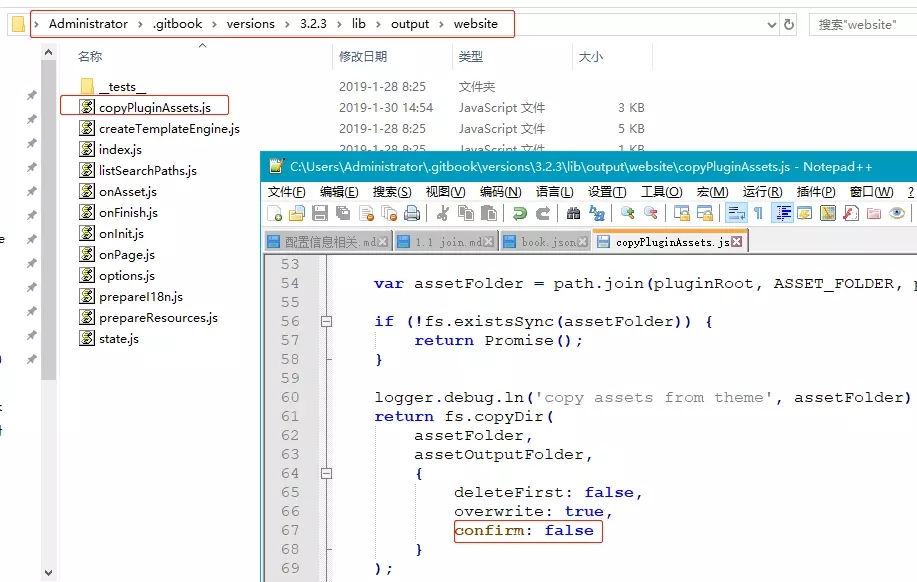
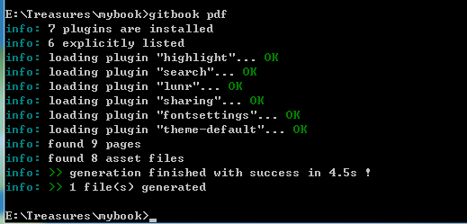
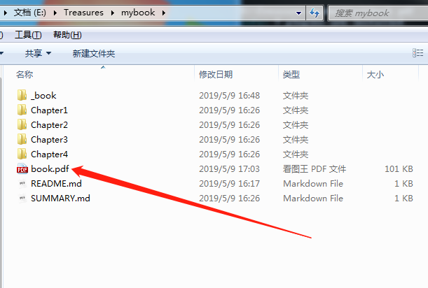

# 05-使用Gitbook+Markdown编写电子文档

## 前言

最近工作不是太忙，就想着把脑子中的一些想法形成文档沉淀下来。之前已经在学*Markdown*了，写文档真的是非常爽，所以这次也是用Markdown来写的。我的电脑是Windows系统，所以编写Markdown我就使用了`Typora`。写一些篇章比较短的文章还好，但是当篇章过长，标题目录过多的时候，就会导致阅读效果很差。为了提升更好的体验效果，我下一步就需要考虑使用`Gitbook`的方式来编写管理文章了。


## GitBook是什么

在我认识 GitBook 之前，我已经在使用 Git 了，毋容置疑，Git 是目前世界上最先进的分布式版本控制系统。

我认为 Git 不仅是程序员管理代码的工具，它的分布式协作方式同样适用于很多场合，其中一个就是写作（这会是一个引起社会变革的伟大的工具！）。所以在我发现 GitBook 之前，实际上我已经无数次想象过它的使用场景了。

咋一看 GitBook 的名字，你可能会认为它是关于 Git 的一本书。而当你有所了解之后，你也许会认为它是一个使用 Git 构建电子书的工具。其实不然，GitBook 与 Git 的关系，就像雷锋塔和雷锋那样，没有一点关系！


实际上，GitBook 是一个基于 Node.js 的命令行工具，支持 Markdown 和 AsciiDoc 两种语法格式，可以输出 HTML、PDF、eBook 等格式的电子书。所以我更喜欢把 GitBook 定义为文档格式转换工具。
　　
所以，GitBook 不是 Markdown 编辑工具，也不是 Git 版本管理工具。市面上我们可以找到很多 Markdown 编辑器，比如 Typora、MacDown、Bear、MarkdownPad、MarkdownX、JetBrains’s IDE（需要安装插件）、Atom、简书、CSDN 以及 GitBook 自家的 GitBook Editor 等等。


但 GitBook 又与 Markdown 和 Git 息息相关，因为只有将它们结合起来使用，才能将它们的威力发挥到极致！因此，通常我们会选择合适的 Markdown 编辑工具以获得飞一般的写作体验；使用 GitBook 管理文档，预览、制作电子书；同时通过 Git 管理书籍内容的变更，并将其托管到云端（比如 GitHub、GitLab、码云，或者是自己搭建的 Git 服务器），实现多人协作。

实际上，GitBook Editor 对于新手来说是个不错的选择，它集成了 GitBook、Git、Markdown 等功能，还支持将书籍同步到 gitbook.com 网站，使我们可以很方便地编辑和管理书籍。但是不幸的是，GitBook Editor 的注册和登录需要翻墙，即便注册成功了也可能登录不上，似乎是因为网站最近在升级。因此，我推荐，也是我目前使用的搭配是 `GitBook + Typora + Git`。


##  为什么要使用GitBook？
通常，我们最开始学习和使用的办公软件就是 Word、Excel 和 PowerPoint。这里不是说它们已经过时了，不是说 GitBook 能够替代它们。

相反，Microsoft 的办公软件很优秀并且经受了时间的考验，但是正因为它功能丰富，导致稍显臃肿（二八定律：80%的时间里我们只会只用20%的功能），同时因为它存在以二进制格式保存、软件不兼容、格式不兼容、难以进行版本控制、难以实时分享预览、难以多人协作等短板。而这恰恰是 GitBook + Markdown + Git 的长处。

简单来说，GitBook + Markdown + Git 带来的好处有：

> * 语法简单
> * 兼容性强
> * 导出方便
> * 专注内容
> * 团队协作

所以，如果你和我一样，不满足于传统的写作方式，正在寻找一种令人愉悦的写作方式，那么该尝试使用 GitBook 啦！


## 搭建GitBook 环境

### 下载安装Typora 和 git 工具

首先需要在电脑上安装 Typora（一个很棒的支持 macOS、Windows、Linux 的 Markdown 编辑工具）和 Git 版本管理工具。下载链接在下面：

- Typora 下载地址：[https://typora.io/](https://typora.io/) 
- Git 下载地址：[https://git-scm.com/downloads](https://git-scm.com/downloads) 

### 安装nodejs

因为 GitBook 是基于 Node.js，所以我们首先需要安装 Node.js（下载地址：[https://nodejs.org/en/download/](https://nodejs.org/en/download/），找到对应平台的版本安装即可。



因为我的系统版本是 win10 64位，那么我就下载这个版本来进行安装。


安装步骤只要下一步安装即可。

### 使用npm安装gitbook

现在安装 Node.js 都会默认安装 npm（node 包管理工具），所以我们不用单独安装 npm，打开命令行，执行以下命令安装 GitBook：

```
npm install -g gitbook-cli
```

使用**Git Bash**操作如下图：



好了，准备好了三件套工具之后，就是来看看怎么编写**GitBook**了。

## 编写GitBook

### 创建电子书的文件夹目录

> 想象一下，现在你准备构建一本书籍，你在硬盘上新建了一个叫 mybook 的文件夹，按照以前的做法，你会新建一个 Word 文档，写上标题，然后开始巴滋巴滋地笔耕。


### 初始化Gitbook

> 但是现在有了 GitBook，你首先要做的是在 mybook 文件夹下执行以下命令：

使用`gitbook init`初始化gitbook，操作如下：





执行完后，你会看到多了两个文件 —— README.md 和 SUMMARY.md，它们的作用如下：

- README.md —— 书籍的介绍写在这个文件里
- SUMMARY.md —— 书籍的目录结构在这里配置

### 使用Typora来编写框架内容

这时候，我们启动恭候多时的 Typora 来编辑这两个文件了：


编辑 SUMMARY.md 文件，内容修改为：

```
# 目录

* [前言](README.md)
* [第一章](Chapter1/README.md)
  * [第1节：衣](Chapter1/衣.md)
  * [第2节：食](Chapter1/食.md)
  * [第3节：住](Chapter1/住.md)
  * [第4节：行](Chapter1/行.md)
* [第二章](Chapter2/README.md)
* [第三章](Chapter3/README.md)
* [第四章](Chapter4/README.md)
```

显示如下：


### 重新使用gitbook根据目录，初始化篇章

然后我们回到命令行，在 mybook 文件夹中再次执行 `gitbook init` 命令。GitBook 会查找 SUMMARY.md 文件中描述的目录和文件，如果没有则会将其创建。





Typora 是所见即所得（实时渲染）的 Markdown 编辑器，这时候它是这样的：




### 启动服务，预览书籍

接着我们执行 `gitbook serve` 来预览这本书籍，执行命令后会对 Markdown 格式的文档进行转换，默认转换为 html 格式，最后提示 “Serving book on [http://localhost:4000](https://links.jianshu.com/go?to=http%3A%2F%2Flocalhost%3A4000%2F)”。嗯，打开浏览器看一下吧：





### 构建书籍

当你写得差不多，你可以执行`gitbook build`命令构建书籍，默认将生成的静态网站输出到`_book`目录。实际上，这一步也包含在`gitbook serve`里面，因为它们是 HTML，所以 GitBook 通过 Node.js 给你提供服务了。





## GitBook其他相关命令

> 当然，build 命令可以指定路径：

```
$ gitbook build [书籍路径] [输出路径]
```

> serve 命令也可以指定端口：

```
$ gitbook serve --port 2333
```

> 你还可以生成 PDF 格式的电子书：

```
$ gitbook pdf ./ ./mybook.pdf
```

> 生成 epub 格式的电子书：

```
$ gitbook epub ./ ./mybook.epub
```

> 生成 mobi 格式的电子书：

```
$ gitbook mobi ./ ./mybook.mobi
```

如果生成不了，你可能还需要安装一些工具，比如 ebook-convert。或者在 Typora 中安装 Pandoc 进行导出。

除此之外，别忘了还可以用 Git 做版本管理呀！在 mybook 目录下执行 git init 初始化仓库，执行 git remote add 添加远程仓库（你得先在远端建好）。接着就可以愉快地 commit，push，pull … 啦！

## Gitbook生成pdf

我们看到gitbook的相关命令中也有生成pdf、epub、mobi等格式的功能，我也是很好奇，直接转化生成pdf，岂不美哉！可是当我执行`gitbook pdf ./ ./mybook.pdf`命令时，就是不成功，我们一起来看一下所碰到的问题，以及如何解决。

### 缺少ebook.css解决方案

gitbook生成pdf时，报错找不到ebook.css。
```
$ Error: ENOENT: no such file or directory, stat 'C:\Users\ADMINI~1\AppData\Local\Temp\tmp-16084aYPZt3Tumn92\gitbook\ebook.css'
```
**解决方法：**

> 路径：C:\Users\Administrator.gitbook\versions\3.2.3\lib\output\website
> 修改：文件中67行和112行的“confirm: true” 改为：“confirm: false”




### 解决ebook-convert问题

刚解决了ebook.css的问题之后，我再进行pdf导出时，又会弹出下面的错误信息：

> Error during ebook generation: 'ebook-convert'

**解决办法：**

打开下面的网页链接，下载calibre并安装，非常简单
[https://pc.qq.com/detail/16/detail_1916.html](https://pc.qq.com/detail/16/detail_1916.html)


然后我们再回到mybook文件夹下，执行以下命令：

```
gitbook pdf
```

等待命令执行完成



就可以看到你的文件夹里出现了生成的pdf文件了。

