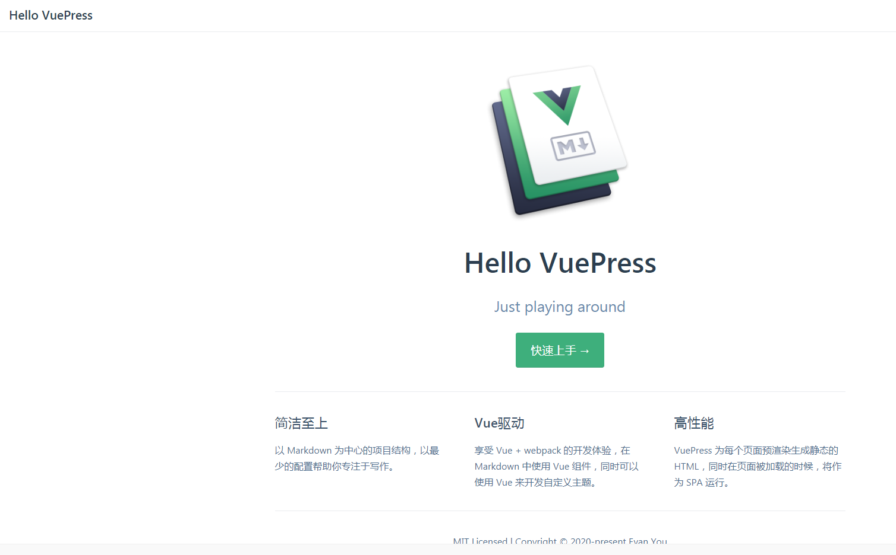

# 使用VuePress搭建一个类Vue文档风格的技术文档博客


## 前言

VuePress是尤大为了支持 Vue 及其子项目的文档需求而写的一个项目，VuePress界面十分简洁，并且**非常容易上手，一个小时就可以将项目架构搭好**。现在已经有很多这种类型的文档，如果你有写技术文档/技术博客的需求，VuePress绝对可以成为你的备选项之一。

**VuePress特性：**

- 为技术文档而优化的内置 Markdown 拓展
- 在 Markdown 文件中使用 Vue 组件的能力
- Vue 驱动的自定义主题系统
- 自动生成 Service Worker（支持PWA）
- Google Analytics 集成
- 基于 Git 的 “最后更新时间”
- 多语言支持
- 响应式布局

建议先看一下[官方文档](https://vuepress.vuejs.org/zh/guide/)


**效果：**

可能你会搭建出一个类似这样的[文档](http://obkoro1.com/web_accumulate/)：


------


## 环境搭建


**创建项目文件夹**

```shell
mkdir yuzhengquaner
```


**项目初始化**

进入到 `yuzhengquaner`文件夹中，使用你喜欢的包管理器进行初始化：

```js
yarn init # 或者 npm init
```

执行命令行，将会创建一个`package.json`文件，内容如下：

```json
{
  "name": "yuzhengquaner",
  "version": "1.0.0",
  "description": "",
  "main": "index.js",
  "scripts": {
    "test": "echo \"Error: no test specified\" && exit 1"
  },
  "keywords": [],
  "author": "",
  "license": "ISC"
}
```


**将 VuePress 安装为本地依赖**

我们已经不再推荐全局安装 VuePress

```js
yarn add -D vuepress # npm install -D vuepress
```

> 注意
>
> 如果你的现有项目依赖了 webpack 3.x，我们推荐使用 [Yarn](https://classic.yarnpkg.com/zh-Hans/) 而不是 npm 来安装 VuePress。因为在这种情形下，npm 会生成错误的依赖树。


**创建必要目录结构以及相关文件**

在 `yuzhengquaner` 目录下创建 `docs` 文件夹，这个文件夹将作为项目文档的根目录来使用。

然后在 docs 文件夹下创建`.vuepress`文件夹，所有 VuePress 相关的文件都将会被放在这里。


在`.vuepress`文件夹下面创建`config.js` 文件，这是 VuePress 必要的配置文件，它导出一个JavaScript对象。可以先加入如下配置：

```js
module.exports = {
    title: 'Hello VuePress',
    description: 'Just playing around'
}
```


在`.vuepress`文件夹下面创建 `public` 文件夹，该文件夹是用来放置静态资源的，打包出来之后会放在`.vuepress/dist/`的根目录。

在docs文件夹下面创建一个`README.md`文件，作为首页(像VuePress文档主页一样)。

默认的主题提供了一个首页，像下面一样设置`home:true`即可，可以把下面的设置放入`README.md`中，待会儿你将会看到跟`VuePress`一样的主页。

```html
---
home: true
heroImage: /logo.png
actionText: 快速上手 →
actionLink: /zh/guide/
features:
- title: 简洁至上
  details: 以 Markdown 为中心的项目结构，以最少的配置帮助你专注于写作。
- title: Vue驱动
  details: 享受 Vue + webpack 的开发体验，在 Markdown 中使用 Vue 组件，同时可以使用 Vue 来开发自定义主题。
- title: 高性能
  details: VuePress 为每个页面预渲染生成静态的 HTML，同时在页面被加载的时候，将作为 SPA 运行。
footer: MIT Licensed | Copyright © 2020-present Evan You
---
```

> heroImage：首页图片，图片放置在 `.vupress/public` 文件夹下，若没有该文件夹则自己创建一个，保存一张你想要的首页图片，并在此处引用。


经过上面的一系列步骤，我们的项目结构就已经搭好了：

```text
yuzhengquaner
├─── docs
│   ├── README.md
│   └── .vuepress
│       ├── public
│       └── config.js
└── package.json
```


**配置启动命令**
在 `package.json` 里添加两个启动命令：

```json
{
    "scripts": {
        "docs:dev": "vuepress dev docs",
        "docs:build": "vuepress build docs"
    }
}
```


**在本地启动服务器**

```js
yarn docs:dev # 或者：npm run docs:dev
```

VuePress 会在 [http://localhost:8080](http://localhost:8080/) 启动一个热重载的开发服务器。现在，你应该已经有了一个简单可用的 VuePress 文档。




**构建VuePress**

build生成静态的HTML文件,默认会在 `.vuepress/dist` 文件夹下

```js
yarn docs:build # 或者：npm run docs:build
```


## 基本配置

最标准的当然是[官方文档](https://vuepress.vuejs.org/zh/default-theme-config/)，可以根据自己的需求来配置`config.js`。可以参考一下我的`config.js`的配置：

```js
module.exports = {
    title: '网站标题',
    description: '网站描述',
    // 注入到当前页面的 HTML <head> 中的标签
    head: [
        ['link', { rel: 'icon', href: '/favicon.ico' }], // 增加一个自定义的 favicon(网页标签的图标)
    ],
    base: '/web_accumulate/', // 这是部署到github相关的配置 下面会讲
    markdown: {
        lineNumbers: true // 代码块显示行号
    },
    themeConfig: {
        sidebarDepth: 2, // e'b将同时提取markdown中h2 和 h3 标题，显示在侧边栏上。
        lastUpdated: 'Last Updated' // 文档更新时间：每个文件git最后提交的时间
    }
};
```


**导航栏配置**

```js
module.exports = {
    themeConfig: {
        nav:[
            { text: '前端算法', link: '/algorithm/' }, // 内部链接 以docs为根目录
            { text: '博客', link: 'http://obkoro1.com/' }, // 外部链接
            // 下拉列表
            {
                text: 'GitHub',
                items: [
                    { text: 'GitHub地址', link: 'https://github.com/OBKoro1' },
                    {
                        text: '算法仓库',
                        link: 'https://github.com/OBKoro1/Brush_algorithm'
                    }
                ]
            }        
        ]
    }
}
```


**侧边栏配置**

侧边栏的配置相对麻烦点，我里面都做了详细的注释，仔细看，自己鼓捣鼓捣，就知道怎么搞了。

```js
module.exports = {
    themeConfig: {
        sidebar:{
            // docs文件夹下面的accumulate文件夹 文档中md文件 书写的位置(命名随意)
            '/accumulate/': [
                '/accumulate/', // accumulate文件夹的README.md 不是下拉框形式
                {
                    title: '侧边栏下拉框的标题1',
                    children: [
                        '/accumulate/JS/test', // 以docs为根目录来查找文件 
                        // 上面地址查找的是：docs>accumulate>JS>test.md 文件
                        // 自动加.md 每个子选项的标题 是该md文件中的第一个h1/h2/h3标题
                    ]
                }
            ],
            // docs文件夹下面的algorithm文件夹 这是第二组侧边栏 跟第一组侧边栏没关系
            '/algorithm/': [
                '/algorithm/', 
                {
                    title: '第二组侧边栏下拉框的标题1',
                    children: [
                        '/algorithm/simple/test' 
                    ]
                }
            ]
        }
    }
}
```

经过以上配置之后，再次访问，发现我们的网站已经大变样了。


## GitHub上进行站点的搭建


### 创建仓库

登录[GitHub]( https://github.com/ )后，在页面右上角的加号中找到“New repository”按钮，创建一个新的仓库，而且仓库的名字为： `[USERNAME].github.io`。例如我的用户名是`yuzhengquaner` ，所以我的仓库名字就是`yuzhengquaner.github.io`。

   （注意：我们写入的名字要以**github.io**做后缀，不然创建出来的不是GitHub Pages） 

> 为什么用 [USERNAME].github.io ？
> 因为在这个项目下，可以直接使用 https://[USERNAME].github.io/ 域名，简洁易记。

   

进入到创建仓库页面，按照步骤创建，最后点击按钮完成仓库的创建。


### 将GitHub上仓库克隆到本地

选择本地存放Github项目的文件目录， 然后在该目录下使用以下命令行将仓库clone到本地：

> git clone https://github.com/zhengxiaochuan/learnnote.github.io.git

然后根据VuePress的用法，自行去写一些文档，做一下简单的配置，先别急着提交到 Github。


### 发布到GitHub

在 `docs/.vuepress/config.js` 中设置正确的 `base`，

如果你打算发布到 `https://<USERNAME>.github.io/`，则可以省略这一步，因为 base 默认即是 `"/"`。

如果你打算发布到 `https://<USERNAME>.github.io/<REPO>/`（也就是说你的仓库在 `https://github.com/<USERNAME>/<REPO>`），则将 base 设置为 `"/<REPO>/"`。

```js
module.exports = {
    base: '/test/', // 比如你的仓库是test
}
```


**创建脚本文件**

在`yuzhengquaner`的根目录下，创建一个`deploy.sh`文件：

```shell
#!/usr/bin/env sh

# 确保脚本抛出遇到的错误
set -e

# 生成静态文件
npm run docs:build

# 进入生成的文件夹
cd docs/.vuepress/dist

# 如果是发布到自定义域名
# echo 'www.example.com' > CNAME

git init
git add -A
git commit -m 'deploy'

# 如果发布到 https://<USERNAME>.github.io  USERNAME=你的用户名 
# git push -f git@github.com:<USERNAME>/<USERNAME>.github.io.git master

# 如果发布到 https://<USERNAME>.github.io/<REPO>  REPO=github上的项目
# git push -f git@github.com:<USERNAME>/<REPO>.git master:gh-pages

cd -
```


**设置package.json**

```json
{
    "scripts": {
    	"d": "bash deploy.sh"
    }
}
```


**部署**

然后你每次可以运行下面的命令行，来把最新更改推到`github`上：

```js
npm run d
```


如果你对运行项目和构建项目的命令行觉得很烦，你也可以像我这么做：

```json
"scripts": {
    "dev": "vuepress dev docs", // 本地运行项目 npm run dev
    "build": "vuepress build docs", // 构建项目 nom run build
    "d": "bash deploy.sh" // 部署项目 npm run d
},
```


## 部署

最后一步，我们需要将代码部署到GitHub Pages，具体请参照文档：[Vupress-部署](https://links.jianshu.com/go?to=https%3A%2F%2Fvuepress.vuejs.org%2Fzh%2Fguide%2Fdeploy.html%23github-pages)。

1、首先确定你的项目是否满足以下条件：

- 文档放置在项目的 docs 目录中
- 使用的是默认的构建输出位置
- VuePress 以本地依赖的形式被安装到你的项目中，在根目录的 `package.json`文件中有如下两段代码：


```cpp
// 配置npm scripts
"scripts": {
    "docs:dev": "vuepress dev docs",
    "docs:build": "vuepress build docs"
 }

// VuePress 以本地依赖的形式被安装
"devDependencies": {
    "vuepress": "^1.5.2"
}
```

2、在github上创建一个名为 `blog-demo` 的仓库，并将你的代码提交到github上。

3、在 `docs/.vuepress/config.js` 文件中设置正确的 base。

如果打算发布到 `https://<USERNAME>.github.io/<REPO>/`（也就是说你的仓库在 `https://github.com/<USERNAME>/<REPO>`），则将 base 设置为 `/<REPO>/`，此处我设置为 `/blog-demo/` 。

4、在项目根目录中，创建一个如下的 deploy.sh 脚本文件，请自行修改github仓库地址

```bash
#!/usr/bin/env sh

# 确保脚本抛出遇到的错误
set -e

# 生成静态文件
npm run docs:build

# 进入生成的文件夹
cd docs/.vuepress/dist

git init
git add -A
git commit -m 'deploy'

# 如果发布到 https://<USERNAME>.github.io/<REPO>
git push -f git@github.com:<USERNAME>/<REPO>.git master:gh-pages

cd -
```

5、双击 `deploy.sh` 运行脚本，会自动在我们的 `GitHub` 仓库中，创建一个名为 `gh-pages` 的分支，而我们要部署到 `GitHub Pages` 的正是这个分支。


 6、这是最后一步了，在 `GitHub` 项目点击 `Setting` 按钮，找到 `GitHub Pages` - `Source`，选择 `gh-pages` 分支，点击 `Save` 按钮后，静静地等待它部署完成即可。

- 部署效果预览：[https://olewahhh.github.io/blog-demo/](https://links.jianshu.com/go?to=https%3A%2F%2Folewahhh.github.io%2Fblog-demo%2F)

- GitHub仓库地址：

  https://github.com/olewaHHH/blog-demo

  

  Setting

  


## 更多：

实际上VuePress的配置、用法还有很多，像还可以配置PWA，以及在markdown里面使用Vue组件等，这些功能我也还在摸索，所以大家一定要去看[文档](https://vuepress.vuejs.org/zh/)!


## 小结

上面已经写得尽可能详细了，我遇到的坑都写上去了。搭建起来确实很简单，心动不如行动，随手花一两个小时搭建一下又不吃亏，何乐而不为？


