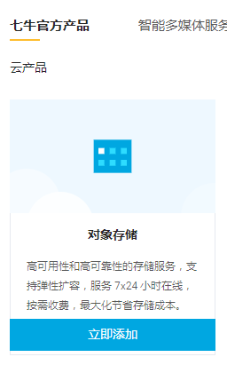
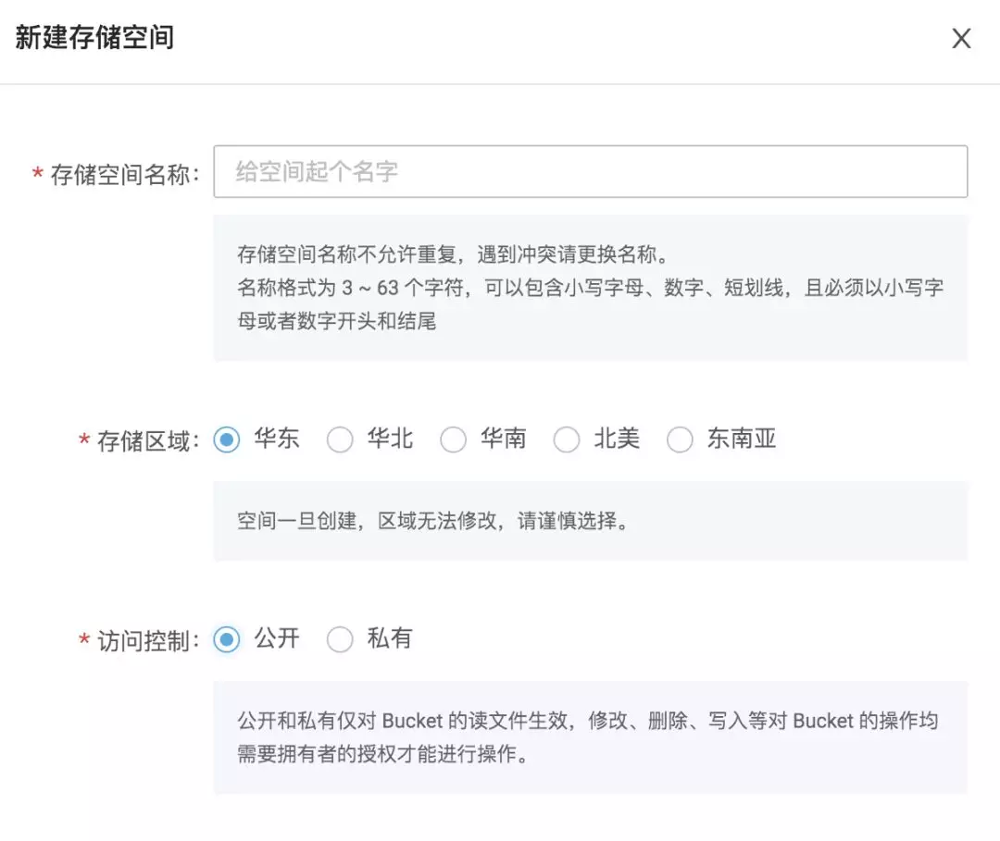
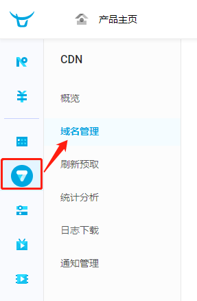
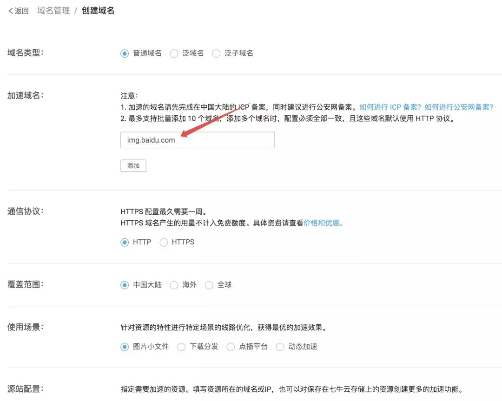
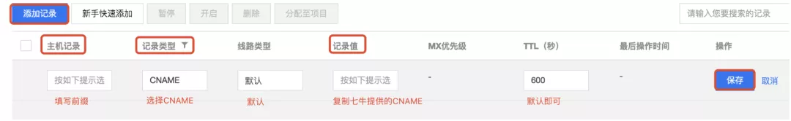
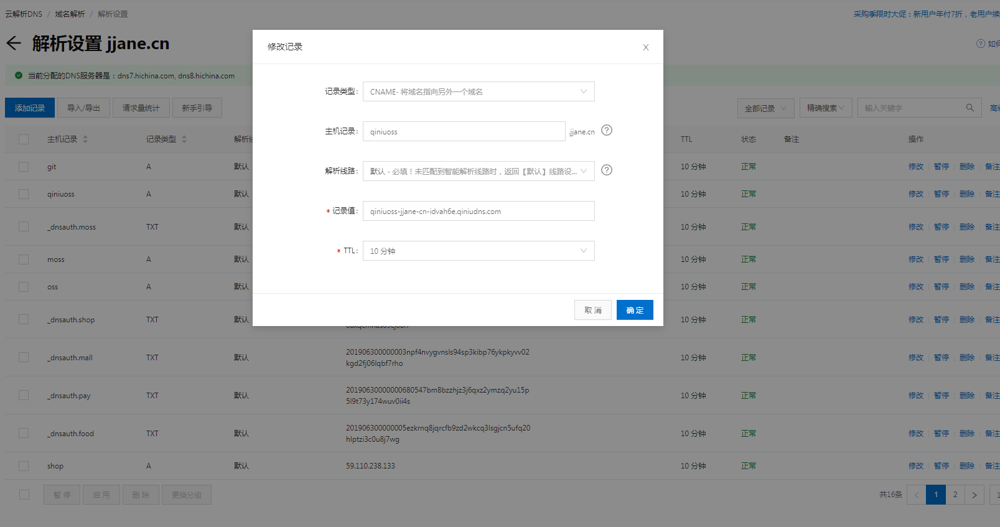
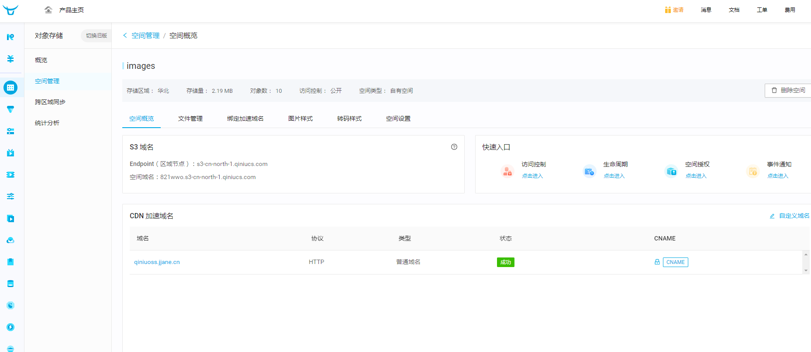
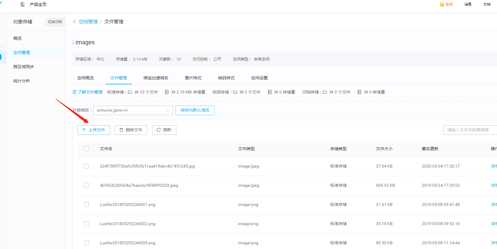
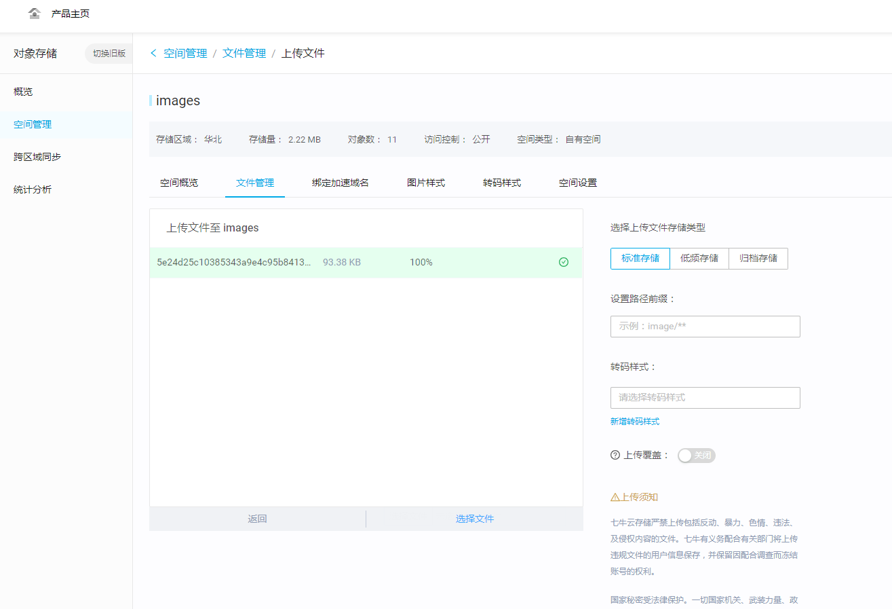
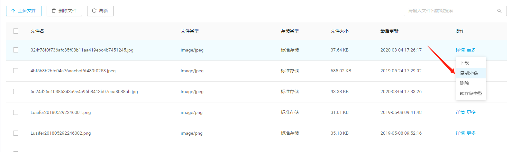

# 七牛云图床搭建

## 登录七牛云控制台

首先在七牛云网站首页点击 「管理控制台」 进入到管理控制台页面，然后选择第一个对象存储，点击 `立即添加` 按钮

## 新建存储空间

然后给新的存储空间取一个名字，选择合适的存储区域。由于我们是要搭建自己的图床，所以最后一项访问控制选择**「公开」**，切勿选错。

## 配置域名

创建完成后，接下来，我们再来配置域名。

首先点击左边菜单栏的 CDN，然后再点击 `域名管理`。

默认情况下，只有一个测试域名。我们点击上方的 「添加域名」，添加自己的域名进来。这里如果没有特殊需求，配置一下域名地址即可，其他都使用默认即可：

其他的选项，大家可以根据实际情况配置，我就不挨个说了，至少配置一个域名，后面就可以用了。配置完成之后，保存。

保存之后，这里会给你一个 `CNAME`，其实就是一个临时的二级域名。然后将这个 CNAME 复制下来。

## 在域名服务商中添加CNAME解析

然后打开自己的域名服务商控制台，添加一条 CNAME 解析记录，像下面这样：

因为我是使用的阿里云的域名服务，所以我的CNAME解析如下：

这里的配置大家注意：

- 由于一开始添加域名的时候，我们配置的是 `img.javaboy.com`，所以这里的主机记录就是 `img`，不要写错了
- 记录类型就是 CNAME，这个不能改
- 线路类型默认即可
- 记录值就是你复制的 CNAME

其他都默认，配置完成之后，保存即可。

> ❝
>
> 那么这个域名配置是什么含义呢？我在这里给大家稍为科普一下。我们把图片上传到七牛云之后，肯定会生成一个访问路径，例如 http://abc-jjane.qiniu.com/12345.png，这个访问路径是有域名的，默认的域名就是七牛云给我们生成的一个临时二级域名，这个二级域名有效期 1 个月，1 个月之后就会失效。所以，我们要配置自己的域名，例如 img.jjane.com，但是当我访问 http://img.jjane.com/12345.png 时，要让这个地址指向七牛云上去，怎么做呢？这个时候就要靠一条 CNAME 解析了，它可以把域名解析到别的域名上。
>
> ❞

这些事情全部做完之后，等待大概十分钟左右，在 「空间管理->空间概览」 里边，看到 CDN 加速域名的状态变为成功时，就表示我们的所有配置都可以 了。

## 上传文件

接下来点到 「空间管理->文件管理」 页面，点击 `文件上传` 按钮，就可以上传文件了。

上传文件页面如下图所示

文件上传成功后，点击右边的更多，就可以复制文件链接了。

整个操作过程还是比较容易的，没有什么难度。