# 短信云服务


## 阿里云短信

### 简介

阿里云通信（原名阿里大于），是阿里云旗下产品，融合了三大运营商的通信能力，通过将传统通信业务和能力与互联网相结合，创新融合阿里巴巴生态内容，全力为中小企业和开发者提供优质服务阿里大于提供包括短信、语音、流量直充、私密专线、店铺手机号等个性化服务。通过阿里大于打通三大运营商通信能力，全面融合阿里巴巴
生态，以开放API及SDK的方式向开发者提供通信和数据服务，更好地支撑企业业务发展和创新服务。


### 前期准备

（1）在阿里云官网 https://www.aliyun.com/ 注册账号
（2）手机下载「阿里云」APP，完成实名认证
（3）登录阿里云，产品中选择「短信服务」

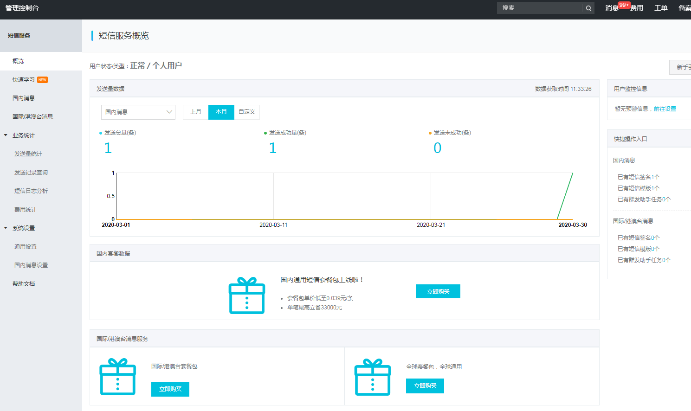

（4）申请签名（选择验证码类型）

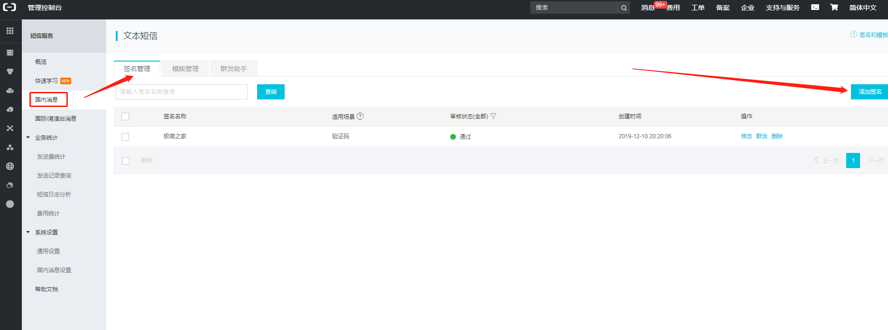

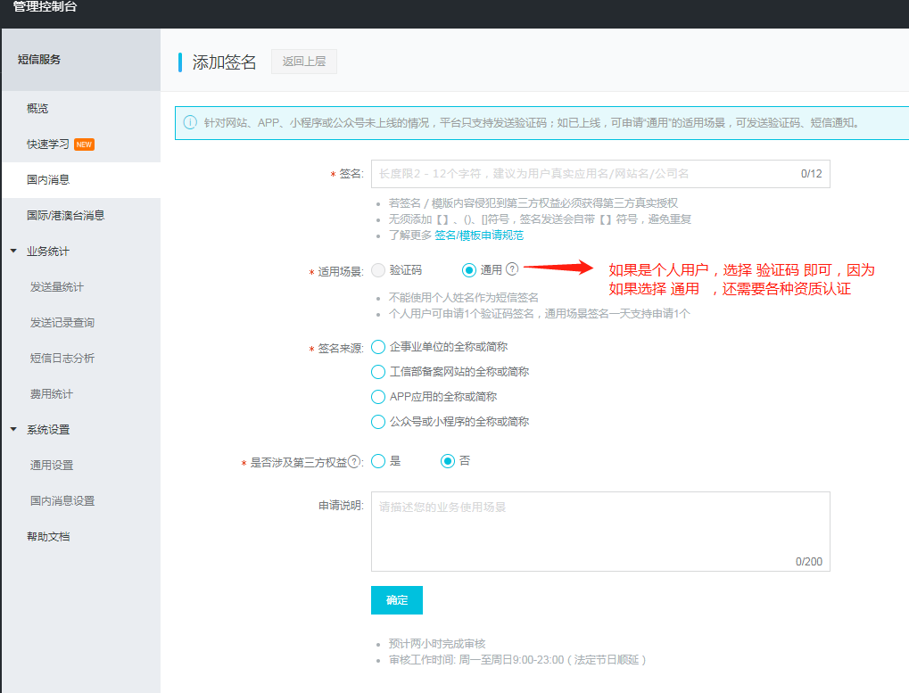

（5）申请模板

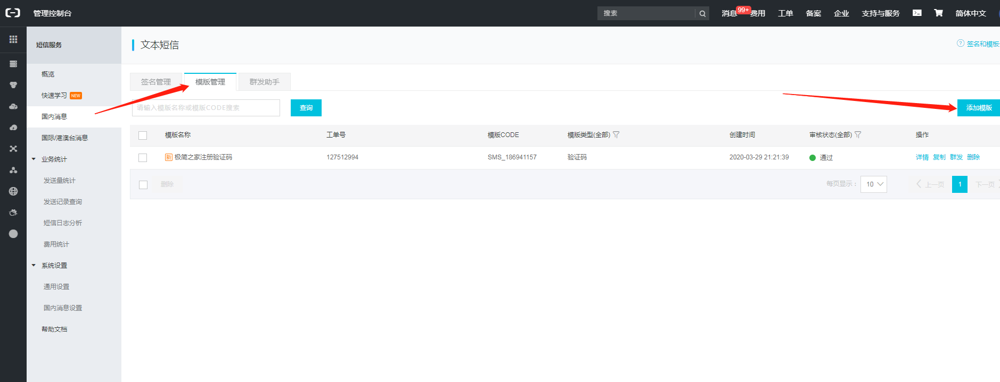

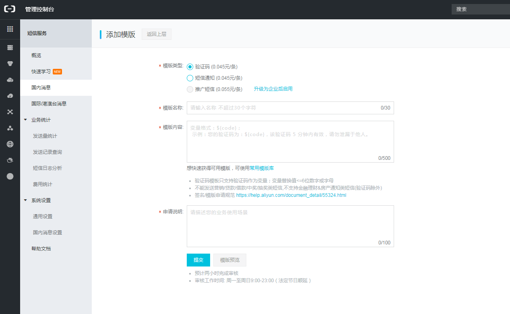

（6）创建 accessKey （注意保密！）

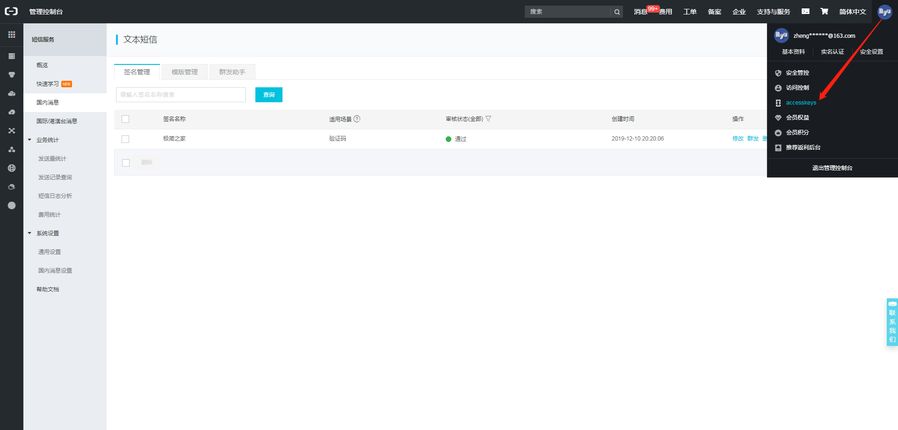

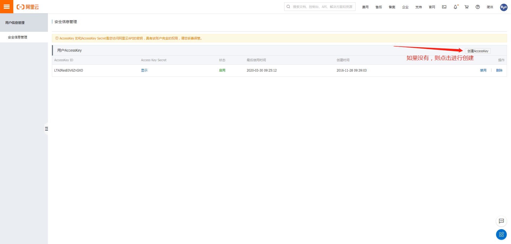

（7）充值 （没必要充太多，1至2元足矣）

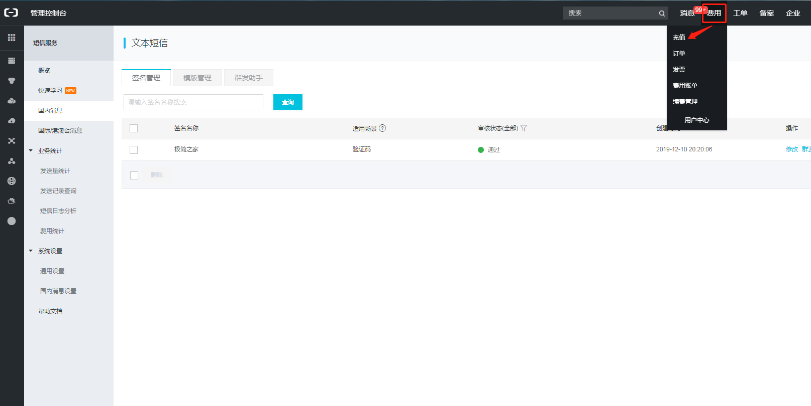

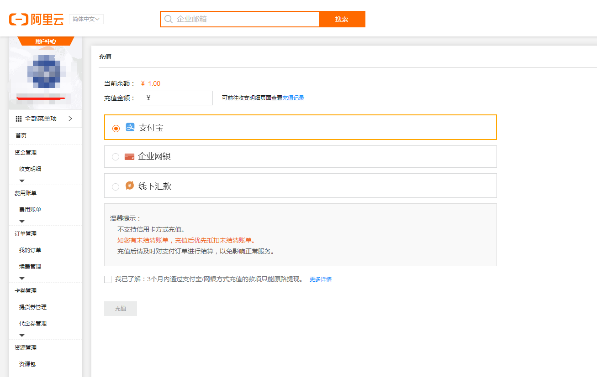


### 开发步骤

（1）创建工程，引入依赖

```xml
<!--阿里云短信服务SDK-->
<dependency>
    <groupId>com.aliyun</groupId>
    <artifactId>aliyun-java-sdk-core</artifactId>
    <version>4.4.9</version>
</dependency>
<dependency>
    <groupId>com.aliyun</groupId>
    <artifactId>aliyun-java-sdk-dysmsapi</artifactId>
    <version>2.1.0</version>
</dependency>
```

（2）创建测试类

> 注意：将其中的 accessKeyId、accessKeySecret 、phone(手机号)、signName(签名)、templateCode(模板)、templateParam(模板参数)、outId(额外参数)  替换成自己的配置后，就可以运行代码了。

```java
package com.devclub.crays.module.sms.util;

import com.aliyuncs.DefaultAcsClient;
import com.aliyuncs.IAcsClient;
import com.aliyuncs.dysmsapi.model.v20170525.*;
import com.aliyuncs.exceptions.ClientException;
import com.aliyuncs.profile.DefaultProfile;
import com.aliyuncs.profile.IClientProfile;

import java.text.SimpleDateFormat;
import java.util.Date;

/**
 * 短信API产品的DEMO程序，执行main函数即可体验短信产品API功能(只需要将AK替换成开通了云通信-短信产品功能的AK即可)
 * <br>
 * <br>
 * 备注:当前Demo工程编码采用UTF-8，国际短信发送请勿参照此DEMO
 *
 * @author: RyuZheng
 * @date: 2020.01.14
 */
public class AliSmsDemo {

    /** 产品名称：短信API产品名称,开发者无需替换 */
    static final String product = "Dysmsapi";
    /** 产品域名：开发者无需替换 */
    static final String domain = "dysmsapi.aliyuncs.com";

    // TODO 此处需要替换成开发者自己的AK(在阿里云访问控制台寻找)
    /** accessKeyId */
    static final String accessKeyId = "your_accessKeyId";
    /** accessKeySecret */
    static final String accessKeySecret = "your_accessKeySecret";


    /**
     * 初始化acsClient实例
     *
     * @return
     * @throws ClientException
     */
    public static IAcsClient aliSmsClient() throws ClientException {
        DefaultProfile profile = DefaultProfile.getProfile("cn-hangzhou", accessKeyId, accessKeySecret);
        DefaultProfile.addEndpoint("cn-hangzhou", product, domain);
        //可自助调整超时时间
        System.setProperty("sun.net.client.defaultConnectTimeout", "10000");
        System.setProperty("sun.net.client.defaultReadTimeout", "10000");
        return new DefaultAcsClient(profile);
    }


    /**
     * 发送短信。详情https://help.aliyun.com/document_detail/55284.html?spm=a2c4g.11186623.6.647.71163520UlAX5d
     *
     * @param phone         待发送手机号
     * @param signName      短信签名-可在短信控制台中找到
     * @param templateCode  短信模板-可在短信控制台中找到
     * @param templateParam 模板中的变量替换JSON串,如模板内容为"亲爱的${name},您的验证码为${code}"时
     * @param outId         outId为提供给业务方扩展字段,最终在短信回执消息中将此值带回给调用者
     * @return SendSmsResponse
     * @throws ClientException
     */
    public static SendSmsResponse sendSms(String phone, String signName, String templateCode, String templateParam, String outId) throws ClientException {
        //初始化acsClient,暂不支持region化
        IAcsClient acsClient = aliSmsClient();


        //组装请求对象-具体描述见控制台-文档部分内容
        SendSmsRequest request = new SendSmsRequest();
        //必填:待发送手机号
        request.setPhoneNumbers(phone);
        //必填:短信签名-可在短信控制台中找到
        request.setSignName(signName);
        //必填:短信模板-可在短信控制台中找到
        request.setTemplateCode(templateCode);
        //可选:模板中的变量替换JSON串,如模板内容为"亲爱的${name},您的验证码为${code}"时,此处的值为
        request.setTemplateParam(templateParam);
        //选填-上行短信扩展码(无特殊需求用户请忽略此字段)
        //request.setSmsUpExtendCode("90997");
        //可选:outId为提供给业务方扩展字段,最终在短信回执消息中将此值带回给调用者
        request.setOutId(outId);
        //hint 此处可能会抛出异常，注意catch
        SendSmsResponse sendSmsResponse = acsClient.getAcsResponse(request);

        return sendSmsResponse;
    }

    /**
     * 批量发送。详情https://help.aliyun.com/document_detail/66041.html
     *
     * @param phoneNumberJson   短信接收号码,JSON格式,批量上限为100个手机号码,批量调用相对于单条调用及时性稍有延迟,验证码类型的短信推荐使用单条调用的方式
     * @param signNameJson      短信签名,JSON格式
     * @param templateCode      短信模板ID
     * @param templateParamJson 短信模板变量替换JSON串,友情提示:如果JSON中需要带换行符,请参照标准的JSON协议。
     * @return SendBatchSmsResponse
     * @throws ClientException
     */
    public static SendBatchSmsResponse sendBatchSms(String phoneNumberJson, String signNameJson, String templateCode, String templateParamJson) throws ClientException {
        SendBatchSmsRequest request = new SendBatchSmsRequest();
        request.setPhoneNumberJson(phoneNumberJson);
        request.setSignNameJson(signNameJson);
        //必填:短信模板-可在短信控制台中找到
        request.setTemplateCode(templateCode);
        request.setTemplateParamJson(templateParamJson);

        IAcsClient acsClient = aliSmsClient();
        return acsClient.getAcsResponse(request);
    }

    /**
     * 查询发送的短信。https://help.aliyun.com/document_detail/55289.html?spm=a2c4g.11186623.6.648.72a53144NTp88y
     *
     * @param bizId       可选-流水号
     * @param phone       必填-号码
     * @param sendDate    短信发送日期格式yyyyMMdd,支持最近30天记录查询
     * @param pageSize    必填-页大小
     * @param currentPage 必填-当前页码从1开始计数
     * @return QuerySendDetailsResponse
     * @throws ClientException
     */
    public static QuerySendDetailsResponse querySendDetails(String bizId, String phone, String sendDate, long pageSize, long currentPage) throws ClientException {
        IAcsClient acsClient = aliSmsClient();

        //组装请求对象
        QuerySendDetailsRequest request = new QuerySendDetailsRequest();
        //必填-号码
        request.setPhoneNumber(phone);
        //可选-流水号
        request.setBizId(bizId);
        //必填-发送日期 支持30天内记录查询，格式yyyyMMdd
        request.setSendDate(sendDate);
        //必填-页大小
        request.setPageSize(pageSize);
        //必填-当前页码从1开始计数
        request.setCurrentPage(currentPage);

        //hint 此处可能会抛出异常，注意catch
        QuerySendDetailsResponse querySendDetailsResponse = acsClient.getAcsResponse(request);

        return querySendDetailsResponse;
    }


    public static void main(String[] args) throws InterruptedException, ClientException {
        //===========================
        //准备参数
        //===========================
        String phone = "1853825****";
        String signName = "极简之家";
        String templateCode = "SMS_186941157";
        String templateParam = "{\"code\":\"123456\"}";
        String outId = "yourOutId";

        SimpleDateFormat ft = new SimpleDateFormat("yyyyMMdd");
        String sendDate = ft.format(new Date());
        long pageSize = 10L;
        long currentPage = 1L;


        //===========================
        //发送短信
        //===========================
        SendSmsResponse response = sendSms(phone, signName, templateCode, templateParam, outId);
        System.out.println("短信接口返回的数据----------------");
        System.out.println("Code=" + response.getCode());
        System.out.println("Message=" + response.getMessage());
        System.out.println("RequestId=" + response.getRequestId());
        System.out.println("BizId=" + response.getBizId());

        Thread.sleep(3000L);

        //===========================
        //查询明细
        //===========================
        if(response.getCode() != null && response.getCode().equals("OK")) {
            QuerySendDetailsResponse querySendDetailsResponse = querySendDetails(response.getBizId(), phone, sendDate, pageSize, currentPage);
            System.out.println("短信明细查询接口返回数据----------------");
            System.out.println("Code=" + querySendDetailsResponse.getCode());
            System.out.println("Message=" + querySendDetailsResponse.getMessage());
            int i = 0;
            for(QuerySendDetailsResponse.SmsSendDetailDTO smsSendDetailDTO : querySendDetailsResponse.getSmsSendDetailDTOs())
            {
                System.out.println("SmsSendDetailDTO["+i+"]:");
                System.out.println("Content=" + smsSendDetailDTO.getContent());
                System.out.println("ErrCode=" + smsSendDetailDTO.getErrCode());
                System.out.println("OutId=" + smsSendDetailDTO.getOutId());
                System.out.println("PhoneNum=" + smsSendDetailDTO.getPhoneNum());
                System.out.println("ReceiveDate=" + smsSendDetailDTO.getReceiveDate());
                System.out.println("SendDate=" + smsSendDetailDTO.getSendDate());
                System.out.println("SendStatus=" + smsSendDetailDTO.getSendStatus());
                System.out.println("Template=" + smsSendDetailDTO.getTemplateCode());
            }
            System.out.println("TotalCount=" + querySendDetailsResponse.getTotalCount());
            System.out.println("RequestId=" + querySendDetailsResponse.getRequestId());
        }

    }

}
```


## 腾讯云短信

### 简介

腾讯云短信（Short Message Service，SMS）沉淀腾讯十多年短信服务技术和经验，为 QQ、微信等亿级平台和10万+客户提供国内短信和国际/港澳台短信服务。国内短信验证秒级触达，99%到达率；国际/港澳台短信覆盖全球200+国家/地区，稳定可靠。腾讯云短信旨在帮助广大开发者快速灵活接入高质量的文本、国际/港澳台短信服务。


### 前期准备

（1）在腾讯云官网 https://cloud.tencent.com/ 注册账号
（2）完成实名认证，可以参考文档 https://cloud.tencent.com/document/product/378/10495 。

认证模式不同，短信使用的权益也有所不同，具体可以看下图：

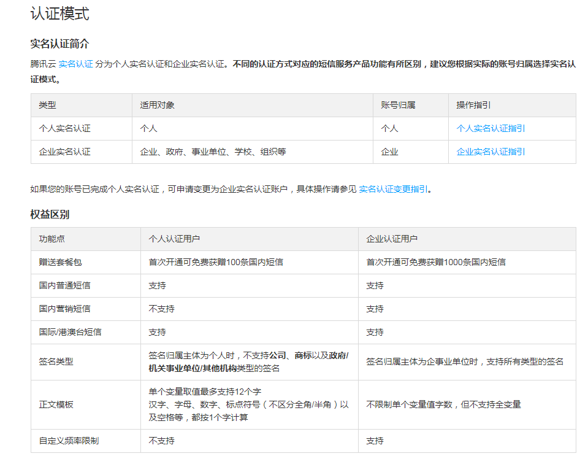

（3）登录腾讯云，产品中选择「短信」，也可以直接通过产品网址 https://cloud.tencent.com/product/sms  进入到 短信SMS 产品页，开通短信服务

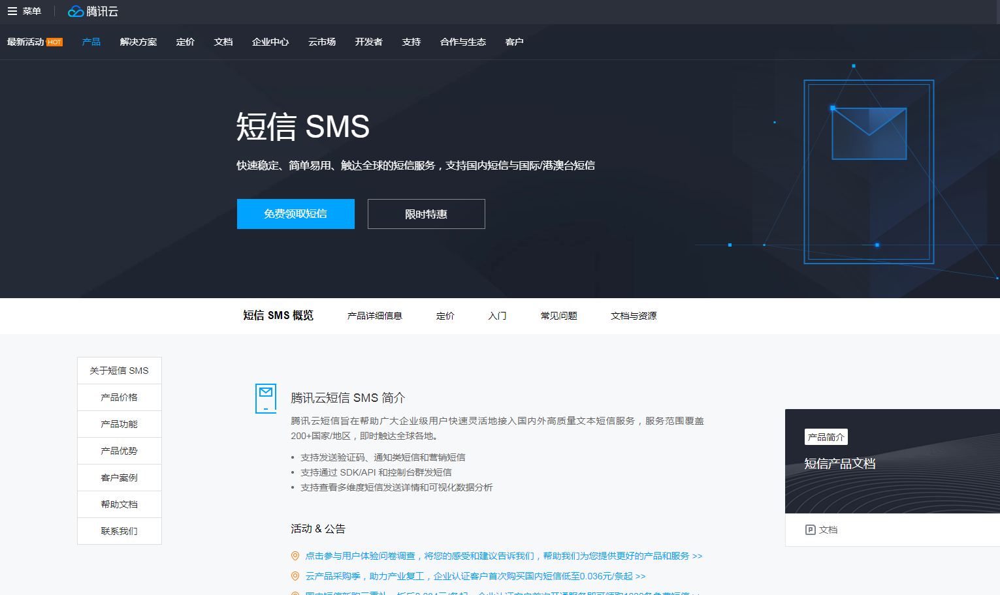

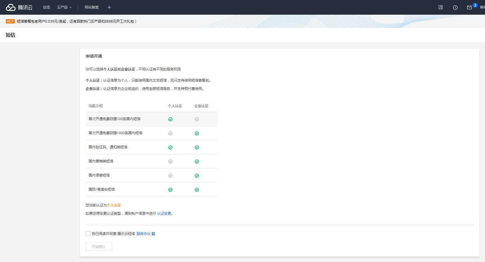

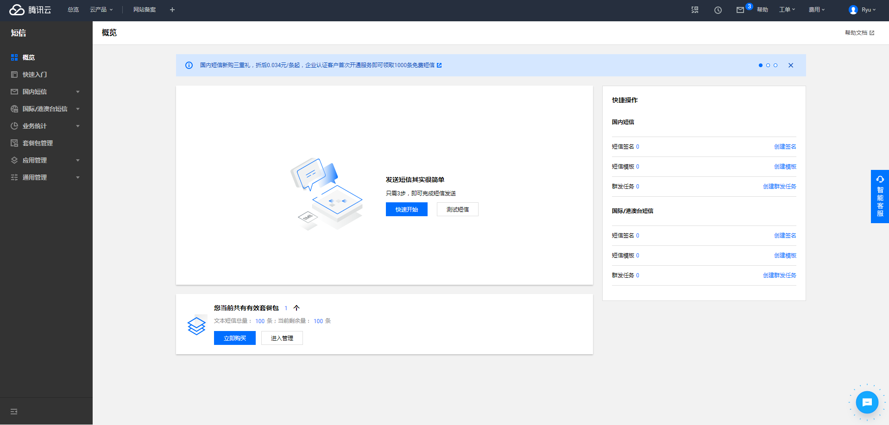

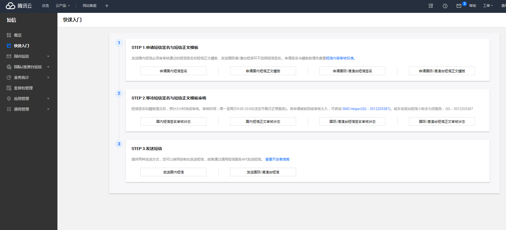

（4）申请签名（选择验证码类型）

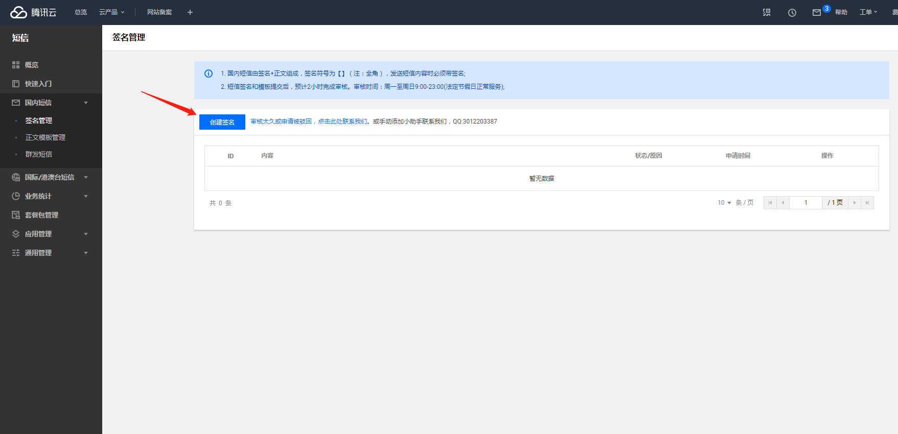

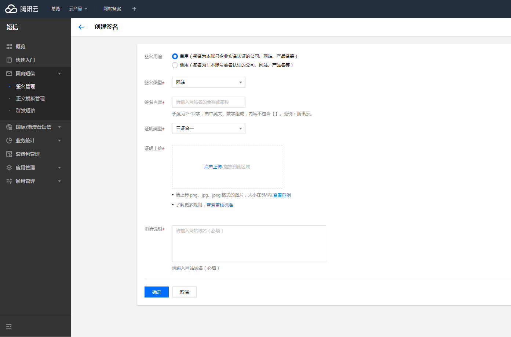

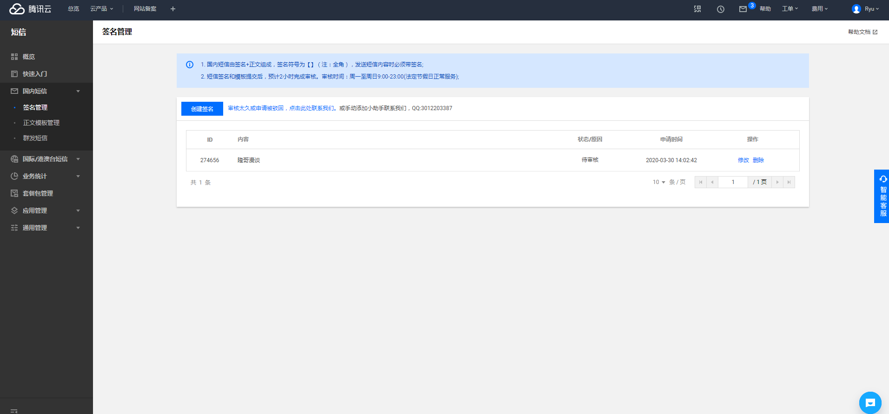

（5）申请模板

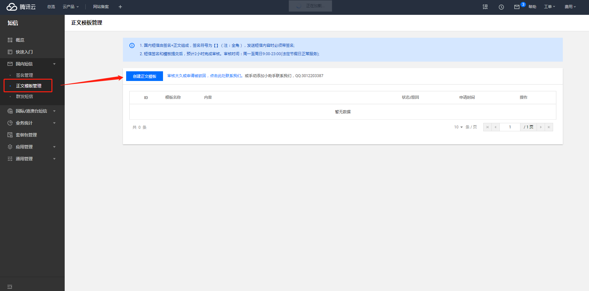

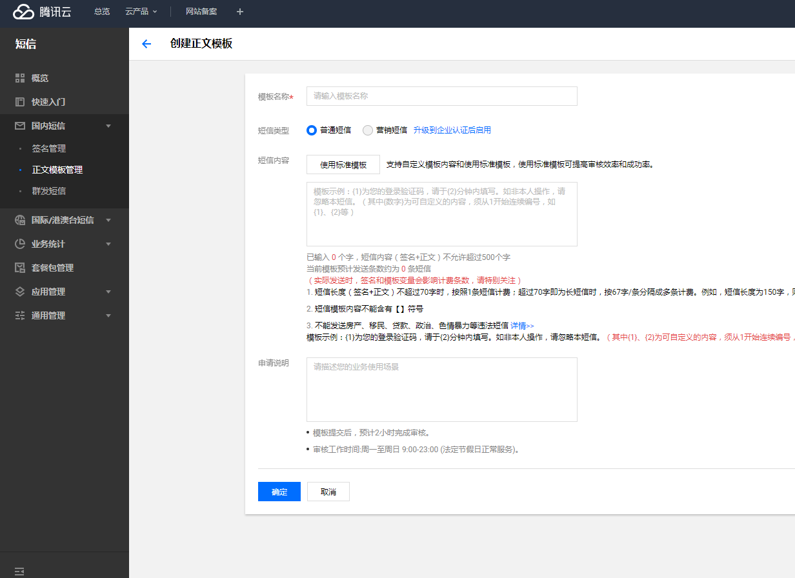

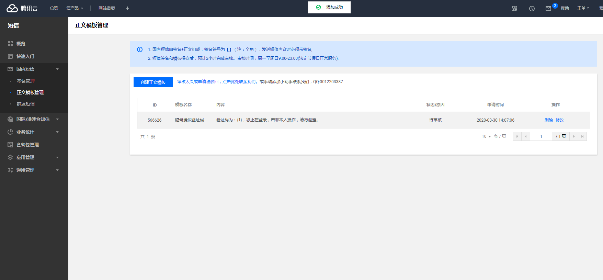

（6）获取SDK AppID和AppKey （注意保密！）

云短信应用SDK `AppID`和`AppKey`可在[短信控制台](https://console.cloud.tencent.com/sms)的应用信息里获取，如您尚未添加应用，请到[短信控制台](https://console.cloud.tencent.com/sms)中添加应用。

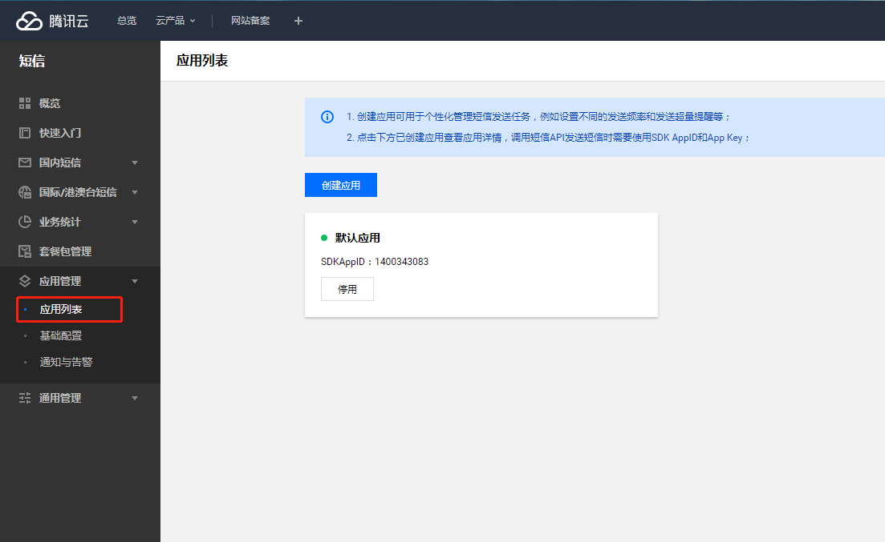

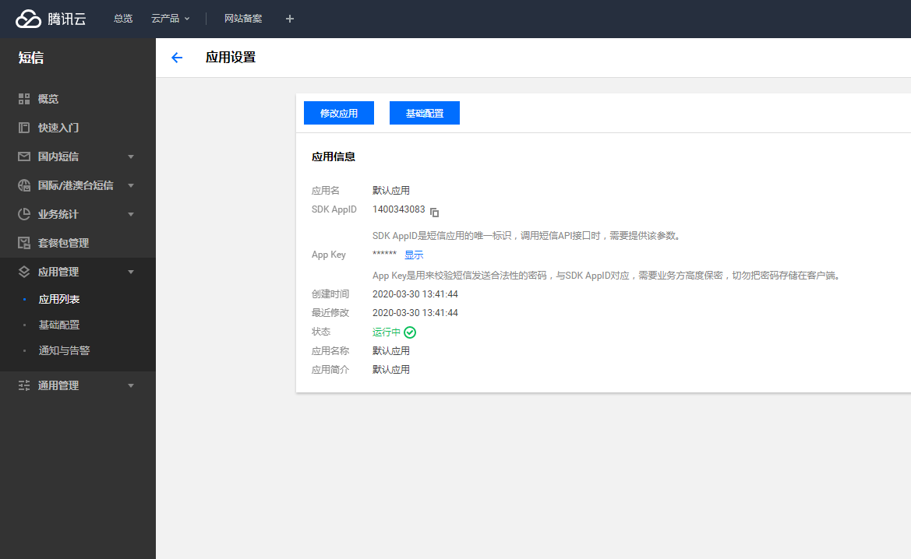


### 开发步骤

（1）创建工程，引入依赖

```xml
<!--腾讯云短信服务SDK-->
<dependency>
  <groupId>com.github.qcloudsms</groupId>
  <artifactId>qcloudsms</artifactId>
  <version>1.0.6</version>
</dependency>
```

（2）创建测试类

> Java SDK 使用指南：https://cloud.tencent.com/document/product/382/13613

```java
package com.devclub.crays.module.sms.util;

import com.github.qcloudsms.SmsMultiSender;
import com.github.qcloudsms.SmsMultiSenderResult;
import com.github.qcloudsms.SmsSingleSender;
import com.github.qcloudsms.SmsSingleSenderResult;
import com.github.qcloudsms.httpclient.HTTPException;
import org.json.JSONException;

import java.io.IOException;

/**
 * Description: 腾讯云短信
 *
 * @author: RyuZheng
 * @date: 2020.03.30
 */
public class QcloudSmsDemo {


    public static void main(String[] args) {
        //****************************************
        //准备必要参数
        //****************************************
        // 短信应用 SDK AppID，SDK AppID 以1400开头
        int appid = 1400009099;
        // 短信应用 SDK AppKey
        String appkey = "9ff91d87c2cd7cd0ea762f141975d1df37481d48700d70ac37470aef";
        // 需要发送短信的手机号码
        String[] phoneNumbers = {"18538195006", "12345678902", "12345678903"};
        // 短信模板 ID，需要在短信应用中申请。NOTE: 这里的模板 ID`7839`只是示例，真实的模板 ID 需要在短信控制台中申请
        int templateId = 7839;
        // 签名  NOTE: 签名参数使用的是`签名内容`，而不是`签名ID`。这里的签名"腾讯云"只是示例，真实的签名需要在短信控制台申请
        String smsSign = "腾讯云";
        // 模板参数
        String[] params = {"5678"};


        //指定模板ID单发短信
        sendSmsSingle(appid, appkey, phoneNumbers[0], templateId, smsSign, params);

        //指定模板ID群发短信
        sendSmsMulti(appid, appkey, phoneNumbers, templateId, smsSign, params);
    }


    /**
     * <p>指定模板ID单发短信</p>
     * 注意：无论单发/群发短信还是指定模板ID单发/群发短信都需要从控制台中申请模板并且模板已经审核通过，才可能下发成功，否则返回失败。
     *
     * @param appid       短信应用 SDK AppID
     * @param appkey      短信应用 SDK AppKey
     * @param phoneNumber 需要发送短信的手机号码
     * @param templateId  短信模板 ID
     * @param smsSign     签名
     * @param params      模板参数
     */
    public static void sendSmsSingle(int appid, String appkey, String phoneNumber, int templateId, String smsSign, String[] params){
        try {
            SmsSingleSender singleSender = new SmsSingleSender(appid, appkey);
            // 签名不能为空串
            SmsSingleSenderResult result = singleSender.sendWithParam("86", phoneNumber, templateId, params, smsSign, "", "");
            System.out.println(result);
        } catch (HTTPException e) {
            // HTTP响应码错误
            e.printStackTrace();
        } catch (JSONException e) {
            // json解析错误
            e.printStackTrace();
        } catch (IOException e) {
            // 网络IO错误
            e.printStackTrace();
        }
    }


    /**
     * <p>指定模板ID群发短信</p>
     * Note 群发一次请求最多支持200个号码，如有对号码数量有特殊需求请联系腾讯云短信技术支持(QQ:3012203387)。 Note 无论单发/群发短信还是指定模板ID单发/群发短信都需要从控制台中申请模板并且模板已经审核通过，才可能下发成功，否则返回失败。
     *
     * @param appid        短信应用 SDK AppID
     * @param appkey       短信应用 SDK AppKey
     * @param phoneNumbers 需要发送短信的手机号码
     * @param templateId   短信模板 ID
     * @param smsSign      签名
     * @param params       模板参数
     */
    public static void sendSmsMulti(int appid, String appkey, String[] phoneNumbers, int templateId, String smsSign, String[] params){
        try {
            SmsMultiSender multiSender = new SmsMultiSender(appid, appkey);
            // 签名不能为空串
            SmsMultiSenderResult result =  multiSender.sendWithParam("86", phoneNumbers, templateId, params, smsSign, "", "");
            System.out.println(result);
        } catch (HTTPException e) {
            // HTTP响应码错误
            e.printStackTrace();
        } catch (JSONException e) {
            // json解析错误
            e.printStackTrace();
        } catch (IOException e) {
            // 网络IO错误
            e.printStackTrace();
        }
    }

}
```


## 百度云短信

### 简介

阿里云通信（原名阿里大于），是阿里云旗下产品，融合了三大运营商的通信能力，通过将传统通信业务和能力与互联网相结合，创新融合阿里巴巴生态内容，全力为中小企业和开发者提供优质服务阿里大于提供包括短信、语音、流量直充、私密专线、店铺手机号等个性化服务。通过阿里大于打通三大运营商通信能力，全面融合阿里巴巴
生态，以开放API及SDK的方式向开发者提供通信和数据服务，更好地支撑企业业务发展和创新服务。


### 前期准备

（1）在阿里云官网 https://www.aliyun.com/ 注册账号
（2）手机下载「阿里云」APP，完成实名认证
（3）登录阿里云，产品中选择「短信服务」


（4）申请签名（选择验证码类型）


（5）申请模板


（6）创建 accessKey （注意保密！）


（7）充值 （没必要充太多，1至2元足矣）


### 开发步骤

（1）创建工程，引入依赖

```xml
<!--阿里云短信服务SDK-->
<dependency>
    <groupId>com.aliyun</groupId>
    <artifactId>aliyun-java-sdk-core</artifactId>
    <version>4.4.9</version>
</dependency>
<dependency>
    <groupId>com.aliyun</groupId>
    <artifactId>aliyun-java-sdk-dysmsapi</artifactId>
    <version>2.1.0</version>
</dependency>
```

（2）创建测试类

> 注意：将其中的 accessKeyId、accessKeySecret 、phone(手机号)、signName(签名)、templateCode(模板)、templateParam(模板参数)、outId(额外参数)  替换成自己的配置后，就可以运行代码了。

```java
package com.devclub.crays.module.sms.util;

import com.aliyuncs.DefaultAcsClient;
import com.aliyuncs.IAcsClient;
import com.aliyuncs.dysmsapi.model.v20170525.*;
import com.aliyuncs.exceptions.ClientException;
import com.aliyuncs.profile.DefaultProfile;
import com.aliyuncs.profile.IClientProfile;

import java.text.SimpleDateFormat;
import java.util.Date;

/**
 * 短信API产品的DEMO程序，执行main函数即可体验短信产品API功能(只需要将AK替换成开通了云通信-短信产品功能的AK即可)
 * <br>
 * <br>
 * 备注:当前Demo工程编码采用UTF-8，国际短信发送请勿参照此DEMO
 *
 * @author: RyuZheng
 * @date: 2020.01.14
 */
public class AliSmsDemo {

    /** 产品名称：短信API产品名称,开发者无需替换 */
    static final String product = "Dysmsapi";
    /** 产品域名：开发者无需替换 */
    static final String domain = "dysmsapi.aliyuncs.com";

    // TODO 此处需要替换成开发者自己的AK(在阿里云访问控制台寻找)
    /** accessKeyId */
    static final String accessKeyId = "your_accessKeyId";
    /** accessKeySecret */
    static final String accessKeySecret = "your_accessKeySecret";


    /**
     * 初始化acsClient实例
     *
     * @return
     * @throws ClientException
     */
    public static IAcsClient aliSmsClient() throws ClientException {
        DefaultProfile profile = DefaultProfile.getProfile("cn-hangzhou", accessKeyId, accessKeySecret);
        DefaultProfile.addEndpoint("cn-hangzhou", product, domain);
        //可自助调整超时时间
        System.setProperty("sun.net.client.defaultConnectTimeout", "10000");
        System.setProperty("sun.net.client.defaultReadTimeout", "10000");
        return new DefaultAcsClient(profile);
    }


    /**
     * 发送短信。详情https://help.aliyun.com/document_detail/55284.html?spm=a2c4g.11186623.6.647.71163520UlAX5d
     *
     * @param phone         待发送手机号
     * @param signName      短信签名-可在短信控制台中找到
     * @param templateCode  短信模板-可在短信控制台中找到
     * @param templateParam 模板中的变量替换JSON串,如模板内容为"亲爱的${name},您的验证码为${code}"时
     * @param outId         outId为提供给业务方扩展字段,最终在短信回执消息中将此值带回给调用者
     * @return SendSmsResponse
     * @throws ClientException
     */
    public static SendSmsResponse sendSms(String phone, String signName, String templateCode, String templateParam, String outId) throws ClientException {
        //初始化acsClient,暂不支持region化
        IAcsClient acsClient = aliSmsClient();


        //组装请求对象-具体描述见控制台-文档部分内容
        SendSmsRequest request = new SendSmsRequest();
        //必填:待发送手机号
        request.setPhoneNumbers(phone);
        //必填:短信签名-可在短信控制台中找到
        request.setSignName(signName);
        //必填:短信模板-可在短信控制台中找到
        request.setTemplateCode(templateCode);
        //可选:模板中的变量替换JSON串,如模板内容为"亲爱的${name},您的验证码为${code}"时,此处的值为
        request.setTemplateParam(templateParam);
        //选填-上行短信扩展码(无特殊需求用户请忽略此字段)
        //request.setSmsUpExtendCode("90997");
        //可选:outId为提供给业务方扩展字段,最终在短信回执消息中将此值带回给调用者
        request.setOutId(outId);
        //hint 此处可能会抛出异常，注意catch
        SendSmsResponse sendSmsResponse = acsClient.getAcsResponse(request);

        return sendSmsResponse;
    }

    /**
     * 批量发送。详情https://help.aliyun.com/document_detail/66041.html
     *
     * @param phoneNumberJson   短信接收号码,JSON格式,批量上限为100个手机号码,批量调用相对于单条调用及时性稍有延迟,验证码类型的短信推荐使用单条调用的方式
     * @param signNameJson      短信签名,JSON格式
     * @param templateCode      短信模板ID
     * @param templateParamJson 短信模板变量替换JSON串,友情提示:如果JSON中需要带换行符,请参照标准的JSON协议。
     * @return SendBatchSmsResponse
     * @throws ClientException
     */
    public static SendBatchSmsResponse sendBatchSms(String phoneNumberJson, String signNameJson, String templateCode, String templateParamJson) throws ClientException {
        SendBatchSmsRequest request = new SendBatchSmsRequest();
        request.setPhoneNumberJson(phoneNumberJson);
        request.setSignNameJson(signNameJson);
        //必填:短信模板-可在短信控制台中找到
        request.setTemplateCode(templateCode);
        request.setTemplateParamJson(templateParamJson);

        IAcsClient acsClient = aliSmsClient();
        return acsClient.getAcsResponse(request);
    }

    /**
     * 查询发送的短信。https://help.aliyun.com/document_detail/55289.html?spm=a2c4g.11186623.6.648.72a53144NTp88y
     *
     * @param bizId       可选-流水号
     * @param phone       必填-号码
     * @param sendDate    短信发送日期格式yyyyMMdd,支持最近30天记录查询
     * @param pageSize    必填-页大小
     * @param currentPage 必填-当前页码从1开始计数
     * @return QuerySendDetailsResponse
     * @throws ClientException
     */
    public static QuerySendDetailsResponse querySendDetails(String bizId, String phone, String sendDate, long pageSize, long currentPage) throws ClientException {
        IAcsClient acsClient = aliSmsClient();

        //组装请求对象
        QuerySendDetailsRequest request = new QuerySendDetailsRequest();
        //必填-号码
        request.setPhoneNumber(phone);
        //可选-流水号
        request.setBizId(bizId);
        //必填-发送日期 支持30天内记录查询，格式yyyyMMdd
        request.setSendDate(sendDate);
        //必填-页大小
        request.setPageSize(pageSize);
        //必填-当前页码从1开始计数
        request.setCurrentPage(currentPage);

        //hint 此处可能会抛出异常，注意catch
        QuerySendDetailsResponse querySendDetailsResponse = acsClient.getAcsResponse(request);

        return querySendDetailsResponse;
    }


    public static void main(String[] args) throws InterruptedException, ClientException {
        //===========================
        //准备参数
        //===========================
        String phone = "1853825****";
        String signName = "极简之家";
        String templateCode = "SMS_186941157";
        String templateParam = "{\"code\":\"123456\"}";
        String outId = "yourOutId";

        SimpleDateFormat ft = new SimpleDateFormat("yyyyMMdd");
        String sendDate = ft.format(new Date());
        long pageSize = 10L;
        long currentPage = 1L;


        //===========================
        //发送短信
        //===========================
        SendSmsResponse response = sendSms(phone, signName, templateCode, templateParam, outId);
        System.out.println("短信接口返回的数据----------------");
        System.out.println("Code=" + response.getCode());
        System.out.println("Message=" + response.getMessage());
        System.out.println("RequestId=" + response.getRequestId());
        System.out.println("BizId=" + response.getBizId());

        Thread.sleep(3000L);

        //===========================
        //查询明细
        //===========================
        if(response.getCode() != null && response.getCode().equals("OK")) {
            QuerySendDetailsResponse querySendDetailsResponse = querySendDetails(response.getBizId(), phone, sendDate, pageSize, currentPage);
            System.out.println("短信明细查询接口返回数据----------------");
            System.out.println("Code=" + querySendDetailsResponse.getCode());
            System.out.println("Message=" + querySendDetailsResponse.getMessage());
            int i = 0;
            for(QuerySendDetailsResponse.SmsSendDetailDTO smsSendDetailDTO : querySendDetailsResponse.getSmsSendDetailDTOs())
            {
                System.out.println("SmsSendDetailDTO["+i+"]:");
                System.out.println("Content=" + smsSendDetailDTO.getContent());
                System.out.println("ErrCode=" + smsSendDetailDTO.getErrCode());
                System.out.println("OutId=" + smsSendDetailDTO.getOutId());
                System.out.println("PhoneNum=" + smsSendDetailDTO.getPhoneNum());
                System.out.println("ReceiveDate=" + smsSendDetailDTO.getReceiveDate());
                System.out.println("SendDate=" + smsSendDetailDTO.getSendDate());
                System.out.println("SendStatus=" + smsSendDetailDTO.getSendStatus());
                System.out.println("Template=" + smsSendDetailDTO.getTemplateCode());
            }
            System.out.println("TotalCount=" + querySendDetailsResponse.getTotalCount());
            System.out.println("RequestId=" + querySendDetailsResponse.getRequestId());
        }

    }

}
```

