# Docker Compose 部署 GitLab

## 什么是 GitLab

GitLab 是利用 Ruby on Rails 一个开源的版本管理系统，实现一个自托管的 Git 项目仓库，可通过 Web 界面进行访问公开的或者私人项目。它拥有与 Github 类似的功能，能够浏览源代码，管理缺陷和注释。可以管理团队对仓库的访问，它非常易于浏览提交过的版本并提供一个文件历史库。团队成员可以利用内置的简单聊天程序 (Wall) 进行交流。它还提供一个代码片段收集功能可以轻松实现代码复用，便于日后有需要的时候进行查找。

## 部署 GitLab

我们使用 Docker 来安装和运行 GitLab 中文版，`docker-compose.yml` 配置如下：

```yaml
version: '3'
services:
    web:
      image: 'twang2218/gitlab-ce-zh'
      restart: always
      hostname: '192.168.75.145'
      environment:
        TZ: 'Asia/Shanghai'
        GITLAB_OMNIBUS_CONFIG: |
          external_url 'http://192.168.75.145'
          gitlab_rails['gitlab_shell_ssh_port'] = 2222
          unicorn['port'] = 8888
          nginx['listen_port'] = 80
      ports:
        - '80:80'
        - '443:443'
        - '2222:22'
      volumes:
        - ./config:/etc/gitlab
        - ./data:/var/opt/gitlab
        - ./logs:/var/log/gitlab
```

## 配置 GitLab

- 访问地址：[http://ip:8080](http://qfdmy.com/wp-content/themes/quanbaike/go.php?url=aHR0cDovL2lwOjgwODA=)


- 设置管理员初始密码，这里的密码最好是 **字母 + 数字组合，并且大于等于 8 位**
- 配置完成后登录，管理员账号是 **root**

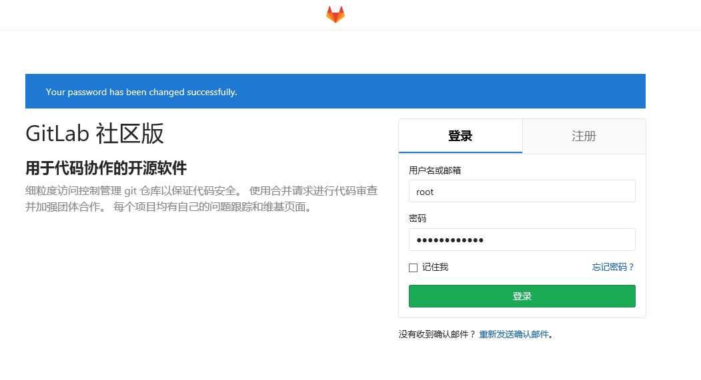

> **注意：** 如果服务器配置较低，启动运行可能需要较长时间，请耐心等待

## 设置 GitLab

第一次使用时可以做一些初始化设置，点击 **管理区域** -> **设置**

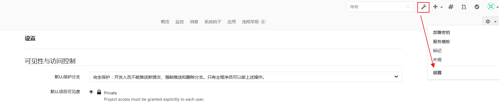

- 关闭头像功能，由于 Gravatar 头像为网络头像，在网络情况不理想时可能导致访问时卡顿

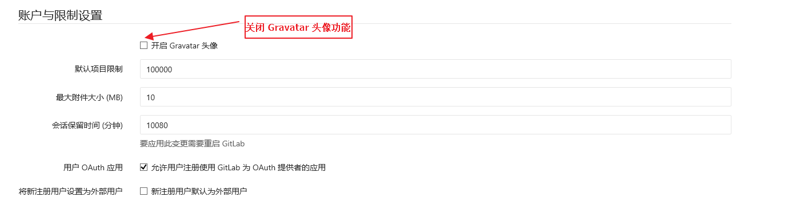

- 由于是内部代码托管服务器，可以直接关闭注册功能，由管理员统一创建用户即可

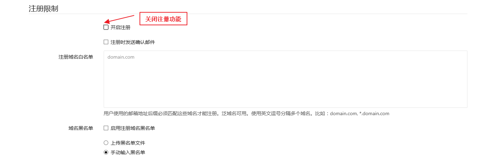

## 账户管理

使用时请不要直接通过 root 用户操作，需要先创建用户，然后通过创建的用户操作，如果你是管理员还需要为其他开发人员分配账户

- 创建账户，点击 **管理区域** -> **新建用户**

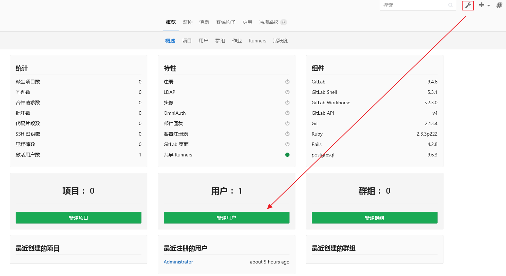

- 设置账户信息，同时你可以将自己设置为管理员

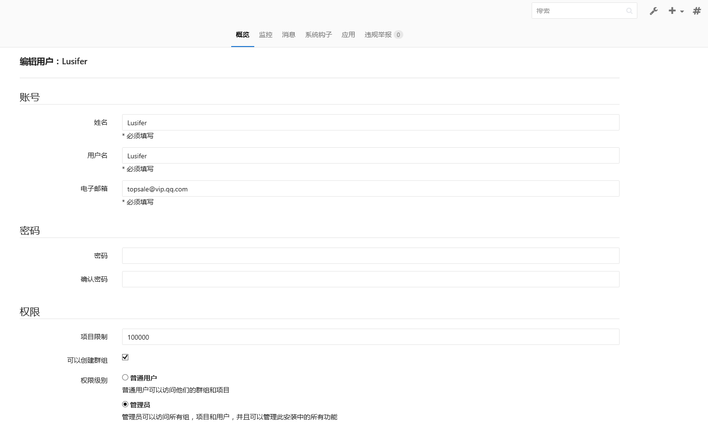

- 修改用户密码，由于我们创建时并没有配置邮箱，所以还需要重新编辑用户信息并手动设置密码

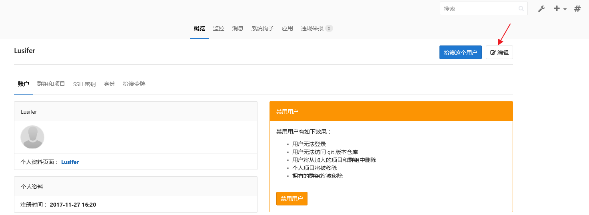

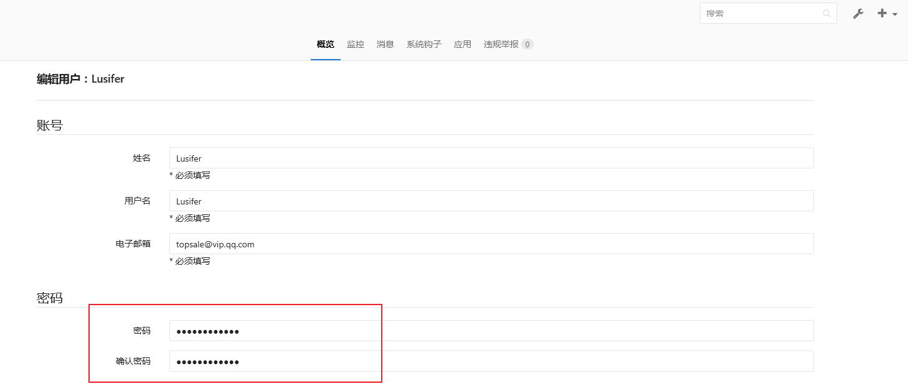

- 退出并使用新账户登录


> **注意：** 创建完账户，第一次登录时还会提示你修改登录密码

## 项目管理

- 点击 **+** 号 -> **新建项目**

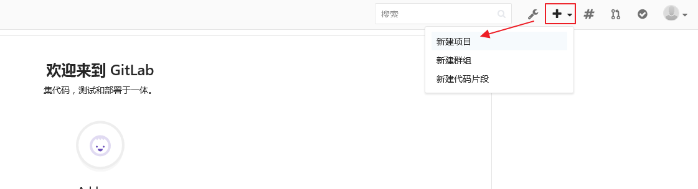

- 输入项目名称及描述信息，设置可见等级为私有，这样别人就看不见你的项目

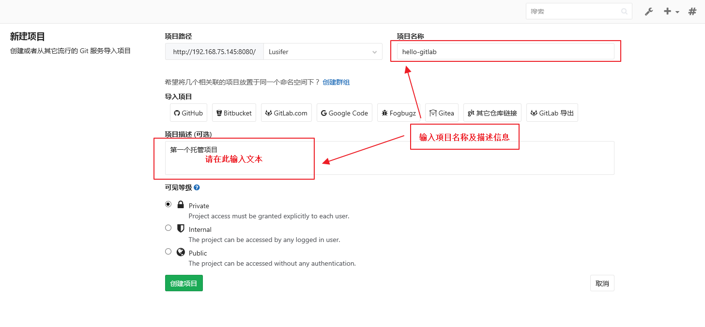

- 我们选择通过增加一个 README 的方式来初始化项目

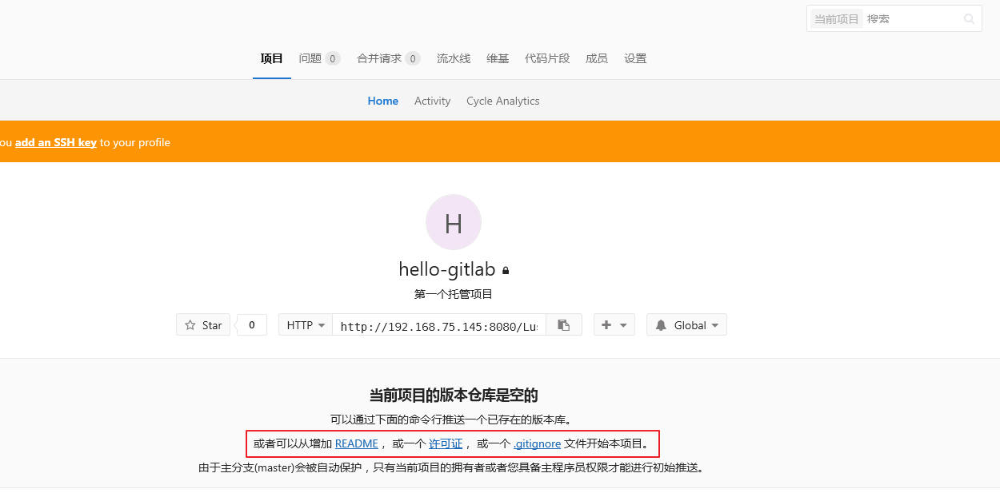

- 直接提交修改即可

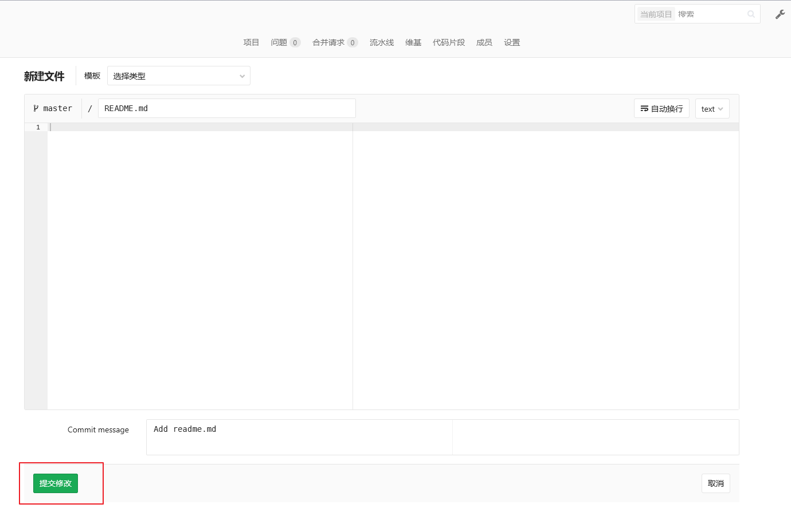

## 使用 SSH 方式拉取和推送

### 生成 SSH KEY

- 使用 ssh-keygen 工具生成，位置在 Git 安装目录下，我的是 `C:\Program Files\Git\usr\bin`，输入命令：

```bash
ssh-keygen -t rsa -C "your_email@example.com"
```

- 执行成功后的效果：

```bash
Microsoft Windows [版本 10.0.14393]
(c) 2016 Microsoft Corporation。保留所有权利。

C:\Program Files\Git\usr\bin>ssh-keygen -t rsa -C "topsale@vip.qq.com"
Generating public/private rsa key pair.
Enter file in which to save the key (/c/Users/Lusifer/.ssh/id_rsa):
Enter passphrase (empty for no passphrase):
Enter same passphrase again:
Your identification has been saved in /c/Users/Lusifer/.ssh/id_rsa.
Your public key has been saved in /c/Users/Lusifer/.ssh/id_rsa.pub.
The key fingerprint is:
SHA256:cVesJKa5VnQNihQOTotXUAIyphsqjb7Z9lqOji2704E topsale@vip.qq.com
The key's randomart image is:
+---[RSA 2048]----+
|  + ..=o=.  .+.  |
| o o + B .+.o.o  |
|o   . + +=o+..   |
|.=   .  oo...    |
|= o     So       |
|oE .    o        |
| .. .. .         |
| o*o+            |
| *B*oo           |
+----[SHA256]-----+

C:\Program Files\Git\usr\bin>
```

### 复制 SSH-KEY 信息到 GitLab

- 密钥位置在：`C:\Users\你的用户名\.ssh` 目录下，找到 `id_rsa.pub` 并使用编辑器打开，如：


- 登录 GitLab，点击“用户头像”-->“设置”-->“SSH 密钥”

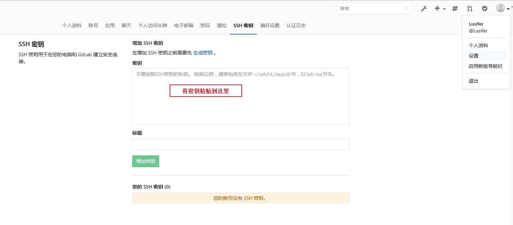

- 成功增加密钥后的效果


## 使用 TortoiseGit

### 克隆项目

- 新建一个存放代码仓库的本地文件夹
- 在文件夹空白处按右键
- 选择 **Git 克隆...**

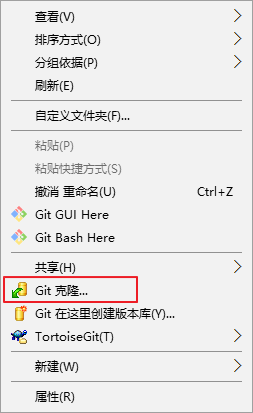

- 复制项目地址到 URL

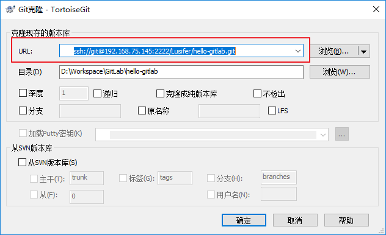

- 如果弹出连接信息请选择是


- 成功克隆项目到本地

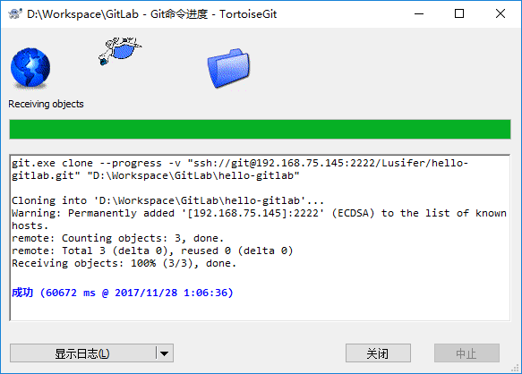

### 推送项目

- 创建或修改文件（这里的文件为所有文件，包括：代码、图片等）
- 我们以创建 `.gitignore` 过滤配置文件为例，该文件的主要作用为过滤不需要上传的文件，比如：IDE 生成的工程文件、编译后的 class 文件等
- 在工程目录下，新建 `.gitignore` 文件，并填入如下配置

```
target/
!.mvn/wrapper/maven-wrapper.jar

## STS ##
.apt_generated
.classpath
.factorypath
.project
.settings
.springBeans

## IntelliJ IDEA ##
.idea
*.iws
*.iml
*.ipr

## JRebel ##
rebel.xml

## MAC ##
.DS_Store

## Other ##
logs/
temp/
```

- 右键呼出菜单，选择 **提交 Master...**

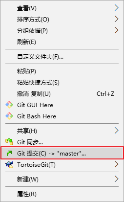

- 点击 **全部** 并填入 **日志信息**

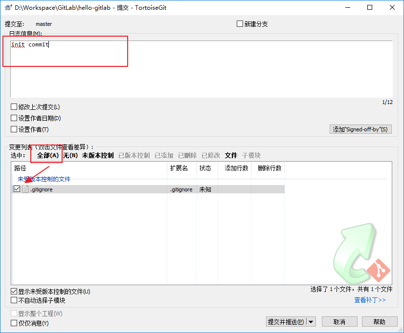

- 点击 **提交并推送**


- 成功后的效果图

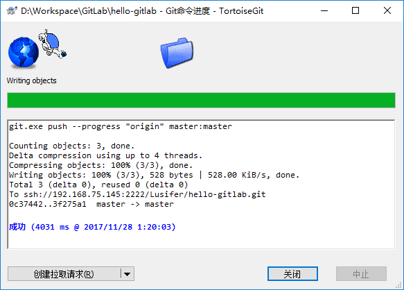

## 查看 GitLab 确认提交成功

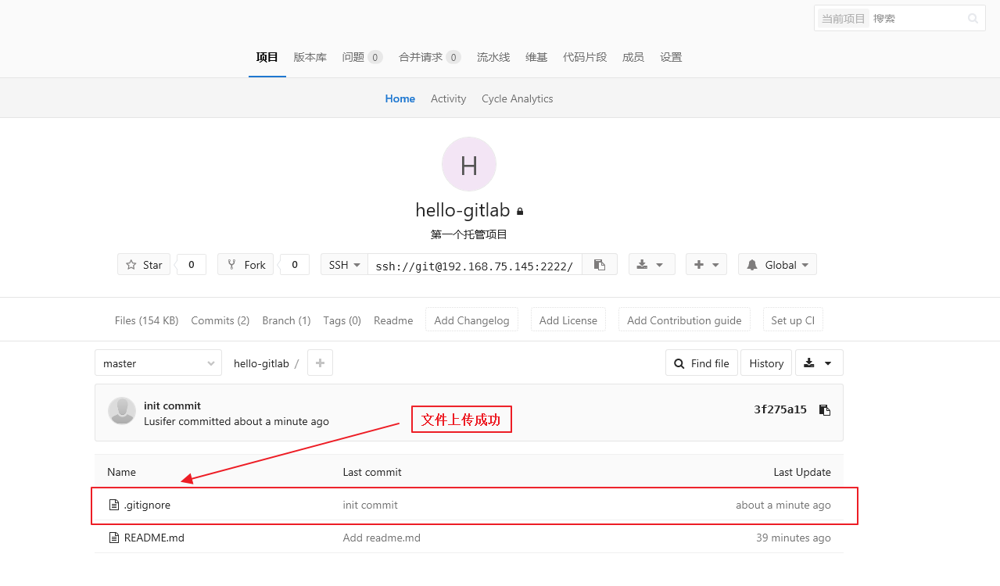