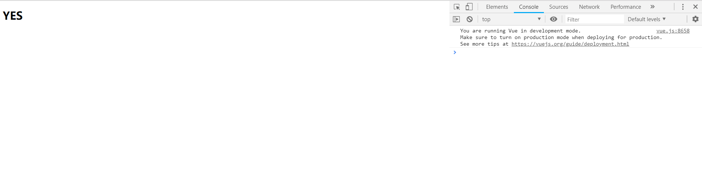
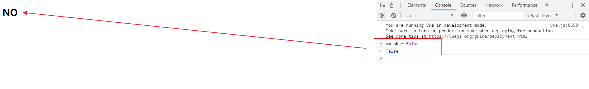
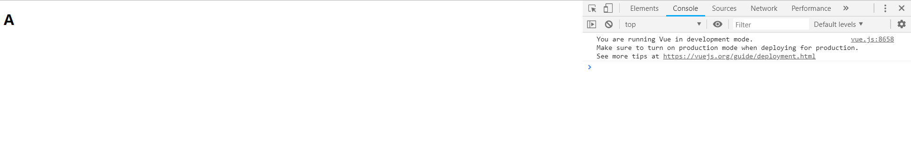
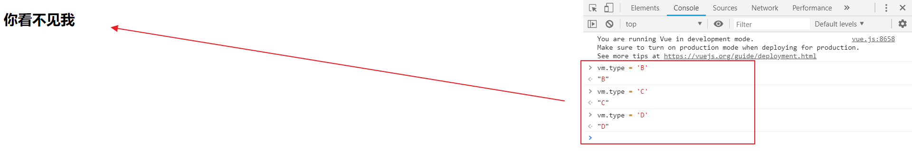
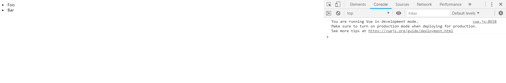
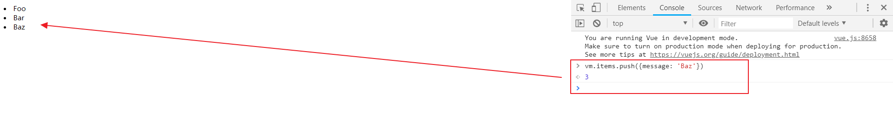

# 07-Vue 语法


## 条件判断语句

- `v-if`
- `v-else`

什么是条件判断语句，就不需要我说明了吧（￣▽￣），直接看语法上效果

### HTML

```html
<div id="vue">
    <h1 v-if="ok">YES</h1>
    <h1 v-else>NO</h1>
</div>
```

### JavaScript

```javascript
<script type="text/javascript">
    var vm = new Vue({
        el: '#vue',
        data: {
            ok: true
        }
    });
</script>
```

### 测试效果

- 在 `Chrome` 浏览器上运行，并按 `F12` 进入 `开发者工具`



- 在控制台输入 `vm.ok = false` ，然后 `回车`，你会发现浏览器中显示的内容会直接变成 `NO`



> **注意：** 使用 `v-*` 属性绑定数据是不需要 `双花括号` 包裹的

### 完整的 HTML

```html
<!DOCTYPE html>
<html>
<head>
    <meta charset="UTF-8">
    <title>语法篇 v-if</title>
    <script src="https://cdn.jsdelivr.net/npm/vue"></script>
</head>
<body>
<div id="vue">
    <h1 v-if="ok">YES</h1>
    <h1 v-else>NO</h1>
</div>
<script type="text/javascript">
    var vm = new Vue({
        el: '#vue',
        data: {
            ok: true
        }
    });
</script>
</body>
</html>
```


## 连续的条件判断语句

- `v-if`
- `v-else-if`
- `v-else`

### HTML

```html
<div id="vue">
    <h1 v-if="type === 'A'">A</h1>
    <h1 v-else-if="type === 'B'">B</h1>
    <h1 v-else-if="type === 'C'">C</h1>
    <h1 v-else>你看不见我</h1>
</div>
```

注：`===` 三个等号在 JS 中表示绝对等于（就是数据与类型都要相等）

### JavaScript

```javascript
<script type="text/javascript">
    var vm = new Vue({
        el: '#vue',
        data: {
            type: 'A'
        }
    });
</script>
```

### 测试效果

- 在 `Chrome` 浏览器上运行，并按 `F12` 进入 `开发者工具`



- 分别观察在控制台输入 `vm.type = 'B'、'C'、'D'` 的变化



### 完整的 HTML

```html
<!DOCTYPE html>
<html>
<head>
    <meta charset="UTF-8">
    <title>语法篇 v-else-if</title>
    <script src="https://cdn.jsdelivr.net/npm/vue"></script>
</head>
<body>
<div id="vue">
    <h1 v-if="type === 'A'">A</h1>
    <h1 v-else-if="type === 'B'">B</h1>
    <h1 v-else-if="type === 'C'">C</h1>
    <h1 v-else>你看不见我</h1>
</div>
<script type="text/javascript">
    var vm = new Vue({
        el: '#vue',
        data: {
            type: 'A'
        }
    });
</script>
</body>
</html>
```


## 循环遍历语句

- `v-for`

### HTML

```html
<div id="vue">
    <li v-for="item in items">
        {{ item.message }}
    </li>
</div>
```

注：`items` 是源数据数组并且 `item` 是数组元素迭代的别名。是不是像极了 `Thymeleaf`

### JavaScript

```java
<script type="text/javascript">
    var vm = new Vue({
        el: '#vue',
        data: {
            items: [
                {message: 'Foo'},
                {message: 'Bar'}
            ]
        }
    });
</script>
```

### 测试效果

- 在 `Chrome` 浏览器上运行，并按 `F12` 进入 `开发者工具`



- 在控制台输入 `vm.items.push({message: 'Baz'})` ，尝试追加一条数据，你会发现浏览器中显示的内容会增加一条 `Baz`



### 完整的 HTML

```html
<!DOCTYPE html>
<html>
<head>
    <meta charset="UTF-8">
    <title>语法篇 v-for</title>
    <script src="https://cdn.jsdelivr.net/npm/vue"></script>
</head>
<body>
<div id="vue">
    <li v-for="item in items">
        {{ item.message }}
    </li>
</div>
<script type="text/javascript">
    var vm = new Vue({
        el: '#vue',
        data: {
            items: [
                {message: 'Foo'},
                {message: 'Bar'}
            ]
        }
    });
</script>
</body>
</html>
```