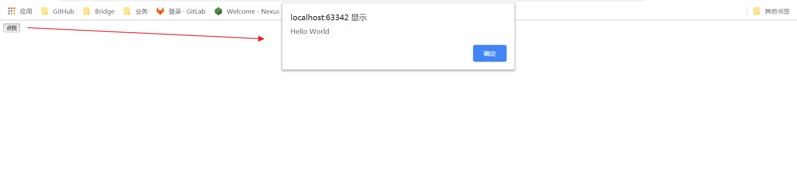

# 08-Vue 事件


## 监听事件

- `v-on`

## HTML

```html
<div id="vue">
    <button v-on:click="sayHi">点我</button>
</div>
```

注：在这里我们使用了 `v-on` 绑定了 `click` 事件，并指定了名为 `sayHi` 的方法

## JavaScript

方法必须定义在 Vue 实例的 `methods` 对象中

```javascript
<script type="text/javascript">
    var vm = new Vue({
        el: '#vue',
        data: {
            message: 'Hello World'
        },
        // 在 `methods` 对象中定义方法
        methods: {
            sayHi: function (event) {
                // `this` 在方法里指向当前 Vue 实例
                alert(this.message);
            }
        }
    });
</script>
```

## 测试效果



## 完整的 HTML

```html
<!DOCTYPE html>
<html xmlns:v-on="">
<head>
    <meta charset="UTF-8">
    <title>事件篇 v-on</title>
    <script src="https://cdn.jsdelivr.net/npm/vue"></script>
</head>
<body>
<div id="vue">
    <button v-on:click="sayHi">点我</button>
</div>
<script type="text/javascript">
    var vm = new Vue({
        el: '#vue',
        data: {
            message: 'Hello World'
        },
        // 在 `methods` 对象中定义方法
        methods: {
            sayHi: function (event) {
                // `this` 在方法里指向当前 Vue 实例
                alert(this.message);
            }
        }
    });
</script>
</body>
</html>
```