# IDEA中的Git操作


## 摘要

大家在使用Git时，都会选择一种Git客户端，在IDEA中内置了这种客户端，可以让你不需要使用Git命令就可以方便地进行操作，本文将讲述IDEA中的一些常用Git操作。


## 环境准备

- 使用前需要安装一个远程的Git仓库和本地的Git客户端。
- 由于IDEA中的Git插件需要依赖本地Git客户端，所以需要进行如下配置：


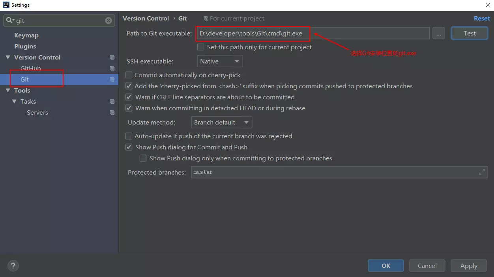


## 操作流程

> 我们这里使用mall-tiny项目的源代码来演示，尽可能还原一个正式的操作流程。

### 在Gitlab中创建一个项目并添加README文件


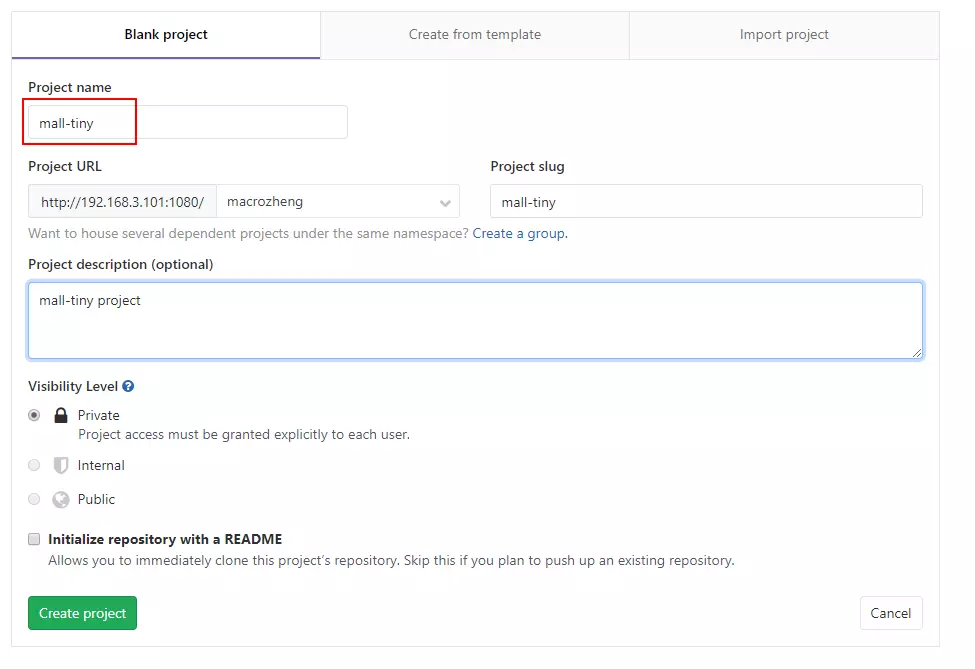


### clone项目到本地

- 打开从Git检出项目的界面：

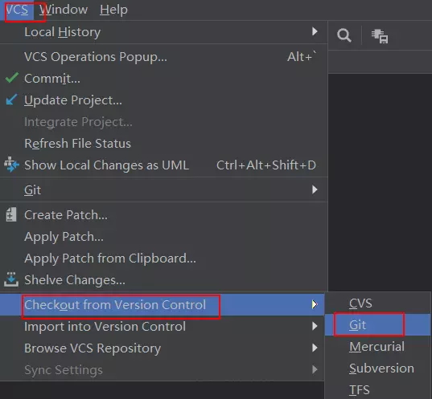


- 输入Git地址进行检出：

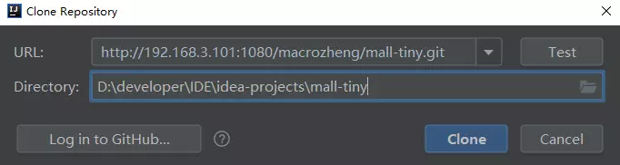


- 暂时不生成IDEA项目，因为项目还没初始化：

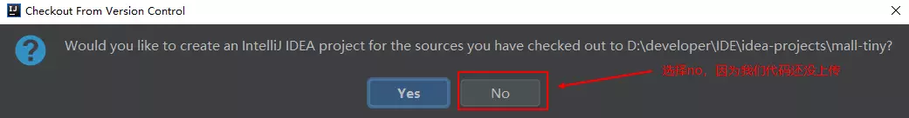


### 初始化项目并提交代码

- 将mall-tiny的代码复制到该目录中：


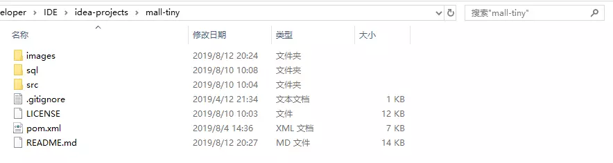


- 这里我们需要一个.gitignore文件来防止一些IDEA自动生成的代码被提交到Git仓库去：

```
# Maven #
target/

# IDEA #
.idea/
*.iml

# Eclipse #
.settings/
.classpath
.project
```

- 使用IDEA打开项目：


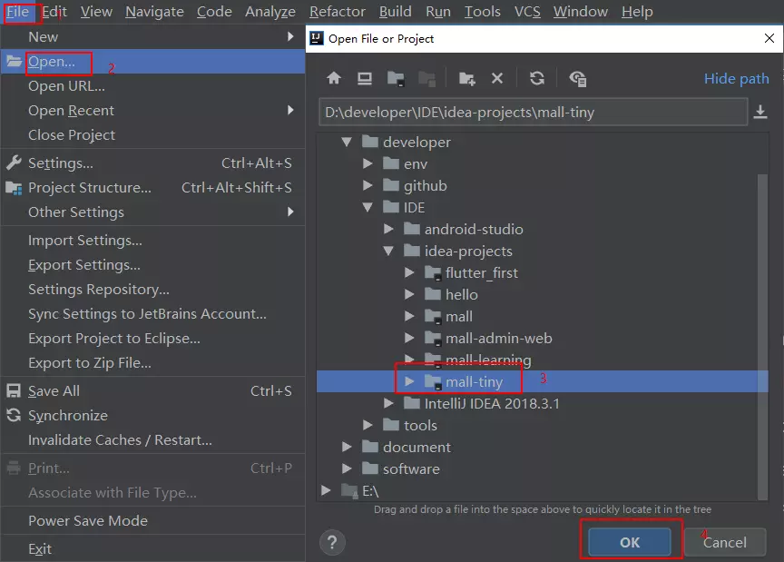


- 右键项目打开菜单，将所有文件添加到暂存区中：


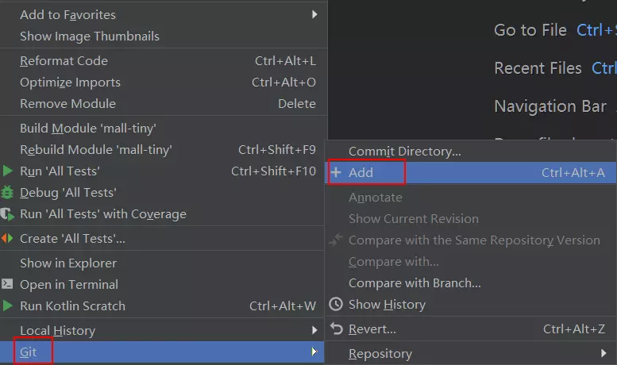


- 添加注释并提交代码：


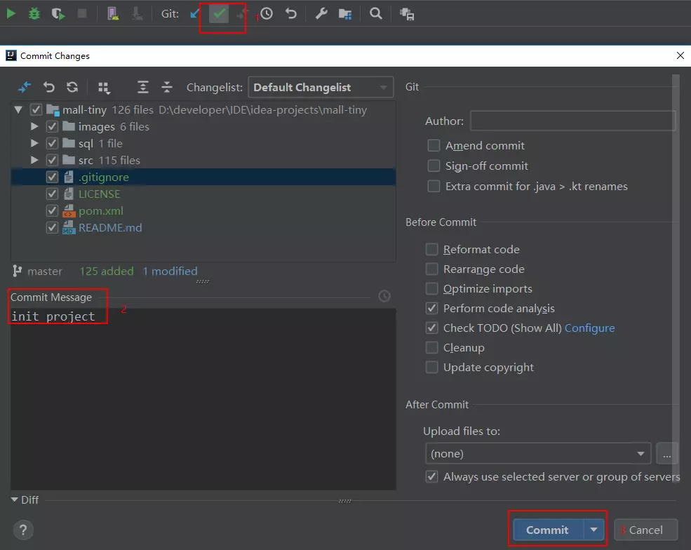


### 将代码推送到远程仓库

- 点击push按钮推送代码：


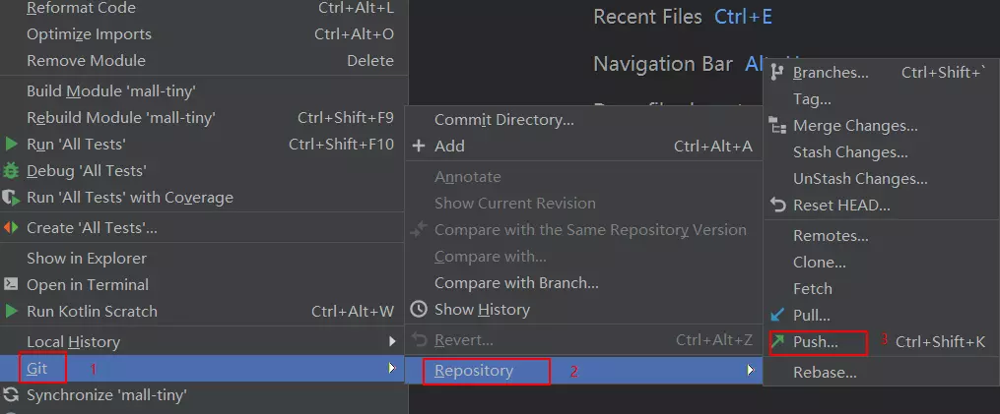


- 确认推送内容：

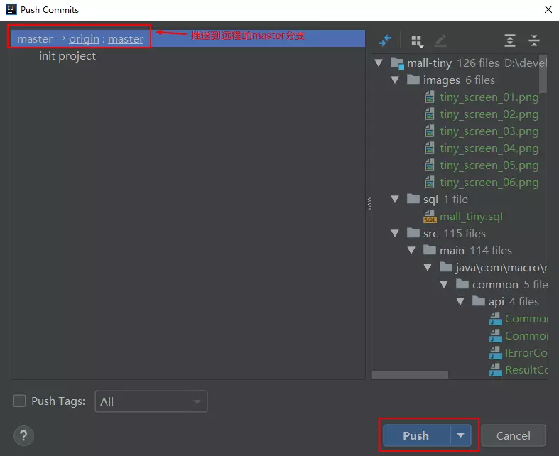


- 查看远程仓库发现已经提交完成：

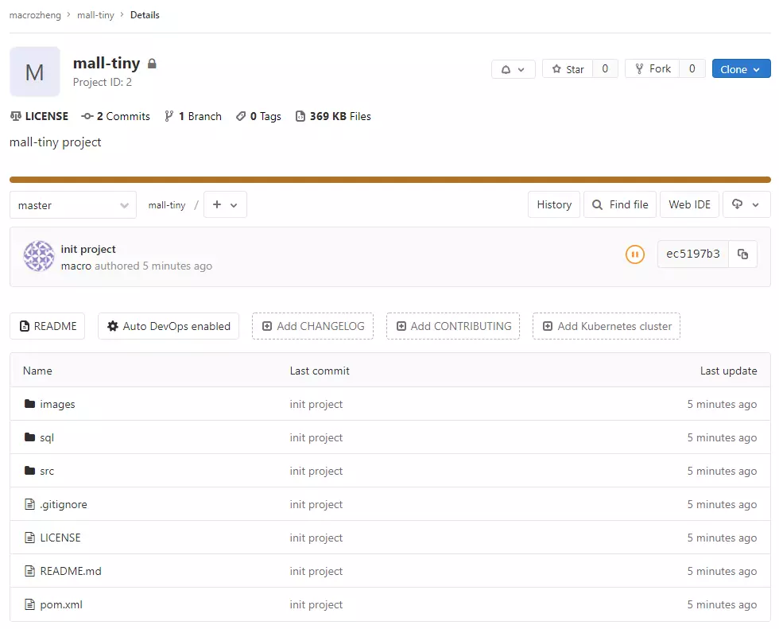


### 从远程仓库拉取代码

- 在远程仓库添加一个README-TEST.md文件：

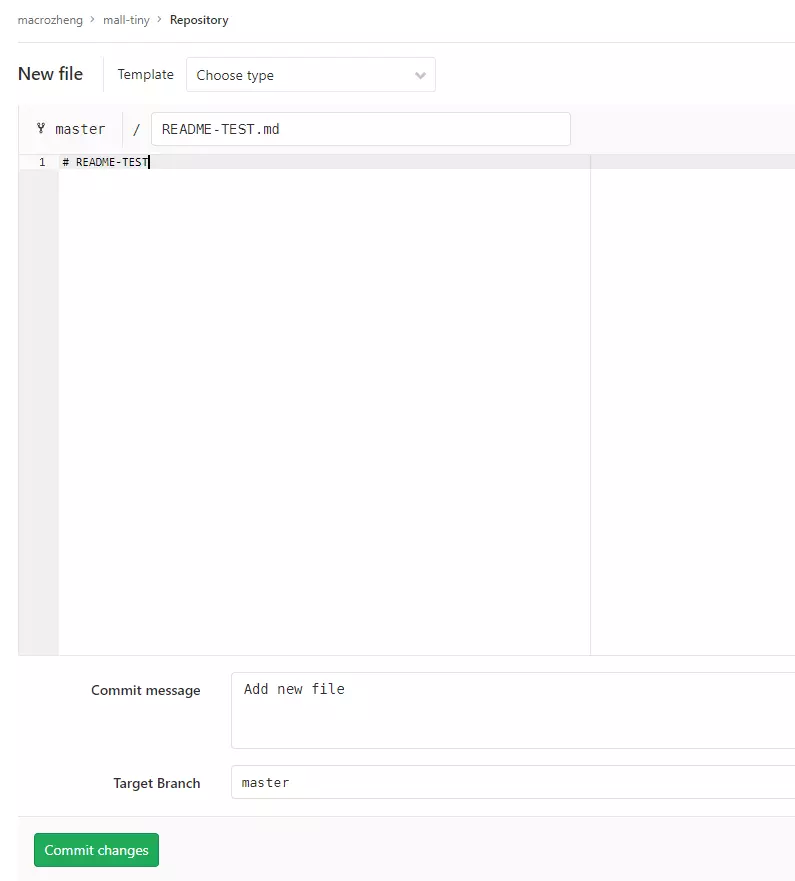


- 从远程仓库拉取代码：


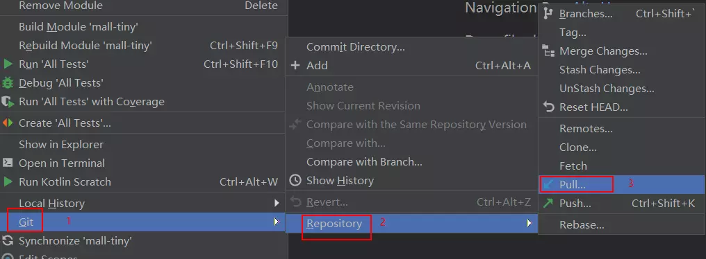


- 确认拉取分支信息：

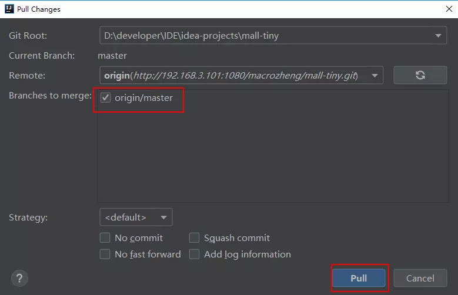


### 从本地创建分支并推送到远程

- 在本地创建dev分支，点击右下角的Git:master按钮：

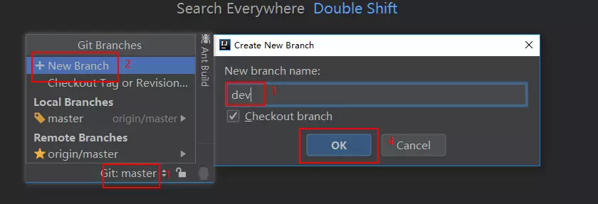


- 使用push将本地dev分支推送到远程：


- 确认推送内容：

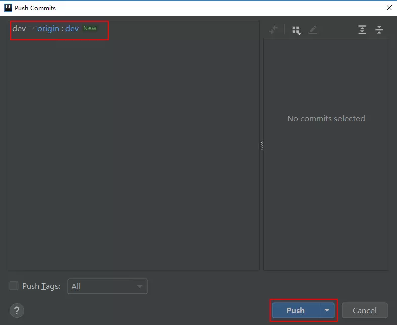


- 查看远程仓库发现已经创建了dev分支：

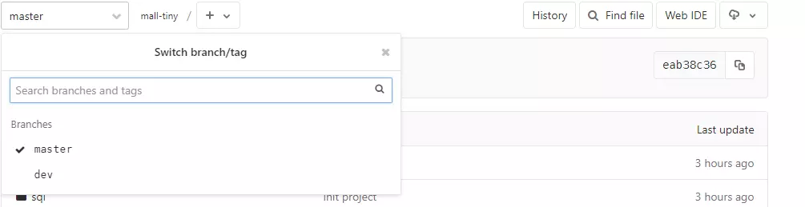


### 分支切换

- 从dev分支切换回master分支：

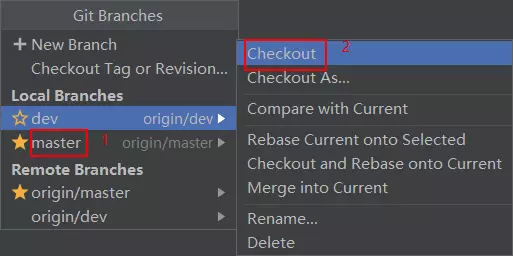


### Git文件冲突问题解决

- 修改远程仓库代码：

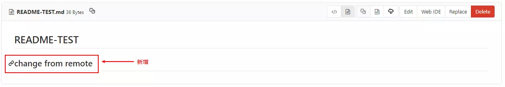


- 修改本地仓库代码：

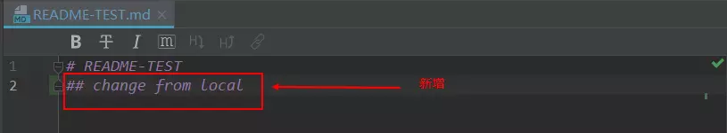


- 提交本地仓库代码并拉取，发现代码产生冲突，点击Merge进行合并：

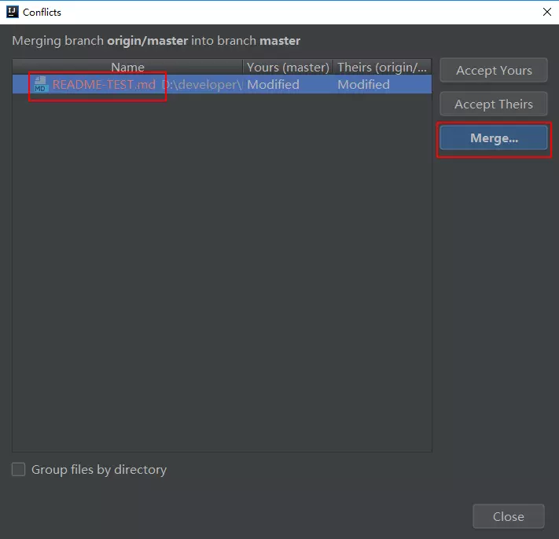


- 点击箭头将左右两侧代码合并到中间区域：

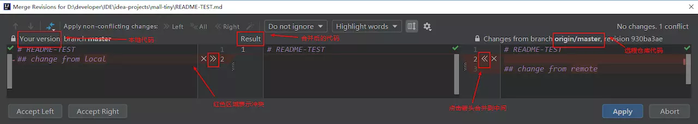


- 冲突合并完成后，点击Apply生效：

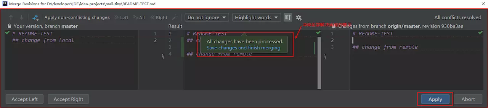


- 提交代码并推送到远程。


### 从dev分支合并代码到master

- 在远程仓库修改dev分支代码：

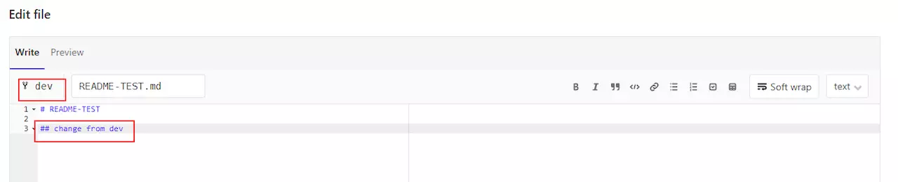


- 在本地仓库拉取代码，选择从dev分支拉取并进行合并：

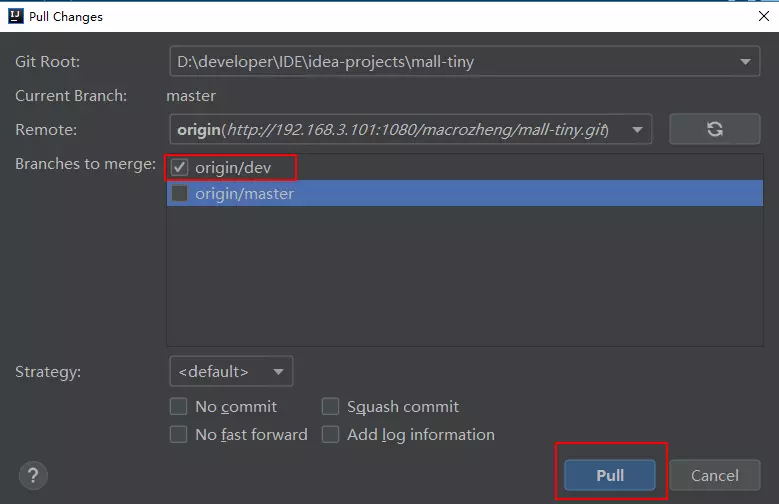


- 发现产生冲突，解决后提交并推送到远程仓库即可。


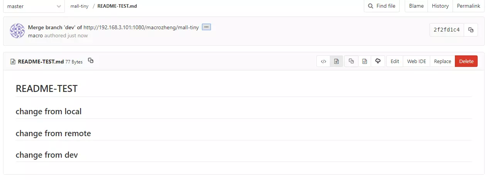


### 查看Git仓库提交历史记录


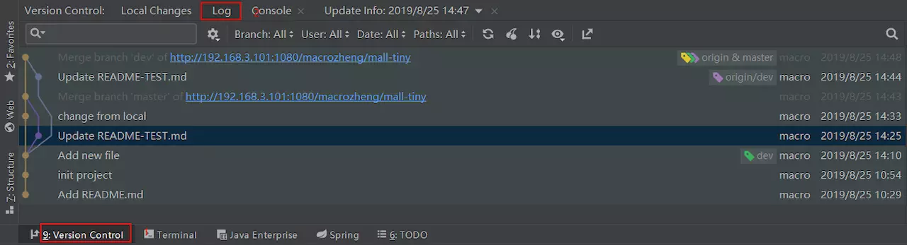


