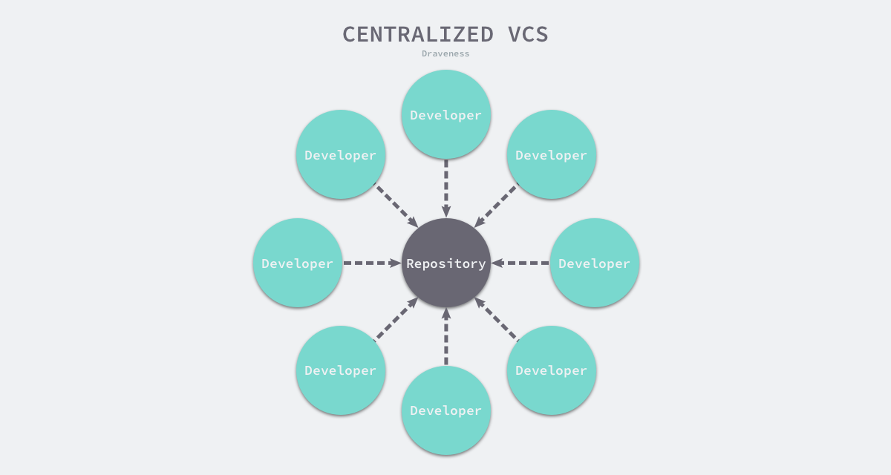
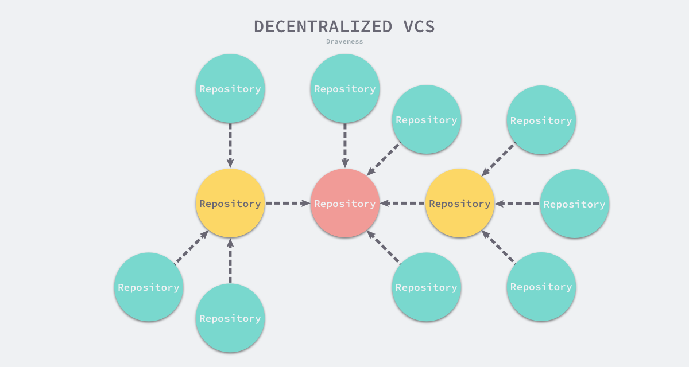

# 为什么你应该使用 Git 进行版本控制


> 为什么这么设计（Why’s THE Design）是一系列关于计算机领域中程序设计决策的文章，我们在这个系列的每一篇文章中都会提出一个具体的问题并从不同的角度讨论这种设计的优缺点、对具体实现造成的影响。如果你有想要了解的问题，可以在文章下面留言。

Git 是 Linus 在 2005 年开发出的版本控制系统（Version Control System），演化至今已经成为了最流行和最先进的开源版本控制工具，不过仍然有很多的公司和团队还在使用 SVN 或者 CVS 对项目进行版本控制，部分公司确实有一些可能合理的原因来维持现状，但是使用 Git 在绝大多数的场景下都能让我们的开发和合作变得更加高效。

很多关于 Git 与其他版本控制工具的对比文章和讨论都已经有着相当久的年头了，我们目前面对的开发场景与几年前有很多不同，而这些不同的版本控制工具也各自演化，不过作者始终认为 Git 是目前最高效的工具，这都是由顶层的设计思想决定的，我们今天就来看一看『为什么你应该使用 Git 进行版本控制』。

## 概述

当我们谈论最好的版本控制系统时，我们需要为 Git 找几个用于比较的对手，只有通过对手我们才能更清晰的理解 Git 背后的设计哲学为它带来了怎样与众不同的功能，而我们今天在介绍 Git 时可能就会同时比较 SVN 以及其他的版本控制工具。

无论是 Git、SVN 还是其他的版本控制系统，它们绝大多数的功能都是重叠的，所以很多时候我们也能找到不同工具之间命令的对照表，下面就是一个 Git 和 SVN 命令对照表，其中包括了两个不同工具对于检出仓库、更新本地仓库、本地提交和向主仓库提交几个最常用的简单命令：

```bash
# Check out the repository
+ svn checkout --username=<username> <repo>
+ git clone git://<repo>

# Update locally checked out files
+ svn update
+ git pull

# Commit files locally
+ N/A
+ git add <files> && git commit

# Add files to the main repo
+ svn commit
+ git push
```

虽然说这两个版本控制系统有很多等价的功能，但是从两者不同的地方我们就能看到它们在设计上的不同抉择，例如：SVN 不支持在本地提交文件，这一点背后的设计哲学就与 Git 完全不同。

在继续深入理解 Git 在设计上的决策之前，我们首先要回到今天要讨论的问题，也就是『为什么你应该使用 Git 进行版本控制』，我们可以换一种方式思考这个问题 —— 我们对于版本控制系统的的要求是什么，又应该如何定义一个更好的版本控制系统呢？Linus 在 2007 年的 [Google Talk](https://www.bilibili.com/video/av34867224?t=1494) 上曾经介绍过版本控制系统必须具有的三个特性：

1. 版本控制系统中的开发模型必须是分布式的；
2. 版本控制系统必须提供足够好的性能支持；
3. 版本控制系统必须保证文件的完整性，提供来自于数据丢失或者损坏的保护；


上述三点中的后两点是非常容易理解的，虽然很多人可能会疑惑为什么性能对于一个日常使用频率不高的版本控制工具如此重要，但是没有人拒绝性能的提升（尤其是在免费的情况下）。

## 设计

我们在上一节中已经介绍了版本控制系统必须满足的三个特性：分布式、高性能以及可靠性，在这里我们就会分别从这三个方面介绍 Linus 在设计 Git 时是如何满足自己提出的这些需求的：

- 分布式的方式更加符合版本控制系统的工作场景；
- 性能的提升能够鼓励我们做出成本更低的操作；
- 可靠性能帮助我们能够及时发现数据因磁盘故障而丢失或者损坏；

上述的几个特性对于一个好的版本控制系统来说缺一不可，我们会依次介绍它们的重要性以及 Git 是如何遵循这些规则来设计和实现的。

### 分布式

分布式对于一个版本控制工具非常重要，如果你从开发程序以来就一直使用 Git 作为版本控制工具的话，你可能无法体会使用集中式版本控制工具的局限性，假设我们使用的是一个集中式的版本控制系统的话，所有的开发者都必须连接到同一个服务器上才能进行开发和提交：



选择集中式的版本控制工具意味着我们必须接受以下的几个缺点：

1. 工程师必须都需要连接网络才能开发，在网络状况不好或者无网络的情况下无法进行提交；
   - 很多人可能认为自己并没有离线工作的需求，但是这实际上在我们的日常工作中也比较常见，百兆带宽虽然已经能够满足日常开发的需求，不过在复杂的网络环境下，很多时候我们还是会遇到无法联网或者网络极差的场景，例如在飞机和火车上；
   - 对于一个较大的分布式开发团队，在实际生产中我们也难以保证所有成员都能同时通过骨干网等高速网络连接到同一个主仓库；
2. 对中心仓库的提交和改动，例如创建分支等操作对于所有的开发人员都是可见的；
   - 当我们使用集中式的开发模型时，无论是提交代码还是创建新的实验分支，这些操作其实都会改变所有人共享的代码库，这也就意味着如果某个开发者创建了很多的实验分支，所有开发者的代码库也都会变大；
   - 虽然我们能在中心仓库中创建分支，但是由于中心仓库中不存在名空间，如果开发者创建分支没有遵循特定的命名规则，就非常容易出现命名冲突的问题，例如各种 `test` 分支；
3. 当前仓库的所有开发者都需要有直接向主仓库提交代码的权限，否则他们就无法进行开发；
   - 同时让项目中的所有开发者具有写权限其实是一件危险的事情，我们并不是知道这些开发者是否有着足够的经验操作主仓库，一旦出现操作上的失误，所有的成员都将面临这一失误带来的风险；

以上的三个问题都是集中式的主仓库带来的，它们是中心化的系统无法避免的问题，这些集中式版本控制系统的缺点非常影响它的使用体验，这也是为什么 Git 选择使用分布式的设计思想指导其实现，正是版本控制系统的场景其实与分布式的模型更加相似，所以通过分布式的模型能够很好地解决上述的关键问题。



在一个分布式的版本控制系统中，所有的节点在实现上都是等同的，只要有权限，它们都可以一次获取其他仓库中的全部数据。不同的节点之间可以互相拉取代码，我们可以使用 `git clone` 命令将某一个仓库中的全部数据下载到本地并在本地创建分支、修改和提交，也可以选择将新的改动推送到其他的节点上或者等待其他节点的拉取。

虽然在实现上所有的节点都是等同的，但是在实际操作中我们还可能会有一个或者多个主仓库帮助多个开发者同步代码，各个节点之间的关系更像一个可以分叉的树形结构，与中心化的版本控制系统相比，通过分布式的模型：

1. Git 可以让我们在本地进行提交以支持离线工作；
2. Git 可以让我们在本地创建分支并且没有命名空间冲突的问题；
3. Git 可以让提交通过 Pull Request 的方式进行，不需要所有的开发者都有主仓库的写权限；

集中式和分布式系统的特性也为 SVN 和 Git 带来一些其他的差异，例如 SVN 的所有版本号都是串行的递增数字，版本号不会有冲突的可能也更利于沟通和交流，Git 则使用由 40 个字母组成的 SHA-1 作为版本号，这一方面是因为一个分布式系统中没有全局时钟和版本的概念，另一个方面 SHA-1 能够作为 Checksum 验证仓库中的内容是否被更改，我们会在『可靠性』一节中详细介绍这一特性。

虽然分布式的版本控制系统能够为我们带来各种各样的好处，但是这并不是说集中式的系统就不能用，正相反在一些代码需要严格控制的项目中，集中式的版本控制系统却能更好的工作，这是因为企业或者项目在做决策时认为『代码需要非常严格的控制』，由此带来的效率降低等问题是可以接受的，所以这其实是对开发效率与权限审核的权衡。

> 很多公司和决策者因为不了解工程和版本控制系统，可能非常容易地就低估了集中式仓库带来的『效率降低』程度。

然而在实际场景中，真正需要严格控制的代码都非常少，大多数公司的内部代码都是一些秘密等级非常低的业务代码，不仅代码质量非常差、而且一旦脱离了公司的环境就无法运行，作为公司内部的开发者通过 Git 来访问这些代码不会有什么问题，通过计算机之外的方式对代码进行控制是一种效率更高的做法。

### 性能

性能对于一个版本控制系统也至关重要，但是更重要的其实是选取合适的指标对性能进行度量，Linus 在 [Google Talk](https://www.bilibili.com/video/av34867224?t=1494) 上的演讲就此嘲讽过 SVN 的开发者，因为它们选择将『创建分支』作为度量版本控制系统的重要性能，还在自己的官网上以此进行宣传（具体界面已经不可考证）。

然而『合并分支』的性能对于版本控制系统来说才更加重要，因为我们创建新分支的最终目的就是合并回主干分支，如果合并分支的性能非常差，每次合并可能都需要几十秒甚至几分钟，那么这种昂贵的代价就会使开发者谨慎地使用分支合并操作，很多人可能因为合并分支的复杂和困难选择直接在主干分支上开发，因为他们认为**只改一两行代码怎么可能会导致线上事故**！


今天的绝大多数开发者都已经在日常开发中使用 Git 进行版本控制了，分支的创建和合并是非常常用的功能，这其实是因为使用 Git 合并多个分支是一件非常容易并且快速的事情，它能在几秒钟以内将两个复杂的分支进行比较和合并，不需要等待较长的时间。

除此之外，使用 Git 来比较两个不同版本和不同文件夹之间的差异也是非常迅速的，作为分布式系统，每一个 Git 仓库都有全量的变更数据，我们不需要通过网络获取仓库的相关信息，与中心化的版本控制工具相比，在出现问题时我们也能快速定位导致问题的变更所在。

### 可靠性

可靠性对于一个版本控制系统来说也至关重要，专业的云服务商提供的磁盘都不一定能够保证我们数据的可靠性，避免数据损坏和丢失等问题，我们作为普通用户和开发者，更需要通过一些机制来保护我们的代码不会被损坏，如果版本控制系统不能为我们提供保护或者一致性的校验，我们可能就会遇到只有在编译或者打开文件时才会发现文件损坏的窘境。

Git 对每一个版本的提交都会生成一个 20 字节的 SHA-1 哈希，例如：`e328029255d8f02909ec0cbc16cc74ef4b79e1d0`，这个哈希就表示了当前提交的版本号，它是由以下的数据共同计算而来的：

- 当前提交的源代码树；
- 上一次提交的 SHA-1 哈希；
- 作者和提交人的名字、邮件等信息；
- 当前提交的消息；

你可以使用如下所示的命令来生成当前仓库 `HEAD` 的提交版本号，这个命令通过以上信息重新计算出了 `git commit` 命令为我们生成 SHA-1 哈希，你可以在 [这篇文章](https://gist.github.com/masak/2415865) 中找到更详细的解释：

```bash
$ (printf "commit %s\0" $(git cat-file commit HEAD | wc -c); git cat-file commit HEAD) | sha1sum
652baf18601eecf42521a1361a8815576bc8eb55  -
(base)
```

SHA-1 哈希的计算同时使用了源代码树、上一次提交的哈希、作者和提交人的信息以及当前提交的消息，所以只要使用的任何信息有所变动，我们就会在校验时发现哈希的不一致，从而检测出当前仓库的数据中包含数据的变更、损坏和丢失，同时这也能够帮助我们阻挡攻击者对仓库的恶意修改，因为即使对仓库修改成功，攻击者也很难保证哈希的不变，虽然在研究中表明这种的哈希冲突攻击是可能的，但是在实践中遇到这种问题的几率还是非常低。

> 由于 2017 年 GitHub 检测到了 [SHA-1 的哈希碰撞](https://github.blog/2017-03-20-sha-1-collision-detection-on-github-com/)，所以 Git 社区也在考虑使用更加复杂的哈希算法来替代 SHA-1，例如：SHA-256，[Git hash function transition](https://github.com/git/git/blob/master/Documentation/technical/hash-function-transition.txt) 是一篇关于 Git 如何从 SHA-1 迁移到更复杂的哈希的提案，感兴趣的读者可以简单阅读一下。


所有的 Commit 共同组成了一个链条，我们只要验证当前的提交版本是否合法，就能够信任整条链路上的全部提交，如果本地仓库的磁盘损坏，我们可以通过当前的提交记录从远程仓库上获取相同的代码并且通过下面的命令来验证仓库中的数据是否发生了损坏：

```bash
$ git fsck
Checking object directories: 100% (256/256), done.
Checking objects: 100% (1046479/1046479), done.
Checking connectivity: 1034279, done.
dangling blob 5d05609b383fffc5f9f36f65de0d7d7d3df91ce6
dangling blob 190de0ca85c16aef74c490127b94fa8ff04e168e
...
```

Git 通过 SHA-1 哈希的一致性检查，保证我们能够立刻感知到仓库中的数据损坏和变更，还能够帮助我们抵御来自攻击者对文件的恶意篡改，保证了仓库的安全和可靠性。

## 总结

文档和工具链对于一个工具来说十分重要，一个好的文档不仅能够帮助初学者快速上手，还能帮助使用者解决大多数使用过程中的困惑、理解工具背后的设计和实现，Git 的生态目前建设的也非常好，GitHub 和 GitLab 等服务商提供个人版和企业版的 Git 服务，图形界面的 Git 客户端和插件也降低了 Git 的使用门槛，SourceTree 和 IDE 的集成也不再需要我们直接使用命令行来进行操作（作者还是倾向于使用命令行），这些都帮助 Git 的生态走的更加成熟，也是为什么我们应该使用 Git 的重要原因。

我们还是需要简单总结一下正文中提出的一些观点：

1. Git 作为分布式的版本控制系统能够让开发者离线工作和本地提交，不仅能够避免直接提交大量代码带来的风险，还能帮助我们限制对主仓库的授权，减少由于命名空间导致的冲突问题；
2. Git 在优化性能时选择了合并分支作为主要的性能衡量指标，将合并分支变成了成本非常低的操作以鼓励分支的使用；
3. Git 通过 SHA-1 哈希来保证仓库中数据的可靠性，我们通过 SHA-1 就可以对数据进行校验，保证整个提交链条上的所有数据的稳定性和可靠性，也帮助我们抵御了来自攻击者的恶意篡改；

这里我们还是要强调，集中式的版本控制系统在一些需要严格控制源代码的公司中还是有着一席之地，不过我们总是可以通过将代码分到多个仓库来分别限制权限，但是如果这一操作并不可行，选择集中式的版本控制系统可能就是最后不得不做的选择。到最后，我们还是来看一些比较开放的相关问题，有兴趣的读者可以仔细想一下下面的问题：

- SVN 能够在哪些场景下发挥出 Git 无法发挥的作用？它有哪些特性是作为分布式系统的 Git 做不到的？
- 目前的 Git 在设计上有哪些缺点和问题，我们能不能改变它？如果能的话又如何改变它？
- 有没有什么方式能够帮助我们发现使用『哈希碰撞』进行的恶意攻击从而保证仓库的安全呢？

> 如果对文章中的内容有疑问或者想要了解更多软件工程上一些设计决策背后的原因，可以在博客下面留言，作者会及时回复本文相关的疑问并选择其中合适的主题作为后续的内容。

## Reference

- [Linus 在 2007 年 Google Talk 上介绍 Git](https://www.bilibili.com/video/av34867224?t=1494)
- [Subversion vs. Git: Myths and Facts](https://svnvsgit.com/)
- [A year of using Git: the good, the bad, and the ugly](https://ikriv.com/blog/?p=1905)
- [Proud to be a Moron – My Journey with Git](https://martinkolbblog.wordpress.com/2018/06/10/proud-to-be-a-moron-my-journey-with-git/)
- [GIT: a Nightmare of Mixed Metaphors](https://ventrellathing.wordpress.com/2013/01/25/git-a-nightmare-of-mixed-metaphors/)
- [10 things I hate about Git](https://stevebennett.me/2012/02/24/10-things-i-hate-about-git/)
- [What are the differences between Subversion and Git?](https://help.github.com/en/github/importing-your-projects-to-github/what-are-the-differences-between-subversion-and-git)
- [Which is better, SVN or Git?](https://www.quora.com/Which-is-better-SVN-or-Git)
- [关于滨野纯的访谈](http://blog.dyngr.com/blog/2013/09/26/junio-c-hamano-interview/)
- [SVN 和 Git 在日常使用中的明显差异](https://github.com/xirong/my-git/blob/master/why-git.md)
- [Why is Git better than Subversion?](https://stackoverflow.com/questions/871/why-is-git-better-than-subversion)
- [Git and Other Systems - Git as a Client](https://git-scm.com/book/en/v2/Git-and-Other-Systems-Git-as-a-Client)
- [SHA-1 collision detection on GitHub.com](https://github.blog/2017-03-20-sha-1-collision-detection-on-github-com/)
- [Git hash function transition](https://github.com/git/git/blob/master/Documentation/technical/hash-function-transition.txt)
- [Git series 1/3: Understanding git for real by exploring the .git directory](https://www.daolf.com/posts/git-series-part-1/)
- [Does Git prevent data degradation](https://superuser.com/questions/1253830/does-git-prevent-data-degradation)
- [How is git commit sha1 formed](https://gist.github.com/masak/2415865)
- [What does git fsck stand for?](https://stackoverflow.com/questions/21151945/what-does-git-fsck-stand-for)

### 关于图片和转载

[](http://creativecommons.org/licenses/by/4.0/)
[知识共享署名 4.0 国际许可协议](http://creativecommons.org/licenses/by/4.0/)