# 快速搭建自己的Git仓库


## 简介

GitLab是一款使用MIT许可证的基于网络的Git仓库管理工具，我们可以使用它来搭建自己的Git仓库，本文将介绍如何使用Gitlab在Linux下快速搭建Git仓库。

## Gitlab服务端搭建

> 在Linux（CenterOS7.6）下我们会以Docker的方式来安装Gitlab，对Docker不了解的朋友可以参考：[开发者必备Docker命令](https://mp.weixin.qq.com/s/d_CuljDTJq680NTndAay8g)。

### 下载Gitlab的Docker镜像

```bash
docker pull gitlab/gitlab-ce
```

### 运行如下命令来启动Gitlab

> 需要注意的是我们的Gitlab的http服务运行在宿主机的1080端口上，这里我们将Gitlab的配置，日志以及数据目录映射到了宿主机的指定文件夹下，防止我们在重新创建容器后丢失数据。

```bash
docker run --detach \
  --publish 10443:443 --publish 1080:80 --publish 1022:22 \
  --name gitlab \
  --restart always \
  --volume /mydata/gitlab/config:/etc/gitlab \
  --volume /mydata/gitlab/logs:/var/log/gitlab \
  --volume /mydata/gitlab/data:/var/opt/gitlab \
  gitlab/gitlab-ce:latest
```

### 开启防火墙的指定端口

> 由于Gitlab运行在1080端口上，所以我们需要开放该端口，注意千万不要直接关闭防火墙，否则Gitlab会无法启动。

```bash
# 开启1080端口
firewall-cmd --zone=public --add-port=1080/tcp --permanent 
# 重启防火墙才能生效
systemctl restart firewalld
# 查看已经开放的端口
firewall-cmd --list-ports
```

### 访问Gitlab

- 访问地址：http://192.168.3.101:1080/
- 由于Gitlab启动比较慢，需要耐心等待10分钟左右，如果Gitlab没有启动完成访问，会出现如下错误。


- 可以通过docker命令动态查看容器启动日志来知道gitlab是否已经启动完成。

```bash
docker logs gitlab -f
```


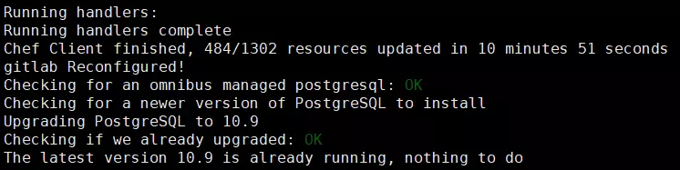


## Gitlab的使用

### Gitlab启动完成后第一次访问，会让你重置root帐号的密码


### 重置完成后输入帐号密码登录


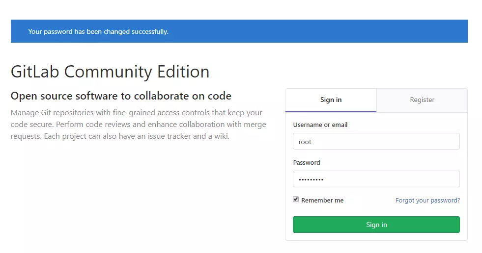


### 选择创建项目、创建组织、创建帐号


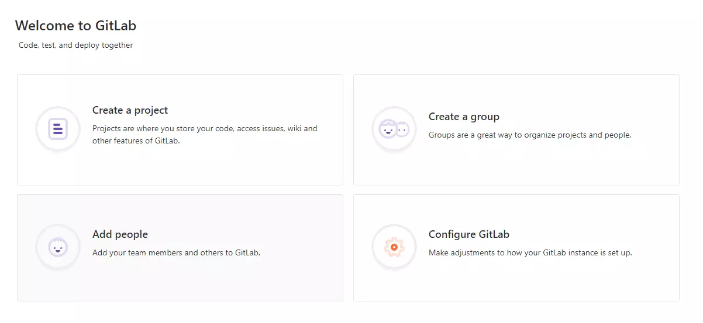


### 创建组织

首先我们需要创建一个组织，然后在这个组织下分别创建用户和项目，这样同组织的用户就可以使用该组织下的项目了。 


### 创建用户并修改密码

#### 找到添加用户的按钮


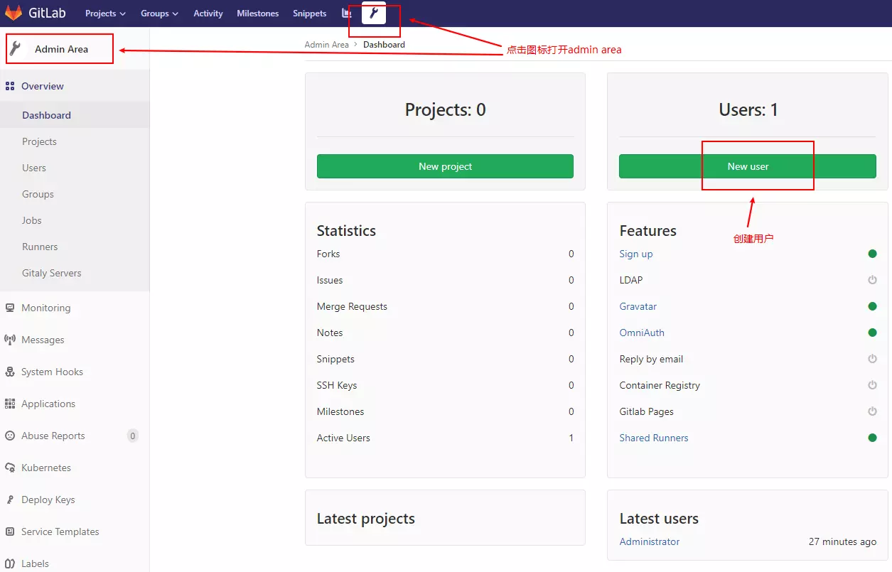


#### 输入用户名密码添加用户


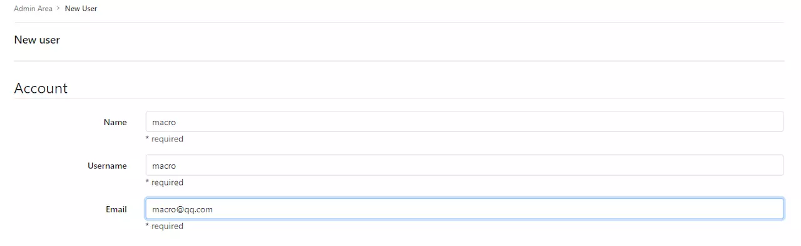


#### 在编辑界面中修改用户密码


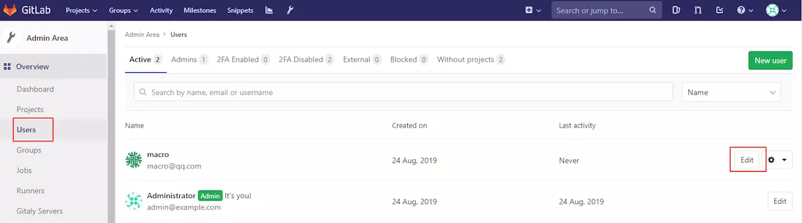


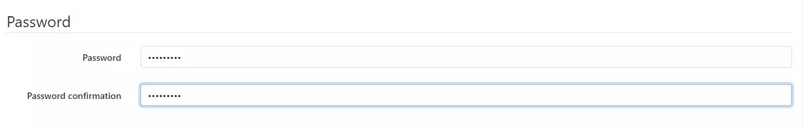


### 创建项目并添加README文件


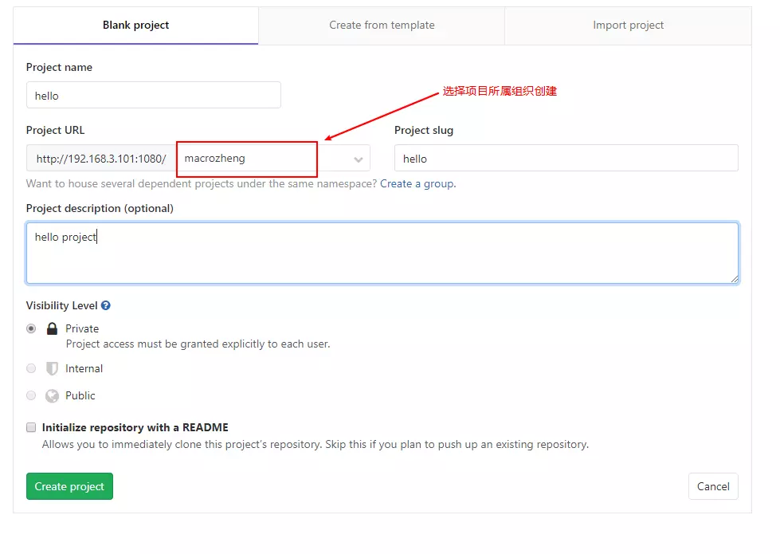


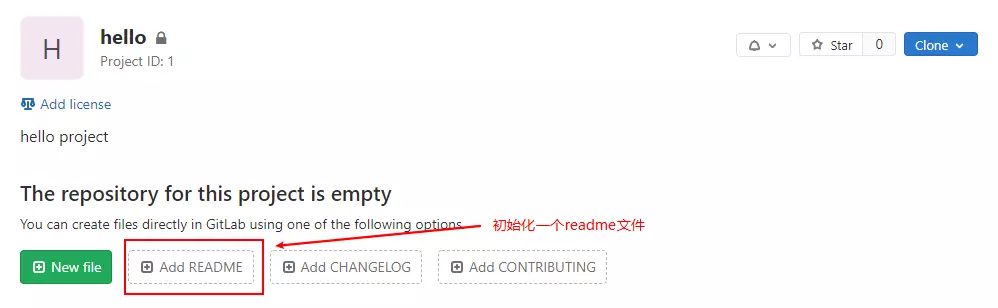


### 将用户分配到组织


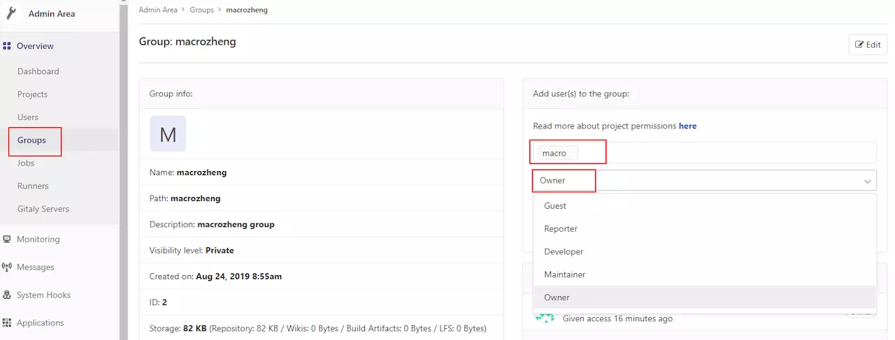


## Git客户端安装及使用

### 下载Git客户端并安装

- 下载地址：[github.com/git-for-win…](https://github.com/git-for-windows/git/releases/download/v2.23.0.windows.1/Git-2.23.0-64-bit.exe)
- 下载完成后，一路点击Next安装即可。


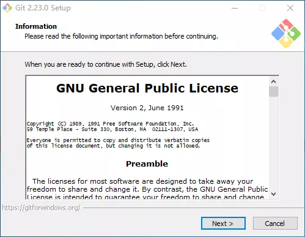


### clone项目

- 找到项目clone的地址：


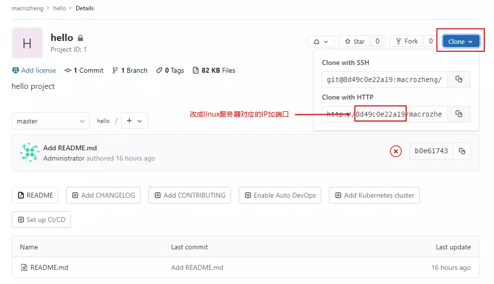


- 打开Git命令行工具：


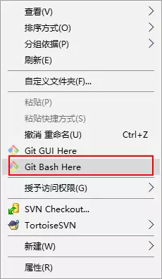


- 执行以下命令clone项目到本地：

```bash
git clone http://192.168.3.101:1080/macrozheng/hello.git
```

### 提交代码

进入项目目录，修改一下README.md并提交：

```bash
# 进入项目工程目录
cd hello/
# 将当前修改的文件添加到暂存区
git add .
# 提交代码
git commit -m "first commit"
```

### 推送到远程仓库

```bash
git push
```


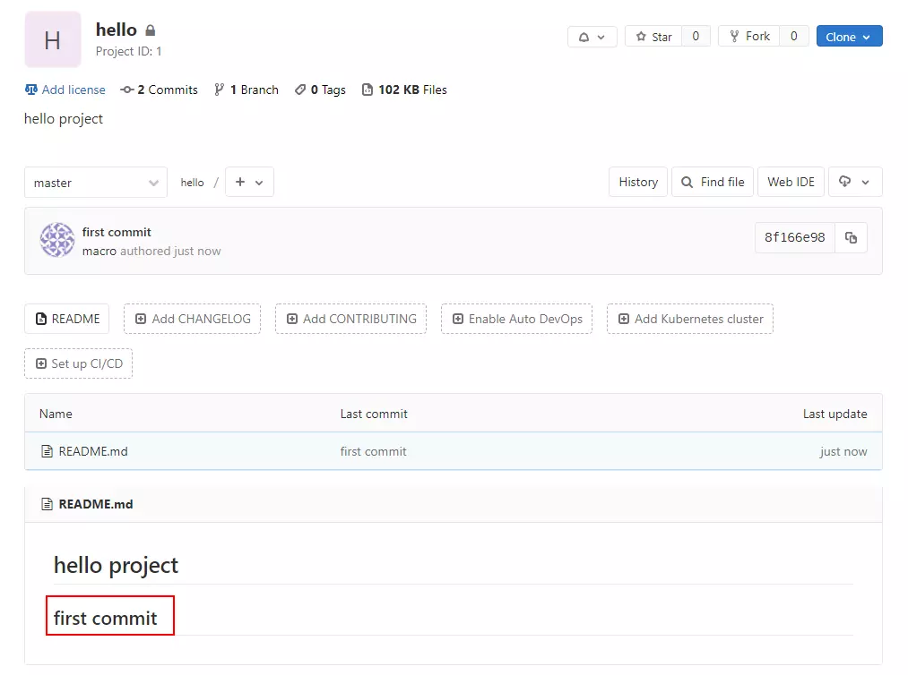


### 拉取远程仓库代码

- 在Gitlab上修改readme中的文件内容：


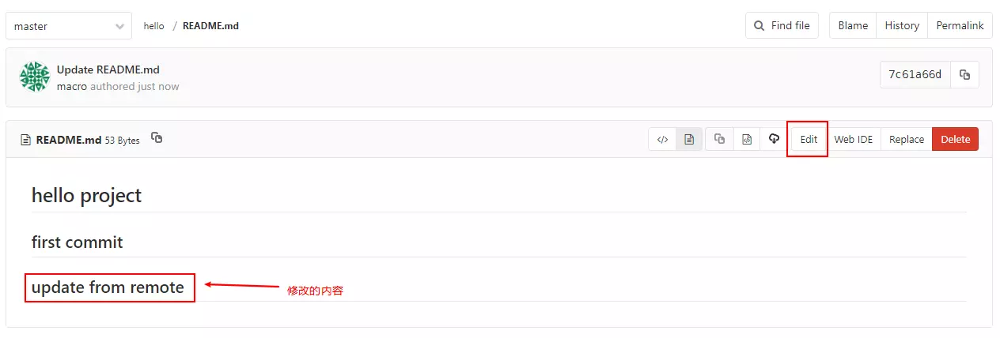


- 拉取代码：

```bash
git pull
```

### 本地创建并提交分支

```bash
# 切换并从当前分支创建一个dev分支
git checkout -b dev
# 将新创建的dev分支推送到远程仓库
git push origin dev
```


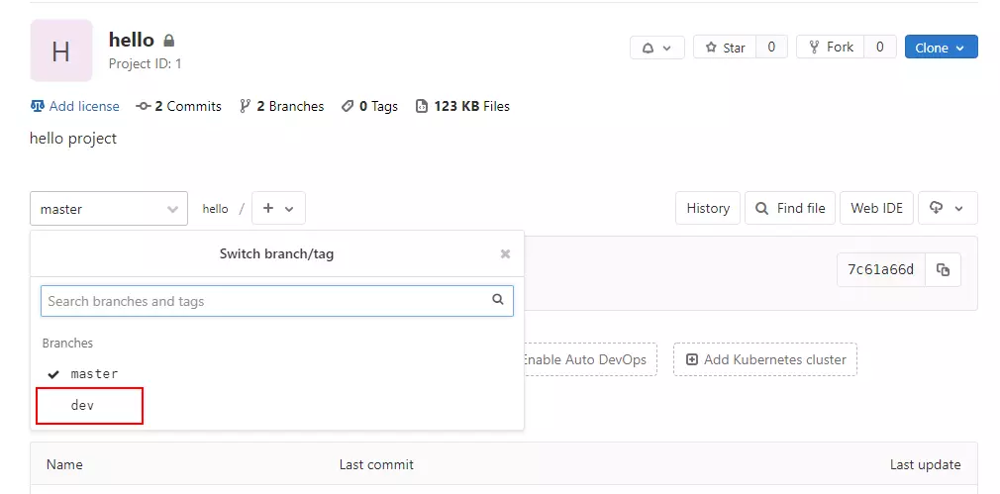


### 其他常用命令

```bash
# 切换到dev分支
git checkout dev
# 查看本地仓库文件状况
git status
# 查看本地所有分支
git branch
# 查看提交记录
git log
```

