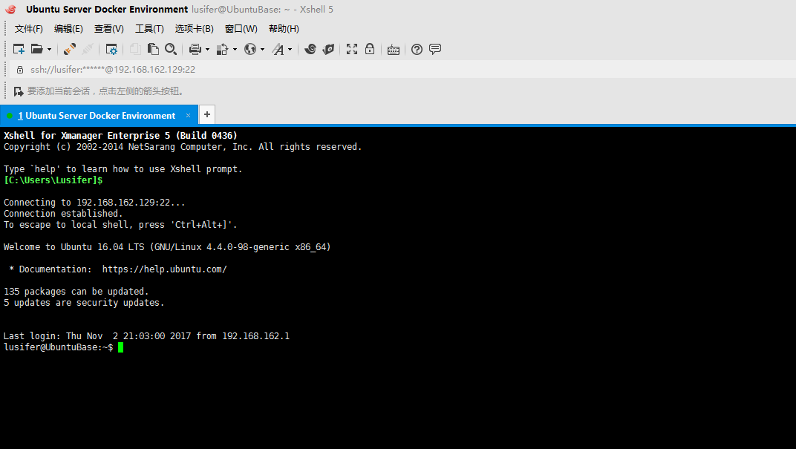
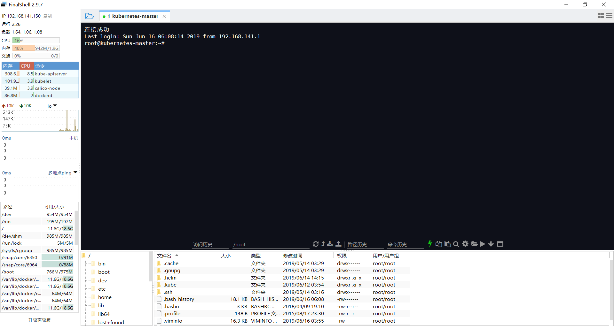

# 02-Linux远程控制管理

## 概述

传统的网络服务程序，FTP、POP、Telnet 本质上都是不安全的，因为它们在网络上通过明文传送口令和数据，这些数据非常容易被截获。SSH 叫做 `Secure Shell`。通过 SSH，可以把传输数据进行加密，预防攻击，传输的数据进行了压缩，可以加快传输速度。


## OpenSSH

SSH 是芬兰一家公司开发。但是受到版权和加密算法限制，现在很多人都使用 OpenSSH。OpenSSH 是 SSH 的替代软件，免费。OpenSSH 由客户端和服务端组成。

- **基于口令的安全验证：** 知道服务器的帐号密码即可远程登录，口令和数据在传输过程中都会被加密。
- **基于密钥的安全验证：** 此时需要在创建一对密钥，把公有密钥放到远程服务器上自己的宿主目录中，而私有密钥则由自己保存。

安装流程如下：

- 检查软件是否安装

```
sudo apt-cache policy openssh-client openssh-server
```

- 安装服务端

```
sudo apt-get install openssh-server
```

- 安装客户端

```
sudo apt-get install openssh-client
```

OpenSSH 服务器的主要配置文件为 `/etc/ssh/sshd\_config`，几乎所有的配置信息都在此文件中。


## XShell

XShell 是一个强大的安全终端模拟软件，它支持 SSH1, SSH2, 以及 Microsoft Windows 平台的 TELNET 协议。XShell 通过互联网到远程主机的安全连接以及它创新性的设计和特色帮助用户在复杂的网络环境中享受他们的工作。

XShell 可以在 Windows 界面下用来访问远端不同系统下的服务器，从而比较好的达到远程控制终端的目的。




## FinalShell

FinalShell 是一体化的的服务器，网络管理软件，不仅是 SSH 客户端，还是功能强大的开发，运维工具，充分满足开发，运维需求。

