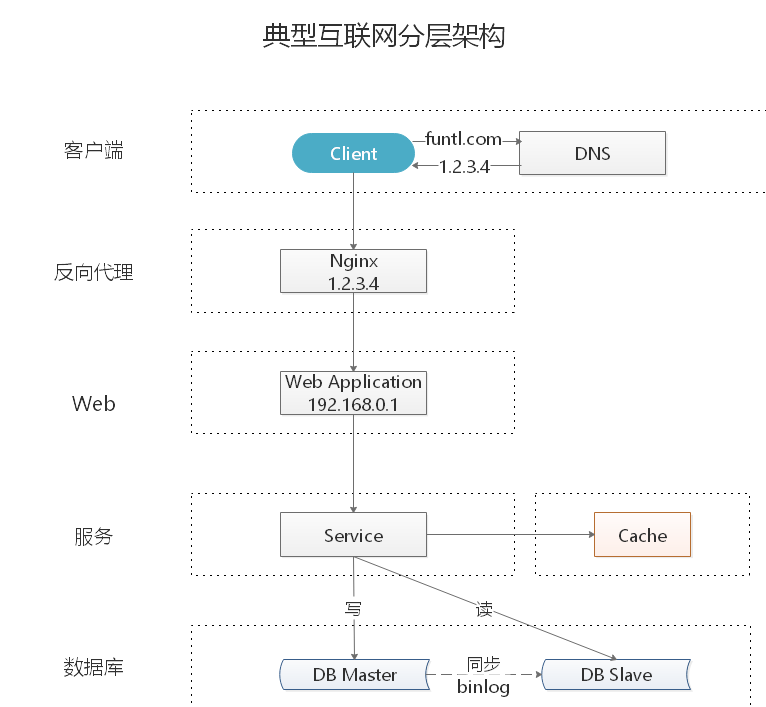
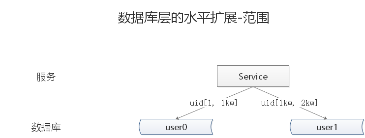

# 07-如何应对高并发

## 什么是高并发

高并发(High Concurrency)是互联网分布式系统架构设计中必须考虑的因素之一，它通常是指，通过设计保证系统能够同时并行处理很多请求。高并发相关常用的一些指标有 **响应时间(Response Time)**，**吞吐量(Throughput)**，**每秒查询率 QPS(Query Per Second)**，**并发用户数** 等。

- **响应时间：** 系统对请求做出响应的时间。例如系统处理一个 HTTP 请求需要 200ms，这个 200ms 就是系统的响应时间。
- **吞吐量：** 单位时间(年，月，日，时，分，秒)内处理的请求数量。
- **QPS：** 每秒响应请求数。在互联网领域，这个指标和吞吐量区分的没有这么明显。
- **并发用户数：** 同时承载正常使用系统功能的用户数量。例如一个即时通讯系统，同时在线量一定程度上代表了系统的并发用户数。

## 如何提升系统的并发能力

互联网分布式架构设计，提高系统并发能力的方式，方法论上主要有两种：**垂直扩展(Scale Up)** 与 **水平扩展(Scale Out)**。

### 垂直扩展

提升单机处理能力。垂直扩展的方式又有两种：

- 增强单机硬件性能，例如：增加 CPU 核数如 32 核，升级更好的网卡如万兆，升级更好的硬盘如 SSD，扩充硬盘容量如 2T，扩充系统内存如 128G；
- 提升单机架构性能，例如：使用 Cache 来减少 IO 次数，使用异步来增加单服务吞吐量，使用无锁数据结构来减少响应时间；

在互联网业务发展非常迅猛的早期，如果预算不是问题，强烈建议使用 “增强单机硬件性能” 的方式提升系统并发能力，因为这个阶段，公司的战略往往是发展业务抢时间，而 “增强单机硬件性能” 往往是最快的方法。

不管是提升单机硬件性能，还是提升单机架构性能，都有一个致命的不足：单机性能总是有极限的。所以互联网分布式架构设计高并发终极解决方案还是水平扩展。

### 水平扩展

只要增加服务器数量，就能线性扩充系统性能。水平扩展对系统架构设计是有要求的，如何在架构各层进行可水平扩展的设计，以及互联网公司架构各层常见的水平扩展实践，是本文重点讨论的内容。

## 典型互联网分层架构

- **客户端层：** 典型调用方是浏览器或手机应用 APP
- **反向代理层：** 系统入口(Ingress)，反向代理(Nginx)
- **站点应用层：** 实现核心应用逻辑，返回 HTML 或者 JSON
- **服务层：** 微服务体现在这一层
- **数据缓存层：** 缓存加速访问存储
- **数据库层：** 数据库持久化数据存储

## 水平扩展分层架构

### 反向代理层的水平扩展

反向代理层的水平扩展，是通过 **DNS 轮询** 实现的：DNS Server 对于一个域名配置了多个解析 IP，每次 DNS 解析请求来访问 DNS Server，会轮询返回这些 IP。

当 Nginx 成为瓶颈的时候，只要增加服务器数量，新增 Nginx 服务的部署，增加一个外网 IP，就能扩展反向代理层的性能，做到理论上的无限高并发。

### 站点应用层的水平扩展

站点层的水平扩展，是通过 **Nginx** 实现的。通过修改 `nginx.conf`，可以设置多个 Web 后端。

当 Web 后端成为瓶颈的时候，只要增加服务器数量，新增 Web 服务的部署，在 Nginx 配置中配置上新的 Web 后端，就能扩展站点层的性能，做到理论上的无限高并发。

### 服务层的水平扩展

服务层的水平扩展，是通过 **服务连接池** 实现的。

站点层通过 RPC Client 调用下游的服务层 RPC Server 时，RPC Client 中的连接池会建立与下游服务多个连接，当服务成为瓶颈的时候，只要增加服务器数量，新增服务部署，在 RPC Client 处建立新的下游服务连接，就能扩展服务层性能，做到理论上的无限高并发。如果需要优雅的进行服务层自动扩容，这里可能需要配置中心里服务自动发现功能的支持。

### 数据层的水平扩展

在数据量很大的情况下，数据层(缓存，数据库)涉及数据的水平扩展，将原本存储在一台服务器上的数据(缓存，数据库)水平拆分到不同服务器上去，以达到扩充系统性能的目的。

#### 按照范围水平拆分

每一个数据服务，存储一定范围的数据

- user0 库，存储 uid 范围 1-1kw
- user1 库，存储 uid 范围 1kw-2kw

**优点：**

- 规则简单，Service 只需判断一下 uid 范围就能路由到对应的存储服务
- 数据均衡性较好
- 比较容易扩展，可以随时加一个 uid [2kw,3kw] 的数据服务

**缺点：**

- 请求的负载不一定均衡，一般来说，新注册的用户会比老用户更活跃，大范围的服务请求压力会更大

#### 按照哈希水平拆分

每一个数据库，存储某个 key 值 hash 后的部分数据

- user0 库，存储偶数 uid 数据
- user1 库，存储奇数 uid 数据

**优点：**

- 规则简单，Service 只需对 uid 进行 hash 能路由到对应的存储服务
- 数据均衡性较好
- 请求均匀性较好

**缺点：**

- 不容易扩展，扩展一个数据服务，hash 方法改变时候，可能需要进行数据迁移

#### 水平拆分与主从同步

这里需要注意的是，通过水平拆分来扩充系统性能，与主从同步读写分离来扩充数据库性能的方式有本质的不同。

**通过水平拆分扩展数据库性能**

- 每个服务器上存储的数据量是总量的 1/n，所以单机的性能也会有提升
- n 个服务器上的数据没有交集，那个服务器上数据的并集是数据的全集
- 数据水平拆分到了 n 个服务器上，理论上读性能扩充了 n 倍，写性能也扩充了 n 倍(其实远不止 n 倍，因为单机的数据量变为了原来的 1/n)

**通过主从同步读写分离扩展数据库性能**

- 每个服务器上存储的数据量是和总量相同
- n 个服务器上的数据都一样，都是全集
- 理论上读性能扩充了 n 倍，写仍然是单点，写性能不变

> **注意：** 缓存层的水平拆分和数据库层的水平拆分类似，也是以范围拆分和哈希拆分的方式居多

## 总结

高并发(High Concurrency)是互联网分布式系统架构设计中必须考虑的因素之一，它通常是指，通过设计保证系统能够同时并行处理很多请求。

提高系统并发能力的方式，方法论上主要有两种：垂直扩展(Scale Up)与水平扩展(Scale Out)。前者垂直扩展可以通过提升单机硬件性能，或者提升单机架构性能，来提高并发性，但单机性能总是有极限的，**互联网分布式架构设计高并发终极解决方案还是后者：水平扩展**。

互联网分层架构中，各层次水平扩展的实践又有所不同：

- 反向代理层可以通过 **DNS 轮询** 的方式来进行水平扩展
- 站点层可以通过 Nginx 来进行水平扩展
- 服务层可以通过服务连接池来进行水平扩展
- 数据库可以按照数据范围，或者数据哈希的方式来进行水平扩展

各层实施水平扩展后，能够通过增加服务器数量的方式来提升系统的性能，做到理论上的性能无限。