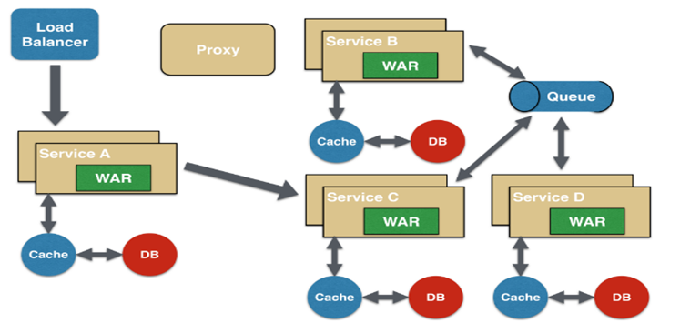

# 10-微服务设计模式

## 微服务架构需要考虑的问题

- API Gateway
- 服务间调用
- 服务发现
- 服务容错
- 服务部署
- 数据调用

## 聚合器微服务设计模式

这是一种最常见也最简单的设计模式

聚合器调用多个服务实现应用程序所需的功能。它可以是一个简单的 WEB 页面，将检索到的数据进行处理展示。它也可以是一个更高层次的组合微服务，对检索到的数据增加业务逻辑后进一步发布成一个新的微服务，这符合 **DRY** 原则。另外，每个服务都有自己的缓存和数据库。如果聚合器是一个组合服务，那么它也有自己的缓存和数据库。聚合器可以沿 `X轴` 和 `Z轴` 独立扩展。

## 代理微服务设计模式

这是聚合模式的一个变种，如下图所示

在这种情况下，客户端并不聚合数据，但会根据业务需求的差别调用不同的微服务。代理可以仅仅委派请求，也可以进行数据转换工作。

## 链式微服务设计模式

这种模式在接收到请求后会产生一个经过合并的响应，如下图所示

在这种情况下，`服务A` 接收到请求后会与 `服务B` 进行通信，类似地，`服务B` 会同 `服务C` 进行通信。所有服务都使用同步消息传递。在整个链式调用完成之前，客户端会一直阻塞。因此，服务调用链不宜过长，以免客户端长时间等待。

## 分支微服务设计模式

这种模式是聚合器模式的扩展，允许同时调用两个微服务链，如下图所示

## 数据共享微服务设计模式

自治是微服务的设计原则之一，就是说微服务是全栈式服务。但在重构现有的“单体应用（Monolithic Application）”时，SQL 数据库反规范化可能会导致数据重复和不一致。因此，在单体应用到微服务架构的过渡阶段，可以使用这种设计模式，如下图所示

在这种情况下，部分微服务可能会共享缓存和数据库存储。不过，这只有在两个服务之间存在强耦合关系时才可以。对于基于微服务的新建应用程序而言，这是一种反模式。

## 异步消息传递微服务设计模式

虽然 REST 设计模式非常流行，但它是同步的，会造成阻塞。因此部分基于微服务的架构可能会选择使用消息队列代替 REST 请求/响应，如下图所示

## 新架构新起点

对于微服务架构，最重要的是思维上的转变，技术不是问题，思想才是王道（**有道无术，术尚可求，有术无道，止于术**），对于做微服务开发的几点建议：

- **应用程序的核心是业务逻辑，按照业务或客户需求组织资源（这是最难的）**
- **做有生命的产品，而不是项目**
- **全栈化**
- **后台服务贯彻 Single Responsibility Principle（单一职责原则）**
- **VM -> Docker -> Kubernetes -> Istio**
- **DevOps**