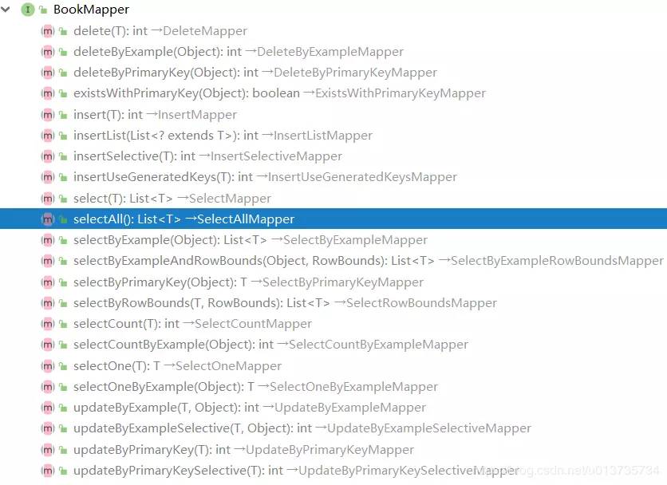

# 01-集成Mybatis的数据库连接池、通用mapper、pagehelper等


## 前言

MyBatis 是一款优秀的持久层框架，它支持定制化 SQL、存储过程以及高级映射。MyBatis 避免了几乎所有的 JDBC 代码和手动设置参数获取结果集的过程。MyBatis 可以使用简单的 `XML` 或`注解`来配置和映射原生信息，将接口和 Java 的 POJOs(Plain Old Java Objects,普通的 Java对象)映射成数据库中的记录。

关于 Mybatis 的基础知识可以查询官方文档，十分的详细。


## 数据表准备

既然是持久层框架，先准备一个用于实验操作的数据表。这里我们在 mysql 数据库中的添加一张 book 数据表。

```sql
CREATE TABLE `book` (
  `id` int(11) NOT NULL AUTO_INCREMENT,
  `author` varchar(255) DEFAULT NULL COMMENT '书籍作者',
  `name` varchar(255) DEFAULT NULL COMMENT '书籍名称',
  `price` float NOT NULL COMMENT '书籍价格',
  `create_time` datetime NOT NULL COMMENT '创建时间',
  `description` varchar(255) DEFAULT NULL COMMENT '书籍描述',
  PRIMARY KEY (`id`)
) ENGINE=InnoDB AUTO_INCREMENT=15 DEFAULT CHARSET=utf8;
```

增加测试数据。

```sql
INSERT INTO `book`(`id`, `author`, `name`, `price`, `create_time`, `description`) VALUES (2, '金庸', '笑傲江湖', 12, '2018-09-01 10:10:12', '是作家金庸创作的一部长篇武侠小说');
INSERT INTO `book`(`id`, `author`, `name`, `price`, `create_time`, `description`) VALUES (3, '罗贯中', '三国演义', 22, '2018-09-01 10:10:16', '是作家罗贯中创作的一部长篇历史小说');
INSERT INTO `book`(`id`, `author`, `name`, `price`, `create_time`, `description`) VALUES (4, '吴承恩', '西游记', 17, '2018-09-01 10:10:19', '是作家吴承恩创作的一部长篇小说');
INSERT INTO `book`(`id`, `author`, `name`, `price`, `create_time`, `description`) VALUES (5, '金庸1535767819284', '笑傲江湖1535767819284', 43, '2018-09-01 10:10:19', '是作家金庸创作的一部长篇武侠小说1535767819284');
INSERT INTO `book`(`id`, `author`, `name`, `price`, `create_time`, `description`) VALUES (6, '金庸1535767819679', '笑傲江湖1535767819679', 24, '2018-09-01 10:10:20', '是作家金庸创作的一部长篇武侠小说1535767819679');
INSERT INTO `book`(`id`, `author`, `name`, `price`, `create_time`, `description`) VALUES (7, '罗贯中1535769035138', '三国演义1535769035138', 20, '2018-09-01 10:30:35', '是罗贯中创作的一部小说1535769035138');
INSERT INTO `book`(`id`, `author`, `name`, `price`, `create_time`, `description`) VALUES (9, '金庸1535783613226', '笑傲江湖1535783613226', 30, '2018-09-01 14:33:33', '是作家金庸创作的一部长篇武侠小说1535783613226');
INSERT INTO `book`(`id`, `author`, `name`, `price`, `create_time`, `description`) VALUES (10, '金庸1535783618455', '笑傲江湖1535783618455', 30, '2018-09-01 14:33:38', '是作家金庸创作的一部长篇武侠小说1535783618455');
INSERT INTO `book`(`id`, `author`, `name`, `price`, `create_time`, `description`) VALUES (11, '金庸1535783620634', '笑傲江湖1535783620634', 30, '2018-09-01 14:33:41', '是作家金庸创作的一部长篇武侠小说1535783620634');
INSERT INTO `book`(`id`, `author`, `name`, `price`, `create_time`, `description`) VALUES (12, '金庸1535783672457', '笑傲江湖1535783672457', 30, '2018-09-01 14:34:32', '是作家金庸创作的一部长篇武侠小说1535783672457');
INSERT INTO `book`(`id`, `author`, `name`, `price`, `create_time`, `description`) VALUES (13, '金庸1535783673664', '笑傲江湖1535783673664', 30, '2018-09-01 14:34:34', '是作家金庸创作的一部长篇武侠小说1535783673664');
INSERT INTO `book`(`id`, `author`, `name`, `price`, `create_time`, `description`) VALUES (14, '金庸1535783939262', '笑傲江湖1535783939262', 30, '2018-09-01 14:38:59', '是作家金庸创作的一部长篇武侠小说1535783939262');
```


## 引入依赖
pom.xml中加入依赖

```xml
<dependencies>
    <dependency>
        <groupId>org.springframework.boot</groupId>
        <artifactId>spring-boot-starter-web</artifactId>
    </dependency>
    <dependency>
        <groupId>org.springframework.boot</groupId>
        <artifactId>spring-boot-starter-aop</artifactId>
    </dependency>
    <dependency>
        <groupId>org.springframework.boot</groupId>
        <artifactId>spring-boot-devtools</artifactId>
        <scope>runtime</scope>
        <optional>true</optional>
    </dependency>
    <dependency>
        <groupId>org.projectlombok</groupId>
        <artifactId>lombok</artifactId>
        <optional>true</optional>
    </dependency>
    <dependency>
        <groupId>org.springframework.boot</groupId>
        <artifactId>spring-boot-starter-test</artifactId>
        <scope>test</scope>
    </dependency>    

    <!-- HikariCP 依赖 -->
    <dependency>
        <groupId>com.zaxxer</groupId>
        <artifactId>HikariCP</artifactId>
    </dependency>
    <dependency>
        <groupId>org.springframework.boot</groupId>
        <artifactId>spring-boot-starter-jdbc</artifactId>
        <exclusions>
            <!-- 排除 tomcat-jdbc 以使用 HikariCP -->
            <exclusion>
                <groupId>org.apache.tomcat</groupId>
                <artifactId>tomcat-jdbc</artifactId>
            </exclusion>
        </exclusions>
    </dependency>
    
    <!-- MySQL 驱动 -->
    <dependency>
        <groupId>mysql</groupId>
        <artifactId>mysql-connector-java</artifactId>
    </dependency>

    <!-- tk.mybatis -->
    <dependency>
        <groupId>tk.mybatis</groupId>
        <artifactId>mapper-spring-boot-starter</artifactId>
        <version>2.1.5</version>
    </dependency>
    
    <!-- PageHelper -->
    <dependency>
        <groupId>com.github.pagehelper</groupId>
        <artifactId>pagehelper-spring-boot-starter</artifactId>
        <version>1.2.12</version>
    </dependency>
    
</dependencies>
```


## 添加配置

我们在SpringBoot的配置文件`application-dev.yml`中加入以下配置：

```yaml
#========================================
# Mybatis配置
#========================================
mybatis:
  mapper-locations: classpath:mapper/*.xml
  type-aliases-package: com.devclub.crays.domain

pagehelper:
  dialect: mysql
  reasonable: true
  support-methods-arguments: true

#========================================
# Spring配置
#========================================
spring:
  datasource:
    type: com.zaxxer.hikari.HikariDataSource
    driver-class-name: com.mysql.cj.jdbc.Driver
    url: jdbc:mysql://localhost:3306/mtfp?useUnicode=true&characterEncoding=utf-8&useSSL=false&serverTimezone=Asia/Shanghai
    username: root
    password: 123456
    hikari:
      minimum-idle: 5
      idle-timeout: 600000
      maximum-pool-size: 10
      auto-commit: true
      pool-name: MyHikariCP
      max-lifetime: 1800000
      connection-timeout: 30000
      connection-test-query: SELECT 1
```


## 自动生成通用Mapper

之前我们都是手写每张表对应的Mapper，都是体力活儿，而且很繁琐，浪费时间。那么有没有什么方法，可以帮我们完成这个工作呢？那当然是有啦。接下来。我们引入通用 Mapper ，然后再进行Mapper的生成，生成的代码非常简洁。


### 自动生成的配置

自动生成通用接口分为两步，第一步是编写生成配置文件。

该配置文件我们放到`resources`-`generator`-`generatorConfig.xml`中，注释也很详细，代码如下：

```xml
<?xml version="1.0" encoding="UTF-8"?>
<!DOCTYPE generatorConfiguration
        PUBLIC "-//mybatis.org//DTD MyBatis Generator Configuration 1.0//EN"
        "http://mybatis.org/dtd/mybatis-generator-config_1_0.dtd">

<generatorConfiguration>
    <context id="MysqlContext" targetRuntime="MyBatis3Simple" defaultModelType="flat">
        <property name="beginningDelimiter" value="`"/>
        <property name="endingDelimiter" value="`"/>
        <property name="javaFileEncoding" value="UTF-8"/>
        <!-- 是否使用通用 Mapper 提供的注释工具，默认 true 使用，这样在生成代码时会包含字段的注释（目前只有 mysql 和 oracle 支持）-->
        <property name="useMapperCommentGenerator" value="true"/>

        <plugin type="tk.mybatis.mapper.generator.MapperPlugin">
            <!-- 配置后生成的 Mapper 接口都会自动继承这个接口-->
            <property name="mappers" value="tk.mybatis.mapper.common.MySqlMapper"/>
        </plugin>

        <plugin type="tk.mybatis.mapper.generator.MapperPlugin">
            <!-- 配置后生成的 Mapper 接口都会自动继承这个接口 -->
            <property name="mappers" value="tk.mybatis.mapper.common.Mapper"/>
            <!-- 是否区分大小写，默认 false -->
            <property name="caseSensitive" value="true"/>
        </plugin>
        
        
        <!-- 配置数据库连接 -->
        <jdbcConnection driverClass="com.mysql.cj.jdbc.Driver"
                        connectionURL="jdbc:mysql://127.0.0.1:3306/springboot?characterEncoding=utf-8&amp;serverTimezone=GMT%2B8&amp;nullCatalogMeansCurrent=true"
                        userId="root"
                        password="123456">
        </jdbcConnection>

        <!-- 配置生成的实体类所在包 -->
        <javaModelGenerator targetPackage="com.devclub.crays.domain" targetProject="src/main/java"/>

        <!-- 配置生成的mapper所在目录 -->
        <sqlMapGenerator targetPackage="mapper" targetProject="src/main/resources"/>

        <!-- 配置mapper对应的java映射 -->
        <javaClientGenerator targetPackage="com.devclub.crays.mapper" targetProject="src/main/java" type="XMLMAPPER"/>

        <!-- 要生成那些表(更改tableName和domainObjectName就可以) -->
        <table tableName="book" domainObjectName="Book"/>

    </context>
</generatorConfiguration>
复制代码
```

**注意：** 我们增加了两个 `plugin`，后面生成的 Mapper 接口都会自动继承这两个接口。


### 自动生成代码

**方式一：**

写好配置文件之后，还需要写一个生成程序，用于加载配置文件，运行就可以生成相关的实体类、Mapper 接口、Mapper xml .

```java
import org.mybatis.generator.api.MyBatisGenerator;
import org.mybatis.generator.config.Configuration;
import org.mybatis.generator.config.xml.ConfigurationParser;
import org.mybatis.generator.internal.DefaultShellCallback;
import java.io.File;
import java.util.ArrayList;

/**
 * <p>
 * Mybatis generator的逆向生成工具类
 *
 * @Author Ryu
 */
public class MybatisGenerator {

    public void generator() throws Exception {
        ArrayList<String> warnings = new ArrayList<>();
        boolean overwrite = true;
        // 指定配置文件
        File configFile = new File("generatorConfig.xml");
        System.out.println(configFile.getAbsolutePath());
        ConfigurationParser cp = new ConfigurationParser(warnings);
        Configuration config = cp.parseConfiguration(configFile);
        DefaultShellCallback callback = new DefaultShellCallback(overwrite);
        MyBatisGenerator myBatisGenerator = new MyBatisGenerator(config, callback, warnings);
        myBatisGenerator.generate(null);
        for (String warning : warnings) {
            System.out.println(warning);
        }
    }

    public static void main(String[] args) throws Exception {
        MybatisGenerator mybatisGenerator = new MybatisGenerator();
        mybatisGenerator.generator();
    }
}
```


**方式二：**

除了这种方法之外，还有一种方式，就是通过配置maven插件，来完成代码的自动生成。

在 `pom.xml` 文件中添加插件配置：

```xml
<build>
        <plugins>           

            <!-- Mybatis代码生成插件 -->
            <plugin>
                <groupId>org.mybatis.generator</groupId>
                <artifactId>mybatis-generator-maven-plugin</artifactId>
                <version>1.3.7</version>
                <configuration>
                    <configurationFile>${basedir}/src/main/resources/generator/generatorConfig.xml</configurationFile>
                    <overwrite>true</overwrite>
                    <verbose>true</verbose>
                </configuration>
                <dependencies>
                    <dependency>
                        <groupId>mysql</groupId>
                        <artifactId>mysql-connector-java</artifactId>
                        <version>${mysql.version}</version>
                    </dependency>
                    <dependency>
                        <groupId>tk.mybatis</groupId>
                        <artifactId>mapper</artifactId>
                        <version>4.1.5</version>
                    </dependency>
                </dependencies>
            </plugin>
            
        </plugins>
    </build>
```

然后运行maven插件即可完成代码的自动生成，也很方便。


### 自动生成结果

运行完毕上面程序之后，自动生成了 Book.java.

```java
@Table(name = "book")
@ToString // 手动添加的 tostring 注解
public class Book {
    @Id
    private Integer id;

    /**
     * 书籍作者
     */
    private String author;

    /**
     * 书籍名称
     */
    private String name;

    /**
     * 书籍价格
     */
    private Float price;

    // 省略下面的自动生成代码
}
```


### 通用 Mapper

上面的程序也自动生成了 BookMapper 接口，且继承了配置的 MySqlMapper 和 Mapper 接口。

```java
import net.codingme.boot.domain.Book;
import org.springframework.stereotype.Repository;
import tk.mybatis.mapper.common.Mapper;
import tk.mybatis.mapper.common.MySqlMapper;

@Repository
public interface BookMapper extends MySqlMapper<Book>, Mapper<Book> {
}
```


这两个接口里实现了很多常用操作。




生成完成之后要在 Springboot 启动器上添加 MapperScan 注解指定要扫描的 mapper 位置。

```java
@tk.mybatis.spring.annotation.MapperScan(basePackages = "com.devclub.crays.mapper")
@SpringBootApplication
public class BootApplication {

    public static void main(String[] args) {
        SpringApplication.run(BootApplication.class, args);
    }
}
```


## 单元测试和分页测试

编写 BookMapperTest 单元测试用于测试 BookMapper 的方法。

```java
package com.devclub.crays.mapper;

import com.github.pagehelper.Page;
import com.github.pagehelper.PageHelper;
import com.github.pagehelper.PageInfo;
import net.codingme.boot.domain.Book;
import org.junit.Assert;
import org.junit.Test;
import org.junit.runner.RunWith;
import org.springframework.beans.factory.annotation.Autowired;
import org.springframework.boot.test.context.SpringBootTest;
import org.springframework.test.context.junit4.SpringRunner;

import java.util.List;

@RunWith(SpringRunner.class)
@SpringBootTest
public class BookMapperTest {

    @Autowired
    private BookMapper bookMapper;

    @Test
    public void testSelectOne() {
        Book book = new Book();
        book.setId(2);
        Book selectOne = bookMapper.selectOne(book);
        Assert.assertNotNull(selectOne);
        System.out.println(selectOne);
    }

    @Test
    public void testSelectByPrimaryKey() {
        Book book = bookMapper.selectByPrimaryKey(2);
        Assert.assertNotNull(book);
        System.out.println(book);
    }

    /**
     * 分页测试
     */
    @Test
    public void testSelectPageInfo() {
        PageHelper.startPage(2, 3);
        List<Book> bookList = bookMapper.selectAll();
        Assert.assertNotNull(bookList);
        System.out.println("查询出数量：" + bookList.size());
        PageInfo<Book> pageInfo = PageInfo.of(bookList);
        System.out.println("总数量：" + pageInfo.getTotal());
        System.out.println("总页数：" + pageInfo.getPages());
        System.out.println("页大小：" + pageInfo.getPageSize());
        System.out.println("第几页：" + pageInfo.getPageNum());
        System.out.println("当前量：" + pageInfo.getSize());
    }

    /**
     * 分页测试
     */
    @Test
    public void testSelectPage() {
        PageHelper.startPage(2, 3);
        List<Book> bookList = bookMapper.selectAll();
        Assert.assertNotNull(bookList);
        System.out.println("查询出数量：" + bookList.size());
        System.out.println("总数量：" + ((Page)bookList).getTotal());
        System.out.println("总页数：" + ((Page)bookList).getPages());
        System.out.println("第几页：" + ((Page)bookList).getPageNum());
    }

}
```

从代码中可以看到分页的实现主要是 PageHelper 的设置，在设置 PageHelper 之后的第一个查询会进行分页。像上面的例子会查询第二页，每页三条这样。

```java
PageHelper.startPage(2, 3);
List<Book> bookList = bookMapper.selectAll();
```

其实使用了分页插件之后返回的数据类型是一个 Page 类，总数等分页信息都已经返回，如果要取出来使用就需要强制转换类型然后取出，上面也是演示了两种方式。

```java
// 方式 1
PageInfo<Book> pageInfo = PageInfo.of(bookList);
System.out.println("总数量：" + pageInfo.getTotal());
System.out.println("总页数：" + pageInfo.getPages());
System.out.println("页大小：" + pageInfo.getPageSize());
System.out.println("第几页：" + pageInfo.getPageNum());
System.out.println("当前量：" + pageInfo.getSize());

// 方式 2
System.out.println("查询出数量：" + bookList.size());
System.out.println("总数量：" + ((Page)bookList).getTotal());
System.out.println("总页数：" + ((Page)bookList).getPages());
System.out.println("第几页：" + ((Page)bookList).getPageNum());
```

运行 BookMapperTest 类测试所有的单元测试。


发现单元测试全部通过，查看一个分页查询（testSelectPageInfo）输出情况。

```
2019-03-08 16:07:52.226 DEBUG 26764 --- [           main] n.c.b.d.m.BookMapper.selectAll_COUNT     : ==>  Preparing: SELECT count(0) FROM book 
2019-03-08 16:07:52.227 DEBUG 26764 --- [           main] n.c.b.d.m.BookMapper.selectAll_COUNT     : ==> Parameters: 
2019-03-08 16:07:52.229 DEBUG 26764 --- [           main] n.c.b.d.m.BookMapper.selectAll_COUNT     : <==      Total: 1
2019-03-08 16:07:52.231 DEBUG 26764 --- [           main] n.c.b.d.mapper.BookMapper.selectAll      : ==>  Preparing: SELECT id,author,name,price,create_time,description FROM book LIMIT ?, ? 
2019-03-08 16:07:52.233 DEBUG 26764 --- [           main] n.c.b.d.mapper.BookMapper.selectAll      : ==> Parameters: 3(Integer), 3(Integer)
2019-03-08 16:07:52.236 DEBUG 26764 --- [           main] n.c.b.d.mapper.BookMapper.selectAll      : <==      Total: 3
查询出数量：3
总数量：12
总页数：4
页大小：3
第几页：2
当前量：3
```

再查看一个普通查询（testSelectByPrimaryKey）输出情况。

```
2019-03-08 16:07:52.241 DEBUG 26764 --- [           main] n.c.b.d.m.BookMapper.selectByPrimaryKey  : ==>  Preparing: SELECT id,author,name,price,create_time,description FROM book WHERE id = ? 
2019-03-08 16:07:52.242 DEBUG 26764 --- [           main] n.c.b.d.m.BookMapper.selectByPrimaryKey  : ==> Parameters: 2(Integer)
2019-03-08 16:07:52.244 DEBUG 26764 --- [           main] n.c.b.d.m.BookMapper.selectByPrimaryKey  : <==      Total: 1
Book(id=2, author=金庸, name=笑傲江湖, price=12.0, createTime=Sat Sep 01 10:10:12 GMT+08:00 2018, description=是作家金庸创作的一部长篇武侠小说)
```

