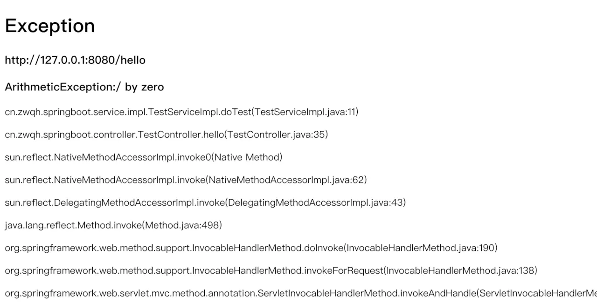
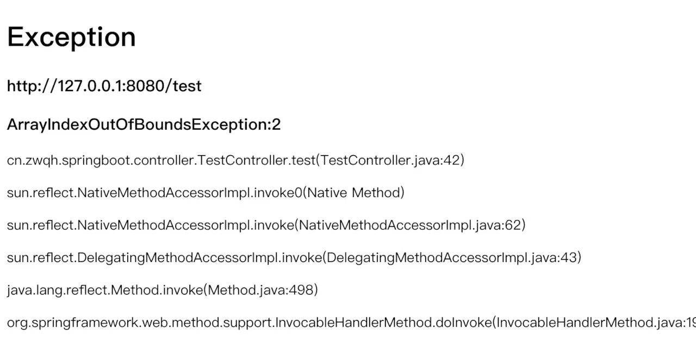

# 02-全局异常处理


## 前言

在 Java Web 系统开发中，不管是 Controller 层、Service 层还是 Dao 层，都有可能抛出异常。如果在每个方法中加上各种 try catch 的异常处理代码，那样会使代码非常繁琐。在Spring MVC 中，我们可以将所有类型的异常处理从各个单独的方法中解耦出来，进行异常信息的统一处理和维护。

在 Spring MVC 中全局异常捕获处理的解决方案通常有两种方式：

1.使用 @ControllerAdvice + @ExceptionHandler 注解进行全局的 Controller 层异常处理。

2.实现 org.springframework.webb.servlet.HandlerExceptionResolver 接口中的 resolveException 方法。


## 使用 @ControllerAdvice + @ExceptionHandler 注解

### 1.定义统一异常处理类

```java
@ControllerAdvice
public class GlobalExceptionHandler {

	private Logger log = LoggerFactory.getLogger(GlobalExceptionHandler.class);

	@ExceptionHandler(value = Exception.class)
	public ModelAndView defaultErrorHandler(HttpServletRequest req, Exception e) {
		log.error("ExceptionHandler ===>" + e.getMessage());
		e.printStackTrace();
		// 这里可根据不同异常引起的类做不同处理方式
		String exceptionName = ClassUtils.getShortName(e.getClass());
		log.error("ExceptionHandler ===>" + exceptionName);
		ModelAndView mav = new ModelAndView();
		mav.addObject("stackTrace", e.getStackTrace());
		mav.addObject("errorMessage", e.getMessage());
		mav.addObject("url", req.getRequestURL());
		mav.setViewName("forward:/error/500");
		return mav;
	}
}
```

其中 @ExceptionHandler(value = Exception.class) 中的捕获异常 value 可以自定义，如下：

| 类型                          | 描述                                                         |
| ----------------------------- | ------------------------------------------------------------ |
| NullPointerException          | 当应用程序试图访问空对象时，则抛出该异常                     |
| SQLException                  | 提供关于数据库访问错误或其他错误信息的异常                   |
| IndexOutOfBoundsException     | 指示某排序索引（例如对数组、字符串或向量的排序）超出范围时抛出 |
| NumberFormatException         | 当应用程序试图将字符串转换成一种数值类型，但该字符串不能转换为适当格式时，抛出该异常 |
| FileNotFoundException         | 当试图打开指定路径名表示的文件失败时，抛出此异常             |
| IOException                   | 当发生某种I/O异常时，抛出此异常。此类是失败或中断的I/O操作生成的异常的通用类 |
| ClassCastException            | 当试图将对象强制转换为不是实例的子类时，抛出该异常           |
| ArrayStoreException           | 试图将错误类型的对象存储到一个对象数组时抛出的异常           |
| IllegalArgumentException      | 抛出的异常表明向方法传递了一个不合法或不正确的参数           |
| ArithmeticException           | 当出现异常的运算条件时，抛出此异常。例如，一个整数“除以零”时，抛出此类的一个实例 |
| NegativeArraySizeException    | 如果应用程序试图创建大小为负的数组，则抛出该异常             |
| NoSuchMethodException         | 无法找到某一特定方法时，抛出该异常                           |
| SecurityException             | 由安全管理器抛出的异常，指示存在安全侵犯                     |
| UnsupportedOperationException | 当不支持请求的操作时，抛出该异常                             |
| RuntimeException              | 是那些可能在Java虚拟机正常运行期间抛出的异常的超类           |

当捕获到响应的异常类型时，会进入 defaultErrorHandler() 方法中的逻辑：把异常信息放入 model，跳转至 /error/500 请求URL。

### 2.异常信息展现

视图控制器配置

```java
@Configuration
public class WebMvcConfig extends WebMvcConfigurationSupport {

	/**
	 * 视图控制器配置
	 */
	@Override
	public void addViewControllers(ViewControllerRegistry registry) {	
		registry.addViewController("/").setViewName("/index");//设置默认跳转视图为 /index
		registry.addViewController("/error/500").setViewName("/error/500");
        registry.setOrder(Ordered.HIGHEST_PRECEDENCE);
        super.addViewControllers(registry);
		
	}
	
}
```

视图模板

```html
<!DOCTYPE html>
<html lang="en" xmlns:th="http://www.thymeleaf.org">
<head>
<meta charset="UTF-8">
<title>Insert title here</title>
</head>
<body>
<h1>Exception</h1>
<h3 th:text="${url}"></h3>
<h3 th:text="${errorMessage}"></h3>
<p  th:each="line : ${stackTrace}" th:text="${line}">  </p>
</body>
</html>
```

### 3.测试异常类

```java
@Controller
public class TestController {

	@GetMapping("/index")
	public String hello() {
		int x = 1 / 0;
		return "hello";
	}
}
```

### 4.运行测试

浏览器访问：http://127.0.0.1:8080/index 




> @ControllerAdvice 还能结合 @ModelAttribute 、@InitBinder 注解一起使用，实现全局数据绑定和全局数据预处理等功能。

## 实现 HandlerExceptionResolver 接口

### 1.定义统一异常处理类

```java
@Component
public class GlobalHandlerExceptionResolver implements HandlerExceptionResolver {

	private Logger log = LoggerFactory.getLogger(GlobalExceptionHandler.class);

	@Override
	public ModelAndView resolveException(HttpServletRequest request, HttpServletResponse response, Object handler,
			Exception ex) {
		Exception e = new Exception();
		//处理 UndeclaredThrowableException
		if (ex instanceof UndeclaredThrowableException) {
			e = (Exception) ((UndeclaredThrowableException) ex).getUndeclaredThrowable();
		} else {
			e = ex;
		}
		e.printStackTrace();
		//这里可以根据不同异常引起的类做不同处理方式
		String exceptionName = ClassUtils.getShortName(e.getClass());
		if(exceptionName.equals("ArrayIndexOutOfBoundsException")) {
			log.error("GlobalHandlerExceptionResolver resolveException ===>" + exceptionName);
			ModelAndView mav = new ModelAndView();
			mav.addObject("stackTrace", e.getStackTrace());
			mav.addObject("exceptionName", exceptionName);
			mav.addObject("errorMessage", e.getMessage());
			mav.addObject("url", request.getRequestURL());
			mav.setViewName("forward:/error/500");
			return mav;
		}
		return null;
	}

}
```

> UndeclaredThrowableException 异常通常是在 RPC 接口调用场景或者使用 JDK 动态代理的场景时发生。如果不预先处理转换，测试捕获到的异常则为 UndeclaredThrowableException，而不是真实的异常对象。

### 2.异常信息展现 (同上)

### 3.测试异常类

```java
@Controller
public class TestController {

	@GetMapping("/test")
	public String test() {
		String[] ss = new String[] { "1", "2" };
		System.out.print(ss[2]);
		return "hello";
	}

}
```

### 4.测试运行

测试前先把 @ControllerAdvice 注释了。 浏览器访问：http://127.0.0.1:8080/test 




## 示例代码

[github](https://github.com/zwqh1992/Spring-Boot-2.X/tree/master/spring-boot-exception)

[码云](https://gitee.com/zwqh/Spring-Boot-2.X/tree/master/spring-boot-exception)

非特殊说明，本文版权归 [朝雾轻寒](https://www.zwqh.top) 所有，转载请注明出处.


作者：朝雾轻寒链接：https://juejin.im/post/5db3e66cf265da4d05683eed来源：掘金著作权归作者所有。商业转载请联系作者获得授权，非商业转载请注明出处。