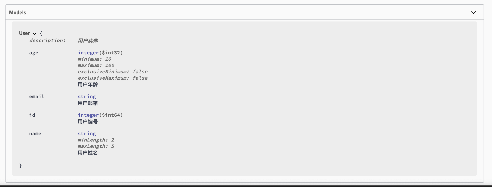

# 03-JSR-303实现请求参数校验

请求参数的校验是很多新手开发非常容易犯错，或存在较多改进点的常见场景。比较常见的问题主要表现在以下几个方面：

- 仅依靠前端框架解决参数校验，缺失服务端的校验。这种情况常见于需要同时开发前后端的时候，虽然程序的正常使用不会有问题，但是开发者忽略了非正常操作。比如绕过前端程序，直接模拟客户端请求，这时候就会突然在前端预设的各种限制，直击各种数据访问接口，使得我们的系统存在安全隐患。 
- 大量地使用`if/else`语句嵌套实现，校验逻辑晦涩难通，不利于长期维护。 

所以，针对上面的问题，建议服务端开发在实现接口的时候，对于请求参数必须要有服务端校验以保障数据安全与稳定的系统运行。同时，对于参数的校验实现需要足够优雅，要满足逻辑易读、易维护的基本特点。

接下来，我们就在本篇教程中详细说说，如何优雅地实现Spring Boot服务端的请求参数校验。

## JSR-303

在开始动手实践之前，我们先了解一下接下来我们将使用的一项标准规范：JSR-303

**什么是JSR？**

JSR是Java Specification Requests的缩写，意思是Java 规范提案。是指向JCP(Java Community Process)提出新增一个标准化技术规范的正式请求。任何人都可以提交JSR，以向Java平台增添新的API和服务。JSR已成为Java界的一个重要标准。

**JSR-303定义的是什么标准？**

JSR-303 是JAVA EE 6 中的一项子规范，叫做Bean Validation，Hibernate Validator 是 Bean Validation 的参考实现 . Hibernate Validator 提供了 JSR 303 规范中所有内置 constraint 的实现，除此之外还有一些附加的 constraint。

**Bean Validation中内置的constraint**

| Constraint                 | 详细信息                                                 |
| -------------------------- | -------------------------------------------------------- |
| @Null                      | 被注释的元素必须为 null                                  |
| @NotNull                   | 被注释的元素必须不为 null                                |
| @AssertTrue                | 被注释的元素必须为 true                                  |
| @AssertFalse               | 被注释的元素必须为 false                                 |
| @Min(value)                | 被注释的元素必须是一个数字，其值必须大于等于指定的最小值 |
| @Max(value)                | 被注释的元素必须是一个数字，其值必须大于等于指定的最大值 |
| @DecimalMin(value)         | 被注释的元素必须是一个数字，其值必须大于等于指定的最小值 |
| @DecimalMax(value)         | 被注释的元素必须是一个数字，其值必须大于等于指定的最大值 |
| @Size(max, min)            | 被注释的元素的大写必须在指定的范围内                     |
| @Digits(integer, fraction) | 被注释的元素必须是一个数字，其值必须在可接受的范围内     |
| @Past                      | 被注释的元素必须是一个过去的日期                         |
| @Future                    | 被注释的元素必须是一个将来的日期                         |
| @Pattern(value)            | 被注释的元素必须符合指定的正则表达式                     |

**Hibernate Validator附加的constraint**

| Constraint | 详细信息                               |
| ---------- | -------------------------------------- |
| @Email     | 被注释的元素必须是电子邮箱地址         |
| @Length    | 被注释的字符串的大小必须在指定的范围内 |
| @NotEmpty  | 被注释的字符串必须非空                 |
| @Range     | 被注释的元素必须在合适的范围内         |

在JSR-303的标准之下，我们可以通过上面这些注解，优雅的定义各个请求参数的校验。更多关于JSR的内容可以参与官方文档或参考[这篇文章](https://www.jianshu.com/p/554533f88370 "JSR-303")。


## 动手实践

已经了解了JSR-303之后，接下来我们就来尝试一下，基于此规范如何实现参数的校验！

### 快速入门

我们先来做一个简单的例子，比如：定义字段不能为`Null`。只需要两步

**第一步**：在要校验的字段上添加上`@NotNull`注解，具体如下：

```java
@Data
@ApiModel(description="用户实体")
public class User {

    @ApiModelProperty("用户编号")
    private Long id;

    @NotNull
    @ApiModelProperty("用户姓名")
    private String name;

    @NotNull
    @ApiModelProperty("用户年龄")
    private Integer age;

}
```

**第二步**：在需要校验的参数实体前添加`@Valid`注解，具体如下：

```java
@PostMapping("/")
@ApiOperation(value = "创建用户", notes = "根据User对象创建用户")
public String postUser(@Valid @RequestBody User user) {
    users.put(user.getId(), user);
    return "success";
}
```

完成上面配置之后，启动应用，并用POST请求访问`localhost:8080/users/`接口，body使用一个空对象，`{}`。你可以用Postman等测试工具发起，也可以使用curl发起，比如这样：

```
curl -X POST \
  http://localhost:8080/users/ \
  -H 'Content-Type: application/json' \
  -H 'Postman-Token: 72745d04-caa5-44a1-be84-ba9c115f4dfb' \
  -H 'cache-control: no-cache' \
  -d '{
    
}'
```

不出意外，你可以得到如下结果：

```json
{
    "timestamp": "2019-10-05T05:45:19.221+0000",
    "status": 400,
    "error": "Bad Request",
    "errors": [
        {
            "codes": [
                "NotNull.user.age",
                "NotNull.age",
                "NotNull.java.lang.Integer",
                "NotNull"
            ],
            "arguments": [
                {
                    "codes": [
                        "user.age",
                        "age"
                    ],
                    "arguments": null,
                    "defaultMessage": "age",
                    "code": "age"
                }
            ],
            "defaultMessage": "不能为null",
            "objectName": "user",
            "field": "age",
            "rejectedValue": null,
            "bindingFailure": false,
            "code": "NotNull"
        },
        {
            "codes": [
                "NotNull.user.name",
                "NotNull.name",
                "NotNull.java.lang.String",
                "NotNull"
            ],
            "arguments": [
                {
                    "codes": [
                        "user.name",
                        "name"
                    ],
                    "arguments": null,
                    "defaultMessage": "name",
                    "code": "name"
                }
            ],
            "defaultMessage": "不能为null",
            "objectName": "user",
            "field": "name",
            "rejectedValue": null,
            "bindingFailure": false,
            "code": "NotNull"
        }
    ],
    "message": "Validation failed for object='user'. Error count: 2",
    "path": "/users/"
}
```

其中返回内容的各参数含义如下：

- `timestamp`：请求时间 
- `status`：HTTP返回的状态码，这里返回400，即：请求无效、错误的请求，通常参数校验不通过均为400 
- `error`：HTTP返回的错误描述，这里对应的就是400状态的错误描述：Bad Request 
- `errors`：具体错误原因，是一个数组类型；因为错误校验可能存在多个字段的错误，比如这里因为定义了两个参数不能为`Null`，所以存在两条错误记录信息 
- `message`：概要错误消息，返回内容中很容易可以知道，这里的错误原因是对user对象的校验失败，其中错误数量为`2`，而具体的错误信息就定义在上面的`errors`数组中 
- `path`：请求路径 

请求的调用端在拿到这个规范化的错误信息之后，就可以方便的解析并作出对应的措施以完成自己的业务逻辑了。

### 尝试一些其他校验

在完成了上面的例子之后，我们还可以增加一些校验规则，比如：校验字符串的长度、校验数字的大小、校验字符串格式是否为邮箱等。下面我们就来定义一些复杂的校验定义，比如：

```java
@Data
@ApiModel(description="用户实体")
public class User {

    @ApiModelProperty("用户编号")
    private Long id;

    @NotNull
    @Size(min = 2, max = 5)
    @ApiModelProperty("用户姓名")
    private String name;

    @NotNull
    @Max(100)
    @Min(10)
    @ApiModelProperty("用户年龄")
    private Integer age;

    @NotNull
    @Email
    @ApiModelProperty("用户邮箱")
    private String email;

}
```

发起一个可以出发`name`、`age`、`email`都校验不通过的请求，比如下面这样：

```
curl -X POST \
  http://localhost:8080/users/ \
  -H 'Content-Type: application/json' \
  -H 'Postman-Token: 114db0f0-bdce-4ba5-baf6-01e5104a68a3' \
  -H 'cache-control: no-cache' \
  -d '{
    "name": "abcdefg",
    "age": 8,
    "email": "aaaa"
}'复制代码
```

我们将得到如下的错误返回：

```json
{
    "timestamp": "2019-10-05T06:24:30.518+0000",
    "status": 400,
    "error": "Bad Request",
    "errors": [
        {
            "codes": [
                "Size.user.name",
                "Size.name",
                "Size.java.lang.String",
                "Size"
            ],
            "arguments": [
                {
                    "codes": [
                        "user.name",
                        "name"
                    ],
                    "arguments": null,
                    "defaultMessage": "name",
                    "code": "name"
                },
                5,
                2
            ],
            "defaultMessage": "个数必须在2和5之间",
            "objectName": "user",
            "field": "name",
            "rejectedValue": "abcdefg",
            "bindingFailure": false,
            "code": "Size"
        },
        {
            "codes": [
                "Min.user.age",
                "Min.age",
                "Min.java.lang.Integer",
                "Min"
            ],
            "arguments": [
                {
                    "codes": [
                        "user.age",
                        "age"
                    ],
                    "arguments": null,
                    "defaultMessage": "age",
                    "code": "age"
                },
                10
            ],
            "defaultMessage": "最小不能小于10",
            "objectName": "user",
            "field": "age",
            "rejectedValue": 8,
            "bindingFailure": false,
            "code": "Min"
        },
        {
            "codes": [
                "Email.user.email",
                "Email.email",
                "Email.java.lang.String",
                "Email"
            ],
            "arguments": [
                {
                    "codes": [
                        "user.email",
                        "email"
                    ],
                    "arguments": null,
                    "defaultMessage": "email",
                    "code": "email"
                },
                [],
                {
                    "defaultMessage": ".*",
                    "codes": [
                        ".*"
                    ],
                    "arguments": null
                }
            ],
            "defaultMessage": "不是一个合法的电子邮件地址",
            "objectName": "user",
            "field": "email",
            "rejectedValue": "aaaa",
            "bindingFailure": false,
            "code": "Email"
        }
    ],
    "message": "Validation failed for object='user'. Error count: 3",
    "path": "/users/"
}
```

从`errors`数组中的各个错误明细中，知道各个字段的`defaultMessage`，可以看到很清晰的错误描述。

### Swagger文档中的体现

可能有读者会问了，我的接口中是定了这么多。上一篇教程中，不是还教了如何自动生成文档么，那么对于参数的校验逻辑该如何描述呢？

这里要分两种情况，Swagger自身对JSR-303有一定的支持，但是支持的并那么完善，并没有覆盖所有的注解的。

比如，上面我们使用的注解是可以自动生成的，启动上面我们的实验工程，然后访问`http://localhost:8080/swagger-ui.html`，在`Models`不是，我们可以看到如下图所示的内容：



其中：`name`和`age`字段相比上一篇教程中的文档描述，多了一些关于校验相关的说明；而`email`字段则没有体现相关校验说明。目前，Swagger共支持以下几个注解：`@NotNull`、`@Max`、`@Min`、`@Size`、`@Pattern`。在实际开发过程中，我们需要分情况来处理，对于Swagger支自动生成的可以利用原生支持来产生，如果有部分字段无法产生，则可以在`@ApiModelProperty`注解的描述中他，添加相应的校验说明，以便于使用方查看。

### 番外：也许你会有这些疑问

**当请求参数校验出现错误信息的时候，错误格式可以修改吗？**

答案是肯定的。这里的错误信息实际上由Spring Boot的异常处理机制统一组织并返回的，我们将在后面的教程中详细介绍，Spring Boot是如何统一处理异常返回以及我们该如何定时异常返回。

**spring-boot-starter-validation****是必须的吗？**

有读者之前问过，看到很多教程都写了还要引入`spring-boot-starter-validation`依赖，这个依赖到底是否需要？（本篇中并没有引入）

```xml
<dependency>
    <groupId>org.springframework.boot</groupId>
    <artifactId>spring-boot-starter-validation</artifactId>
</dependency>
```

其实，只需要仔细看一下`spring-boot-starter-validation`依赖主要是为了引入了什么，再根据当前自己使用的Spring Boot版本来判断即可。实际上，`spring-boot-starter-validation`依赖主要是为了引入下面这个依赖：

```xml
<dependency>
   <groupId>org.hibernate.validator</groupId>
    <artifactId>hibernate-validator</artifactId>
    <version>6.0.14.Final</version>
    <scope>compile</scope>
</dependency>
```

我们可以看看当前工程的依赖中是否有它，就可以判断是否还需要额外引入。在Spring Boot 2.1版本中，该依然其实已经包含在了`spring-boot-starter-web`依赖中，并不需要额外引入，所以您在本文中找不到这一步。


作者：程序猿DD_链接：https://juejin.im/post/5d9be67ce51d45784021e4b0来源：掘金著作权归作者所有。商业转载请联系作者获得授权，非商业转载请注明出处。