# 04-整合Swagger2生成API文档

随着前后端分离架构的流行，我们使用Spring Boot来构建RESTful API项目的场景越来越多。通常我们的一个RESTful API就有可能要服务于多个不同的开发人员或开发团队：IOS开发、Android开发、Web开发甚至其他的后端服务等。


为了减少与其他团队平时开发期间的频繁沟通成本，传统做法就是创建一份RESTful API文档来记录所有接口细节，然而这样的做法有以下几个问题：

- 由于接口众多，并且细节复杂（需要考虑不同的HTTP请求类型、HTTP头部信息、HTTP请求内容等），高质量地创建这份文档本身就是件非常吃力的事，下游的抱怨声不绝于耳。
- 随着时间推移，不断修改接口实现的时候都必须同步修改接口文档，而文档与代码又处于两个不同的媒介，除非有严格的管理机制，不然很容易导致不一致现象。

为了解决上面这样的问题，我们找到了Swagger2。它可以轻松的整合到Spring Boot中，并与Spring MVC程序配合组织出强大RESTful API文档。它既可以减少我们创建文档的工作量，同时说明内容又整合入实现代码中，让维护文档和修改代码整合为一体，可以让我们在修改代码逻辑的同时方便的修改文档说明。另外Swagger2也提供了强大的页面测试功能来调试每个RESTful API。具体效果如下图所示：

[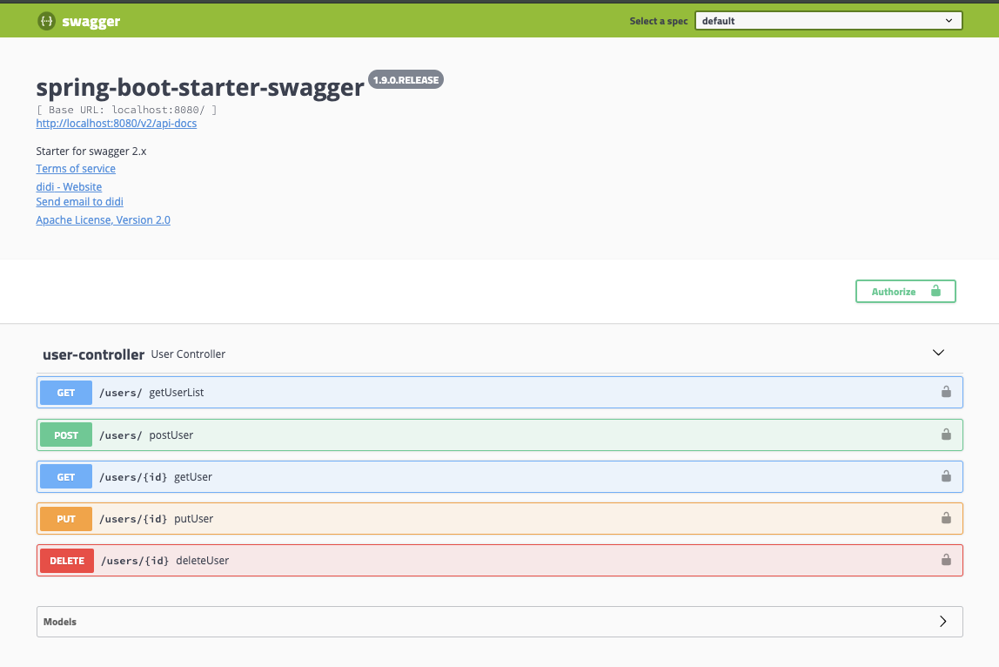](http://img.didispace.com/Frp7Fhk44jt5NzkRM5qxJqoXMWiS)

下面就来具体介绍一下，在Spring Boot中如何整合 Swagger2。


## 准备工作

首先，我们需要一个Spring Boot实现的RESTful API工程。


## 整合Swagger2

#### 第一步：添加依赖

```xml
<dependency>
    <groupId>io.springfox</groupId>
    <artifactId>springfox-swagger2</artifactId>
    <version>2.9.2</version>
    <exclusions>
        <exclusion>
            <groupId>io.swagger</groupId>
            <artifactId>swagger-annotations</artifactId>
        </exclusion>
        <exclusion>
            <groupId>io.swagger</groupId>
            <artifactId>swagger-models</artifactId>
        </exclusion>
    </exclusions>
</dependency>

<!-- 引入新版本的swagger-annotations这两个依赖，是为了解决input为空字符串报错的问题 -->
<dependency>
    <groupId>io.swagger</groupId>
    <artifactId>swagger-annotations</artifactId>
    <version>1.5.22</version>
</dependency>
<dependency>
    <groupId>io.swagger</groupId>
    <artifactId>swagger-models</artifactId>
    <version>1.5.22</version>
</dependency>

<dependency>
    <groupId>io.springfox</groupId>
    <artifactId>springfox-swagger-ui</artifactId>
    <version>2.9.2</version>
</dependency>
```

#### 第二步：添加配置类

我们需要新增一个Swagger2Config 的配置类：

注意一定要记得添加`@EnableSwagger2`注解

```java
/**
 * Swagger2 配置类
 * @author Ryu	
 * @since 2019/10/6 8:31 PM
 */
@Configuration
@EnableSwagger2
public class Swagger2Config {

    @Bean
    public Docket createRestApi() {
        return new Docket(DocumentationType.SWAGGER_2)
                .apiInfo(apiInfo())
                .select()
                .apis(RequestHandlerSelectors.basePackage("indi.viyoung.viboot.*"))
                .paths(PathSelectors.any())
                .build();
    }

    private ApiInfo apiInfo() {
        return new ApiInfoBuilder()
                .title("swagger2-document")	//标题
                .description("Restful-API-Doc")	//描述
                .termsOfServiceUrl("https://www.baidu.com") //这里配置的是网站地址
                .contact(new Contact("XX的技术博客", "https://www.cnblogs.com/XXX", "18530000000@163.com")) // 三个参数依次是姓名，个人网站，邮箱
                .license("The Apache License")
                .licenseUrl("http://www.abc.com")
                .version("1.0") //版本
                .build();
    }
}
```


```java
/**
 * @author Ryu
 * @since 2019/3/6 6:35 PM
 */
@SpringBootApplication
@ComponentScan(value = "com.viyoung.viboot.*")
@MapperScan(value = "com.viyoung.viboot.swagger2.mapper")
@EnableSwagger2
public class ViBootSwaggerApplication {
    public static void main(String[] args) {
        SpringApplication.run(ViBootSwaggerApplication.class, args);
    }
}
```

#### 第三步：通过注解来完成API文档

##### 1. @Api

| 注解名称 | 注解属性 | 作用域 | 属性作用       |
| -------- | -------- | ------ | -------------- |
| `@Api`   | tags     | 类     | 说明该类的作用 |
|          | value    | 类     | 说明该类的作用 |

举个例子：

```java
@Api(value = "用户类控制器",tags="用户类控制器")
public class UserController {
...
}
```

##### 2 . @ApiOperation

| 注解名称          | 注解属性 | 作用域 | 属性作用     |
| ----------------- | -------- | ------ | ------------ |
| `@ApiOperation()` | value    | 方法   | 描述方法作用 |
|                   | notes    | 方法   | 提示内容     |
|                   | tags     | 方法   | 分组         |

举个例子：

```java
@ApiOperation(value = "获取用户列表",notes = "获取用户列表")
public List<User> get() {
    ...   
}
```

##### 3. @ApiParam

| 注解名称      | 注解属性 | 作用域   | 属性作用 |
| ------------- | -------- | -------- | -------- |
| `@ApiParam()` | name     | 方法参数 | 参数名   |
|               | value    | 方法参数 | 参数说明 |
|               | required | 方法参数 | 是否必填 |

举个例子：

```java
@ApiOperation(value="获取用户详细信息", notes="根据url的id来获取用户详细信息")
public User get(@ApiParam(name="id",value="用户id",required=true) Long id) {
    log.info("GET..{}...方法执行。。。",id);
    return userService.getById(id);
}
```

##### 4. @ApiModel && @ApiModelProperty

| 注解名称              | 注解属性    | 作用域 | 属性作用 |
| --------------------- | ----------- | ------ | -------- |
| `@ApiModel()`         | value       | 类     | 对象名   |
|                       | description | 类     | 描述     |
| `@ApiModelProperty()` | value       | 方法   | 字段说明 |
|                       | name        | 方法   | 属性名   |
|                       | dataType    | 方法   | 属性类型 |
|                       | required    | 方法   | 是否必填 |
|                       | example     | 方法   | 举例     |
|                       | hidden      | 方法   | 隐藏     |

举个例子：

```java
@ApiModel(value="user对象",description="用户对象user")
public class User implements Serializable {

    private static final long serialVersionUID = 1L;

    @TableId(value = "id", type = IdType.AUTO)
    @ApiModelProperty(value = "用户ID",example = "1000001",hidden=true)
    private Long id;

    @ApiModelProperty(value="用户名",required = true,dataType = "String")
    private String userName;
    
    @ApiModelProperty(value = "密码")
    private String password;
}
```

##### 5. @ApiImplicitParam && @ApiImplicitParams

```
`@ApiImplicitParam`可以单个用于方法之上，多个参数的话可以把`@ApiImplicitParam`放到`@ApiImplicitParams`中，这里只罗列`@ApiImplicitParam`的属性：
```

| 注解名称              | 注解属性  | 作用域 | 属性作用 |
| --------------------- | --------- | ------ | -------- |
| `@ApiImplicitParam()` | value     | 方法   | 参数说明 |
|                       | name      | 方法   | 参数名   |
|                       | dataType  | 方法   | 数据类型 |
|                       | paramType | 方法   | 参数类型 |
|                       | example   | 方法   | 举例     |

举个例子：

```java
@ApiImplicitParams({
    @ApiImplicitParam(name="user", value ="用户实体user", required=true, dataType= "User")
})
public void put(User user) {
    userService.updateById(user);
    log.info("PUT方法执行。。。");
}
```

##### 6.@ApiResposne && @ApiResponses

`@ApiResponses`与`@ApiResponse`的关系和`@ApiImplicitParam` && `@ApiImplicitParams` 的关系和用法都是类似的

| 注解名称         | 注解属性 | 作用域 | 属性作用 |
| ---------------- | -------- | ------ | -------- |
| `@ApiResponse()` | response | 方法   | 返回类   |
|                  | code     | 方法   | 返回码   |
|                  | message  | 方法   | 返回信息 |
|                  | examples | 方法   | 例子     |

#### 第四步：启动应用

启动应用后，访问：`http://localhost:8080/swagger-ui.html`，就可以看到如下的接口文档页面：

[](http://img.didispace.com/Frp7Fhk44jt5NzkRM5qxJqoXMWiS)


## 调整Controller类来生成API文档内容

在整合完Swagger之后，在`http://localhost:8080/swagger-ui.html`页面中可以看到，关于各个接口的描述还都是英文或遵循代码定义的名称产生的。这些内容对用户并不友好，所以我们需要自己增加一些说明来丰富文档内容。如下所示，我们通过`@Api`，`@ApiOperation`注解来给API增加说明、通过`@ApiImplicitParam`、`@ApiModel`、`@ApiModelProperty`注解来给参数增加说明。

比如下面的例子：

```java
@Api(tags = "用户管理")
@RestController
@RequestMapping(value = "/users")     // 通过这里配置使下面的映射都在/users下
public class UserController {

    // 创建线程安全的Map，模拟users信息的存储
    static Map<Long, User> users = Collections.synchronizedMap(new HashMap<>());

    @GetMapping("/")
    @ApiOperation(value = "获取用户列表")
    public List<User> getUserList() {
        List<User> r = new ArrayList<>(users.values());
        return r;
    }

    @PostMapping("/")
    @ApiOperation(value = "创建用户", notes = "根据User对象创建用户")
    public String postUser(@RequestBody User user) {
        users.put(user.getId(), user);
        return "success";
    }

    @GetMapping("/{id}")
    @ApiOperation(value = "获取用户详细信息", notes = "根据url的id来获取用户详细信息")
    public User getUser(@PathVariable Long id) {
        return users.get(id);
    }

    @PutMapping("/{id}")
    @ApiImplicitParam(paramType = "path", dataType = "Long", name = "id", value = "用户编号", required = true, example = "1")
    @ApiOperation(value = "更新用户详细信息", notes = "根据url的id来指定更新对象，并根据传过来的user信息来更新用户详细信息")
    public String putUser(@PathVariable Long id, @RequestBody User user) {
        User u = users.get(id);
        u.setName(user.getName());
        u.setAge(user.getAge());
        users.put(id, u);
        return "success";
    }

    @DeleteMapping("/{id}")
    @ApiOperation(value = "删除用户", notes = "根据url的id来指定删除对象")
    public String deleteUser(@PathVariable Long id) {
        users.remove(id);
        return "success";
    }

}


```

```java
@Data
@ApiModel(description="用户实体")
public class User {

    @ApiModelProperty("用户编号")
    private Long id;
    @ApiModelProperty("用户姓名")
    private String name;
    @ApiModelProperty("用户年龄")
    private Integer age;

}
```

完成上述代码添加后，启动Spring Boot程序，访问：`http://localhost:8080/swagger-ui.html`，就能看到下面这样带中文说明的文档了（其中标出了各个注解与文档元素的对应关系以供参考）：

[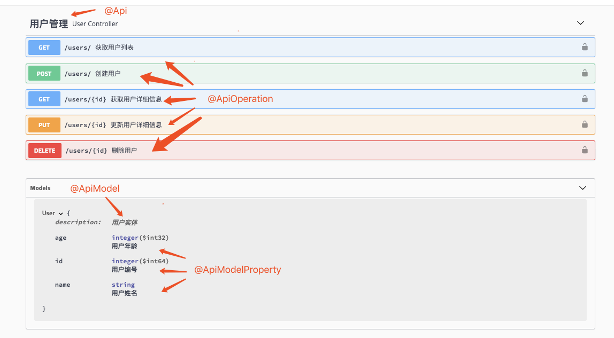]()

[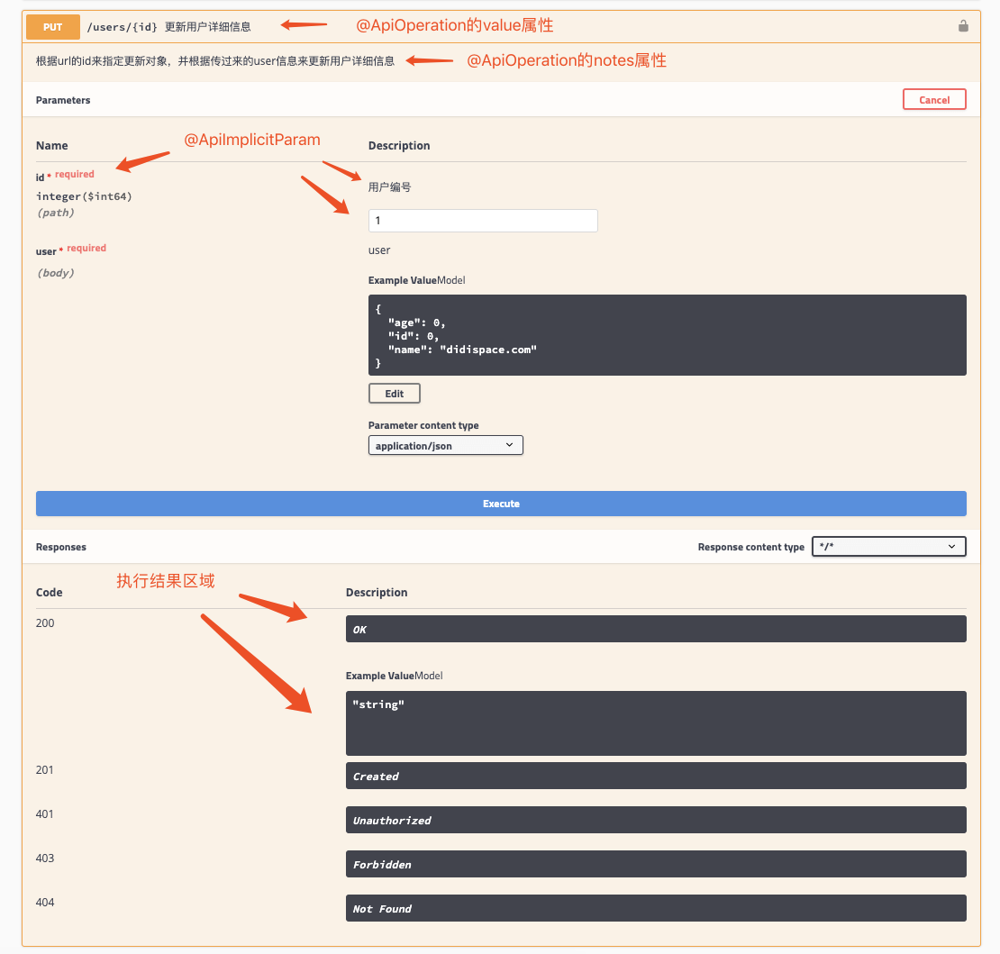]()


## API文档访问与调试

在上图请求的页面中，我们看到user的Value是个输入框？是的，Swagger除了查看接口功能外，还提供了调试测试功能，我们可以点击上图中右侧的Model Schema（黄色区域：它指明了User的数据结构），此时Value中就有了user对象的模板，我们只需要稍适修改，点击下方`“Try it out！”`按钮，即可完成了一次请求调用！

此时，你也可以通过几个GET请求来验证之前的POST请求是否正确。

相比为这些接口编写文档的工作，我们增加的配置内容是非常少而且精简的，对于原有代码的侵入也在忍受范围之内。因此，在构建RESTful API的同时，加入Swagger来对API文档进行管理，是个不错的选择。


## 接口的分组

我们在Spring Boot中定义各个接口是以`Controller`作为第一级维度来进行组织的，`Controller`与具体接口之间的关系是一对多的关系。我们可以将同属一个模块的接口定义在一个`Controller`里。默认情况下，Swagger是以`Controller`为单位，对接口进行分组管理的。这个分组的元素在Swagger中称为`Tag`，但是这里的`Tag`与接口的关系并不是一对多的，它支持更丰富的多对多关系。

### 默认分组

首先，我们通过一个简单的例子，来看一下默认情况，Swagger是如何根据Controller来组织Tag与接口关系的。定义两个`Controller`，分别负责教师管理与学生管理接口，比如下面这样：

```java
@RestController
@RequestMapping(value = "/teacher")
static class TeacherController {

    @GetMapping("/xxx")
    public String xxx() {
        return "xxx";
    }

}

@RestController
@RequestMapping(value = "/student")
static class StudentController {

    @ApiOperation("获取学生清单")
    @GetMapping("/list")
    public String bbb() {
        return "bbb";
    }

    @ApiOperation("获取教某个学生的老师清单")
    @GetMapping("/his-teachers")
    public String ccc() {
        return "ccc";
    }

    @ApiOperation("创建一个学生")
    @PostMapping("/aaa")
    public String aaa() {
        return "aaa";
    }

}
```

启动应用之后，我们可以看到Swagger中这两个Controller是这样组织的：

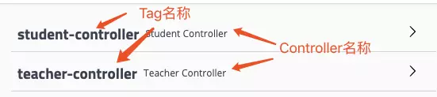

图中标出了Swagger默认生成的`Tag`与Spring Boot中`Controller`展示的内容与位置。

### 自定义默认分组的名称

接着，我们可以再试一下，通过`@Api`注解来自定义`Tag`，比如这样：

```java
@Api(tags = "教师管理")
@RestController
@RequestMapping(value = "/teacher")
static class TeacherController {

    // ...

}

@Api(tags = "学生管理")
@RestController
@RequestMapping(value = "/student")
static class StudentController {

    // ...

}
```

再次启动应用之后，我们就看到了如下的分组内容，代码中`@Api`定义的`tags`内容替代了默认产生的`teacher-controller`和`student-controller`。

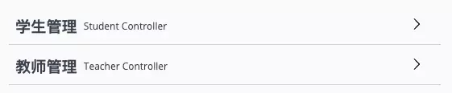

### 合并Controller分组

到这里，我们还都只是使用了`Tag`与`Controller`一一对应的情况，Swagger中还支持更灵活的分组！从`@Api`注解的属性中，相信聪明的读者一定已经发现`tags`属性其实是个数组类型：


我们可以通过定义同名的`Tag`来汇总`Controller`中的接口，比如我们可以定义一个`Tag`为“教学管理”，让这个分组同时包含教师管理和学生管理的所有接口，可以这样来实现：

```java
@Api(tags = {"教师管理", "教学管理"})
@RestController
@RequestMapping(value = "/teacher")
static class TeacherController {

    // ...

}

@Api(tags = {"学生管理", "教学管理"})
@RestController
@RequestMapping(value = "/student")
static class StudentController {

    // ...

}
```

最终效果如下：

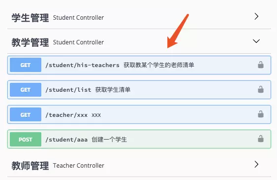

### 更细粒度的接口分组

通过`@Api`可以实现将`Controller`中的接口合并到一个`Tag`中，但是如果我们希望精确到某个接口的合并呢？比如这样的需求：“教学管理”包含“教师管理”中所有接口以及“学生管理”管理中的“获取学生清单”接口（不是全部接口）。

那么上面的实现方式就无法满足了。这时候发，我们可以通过使用`@ApiOperation`注解中的`tags`属性做更细粒度的接口分类定义，比如上面的需求就可以这样子写：

```java
@Api(tags = {"教师管理","教学管理"})
@RestController
@RequestMapping(value = "/teacher")
static class TeacherController {

    @ApiOperation(value = "xxx")
    @GetMapping("/xxx")
    public String xxx() {
        return "xxx";
    }

}

@Api(tags = {"学生管理"})
@RestController
@RequestMapping(value = "/student")
static class StudentController {

    @ApiOperation(value = "获取学生清单", tags = "教学管理")
    @GetMapping("/list")
    public String bbb() {
        return "bbb";
    }

    @ApiOperation("获取教某个学生的老师清单")
    @GetMapping("/his-teachers")
    public String ccc() {
        return "ccc";
    }

    @ApiOperation("创建一个学生")
    @PostMapping("/aaa")
    public String aaa() {
        return "aaa";
    }

}
```

效果如下图所示：

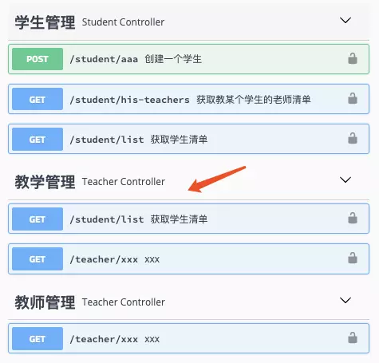

## 内容的顺序

在完成了接口分组之后，对于接口内容的展现顺序又是众多用户特别关注的点，其中主要涉及三个方面：分组的排序、接口的排序以及参数的排序，下面我们就来逐个说说如何配置与使用。

### 分组的排序

关于分组排序，也就是Tag的排序。目前版本的Swagger支持并不太好，通过文档我们可以找到关于Tag排序的配置方法。

第一种：原生Swagger用户，可以通过如下方式：

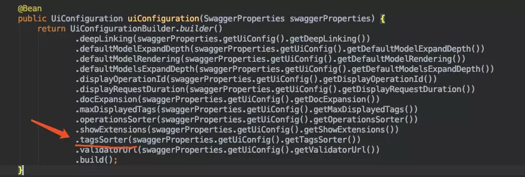

第二种：Swagger Starter用户，可以通过修改配置的方式：

```properties
swagger.ui-config.tags-sorter=alpha
```

似乎找到了希望，但是其实这块并没有什么可选项，一看源码便知：

```java
public enum TagsSorter {
  ALPHA("alpha");

  private final String value;

  TagsSorter(String value) {
    this.value = value;
  }

  @JsonValue
  public String getValue() {
    return value;
  }

  public static TagsSorter of(String name) {
    for (TagsSorter tagsSorter : TagsSorter.values()) {
      if (tagsSorter.value.equals(name)) {
        return tagsSorter;
      }
    }
    return null;
  }
}
```

是的，Swagger只提供了一个选项，就是按字母顺序排列。那么我们要如何实现排序呢？这里笔者给一个不需要扩展源码，仅依靠使用方式的定义来实现排序的建议：为Tag的命名做编号。比如：

```java
@Api(tags = {"1-教师管理","3-教学管理"})
@RestController
@RequestMapping(value = "/teacher")
static class TeacherController {

    // ...

}

@Api(tags = {"2-学生管理"})
@RestController
@RequestMapping(value = "/student")
static class StudentController {

    @ApiOperation(value = "获取学生清单", tags = "3-教学管理")
    @GetMapping("/list")
    public String bbb() {
        return "bbb";
    }

    // ...

}
```

由于原本存在按字母排序的机制在，通过命名中增加数字来帮助排序，可以简单而粗暴的解决分组问题，最后效果如下：

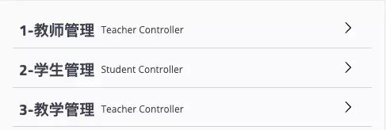

### 接口的排序

在完成了分组排序问题（虽然不太优雅...）之后，在来看看同一分组内各个接口该如何实现排序。同样的，凡事先查文档，可以看到Swagger也提供了相应的配置，下面也分两种配置方式介绍：

第一种：原生Swagger用户，可以通过如下方式：

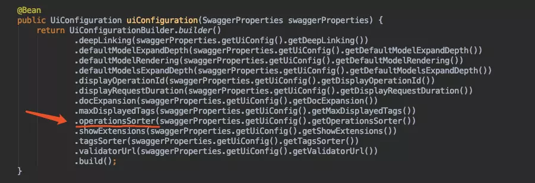

第二种：Swagger Starter用户，可以通过修改配置的方式：

```properties
swagger.ui-config.operations-sorter=alpha
```

很庆幸，这个配置不像Tag的排序配置没有可选项。它提供了两个配置项：`alpha`和`method`，分别代表了按字母表排序以及按方法定义顺序排序。当我们不配置的时候，改配置默认为`alpha`。两种配置的效果对比如下图所示：

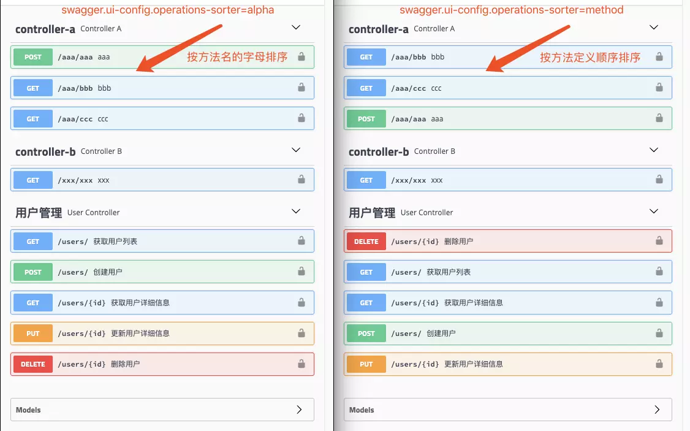

### 参数的排序

完成了接口的排序之后，更细粒度的就是请求参数的排序了。默认情况下，Swagger对Model参数内容的展现也是按字母顺序排列的。所以之前教程中的User对象在文章中展现如下：

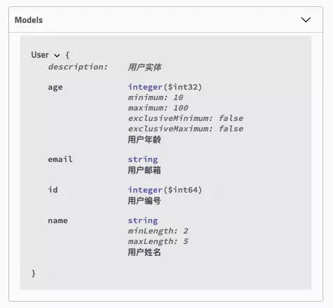

如果我们希望可以按照Model中定义的成员变量顺序来展现，那么需要我们通过`@ApiModelProperty`注解的`position`参数来实现位置的设置，比如：

```java
@Data
@ApiModel(description = "用户实体")
public class User {

    @ApiModelProperty(value = "用户编号", position = 1)
    private Long id;

    @NotNull
    @Size(min = 2, max = 5)
    @ApiModelProperty(value = "用户姓名", position = 2)
    private String name;

    @NotNull
    @Max(100)
    @Min(10)
    @ApiModelProperty(value = "用户年龄", position = 3)
    private Integer age;

    @NotNull
    @Email
    @ApiModelProperty(value = "用户邮箱", position = 4)
    private String email;

}
```

最终效果如下：

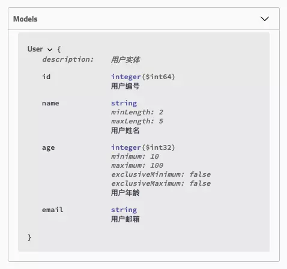


## 附录

## Swagger2 常用注解说明

### @Api

**用在请求的类上，表示对类的说明**

> tags="说明该类的作用，可以在UI界面上看到的注解"；
> value="该参数没什么意义，在UI界面上也看不到，所以不需要配置"；

### @ApiOperation

**用在请求的方法上，说明方法的用途、作用**

> value="说明方法的用途、作用"；
> notes="方法的备注说明"；

### @ApiImplicitParams

**用在请求的方法上，表示一组参数说明**

#### @ApiImplicitParam

**用在@ApiImplicitParams注解中，指定一个请求参数的各个方面**

> name：参数名
> value：参数的汉字说明、解释
> required：参数是否必须传
> paramType：参数放在哪个地方
>    · header --> 请求参数的获取：@RequestHeader
>    · query --> 请求参数的获取：@RequestParam
>    · path（用于restful接口）--> 请求参数的获取：@PathVariable
>    · body（不常用）
>    · form（不常用）    
> dataType：参数类型，默认String，其它值dataType="Integer"       
> defaultValue：参数的默认值

### @ApiResponses

**用在请求的方法上，表示一组响应**

#### @ApiResponse

**用在@ApiResponses中，一般用于表达一个错误的响应信息**

> code：数字，例如400
> message：信息，例如"请求参数没填好"
> response：抛出异常的类

### @ApiModel

**用于响应类上，表示一个返回响应数据的信息**

> （这种一般用在post创建的时候，使用@RequestBody这样的场景，
>            请求参数无法使用@ApiImplicitParam注解进行描述的时候）
>    @ApiModelProperty：用在属性上，描述响应类的属性