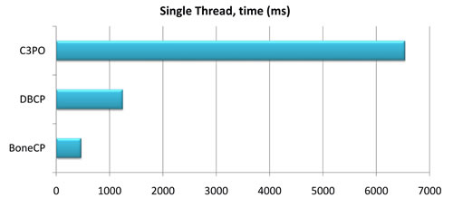
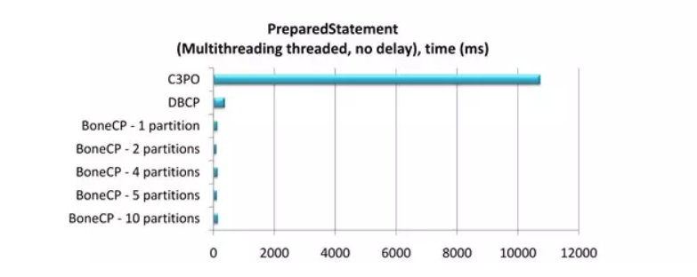

## 什么是 HikariCP

HiKariCP 是数据库连接池的一个后起之秀，号称性能最好，可以完美地 PK 掉其他连接池。是一个高性能的 JDBC 连接池，基于 BoneCP 做了不少的改进和优化。超快，快到连 Spring Boot 2 都宣布支持了。

[官方 GitHub 地址](http://qfdmy.com/wp-content/themes/quanbaike/go.php?url=aHR0cHM6Ly9naXRodWIuY29tL2JyZXR0d29vbGRyaWRnZS9IaWthcmlDUA==)

## 什么是 BoneCP

传说中 BoneCP 在快速这个特点上做到了极致，官方数据是 C3P0 等的 25 倍左右，以下为性能测试报告。

### 单线程

- 1,000,000 获取连接/释放连接请求
- 获取/释放连接之间没有延迟
- 连接池范围：20-50
- 增量：5
- 线程：1
- 分区：1



### 多线程

- 500 个线程分别获取释放 100 个连接
- 在获取连接和释放连接之间引入了 10ms 的延迟 `Thread.sleep()`，模拟连接完成工作
- 连接池范围：50-200
- 增量：5
- 线程：5


### Prepared Statement

- 500 个线程分别获取释放 100 个连接
- 无延迟
- 连接池范围：50-200
- 增量：5
- 线程：5



## 为什么需要 HikariCP

BoneCP 作者放弃维护，并在 Github 项目主页推荐大家使用 HikariCP，Hikari（ひかり[shi ga li]） 来自日文，是 **光** 的意思。这个产品的口号是 **快速、简单、可靠**

### 优化

- **字节码精简 ：** 优化代码，直到编译后的字节码最少，这样，CPU 缓存可以加载更多的程序代码
- **优化代理和拦截器 ：** 减少代码，例如 HikariCP 的 Statement proxy 只有 100 行代码，只有 BoneCP 的十分之一
- **自定义数组类型（FastStatementList）代替 ArrayList ：** 避免每次 `get()` 调用都要进行 range check，避免调用 `remove()` 时的从头到尾的扫描
- **自定义集合类型（ConcurrentBag）：** 提高并发读写的效率
- **其他针对 BoneCP 缺陷的优化：** 比如对于耗时超过一个 CPU 时间片的方法调用的研究（但没说具体怎么优化）

### 代码量

几个连接池的代码量对比（代码量越少，一般意味着执行效率越高、发生 BUG 的可能性越低）

| Pool     | Files | Code  |
| :------- | :---- | :---- |
| Vibur    | 34    | 1927  |
| HikariCP | 21    | 2228  |
| Tomcat   | 31    | 6345  |
| BoneCP   | 49    | 7293  |
| C3P0     | 120   | 15550 |

### 速度

别人发推文测试 Hikari 速度


### 稳定性


### 可靠性

另外，关于可靠性方面，也是有实验和数据支持的。对于数据库连接中断的情况，通过测试 `getConnection()`，各种 CP 的不相同处理方法如下（所有 CP 都配置了跟 `connectionTimeout` 类似的参数为 5 秒钟）

- **HikariCP(A)：** 等待 5 秒钟后，如果连接还是没有恢复，则抛出一个 `SQLExceptions` 异常；后续的 `getConnection()` 也是一样处理
- **C3P0(C-)：** 完全没有反应，没有提示，也不会在 `CheckoutTimeout` 配置的时长超时后有任何通知给调用者；然后等待 2 分钟后终于醒来了，返回一个 error
- **Tomcat(F)：** 返回一个 connection，然后调用者如果利用这个无效的 connection 执行 SQL 语句 结果可想而知；大约 55 秒之后终于醒来了，这时候的 `getConnection()` 终于可以返回一个 error，但没有等待参数配置的 5 秒钟，而是立即返回 error
- **BoneCP(C)：** 跟 Tomcat 的处理方法一样；也是大约 55 秒之后才醒来，有了正常的反应，并且终于会等待 5 秒钟之后返回 error 了

## 整合 HikariCP

### POM

```xml
<!-- 主要增加 HikariCP 依赖 -->
<dependency>
    <groupId>com.zaxxer</groupId>
    <artifactId>HikariCP</artifactId>
    <version>${hikaricp.version}</version>
</dependency>
<dependency>
    <groupId>org.springframework.boot</groupId>
    <artifactId>spring-boot-starter-jdbc</artifactId>
    <exclusions>
        <!-- 排除 tomcat-jdbc 以使用 HikariCP -->
        <exclusion>
            <groupId>org.apache.tomcat</groupId>
            <artifactId>tomcat-jdbc</artifactId>
        </exclusion>
    </exclusions>
</dependency>
<!-- MySQL 驱动 -->
<dependency>
    <groupId>mysql</groupId>
    <artifactId>mysql-connector-java</artifactId>
    <version>${mysql.version}</version>
</dependency>
```

### application.yml

```yaml
spring:
  datasource:
    type: com.zaxxer.hikari.HikariDataSource
    driver-class-name: com.mysql.cj.jdbc.Driver
    url: jdbc:mysql://192.168.141.130:3306/myshop?useUnicode=true&characterEncoding=utf-8&useSSL=false
    username: root
    password: 123456
    hikari:
      minimum-idle: 5
      idle-timeout: 600000
      maximum-pool-size: 10
      auto-commit: true
      pool-name: MyHikariCP
      max-lifetime: 1800000
      connection-timeout: 30000
      connection-test-query: SELECT 1
```

> **注意：** 具体使用方法在 **测试 MyBatis 操作数据库** 时进行介绍，此处仅为准备环节