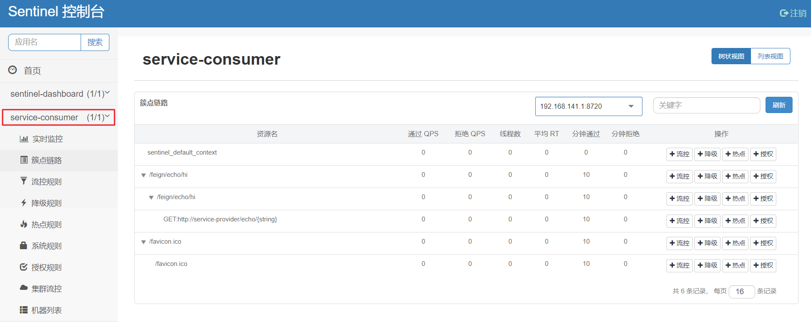

# 11-Sentinel 客户端接入


## POM

如果要在您的项目中引入 Sentinel，需要增加 `org.springframework.cloud:spring-cloud-starter-alibaba-sentinel` Starter POM

```xml
<dependency>
    <groupId>org.springframework.cloud</groupId>
    <artifactId>spring-cloud-starter-alibaba-sentinel</artifactId>
</dependency>
```

## 修改配置文件

在 Nacos 控制台修改配置文件，增加对 Sentinel 的支持

```yaml
spring:
  application:
    # 服务名
    name: service-consumer
  cloud:
    nacos:
      discovery:
        # 服务注册中心
        server-addr: 192.168.141.132:8848
      config:
        # 服务配置中心
        server-addr: 192.168.141.132:8848
    # 熔断限流
    sentinel:
      transport:
        dashboard: localhost:8888

# 开启 Feign 对 Sentinel 的支持
feign:
  sentinel:
    enabled: true

server:
  # 服务端口
  port: 8080

management:
  # 端点检查（健康检查）
  endpoints:
    web:
      exposure:
        include: "*"

user:
  name: "灶门祢豆子"
```

## 配置熔断类

编写一个 Feign 接口的实现类并增加 `@Component` 注解

```java
package com.funtl.spring.cloud.alibaba.consumer.service.fallback;

import com.funtl.spring.cloud.alibaba.consumer.service.EchoService;
import org.springframework.stereotype.Component;

@Component
public class EchoServiceFallback implements EchoService {
    
    @Override
    public String echo(String string) {
        return "echo fallback";
    }
    
    @Override
    public String lb() {
        return "lb fallback";
    }
}
```

## 修改 Feign 接口

在 `@FeignClient` 接口上增加 `fallback` 属性指定熔断类即可

```java
package com.funtl.spring.cloud.alibaba.consumer.service;

import com.funtl.spring.cloud.alibaba.consumer.service.fallback.EchoServiceFallback;
import org.springframework.cloud.openfeign.FeignClient;
import org.springframework.web.bind.annotation.GetMapping;
import org.springframework.web.bind.annotation.PathVariable;

@FeignClient(value = "service-provider", fallback = EchoServiceFallback.class)
public interface EchoService {
    
    @GetMapping(value = "/echo/{string}")
    String echo(@PathVariable("string") String string);
    
    @GetMapping(value = "/lb")
    String lb();
}
```

## 测试熔断

启动 `service-consumer` 服务并停止 `service-provider` 服务，通过浏览器访问 [http://localhost:8080/feign/echo/hi](http://www.qfdmy.com/wp-content/themes/quanbaike/go.php?url=aHR0cDovL2xvY2FsaG9zdDo4MDgwL2ZlaWduL2VjaG8vaGk=)

```
echo fallback
```



> **注意：** 必须至少请求过一次才能在 Sentinel 控制台看到对应的服务