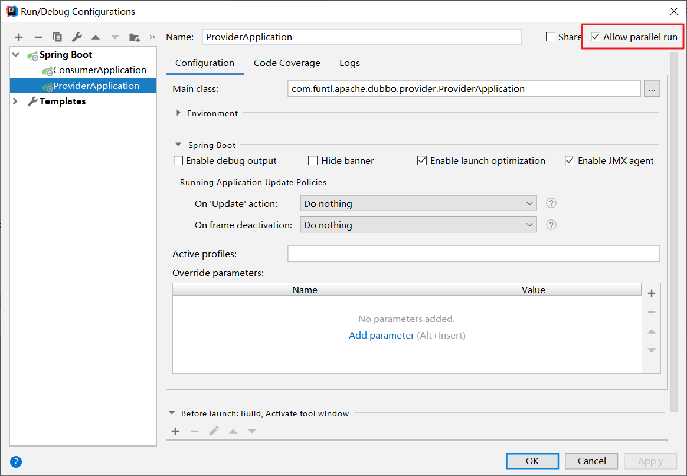
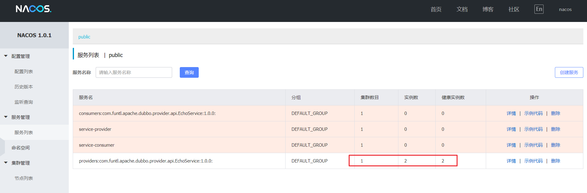

# 06-Dubbo 负载均衡


## 概述

在集群负载均衡时，Dubbo 提供了多种均衡策略，缺省为 `random` 随机调用。

## 负载均衡策略

### 随机

**Random LoadBalance：** 按权重设置随机概率，在一个截面上碰撞的概率高，但调用量越大分布越均匀，而且按概率使用权重后也比较均匀，有利于动态调整提供者权重。

### 轮循

**RoundRobin LoadBalance：** 按公约后的权重设置轮询比率，存在慢的提供者累积请求的问题，比如：第二台机器很慢，但没挂，当请求调到第二台时就卡在那，久而久之，所有请求都卡在调到第二台上。

### 最少活跃调用数

**LeastActive LoadBalance：** 相同活跃数的随机，活跃数指调用前后计数差，使慢的提供者收到更少请求，因为越慢的提供者的调用前后计数差会越大。

### 一致性 Hash

**ConsistentHash LoadBalance：** 相同参数的请求总是发到同一提供者。当某一台提供者挂时，原本发往该提供者的请求，基于虚拟节点，平摊到其它提供者，不会引起剧烈变动。

算法参见：[http://en.wikipedia.org/wiki/Consistent_hashing](http://www.qfdmy.com/wp-content/themes/quanbaike/go.php?url=aHR0cDovL2VuLndpa2lwZWRpYS5vcmcvd2lraS9Db25zaXN0ZW50X2hhc2hpbmc=) ，缺省只对第一个参数 Hash，如果要修改，请配置 ``，缺省用 160 份虚拟节点，如果要修改，请配置 ``

## 配置负载均衡

- 修改 `dubbo-provider` 项目的负载均衡策略，默认的负载均衡策略是 **随机**，我们修改为 **轮循**，可配置的值分别是：`random`，`roundrobin`，`leastactive`，`consistenthash`

```yaml
dubbo:
  provider:
    loadbalance: roundrobin
```

- 修改 `dubbo-provider` 的协议端口为 20880 和 20881，并启动多个实例，IDEA 中依次点击 **Run** -> **Edit Configurations** 并勾选 **Allow parallel run** 以允许 IDEA 多实例运行项目



- Nacos Server 控制台可以看到 `dubbo-provider` 有 2 个实例



- 修改 `dubbo-provider` 项目的 `EchoServiceImpl` 中的测试方法

```java
package com.funtl.apache.dubbo.provider.service;

import com.funtl.apache.dubbo.provider.api.EchoService;
import org.apache.dubbo.config.annotation.Service;
import org.springframework.beans.factory.annotation.Value;

@Service(version = "1.0.0")
public class EchoServiceImpl implements EchoService {
    
    @Value("${dubbo.protocol.port}")
    private String port;
    
    @Override
    public String echo(String string) {
        return "Echo Hello Dubbo " + string + " i am from port: " + port;
    }

}
```

- 重启服务，通过浏览器访问 [http://localhost:8080/echo/hi](http://www.qfdmy.com/wp-content/themes/quanbaike/go.php?url=aHR0cDovL2xvY2FsaG9zdDo4MDgwL2VjaG8vaGk=) ，反复刷新浏览器，浏览器交替显示

```
Echo Hello Dubbo hi i am from port: 20880
Echo Hello Dubbo hi i am from port: 20881
```